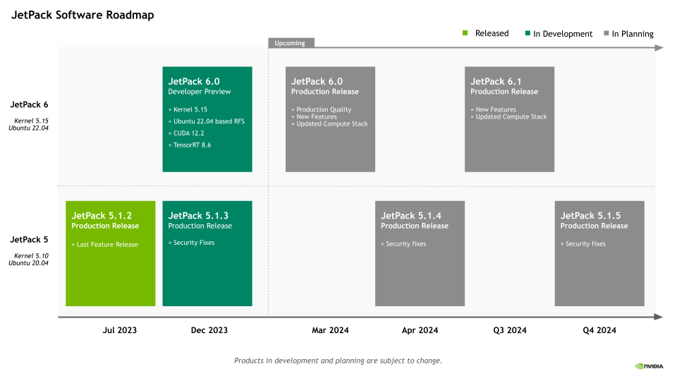

# ROS2 Humble学习笔记 (1)

[2024.01.05 正在编辑中，更新至3.6.2小节]

## 一、前言
2013年的时候已经接触ROS了，当时断断续续学习了一些ROS的基础知识。16年搬到深圳之后，也有幸参加过星火的一次关于ROS的一些活动。当时活动的主讲之一是CSDN上ROS知识传播界的大牛的古月和港中文的林天麟先生。然而，因为自己一直涉猎的是嵌入式领域，一直没有在ROS上有所深耕。十年过去了，我相信我的知识已经足够从头到尾做一台机器人小车（无论是嵌入式软硬件合适结构）。所以我决定开始重新学习ROS。当年ROS2还没有完成，现在ROS2的LTS版本已经是humble了（ROS的版本大体是按照字母顺序起名的，所以你可以看到进展）。

这次学习，我的目标是达到中级水平，能够按照自己的需求开发机器人系统所需要的功能包。另一方面，在工程上我希望基于手边的Jetson Nano自己制作一台机器人。在这些够完成之后，开始个人的机器人项目：Artemis。

除了ROS2的学习，我还希望同时了解和学习Nvidia的ISAAC ROS开发方法。好在我的笔记本基本满足ISAAC的最低要求。知识内存需要从16G升级到32G。目前暂且使用笔记本来开发ISAAC，后续如果实在需要服务器或者PC机，可能这将是一笔较大的投入。不过暂时先将此时放在一边。
好了，现在开始学习吧。愿计划可以达成。

## 二、安装
在安装ROS2之前，需要先明确一个概念。ROS尽管是机器人操作系统的含义。但是本质上ROS并不是一个操作系统（Operation System）。我们不妨看看官方在回答[Why ROS2?](https://docs.ros.org/en/foxy/_downloads/2a9c64e08982f3709e23d20e5dc9f294/ros2-brochure-ltr-web.pdf)是怎么回答这个问题的：
```txt
ROS 2 (Robot Operating System 2) is an open source software development kit for robotics applications. The purpose of ROS 2 is to offer a standard software platform to developers across industries that will carry them from research and prototyping through to deployment and production. ROS 2 builds on the success of ROS 1, which is used today in myriad robotics applications around the world.

ROS2 是一个用于机器人应用的开源软件开发工具。ROS2 的目的是为各行各业的开发者提供一个标准软件平台，使它们在这个平台上完成从研究、原型开发到部署和生产全流程工作。ROS2是建立在ROS1成功的基础之上，ROS1如今已经被用于全世界五花八门的机器人应用中。
```
所以ROS2首先是一个软件开发平台，因此你就不会纠结于为什么ROS这个“Operating System”为什么可以寄生与Linux、MacOS和Windows之上。甚至可以用于RTOS中。那么既然ROS2是一个开发平台，就意味着它公共了从研究到生产整个全流程可用的工具。也提供了编译和部署等工具。实际上ROS2也提供了三个不同尺度的Packages，它们是：Core、Base和Desktop.

另外需要关注的一点，ROS2的核心之一是解决多种应用的解耦合（独立）和集成。它的方法之一是使用DDS, 所以DDS是ROS2的一个核心中间件。这里暂时先对DDS不做详细的说明。（主要是我暂时也没有完全搞懂DDS）

为了安装humble，我的计算机目前安装的Ubuntu22.04，这也是一个LTS版本。安装过程并不复杂，我按照官方的教程在笔记本（AMD64）和Raspberry Pi 4（ARM64）。

但是在我的Jetson Nano上遇到了问题。这是因为Nvidia对于Jetson Nano的支持并不积极，目前Nvidia的JetPack5（基于ubuntu20.04）支持的是orin系列和AVG系列。似乎JetPack 6(基于ubuntu22.04)也已经预发布了。似乎还继续支持orin和AVG系列。但按照我们对于Nvidia的了解，对于orin的支持也仅到JetPack6. Ubuntu 24.04将会是2024年另一个LTS版本，厂家的程序可能会延后半年到一年。所以nvidia未来的JetPack7可能会在2024年底或者2025年发布。相应的新Jetson硬件也应该会在2024年发布。所以如果需要购买Jetson，我们可以再等一等。暂时还是设法让Jetson Nano对humble进行支持。下面这几张图是Nvidia的产品和软件Roadmap，我觉得很讽刺的是支持的最后年限并不意味着软件和系统也跟着做相应的支持。

<p style="text-align:center; color:orange">图1：Jetson模块消费版路线图 </p>


<p style="text-align:center; color:orange">图2：Jetson模块工业版路线图 </p>


<p style="text-align:center; color:orange">图3：JetPack软件路线图 </p>


在搜索了一通之后，发现目前的道路有三条。一条是容易的道路，使用别人已经编译好的容器。另一条更难的道路是自行编译ROS2使其支持ubuntu18.04.第三条是让Jetson Nano支持ubuntu22.04.因为现在属于初期阶段，不想在起步阶段就卡住。所以我暂时使用容器的方法。当然这条道路坑也很多。

### 2.1 Jetson Nano容器方法运行ROS2 Humble
在开始正文之前，我简单说一下为什么会选择Humble，因为这是目前的最新的LTS版本，支持时间也相对比较长。感兴趣的朋友可以去ROS网站查看一下每个版本的支持时间。

#### 2.1.1 基础安装和尝试
Jetson Nano容器安装也是Nvidia官方支持的一部分。我们可以在他们的[链接](Jetson Containers)找到相应的说明。这个链接中包含多个ROS版本的Base、Core、Desktop镜像。
具体的安装方法可以看上面的链接中的说明。这里简单枚举一下命令：
```bash
#下载镜像到本地
sudo docker pull dustynv/ros:humble-ros-base-l4t-r32.7.1

# 通过镜像方式运行，这是一种比较节省空间的方式
sudo docker run --runtime nvidia -it --rm --network=host dustynv/ros:humble-ros-base-l4t-r36.2.0

#另一种更powerful的方式是直接clone整个仓库，然后在本都build和运行
#但是这种方式应该会占用更多空间，上手会有一定的难度。
#可以在稍微熟悉之后再尝试
```

#### 2.1.2 docker运行界面程序遇到的问题和解决办法
在docker界面运行ros2后如果要运行turtlesim_node,rqt等依赖gui的程序时要怎么解决问题。


#### 2.1.3 docker运行界面程序的IP问题

#### 2.1.X 更多问题

### 2.2 与ROS相关的vscode的插件
古月的ROS2入门21讲里面里面很好的总结了ROS2开发相干的插件，这里转述如下：
* ROS开发语言相关的python和C/C++插件。还有智能提示插件IntelliCode。这三个都是microsoft出的。还有CMAKE插件，古月推荐的是twxs提供的CMake插件，而不是由微软提供的CMake Tools。
* 美化相关的除了各种主题之外还有语言插件和叫做vscode-icons的插件。（也是microsoft出品）
* 与ROS直接相关的插件有：microsoft出的ROS(对ROS1和ROS2提供开发支持)；msg格式支持的Msg Language Support（作者是ajshort）；由smilerobotics制作的URDF插件对URDF文件提供支持；

## 三、ROS2基础学习

### 3.1 怎么查看turtlesim某个包的可执行文件
在官方的示例中，我们看到ros2 run的基本格式如下：`ros2 run <package_name> <executable_name>`,但是当我们拿到一个package的时候怎么它的executable对象呐。其实和我们查看我们的环境中的的packages是类似的。
```bash
# 查看pack命令
ros2 pkg list

# 查看是否包含某个名称的pack，例如寻找和urdf相关的包
ros2 pkg list | grep urdf

# 查看某个包的可执行程序，比如我们查看turtlesim包含的可执行程序
ros2 pkg executables turtlesim
#你将会收到如下response
# turtlesim draw_square
# turtlesim mimic
# turtlesim turtle_teleop_key
# turtlesim turtlesim_node
```
### 3.2 深刻理解spawn操作
在官方入门教程[Using turtlesim, ros2, and rqt](https://docs.ros.org/en/humble/Tutorials/Beginner-CLI-Tools/Introducing-Turtlesim/Introducing-Turtlesim.html#)那一章中指导我们利用rqt产生一个turtle，但是在看ros2入门21讲的时候我注意到它是利用命令行产生的另一个turtle。命令如下：
```bash
ros2 service call /spawn turtlesim/srv/Spawn "{x: 2, y: 2, theta: 0.2, name: ''}"
```
#### 3.2.1 追根溯源，弄懂怎么控制小乌龟
但是这条命令的格式为什么是这样，如果我要自己编辑一个命令靠死记硬背肯定不行呀。其实这也不是很复杂，我跟着ros2的命令提示操作起来。
```bash
# 1. 我们先看一下ros2都支持啥命令. 
# 为了便于描述，我在自己输入的命令前加上了‘$ ’
$ ros2 -h
  action     Various action related sub-commands
  bag        Various rosbag related sub-commands
  component  Various component related sub-commands
  daemon     Various daemon related sub-commands
  doctor     Check ROS setup and other potential issues
  interface  Show information about ROS interfaces
  launch     Run a launch file
  lifecycle  Various lifecycle related sub-commands
  multicast  Various multicast related sub-commands
  node       Various node related sub-commands
  param      Various param related sub-commands
  pkg        Various package related sub-commands
  run        Run a package specific executable
  security   Various security related sub-commands
  service    Various service related sub-commands
  topic      Various topic related sub-commands
  wtf        Use `wtf` as alias to `doctor`
# 共有17个参数，缩写和单词都是单数。不要误写成复数形式。
# 我们可以看到doctor和daemon分别是负责issue检查和守护程序的相关功能, wtf和docter一样
# lifecycle用来运行和生命周期相关的功能；multicast和组播相关；security应该是和加密相关的功能
# run用来运行包的可执行程序文件；launch运行启动文件；bag是用来记录、播放、查询rosbag的功能集
# pkg是ros功能包相关的功能集；interface和pkg的接口相关的功能集，下面会重点用到它
# components看提示适合container(容器)以及component(组件/元件)相关的。但目前还不知道用法
# param和node(节点)相关的参数操作相关的功能集
# node/service/action/topic是ROS2中一些基础概念，后面会提到

# 2. 起初我并不知道spawn到底是属于service，topic，action或是param
#    但是没关系，我们用list分别看看各自包含什么
$ ros2 node list
/turtlesim
$ ros2 action list
/turtle1/rotate_absolute
$ ros2 param list
/turtlesim:
  background_b
  background_g
  background_r
  qos_overrides./parameter_events.publisher.depth
  qos_overrides./parameter_events.publisher.durability
  qos_overrides./parameter_events.publisher.history
  qos_overrides./parameter_events.publisher.reliability
  use_sim_time
$ ros2 topic list
/parameter_events
/rosout
/turtle1/cmd_vel
/turtle1/color_sensor
/turtle1/pose
$ ros2 service list
/clear
/kill
/reset
/spawn
/turtle1/set_pen
/turtle1/teleport_absolute
/turtle1/teleport_relative
/turtlesim/describe_parameters
/turtlesim/get_parameter_types
/turtlesim/get_parameters
/turtlesim/list_parameters
/turtlesim/set_parameters
/turtlesim/set_parameters_atomically
# 上面是当我之前只开启了一个turtlesim_node之后的情况
# 可以看到spwan属于服务，当随着之后的学习我相信应该可以更准确的预测某个功能是service还是topic
# 好了我们现在锁定了我们想要的spwan功能属于一个service，具体是’/spawn‘

# 3.那么我们不妨先看一下service到底有啥操作
$ ros2 service -h
usage: ros2 service [-h] [--include-hidden-services] Call `ros2 service <command> -h` for more detailed usage. ...

Various service related sub-commands

options:
  -h, --help            show this help message and exit
  --include-hidden-services
                        Consider hidden services as well

Commands:
  call  Call a service
  find  Output a list of available services of a given type
  list  Output a list of available services
  type  Output a service's type             '
  Call `ros2 service <command> -h` for more detailed usage.

$ ros2 service call -h
ros2 service call -h
usage: ros2 service call [-h] [-r N] service_name service_type [values]

Call a service

positional arguments:
  service_name    Name of the ROS service to call to (e.g. '/add_two_ints')
  service_type    Type of the ROS service (e.g. 'std_srvs/srv/Empty')
  values          Values to fill the service request with in YAML format (e.g. '{a: 1, b: 2}'), otherwise the service request will be published with default values

options:
  -h, --help      show this help message and exit
  -r N, --rate N  Repeat the call at a specific rate in Hz

# 很显然ros2 service call是我们最终要使用的可执行程序它需要三个参数
# 第一个参数是service_name，这里是我们用`ros2 service list`的时候查询到的`/spwan`
# 第二个参数是service_type,按照上面的输出我们应该可以通过调用type查询到
# 第三个参数是values，需要参数是YAML形式的。这个是问题的核心。这个参数可选，忽略后用默认值。

# 4. 我们先来找到第二个参数
$ ros2 service type /spawn
turtlesim/srv/Spawn
# 在反复品味这个指令之后，我的理解是type是这个service需要的数据结构/数据类型
# 在尝试了param之后想到interface应该包含这个数据结构的信息，一测试还真可以

# 5. 我们用interface查看一下第三个参数有什么
$ ros2 interface -h
usage: ros2 interface [-h] Call `ros2 interface <command> -h` for more detailed usage. ...

Show information about ROS interfaces

options:
  -h, --help            show this help message and exit

Commands:
  list      List all interface types available
  package   Output a list of available interface types within one package
  packages  Output a list of packages that provide interfaces
  proto     Output an interface prototype
  show      Output the interface definition

  Call `ros2 interface <command> -h` for more detailed usage.
$ ros2 interface package turtlesim
turtlesim/srv/Spawn
turtlesim/srv/SetPen
turtlesim/srv/TeleportRelative
turtlesim/msg/Pose
turtlesim/msg/Color
turtlesim/action/RotateAbsolute
turtlesim/srv/Kill
turtlesim/srv/TeleportAbsolute
# 我们可以看到'turtlesim/srv/Spawn'正是turtlesim包的可用接口类型
# service type也是一种interface type。可以看到有srv,msg和action三种接口
# msg应该是topic用的，srv就是我们这里的service用的，action就是action用的
$ ros2 interface proto turtlesim/srv/Spawn
"x: 0.0
y: 0.0
theta: 0.0
name: ''
"
# 查看了类型的原型（prototype）
$ ros2 interface show turtlesim/srv/Spawn
float32 x
float32 y
float32 theta
string name # Optional.  A unique name will be created and returned if this is empty
---
string name
# 显示更详细的信息
```
到这里我们就基本了解了怎么使用spawn去产生另一个乌龟。这里还有一个问题是YAML是什么数据格式。我这里提供一个[菜鸟教程的链接](https://www.runoob.com/w3cnote/yaml-intro.html).YAML的语法还是有一些比较严格的规格的，可以使用vscode中的redhat的YAML插件来检查数据内容是否符合规格。一般在shell中使用YAML的flow style形式。和json类似，但key不使用引号包裹。
根据上面的提示物品们就可以自己制作一个的命令,注意YAML语句需要用单引号或者双引号包裹：
```bash
ros2 service call /spawn turtlesim/srv/Spawn "{ x: 6, y: 6, theta: 0.0, name: 'wu_gui' }"
```
#### 3.2.2 举一反三，我们试着使用“/reset”服务
按照上面类似的方法我们可以看一下/reset的用法：
```bash
# 查询第二个参数
$ ros2 service type /reset
std_srvs/srv/Empty

# 使用interface的show或者proto功能去查看这个类型的信息
$ ros2 interface proto std_srvs/srv/Empty
"{}
"

# 至此我们基本确定了value是空，这个参数可以省略
# 现在开始尝试一下
$ ros2 service call /reset std_srvs/srv/Empty

# 这时候你会发现之前界面上的两只乌龟都消失了，出来了另一只不同颜色的乌龟
```
#### 3.2.3 扩展技能，使用action操作乌龟
在3.2.1的最后我们使用service创造了另一只乌龟，不过在3.2.2中我们又将它清除了。现在我们再次重复3.2.1的操作创建另一只名字叫"wu_gui"的turtle。

```bash
## 1. 查询目前支持的action
$ ros2 action -h
usage: ros2 action [-h] Call `ros2 action <command> -h` for more detailed usage. ...

Various action related sub-commands

options:
  -h, --help            show this help message and exit

Commands:
  info       Print information about an action
  list       Output a list of action names
  send_goal  Send an action goal

  Call `ros2 action <command> -h` for more detailed usage.

## 2.查询一下send_goal需要什么参数 
$ ros2 action send_goal -h
usage: ros2 action send_goal [-h] [-f] action_name action_type goal

Send an action goal

positional arguments:
  action_name     Name of the ROS action (e.g. '/fibonacci')
  action_type     Type of the ROS action (e.g. 'example_interfaces/action/Fibonacci')
  goal            Goal request values in YAML format (e.g. '{order: 10}')

options:
  -h, --help      show this help message and exit
  -f, --feedback  Echo feedback messages for the goal

## 3. 现在看一下都有那些action，可以看到我们的wu_gui节点有一个action
$ ros2 action list
/turtle1/rotate_absolute
/wu_gui/rotate_absolute

## 4. 查询/wu_gui/rotate_absolute这个action的信息
$ ros2 action info -h
usage: ros2 action info [-h] [-t] [-c] action_name

Print information about an action

positional arguments:
  action_name       Name of the ROS action to get info (e.g. '/fibonacci')

options:
  -h, --help        show this help message and exit
  -t, --show-types  Additionally show the action type
  -c, --count       Only display the number of action clients and action servers
$ ros2 action info -t /wu_gui/rotate_absolute
Action: /wu_gui/rotate_absolute
Action clients: 0
Action servers: 1
    /turtlesim [turtlesim/action/RotateAbsolute]

## 此时我们得到send_goal的action_name和action_type，还需要一个goal
## 5. 类似与之前的方法我们用interface指令去查询turtlesim/action/RotateAbsolute
$ ros2 interface proto turtlesim/action/RotateAbsolute
"theta: 0.0
"

# 至此我们基本确定了所有的参数
# 6. 现在开始尝试发送指令
ros2 action send_goal /wu_gui/rotate_absolute  turtlesim/action/RotateAbsolute "{ theta: 1.732}"
Waiting for an action server to become available...
Sending goal:
     theta: 1.732

Goal accepted with ID: 8733fdd9a69a4bfebda19fae76b0912d

Result:
    delta: -0.9440000057220459

Goal finished with status: SUCCEEDED

```
现在你会发现乌龟已经朝向了顶部。

#### 3.2.4 继续折腾，使用topic和乌龟对话
topic是ros2很重要的概念，turtlesim下面有很多topic。稍后我会展示cmd_vel这个Topic。
```bash
# 1. 我们先看一下topic的功能
$ ros2 topic -h
usage: ros2 topic [-h] [--include-hidden-topics] Call `ros2 topic <command> -h` for more detailed usage. ...

Various topic related sub-commands

options:
  -h, --help            show this help message and exit
  --include-hidden-topics
                        Consider hidden topics as well

Commands:
  bw     Display bandwidth used by topic
  delay  Display delay of topic from timestamp in header
  echo   Output messages from a topic
  find   Output a list of available topics of a given type
  hz     Print the average publishing rate to screen
  info   Print information about a topic
  list   Output a list of available topics
  pub    Publish a message to a topic
  type   Print a topic's type                          '   

# 可以看到topic的功能还是很复杂的,后面我只展示几个主要步骤
# 2. 我们看一下当前有什么topic
$ ros2 topic list
/parameter_events
/rosout
/turtle1/cmd_vel
/turtle1/color_sensor
/turtle1/pose
/wu_gui/cmd_vel
/wu_gui/color_sensor
/wu_gui/pose
# 3. pub按照解释应该是发布（publish）主题的我们简单看一下它的用法 
ros2 topic pub -h
usage: ros2 topic pub [-h] [-r N] [-p N] [-1 | -t TIMES] [-w WAIT_MATCHING_SUBSCRIPTIONS] [--keep-alive N] [-n NODE_NAME]
                      [--qos-profile {unknown,system_default,sensor_data,services_default,parameters,parameter_events,action_status_default}] [--qos-depth N]
                      [--qos-history {system_default,keep_last,keep_all,unknown}] [--qos-reliability {system_default,reliable,best_effort,unknown}]
                      [--qos-durability {system_default,transient_local,volatile,unknown}] [--spin-time SPIN_TIME] [-s]
                      topic_name message_type [values]

Publish a message to a topic

positional arguments:
  topic_name            Name of the ROS topic to publish to (e.g. '/chatter')
  message_type          Type of the ROS message (e.g. 'std_msgs/String')
  values                Values to fill the message with in YAML format (e.g. 'data: Hello World'), otherwise the message will be published with default values

options:
  -h, --help            show this help message and exit
  -r N, --rate N        Publishing rate in Hz (default: 1)
  -p N, --print N       Only print every N-th published message (default: 1)
  -1, --once            Publish one message and exit
  -t TIMES, --times TIMES
                        Publish this number of times and then exit
  -w WAIT_MATCHING_SUBSCRIPTIONS, --wait-matching-subscriptions WAIT_MATCHING_SUBSCRIPTIONS
                        Wait until finding the specified number of matching subscriptions. Defaults to 1 when using "-1"/"--once"/"--times", otherwise defaults to 0.
  --keep-alive N        Keep publishing node alive for N seconds after the last msg (default: 0.1)
  -n NODE_NAME, --node-name NODE_NAME
                        Name of the created publishing node
  --qos-profile {unknown,system_default,sensor_data,services_default,parameters,parameter_events,action_status_default}
                        Quality of service preset profile to publish)
  --qos-depth N         Queue size setting to publish with (overrides depth value of --qos-profile option)
  --qos-history {system_default,keep_last,keep_all,unknown}
                        History of samples setting to publish with (overrides history value of --qos-profile option, default: keep_last)
  --qos-reliability {system_default,reliable,best_effort,unknown}
                        Quality of service reliability setting to publish with (overrides reliability value of --qos-profile option, default: reliable)
  --qos-durability {system_default,transient_local,volatile,unknown}
                        Quality of service durability setting to publish with (overrides durability value of --qos-profile option, default: transient_local)
  --spin-time SPIN_TIME
                        Spin time in seconds to wait for discovery (only applies when not using an already running daemon)
  -s, --use-sim-time    Enable ROS simulation time
# 尽管pub的命令很复杂，但是主要的参数还是3个：name,type,value
# 这和action，service并不区别。其中value有时是可选的
# 只是topic多了很多更多样的options，这些options后面慢慢研究

# 4. info和type都可以看到某个topic的类型，这里我们使用type看一下/wu_gui/cmd_vel的类型
$ ros2 topic type /wu_gui/cmd_vel
geometry_msgs/msg/Twist

# 这样我们就获得了第二个参数
# 现在根据第二个参数来了解第三个参数要怎么输入
$ ros2 interface show geometry_msgs/msg/Twist
# This expresses velocity in free space broken into its linear and angular parts.

Vector3  linear
	float64 x
	float64 y
	float64 z
Vector3  angular
	float64 x
	float64 y
	float64 z
$ ros2 interface proto geometry_msgs/msg/Twist
"linear:
  x: 0.0
  y: 0.0
  z: 0.0
angular:
  x: 0.0
  y: 0.0
  z: 0.0
"
# 上面的信息显示了线速度和角速度，每个都是三个参数组成的矢量，每个参数都是float64类型的。
# float64暂时不知道是不是double还是一种特殊定义的float类型。

# 5. 按照上面的信息我们来组合一个pub命令
$ ros2 topic pub /wu_gui/cmd_vel  geometry_msgs/msg/Twist  "{ linear: { x: 5.0, y: 0.0, z: 0.0 }, angular: { x: 0.0, y: 0.0, z: 1.732 }}"
```
现在你可以看到一个旋转的乌龟：


<p style="text-align:center; color:orange">图4：旋转乌龟</p>

#### 3.2.5 数据类型
在参考了[ROS Message](https://wiki.ros.org/msg)这篇文章后解决了前面提到的float64数据类型的问题。
现在将相关的数据类型转述如下：
|Primitive|Type|Serialization|C++|Python2|Python3|
|:----|:----|:----|:----|:----|:----|
|bool|unsigned|8-bit|int|uint8_t|bool|
|int8|signed|8-bit|int|int8_t|int|
|uint8|unsigned|8-bit|int|uint8_t|int|
|int16|signed|16-bit|int|int16_t|int|
|uint16|unsigned|16-bit|int|uint16_t|int|
|int32|signed|32-bit|int|int32_t|int|
|uint32|unsigned|32-bit|int|uint32_t|int|
|int64|signed|64-bit|int|int64_t|long/int|
|uint64|unsigned|64-bit|int|uint64_t|long/int|
|float32|32-bit|IEEE|float|float|float|
|float64|64-bit|IEEE|float|double|float|
|string|ascii|string|std::string|str|bytes|
|time|secs/nsecs|unsigned|32-bit|ints|ros::Time|rospy.Time|
|duration|secs/nsecs|signed|32-bit|ints|ros::Duration|rospy.Duration|


另一篇文章介绍了ROS2的[Built-in-types](https://docs.ros.org/en/humble/Concepts/Basic/About-Interfaces.html)，可能更加合适：

| Type name | C++ | Python | DDS type |
|---|---|---|---|
| bool | bool | builtins.bool | boolean |
| byte | uint8_t | builtins.bytes* | octet |
| char | char | builtins.str* | char |
| float32 | float | builtins.float* | float |
| float64 | double | builtins.float* | double |
| int8 | int8_t | builtins.int* | octet |
| uint8 | uint8_t | builtins.int* | octet |
| int16 | int16_t | builtins.int* | short |
| uint16 | uint16_t | builtins.int* | unsigned short |
| int32 | int32_t | builtins.int* | long |
| uint32 | uint32_t | builtins.int* | unsigned long |
| int64 | int64_t | builtins.int* | long long |
| uint64 | uint64_t | builtins.int* | unsigned long long |
| string | std::string | builtins.str | string |
| wstring | std::u16string | builtins.str | wstring |


另一个表格包含了利用内置类型的array类型：
| Type name | C++ | Python | DDS type |
|---|---|---|---|
| static array | std::array&lt;T, N&gt; | builtins.list* | T[N] |
| unbounded dynamic array | std::vector | builtins.list | sequence |
| bounded dynamic array | custom_class&lt;T, N&gt; | builtins.list* | sequence&lt;T, N&gt; |
| bounded string | std::string | builtins.str* | string |

### 3.3 turtlesim remap的理解

教程中举例的两个remap指令如下：

```bash
## 重定向node的名称
ros2 run turtlesim turtlesim_node --ros-args --remap __node:=my_turtle

## 重定向teleop_key的操作对象
ros2 run turtlesim turtle_teleop_key --ros-args --remap turtle1/cmd_vel:=turtle2/cmd_vel

```
官方对于remap其实有[说明](https://design.ros2.org/articles/ros_command_line_arguments.html#name-remapping-rules)。remap的原型是`ros2 run some_package some_ros_executable --ros-args --remap from:=to`或者简写做`ros2 run some_package some_ros_executable --ros-args -r from:=to`.

这个语句本身没有问题，只是from应该怎么填写是我的问题。比如第一条指令中的“__node”来自哪里？按照官方的说法这属于node的properities。携带有“__”标记应该是所有节点的通用参数。关于这些通用参数，我查询到[ROS2的一篇文章](https://design.ros2.org/articles/static_remapping.html)介绍了"__ns","__name","__node"这三种参数，分别表示namespace，name和node等。具体可点击上面的链接查看。我稍后可能会开一篇新的帖子介绍一下remap的详细参数。因为remap的机制似乎非常重要。


第二条指令中的“turtle1/cmd_vel”是这个节点的publisher的一条。我们可以按照如下方法查看：
```bash
$ ros2 node list
/teleop_turtle
/turtlesim
$ ros2 node info /teleop_turtle
/teleop_turtle
  Subscribers:
    /parameter_events: rcl_interfaces/msg/ParameterEvent
  Publishers:
    /parameter_events: rcl_interfaces/msg/ParameterEvent
    /rosout: rcl_interfaces/msg/Log
    /turtle1/cmd_vel: geometry_msgs/msg/Twist
  Service Servers:
    /teleop_turtle/describe_parameters: rcl_interfaces/srv/DescribeParameters
    /teleop_turtle/get_parameter_types: rcl_interfaces/srv/GetParameterTypes
    /teleop_turtle/get_parameters: rcl_interfaces/srv/GetParameters
    /teleop_turtle/list_parameters: rcl_interfaces/srv/ListParameters
    /teleop_turtle/set_parameters: rcl_interfaces/srv/SetParameters
    /teleop_turtle/set_parameters_atomically: rcl_interfaces/srv/SetParametersAtomically
  Service Clients:

  Action Servers:

  Action Clients:
    /turtle1/rotate_absolute: turtlesim/action/RotateAbsolute

```
上图的Publishers中的一个标签就是“/turtle1/cmd_vel”。而这个标签正好指向它控制的那个乌龟。现在我们不妨先spawn一个名字叫wugui的turtle，我在3.2.1小节有介绍方法。然后我们新创建一个teleop_key指向这个乌龟。接着在另一个终端里查看一下新创建的teleop_key的节点信息。

为了便于描述我在自己输入的指令前面添加了"$ ",如果你要复制指令需要去掉这个标志。输出的信息前面不添加任何内容。另外我目前已经打开了三个终端窗口，大家可以查看图5（Remap示例图）。我们将左侧窗口编号叫做#0，右侧上方叫做#1，右侧下方叫做#2.另外新打开一个终端叫做#3。

现在在#2终端操作如下：
```bash
$ ros2 service call /spawn turtlesim/srv/Spawn "{ x: 6, y: 6, theta: 0.0, name: 'wu_gui' }"
## 然后list一下topic，确保里面包含了你需要remap的目标
$ ros2 topic list
/parameter_events
/rosout
/turtle1/cmd_vel
/turtle1/color_sensor
/turtle1/pose
/wu_gui/cmd_vel
/wu_gui/color_sensor
/wu_gui/pose

## 接着将turtle_teleop_key的发布对象指向/wu_gui/cmd_vel
$ ros2 run turtlesim turtle_teleop_key --ros-args --remap turtle1/cmd_vel:=wu_gui/cmd_vel
```
这条指令并不完美，因为如果你list一下node会发现重名问题。
下面的在#3终端操作如下：
```bash
$ ros2 node list
WARNING: Be aware that are nodes in the graph that share an exact name, this can have unintended side effects.
/teleop_turtle
/teleop_turtle
/turtlesim
```
上面是我的显示，你看以看到重名问题提示。

现在我们回到#2终端,让我们停止这个重命名的节点.可以键入ctrl+c或者q停止刚才的节点。然后我们在#2终端重新remap。
```bash
## 重新输入
$ ros2 run turtlesim turtle_teleop_key --ros-args --remap __node:=teleop_wugui --remap turtle1/cmd_vel:=wu_gui/cmd_vel 

## 你如果使用方向键，它确实可以控制乌龟的旋转
```
现在我们在#3终端操作如下：
```bash
## 我们回到刚才list node的节点再次执行
$ ros2 node list
/teleop_turtle
/teleop_wugui
/turtlesim
## 现在再来看一下节点信息
$ ros2 node info /teleop_wugui
/teleop_wugui
  Subscribers:
    /parameter_events: rcl_interfaces/msg/ParameterEvent
  Publishers:
    /parameter_events: rcl_interfaces/msg/ParameterEvent
    /rosout: rcl_interfaces/msg/Log
    /wu_gui/cmd_vel: geometry_msgs/msg/Twist
  Service Servers:
    /teleop_wugui/describe_parameters: rcl_interfaces/srv/DescribeParameters
    /teleop_wugui/get_parameter_types: rcl_interfaces/srv/GetParameterTypes
    /teleop_wugui/get_parameters: rcl_interfaces/srv/GetParameters
    /teleop_wugui/list_parameters: rcl_interfaces/srv/ListParameters
    /teleop_wugui/set_parameters: rcl_interfaces/srv/SetParameters
    /teleop_wugui/set_parameters_atomically: rcl_interfaces/srv/SetParametersAtomically
  Service Clients:

  Action Servers:

  Action Clients:
    /turtle1/rotate_absolute: turtlesim/action/RotateAbsolute
```


这里展示一下我的测试图：

<p style="text-align:center; color:orange">图5：Remap示例</p>

然而，上述操作其实还是有一些副作用。尽管你可以通过方向键控制wugui，但是如果按G|B|V|C|D|E|R|T这些按键，控制的却是turtle1。我们需要继续优化这条指令。幸运的是我们在查看节点信息的时候已经发现了原因：action clients的标签还是/turtle1/rotate_absolute。我们通过名称也大概可以知道这个是关于控制旋转的动作。所以我们也remap一下它吧。这一次我们用间断的“-r”提到“--remap”当然还需要你使用Q或者Ctrl+C停止#2终端的执行。然后在#2终端执行如下操作：
```shell
$ ros2 run turtlesim turtle_teleop_key --ros-args \
-r __node:=teleop_wugui \
-r turtle1/cmd_vel:=wu_gui/cmd_vel \
-r turtle1/rotate_absolute:=wu_gui/rotate_absolute
```
现在我们在#3终端操作如下：
```shell
## 我们再查看一下节点信息
$ ros2 node info /teleop_wugui
/teleop_wugui
  Subscribers:
    /parameter_events: rcl_interfaces/msg/ParameterEvent
  Publishers:
    /parameter_events: rcl_interfaces/msg/ParameterEvent
    /rosout: rcl_interfaces/msg/Log
    /wu_gui/cmd_vel: geometry_msgs/msg/Twist
  Service Servers:
    /teleop_wugui/describe_parameters: rcl_interfaces/srv/DescribeParameters
    /teleop_wugui/get_parameter_types: rcl_interfaces/srv/GetParameterTypes
    /teleop_wugui/get_parameters: rcl_interfaces/srv/GetParameters
    /teleop_wugui/list_parameters: rcl_interfaces/srv/ListParameters
    /teleop_wugui/set_parameters: rcl_interfaces/srv/SetParameters
    /teleop_wugui/set_parameters_atomically: rcl_interfaces/srv/SetParametersAtomically
  Service Clients:

  Action Servers:

  Action Clients:
    /turtle1/rotate_absolute: turtlesim/action/RotateAbsolute

```
可以发现G|B|V|C|D|E|R|T这些按键控制的还是turtle1而不是wu_gui。我们看节点信息也可以看到Action Clients还是没有改变。
我在一个issue里面提到了这个问题：[issue 1312](https://github.com/ros2/ros2/issues/1312)。你可以查看[那篇帖子的回答](https://github.com/ros2/ros2/issues/1312#issuecomment-1234710681).大概意思就是当时这个feature还没有实现，但是目前有一些解决方法。不过确实非常繁琐。你需要将action的feedback，status，cancel_goal，get_result，send_goal等信息都重新remap一下。因为这涉及到action，后面学到了再深入了解吧。

### 3.4 daemon的作用
前面短暂的提到了daemon,但是没有细讲。因为我对daemon的作用不太了解。最后在一番了解后，查到了https://www.ncnynl.com/archives/202210/5572.html 和 https://answers.ros.org/question/327348/what-is-ros2-daemon/ 这两篇文章。前者是对后者机械的翻译。但基本上解决了这个问题：daemon到底干啥的。

为了防止网址失效，将内容粘贴如下（内容稍有修改）：
```txt
ROS2入门教程-daemon简介
说明:
    ROS2 daemon是一个守护进程作用与master在 ROS1 中的作用相同。但是，与ROS1不同，它不是必需的，而是一种优化。
    ROS2 节点可以在没有它的情况下运行，这与ROS1节点在没有主节点（ROS Master）的情况下无法运行不同。
原理:

    DDS（ROS2 在其默认配置中使用的底层通信中间件）有一个发现协议。这用于为节点提供一种分散的方式来找到彼此，而不是像ROS1那样使用主节点。它工作得很好，但它也比使用主节点的方法花费更长的时间，因为每个启动的新节点都必须发送广播寻找其他节点并等待响应进来，以及从其他节点收集hello可能随时间到达的节点。结果是知道其他节点在网络上的存在和位置不再是单一请求的事情，建立知识需要时间。如果您涉及更复杂的网络，则该时间会更长。也很难知道您何时找到了当前存在的所有节点。（注：实时性就得不到保障，尽管ROS2不是一个实时系统。）

    对于想要启动、快速执行某些任务然后关闭的节点来说，这是一个重大缺陷。这类节点的一个很好的例子是 ros2 topic pub 创建的短期节点，用于在您运行该命令时发送一些数据。您不希望它在执行您要求的操作之前等待 30 秒收集节点问候广播。你可以减少它等待的时间，但是你等待的时间越短，它找到的现有节点图就越少，这意味着你的 ros2 主题发布数据可能不会到达实际监听该主题的每个节点。

    解决方案是 ROS2 daemon(守护进程)。这是一个全天候待命的节点，只是监听发现协议流量并记录哪些节点是活动的以及它们在哪里。然后，当一个新节点想知道其他节点在哪里时，它可以绕过自己的 DDS 发现过程，并联系已知端口上的 ROS2 daemon并询问它的graph information（可理解为网络拓扑）。

    这个方案的好处是新节点仍然执行其标准的 DDS 发现过程，所以如果ROS2 daemon不存在，那么它仍然能够找到其他新节点并正常运行。这与ROS 1有很大不同，如果主节点不存在，您的节点将无法运行。类似地，如果新节点在ROS2守护进程之后不久启动，那么守护进程将不会缓存太多关于现有节点的信息。然而，在这种情况下，新节点仍然可以从其DDS发现过程中找到丢失的信息，因此它对于该潜在问题也是稳健的。这与ROS1不同，在ROS1中，如果您在master死后重新启动它，任何新节点都会运行，但它们无法找到在 master 重新启动之前存在的节点。
```
归纳起来就是多了一个独立节点作为DDS graph information信息的收集者，可以减少发现目标节点的时长，但不会降低发现目标节点的机会（机率）。

### 3.5 名称/Name
先来闲聊几句。我记得我以前的公司里有两个“高峰”，而且都是一个组里面的。所以只好将其中一个叫做“大高峰”，一个叫做“小高峰”。想想一下，如果一个学校有数百上千人，可能有好几个人的名字都叫“张三”，也可能只有一个“张三”。如果高一八班“张三”的家长需要传达室的人帮忙找这个“张三”，应该会喊“高一八班的张三请听到广播后到传达室，有人找你”。如果他只是喊“张三请听到广播后到传达室，有人找你”，可能会出现同时出现几个张三。我们小区有几个菜鸟驿站，我有时候就糊里糊涂的走错到其他的驿站里，找一圈包裹之后才发现走错了。因为你通过类似“3-1-5678”这样的编号，是每一个菜鸟驿站都会用的。所以如果我看的更加仔细一点，可能就会发现这个编号前面还写了那个地方。说了这么一通，你应该会明白。起名字可能没有那么简单。那么对于ROS2来说“Name”是如何作为唯一标识符，在整个通讯过程中发挥作用的。他是如何避免名称重复的问题的。

为了了解这些知识，我参照了[Topic和Service的Name](https://design.ros2.org/articles/topic_and_service_names.html)，[ROS Wiki的Name](https://wiki.ros.org/Names)和[ROS2的ramapping](https://design.ros2.org/articles/static_remapping.html)等文章。

在开始正文之前，我们先引入几个概念：
* FQN(Fully Qualified Name): 完全限定名称。以“/”开始。
* Relative Name: 相对名称.不以“/”开始。
* Token：标记。“/”之间的字符。（注：如果在开头和结尾应该只有一侧有“/”。我的理解）
* BaseName：基本名称，基名。是整个名称（Name）中的最后一个Token.
* Namespace：命名空间。是整个名称（Name）基本名称前面的所有内容。

一个名称由命名空间（Namespace）和基本名称（BaseName）组成。命名空间的作用大概等同于我前面讲到的“高一八班”，基本名称就类似于我前面讲的“张三”。命名空间给了基本名称一个限定范围。指出了在那个范围内使用这个基本名称。所以在命名空间Namespace）限定的范围内应该只能有一个基本名称（Basename）。


在ROS范围内涉及到不同的Name。
1. ***ROS1的Name规则：***
  * 首字符必须是英文字母([a-z|A-Z]),波浪号(~)或者正斜杠(/)。
  * 后续字符可以是数字和英文字母 ([0-9|a-z|A-Z]), 下划线(_)或者正斜杠(/)。
  * 例外：基本名称（Basename）只能有数字和英文字母 ([0-9|a-z|A-Z]), 下划线(_)构成。不能包含波浪号(~)和正斜杠(/)。基本名称（Basename）的首字母只能是英文字母。

2. ***ROS2的Name规则：***
  * 不能为空
  * 可能包含字母数字字符 ([0-9|a-z|A-Z])、下划线 (_) 或正斜杠 (/)
  * 可以使用平衡花括号 ({}) 进行替换
  * 可以以波形符 (~) 开头，即私有命名空间替换字符
  * 不得以数字字符 ([0-9])开头
  * 不得以正斜杠 (/)结尾
  * 不得包含任意数量的重复正斜杠 (/)
  * 不得包含任意数量的重复下划线 (_)
  * 必须用正斜杠 (/) 将波形符 (~) 与名称的其余部分分开，即`~/foo`不是`~foo`
  * 使用时必须有平衡的花括号 ({})，即`{sub}/foo`但不能是`{sub/foo`也不能是`/foo}`
  * 替换的内容，即平衡大括号 ({}) 内的字符串，与名称的规则非常相似。替换的内容不能为空，可包含字母数字字符（[0-9|a-z|A-Z]）和下划线 (_)，不得以数字字符（[0-9]）开头

      可以看出ROS2相比ROS1还是有一些不同的地方。比如首字符可以是“_”,也添加了大括号等。但有些要求也更加具体。比如不能连续多个“/”和“_”.除了开头出现“~/”,中间不能出现“~/”等。

3. ***DDS的Name规则***
  * TOPICNAME - 主题名称（TOPICNAME）是主题（TOPIC）的标识符，定义为 "a-z"、"A-Z"、"0-9"、"_"的任意字符串，但不得以数字开头。和ROS1对于基本名称的要求一致。

4. ***完全限定名称FQN***

    除了ROS2中对于名称的限制之外，FQN还包含一些额外限制：
  * 前面提到FDN必须以“/”开头。
  * 不得包含波形符 ( ~) 或大括号 ( {})

5. ***统一资源定位符 (URL)***

    此外，主题和服务名称可以以统一资源定位符（URL）格式表示，以进一步消除资源名称的歧义。主题名称前面可以有rostopic://方案前缀，并且服务名称前面可以有rosservice://方案前缀。例如，绝对名称/foo也可以表示为带有 的主题rostopic:///foo或带有 的服务rosservice:///foo。请注意三重正斜杠 ( /)，它的样式与该方案类似file://。相对名称foo/bar可以用 表示（作为主题）rostopic://foo/bar。

6. ***命名空间 (Namespace)***
  一个Topic或者Service的Name除了ROS2的基本约束之外，还有的约束如下：
  * 可以被分隔符“/”分隔成多个Token
  * 决不能“/”作为结尾

    正如前面所说一个Name是由最后一个Token和前面的Namespace组成。比如`/foo/bar/baz`这个name的`baz`是Basename, `/foo/bar`是命名空间。特殊的情况是比如这样一个Name：`/foo`，它的basename是foo,命名空间是`/`。这个`/`称作根命名空间。这和Linux的根目录命名很像。

    这里也顺便讲一下“Global Name”和“Relative Name”。以“/”开头的Name叫做“Global Name”，反之不以“/”开头的Name叫做“Relative Name”。Relative Name是相对于创建它的node而言的Name.它的Global Name应该由创建它的Node的Name和Relative Name拼接而成。比如创建`apple/redfuji`这个Topic或者Service的Node的命名空间是`/Rosaceae`，那么这个Topic或者Service的Global Name就是`/Rosaceae/apple/redfuji`。如果你熟悉Linux的目录结构，会发现这两者其实很类似。

7. ***私有命名空间替换字符 (Private Namespace Substitution Character)***

    "~"是所在的node节点命名空间的替代字符。类似与linux每个用户所在根目录就是使用"~".当然也不是完全一样。"~"的层深是比较灵活的。具体取决于node所在的命名空间深度。比如一个节点"jazz"所在的命名空间是"/music/modern".那"~"就可以表示这个节点所在的命名空间"/music/modern/jazz"的缩写,如果这个节点下的一个Topic叫做"Renewal",那么我们可以将他的Name叫做"~/Renewal",这等同于"/music/modern/jazz/Renewal".

8. ***替换 (Substitutions)***

   用"{}"包裹一个private名称。要求大括号不能嵌套，里面的内容只能包含英文字母和数字以及下划线。

9. ***隐藏主题/服务名称 (Hidden Topic or Service Names)***

   Name的Token的首字母如果是“_”则表示这是一个隐藏的名称。类似于linux名称如果是一“.”开头的也会被隐藏。

10. ***ROS创建的消息在DDS中的Namespace前缀 (ROS Specific Namespace Prefix)***
   在ros中创建的Topic、Services、Action或者Paramter消息在DDS中都会加上Namespace前缀`rX`，以此区分彼此。`X`是一个字母。具体的规则如下：
    | ROS Subsystem        | Prefix |
    |----------------------|--------|
    | ROS Topics           | rt     |
    | ROS Service Request  | rq     |
    | ROS Service Response | rr     |
    | ROS Service          | rs     |
    | ROS Parameter        | rp     |
    | ROS Action           | ra     |

   比如：

    | ROS Name                      | DDS Topic                       |
    |-------------------------------|---------------------------------|
    | /foo                          | rt/foo                          |
    | rostopic:///foo/bar           | rt/foo/bar                      |
    | /robot1/camera_left/image_raw | rt/robot1/camera_left/image_raw |

    了解上述规则便于后面通过受到的消息去排查各种问题。
    
    另外DDS主题的长度不得超过256个字符。因此，ROS主题的长度（包括命名空间层次结构、主题的基本名称和任何 ros 特定前缀）不得超过256个字符，因为它直接映射为DDS主题。当链接到rmw_connext_c或rmw_connext_cpp时，服务名称不能超过185个字符，包括命名空间层次结构和任何ros特定前缀。


消息相关的内容内容很多，细节又过于繁琐。就不再一一转述。


### 3.5 node
我们再来回到一个基础问题：node是什么?按照官方的解释是：
```txt
Each node in ROS should be responsible for a single, modular purpose, e.g. controlling the wheel motors or publishing the sensor data from a laser range-finder. Each node can send and receive data from other nodes via topics, services, actions, or parameters.
每个ROS的节点都负责单一模块化的目的。比如空着车轮电机或者从激光测距仪发布传感器数据。每个节点都能够通过Topics（主题）、Services（服务）、actions（动作）或者prameters（参数）从其他节点发送或者接受数据。

A full robotic system is comprised of many nodes working in concert. In ROS 2, a single executable (C++ program, Python program, etc.) can contain one or more nodes.
一个完整的机器人系统是由许多协同工作的节点构成的。在ROS2中，一个可执行程序可以容纳一个或多个节点。

A node is a fundamental ROS 2 element that serves a single, modular purpose in a robotics system.
级诶但是ROS2的基础元素，在整个机器人系统中既有单一模块化的目的。
```
其实上面的问题很清晰的解释了节点的目的：single,modular.但没有讲目的，节点的设计目的是解耦合。每个节点具有独立模块化的功能，才能方便相互组合但又能相互拆分工作。以turtlesim来说，它把turtle的生成展示做成一个node,把teleop_key做成了另一个node.

其实如果我们只是单独记住概念可能没有意义。 更重要的是后面要自己要怎么定义自己的node.怎么确保它功能的模块化和单一性（解耦）。

### 3.6 Topic/Service/Action
讲述这部分之前，需要说明这部分的笔记除了参考[ROS2入门教程相章节](https://docs.ros.org/en/humble/Tutorials/Beginner-CLI-Tools/Understanding-ROS2-Topics/Understanding-ROS2-Topics.html)外，还主要参考了[ros2 action design](https://design.ros2.org/articles/actions.html).

Topic、Service、Action这是ROS2三种通讯方式。这三种通讯方式很好的反映了ROS2设计者的思考。现在我们就详细的了解一下这三个概念。

#### 3.6.1 ROS Graph/ROS图
在开始所有之前，我们先来了解一下ROS Graph. 后续我们将它叫做ROS图或者ROS拓扑图。

“ROS Graph”是由同时处理数据的 ROS2元素组成的网络。它包括所有可执行文件以及它们之间的连接，如果要将它们全部映射出来并可视化的话。需要说明的是这是一个虚拟概念，是一种形象化表示网络之间通讯的方式。

可以使用“rqt_graph”去形象化显示ROS2中各个节点之间的通讯关系。下图是展示我们在3.3小节中呈现的网络节点拓扑图。实际上可以显示更加复杂的图。具体的用法，慢慢尝试吧。

<p style="text-align:center; color:orange">图6：rqt graph demo</p>

上图圆圈包裹的是三个节点：/teleop_turtle,/teleop_wugui,/turtlesim.而/turtle1/cmd_vel和/wu_gui/cmd_vel这两个是/turtlesim正在发布的主题。`**/_action/status`和 `**/_action/feedback`则是/turtlesim反馈的动作状态和回应。因为节点是临时刷新的。很难捕捉正在执行的的短暂动作。但是需要说明的是`**/_action/status`和`**/_action/feedback`其实是隐藏的topic.（action的一种实现方法）

你可以通过如下命令查看到它：
```bash
$ ros2 topic list
/parameter_events
/rosout
/turtle1/cmd_vel
/turtle1/color_sensor
/turtle1/pose
/wu_gui/cmd_vel
/wu_gui/color_sensor
/wu_gui/pose

$ ros2 topic list --include-hidden-topics
/parameter_events
/rosout
/turtle1/cmd_vel
/turtle1/color_sensor
/turtle1/pose
/turtle1/rotate_absolute/_action/feedback
/turtle1/rotate_absolute/_action/status
/wu_gui/cmd_vel
/wu_gui/color_sensor
/wu_gui/pose
/wu_gui/rotate_absolute/_action/feedback
/wu_gui/rotate_absolute/_action/status
```
可以明显看到隐藏的节点就是`**/_action/feedback`和`**/_action/status`这4个主题。


#### 3.6.2 Topic/主题
在官方入门教程中会展示这样一张图：
 
<p style="text-align:center; color:orange">图7：发布到多个节点的主题</p>

ROS2将复杂的系统分解成许多模块化节点(Node)。主题(Topic)是ROS图(ROS Graph)的重要元素，是节点交换信息的总线。Topic使用发布/订阅（Publisher/Subscriber）模型。类似与以前互联网有些网站提供的经典的RSS服务。你最爱的B站上的up主，你Subscribe了吗？这也是发布/订阅模式。

Topic的发布者在某个Topic上发布消息，订阅了这个Topic的都会收到这个Topic更新的消息。可以从上图看出，Topic的通讯方向是单向的。Topic的发布消息后，订阅者并不会回应自己是否收到了Topic的更新消息。在实际实验中，消息发布节点可能并没有启动，但是不影响订阅者事先订阅某个主题。同样订阅者也可以随时订阅或者取消订阅某个Topic.当没有订阅者时，发布者并不需要因此就取消想某个Topic发布消息。

需要再次强调的发布者和订阅者的数量均可以是1个或者多个，甚至0个。比如我们可以查询到：
```bash
$ ros2 topic info /parameter_events
Type: rcl_interfaces/msg/ParameterEvent
Publisher count: 3
Subscription count: 3
$ ros2 topic info /rosout
Type: rcl_interfaces/msg/Log
Publisher count: 3
Subscription count: 0
$ ros2 topic info /turtle1/rotate_absolute/_action/status
Type: action_msgs/msg/GoalStatusArray
Publisher count: 1
Subscription count: 1
```
这一节入门教程还演示了pub的多种用法：
```bash
## 乌龟动了一次，但是具体多长时间，暂时还不知道
$ ros2 topic pub --once /turtle1/cmd_vel geometry_msgs/msg/Twist "{linear: {x: 2.0, y: 0.0, z: 0.0}, angular: {x: 0.0, y: 0.0, z: 1.8}}"
publisher: beginning loop
publishing #1: geometry_msgs.msg.Twist(linear=geometry_msgs.msg.Vector3(x=2.0, y=0.0, z=0.0), angular=geometry_msgs.msg.Vector3(x=0.0, y=0.0, z=1.8))

## 乌龟动了3次，这里的3是-t制定的
$ ros2 topic pub -t=3 /turtle1/cmd_vel geometry_msgs/msg/Twist "{linear: {x: 2.0, y: 0.0, z: 0.0}, angular: {x: 0.0, y: 0.0, z: 1.8}}"
publisher: beginning loop
publishing #1: geometry_msgs.msg.Twist(linear=geometry_msgs.msg.Vector3(x=2.0, y=0.0, z=0.0), angular=geometry_msgs.msg.Vector3(x=0.0, y=0.0, z=1.8))

publishing #2: geometry_msgs.msg.Twist(linear=geometry_msgs.msg.Vector3(x=2.0, y=0.0, z=0.0), angular=geometry_msgs.msg.Vector3(x=0.0, y=0.0, z=1.8))

publishing #3: geometry_msgs.msg.Twist(linear=geometry_msgs.msg.Vector3(x=2.0, y=0.0, z=0.0), angular=geometry_msgs.msg.Vector3(x=0.0, y=0.0, z=1.8))
$ ros2 topic pub --rate 1 /turtle1/cmd_vel geometry_msgs/msg/Twist "{linear: {x: 2.0, y: 0.0, z: 0.0}, angular: {x: 0.0, y: 0.0, z: 1.8}}"
publisher: beginning loop
publishing #1: geometry_msgs.msg.Twist(linear=geometry_msgs.msg.Vector3(x=2.0, y=0.0, z=0.0), angular=geometry_msgs.msg.Vector3(x=0.0, y=0.0, z=1.8))

publishing #2: geometry_msgs.msg.Twist(linear=geometry_msgs.msg.Vector3(x=2.0, y=0.0, z=0.0), angular=geometry_msgs.msg.Vector3(x=0.0, y=0.0, z=1.8))

publishing #3: geometry_msgs.msg.Twist(linear=geometry_msgs.msg.Vector3(x=2.0, y=0.0, z=0.0), angular=geometry_msgs.msg.Vector3(x=0.0, y=0.0, z=1.8))

publishing #4: geometry_msgs.msg.Twist(linear=geometry_msgs.msg.Vector3(x=2.0, y=0.0, z=0.0), angular=geometry_msgs.msg.Vector3(x=0.0, y=0.0, z=1.8))

publishing #5: geometry_msgs.msg.Twist(linear=geometry_msgs.msg.Vector3(x=2.0, y=0.0, z=0.0), angular=geometry_msgs.msg.Vector3(x=0.0, y=0.0, z=1.8))

publishing #6: geometry_msgs.msg.Twist(linear=geometry_msgs.msg.Vector3(x=2.0, y=0.0, z=0.0), angular=geometry_msgs.msg.Vector3(x=0.0, y=0.0, z=1.8))

publishing #7: geometry_msgs.msg.Twist(linear=geometry_msgs.msg.Vector3(x=2.0, y=0.0, z=0.0), angular=geometry_msgs.msg.Vector3(x=0.0, y=0.0, z=1.8))

```
现在我们可以看一下现实dubug信息的节点graph：

<p style="text-align:center; color:orange">图8：带dubug节点的Graph</p>

从图中可以看到daemon这个节点。还有一个临时的节点名称叫做`_roscli_114715`.数字部分是随机的。这个节点以`_`开头，说明是隐藏节点。同样的daemon节点，也是以`_`开头的。还有一个当前正在使用的rqt_graph这个工具临时产生的节点，只是它不是以`_`开头的。你可以使用`ros2 node list -a`去查看包含隐藏节点的所有节点。

#### 3.6.3 Services/服务
我们还是以官方文档的一张图作为开始：
 
<p style="text-align:center; color:orange">图8：服务示意图</p>
从上图可以看出Service有两个不对等的角色，一个是Service一个是Client. 这就是互联网通讯最经典的C/S架构（客户端/服务器架构）。client发出请求（Request），客户端发出响应（Response）。就像临近中午你走向食堂对着食堂阿姨说：“来一碗杂粮饭”，阿姨哼了一声说“杂粮饭卖完了”。当然如果你运气好，阿姨会递给你一碗“杂粮饭”。

你应该可以看出来，Service不同于Topic是双向通讯的。客户端发出请求，服务器处理请求后给出回应。通常服务不会连续不断的调用（call）。但是topic可能就会。比如3.6.2中演示的乌龟不断旋转的例子。

Serive的命令行语法，这里就不再细讲。前面我们在3.2节中其实已经接触过了。重点就是要多用“-h”去查询各种用法。对每个命令参数有大概的印象就可以了。不需要专门记忆，反正你如果不常用就会遗忘。

注：<font color='yellow'>官方文档里面将这种通讯模式叫做：“call-and-response model”，即“调用和响应模型”。而不是客户端/服务器（C/S）模型。而将Action叫做C/S模型。</font>具体的原因我暂时还不知道。可能我对C/S的模型有误解。后面在仔细了解吧。但是我们大概先了解这种具体情况。

#### 3.6.4 Action/动作
Action是ROS2中三中通讯类型的最后一个（前面我们讲了Topic和Service）。也是三个当中最复杂的那个，其本质上是借助Topic和Service一起组成的。我们不妨想思考一件事情：当我们想让机器人旋转到某个目标角度，应该如何和机器人进行通讯？首先，我们必须告诉机器人，我们的目标（旋转到X度）：“Mayday，Mayday，Mayday！东东药，东东药，我是东东怪。我现在需要你瞄准35度”。光这样还不行，因为机器人到底执行没有执行这个动作呐？所以如果受到这个请求，还需要回应说：“东东怪，东东怪，我是东东药，你的请求我已经收到，现在我就瞄准到35度”。然而到底这个动作有没有完成我怎么知道？如果某个任务需要未知长度的时间，或者后面的动作需要前面的动作完成方能执行怎么办？一种办法是，请求方连续请求：“大哥，你现在转到哪里了？”？响应方回应：“我转到21.5度了”？然后连续不断的请求回应。这当然也是一种办法，但是有没有更好的方法？当然有，响应方可以每隔一定时间或者没完成一个小目标就向请求方发送目前自己旋转的角度。这样请求方就没有必要，每次都请求。是不是这样就万无一失了？当然不是？有一种可能性，响应方在完成某个步骤之后就停止了。但是并不一定完成了任务。这时候就需要有查询结果的需求。除此之外，还可能在执行过程中需要暂停或者取消当前的动作。而这些都需要这个action支持某种服务。说了这么多，可能不够直观。那么我们不妨看一看官方的示意图。
 
<p style="text-align:center; color:orange">图9：动作示意图</p>

这幅图中的动作由三个部分组成：目标（Goal），反馈（Feedback）和结果（Result）。其实Action的必要三元素。目标（Goal）实际是一个服务（Service）。动作的发起者是这个服务的客户端（Client），它向动作的请求者，目前担当这个服务的服务器（Server）发出服务请求。通过Goal服务，动作的发起者就向接收者发出了动作的请求，并携带了动作的目标值。而动作的接收者则向发起者回应具体这个目标请求是否被接收。第二部分反馈（Feedback）实际是一个Topic.动作的发起者订阅这个主题（Topic）,动作的接收者发布这个主题。具体内容是以某种形式去告知action的进度。第三部分结果（Result）也是一个服务（Service）。和目标（Goal）服务类似：动作的发起者是这个服务的客户端（Client）;它向动作的请求者，目前担当这个服务的服务器（Server）发出服务请求。而动作的接收者则向发起者回应动作的执行结果。需要说明的是Action是可以被取消（Cancel）的。这一点和Service不同。因此Service适合需要快速（或者一次性）执行的任务（Task），而Action往往适合需要多步骤或者长时间执行的任务（Task）。

现在我们不妨以`/turtlesim`这个node为例，来看一下action的具体情况。当然我们首先需要用`ros2 run turtlesim turtlesim_node`以打开一个`/turtlesim`节点。然后我们来看一下具体情况：
```bash
## 1. 我们可以看到现在我们已经启动了一个action
$ ros2 action list
/turtle1/rotate_absolute

## 2. 我们看一看现在有什么service
$ ros2 service list --include-hidden-services 
/clear
/kill
/reset
/spawn
/turtle1/rotate_absolute/_action/cancel_goal
/turtle1/rotate_absolute/_action/get_result
/turtle1/rotate_absolute/_action/send_goal
/turtle1/set_pen
/turtle1/teleport_absolute
/turtle1/teleport_relative
/turtlesim/describe_parameters
/turtlesim/get_parameter_types
/turtlesim/get_parameters
/turtlesim/list_parameters
/turtlesim/set_parameters
/turtlesim/set_parameters_atomically

## 3. 我们看一看现在有什么topic
$ ros2 topic list --include-hidden-topics 
/parameter_events
/rosout
/turtle1/cmd_vel
/turtle1/color_sensor
/turtle1/pose
/turtle1/rotate_absolute/_action/feedback
/turtle1/rotate_absolute/_action/status
```
我们可以看到name中包含名字中包含`_action`的隐藏token的service有三个：
```bash
/turtle1/rotate_absolute/_action/cancel_goal
/turtle1/rotate_absolute/_action/get_result
/turtle1/rotate_absolute/_action/send_goal
```
名字中包含`_action`的隐藏token的topic有两个，分别是：
```bash
/turtle1/rotate_absolute/_action/feedback
/turtle1/rotate_absolute/_action/status
```
send_goal和cancel_goal组成了action的第一部分：目标（Goal）; feedback和status组成了action的第二部分反馈（feedback）；get_result组成了action的第三部分结果（Result）.理论上我们可以在动作执行的过程中去监控这几个状态的信息。

这一部分的入门教程还介绍了action的很多命令行用法。我们前面详细讲过。这里就不再赘述。也介绍了/turtle1/rotate_absolute这个动作的发布者订阅者等等详细信息。如果有需要可以看入门教程。


注：本部分文档除了参考官方[入门教程Action部分](https://docs.ros.org/en/humble/Tutorials/Beginner-CLI-Tools/Understanding-ROS2-Actions/Understanding-ROS2-Actions.html)还参照了官方关于[Action的设计相关的思考](https://design.ros2.org/articles/actions.html)。

#### 3.6.5 Parameter/参数
param就是节点的节点的参数(parameter)或者设置(setting)。这是这些参数某些可变的性质的具体取值组成的组合。以比如/turtlesim这个节点的背景颜色。param中的某个参数的具体取值(value)类型可以是整形(integers), 浮点(floats), 布尔(booleans), 字符串(strings), 和 列表(lists)等.具体可以看前面各种ros2的数据类型。 


`ros2 param`的有7个子命令。`ros2 param list`用来枚举所有节点的param.`ros2 param describe`用来描述某个节点的某个参数的具体信息。
`ros2 param get`和`ros2 param set`这一组构成获取和设置某个参数具体取值的闭环。额外一个子命令`ros2 param delete`可以删除node的某个参数。这些参数的具体用法不再赘述。可以附加`-h`去查询命令的用法。

`ros2 param dump`和`ros2 param load`这一组参数构成了参数文件保存和加载的闭环，具体参数使用方法这里不再详解。需要注意一点是，保存参数文件(dump)的路径有两种制定方式：
```bash
## 第一种使用--output-dir OUTPUT_DIR来指定路径
$ ros2 param dump --help
usage: ros2 param dump [-h] [--spin-time SPIN_TIME] [-s] [--no-daemon]
                       [--include-hidden-nodes] [--output-dir OUTPUT_DIR]
                       [--print]
                       node_name

Show all of the parameters of a node in a YAML file format

positional arguments:
  node_name             Name of the ROS node

options:
  -h, --help            show this help message and exit
  --spin-time SPIN_TIME
                        Spin time in seconds to wait for discovery (only
                        applies when not using an already running daemon)
  -s, --use-sim-time    Enable ROS simulation time
  --no-daemon           Do not spawn nor use an already running daemon
  --include-hidden-nodes
                        Consider hidden nodes as well
  --output-dir OUTPUT_DIR
                        DEPRECATED: The absolute path where to save the
                        generated file
  --print               DEPRECATED: Does nothing.

## 第二种采用标准输出（stdout）方法，比如官方示例
$ ros2 param dump /turtlesim > turtlesim.yaml

## 如果两种方法同时用，第一种方法无效，具体可自行尝试
```

除了上面在node运行时加载（load）参数文件去动态改变node的属性的方法，还有一种在节点启动时自动加载参数文件的方法。具体是采用`ros2 run`后面添加`--ros-args --params-file`的方法。细节可参考[这里](https://design.ros2.org/articles/ros_command_line_arguments.html#multiple-parameter-assignments).命令形式如下：
```bash
ros2 run <package_name> <executable_name> --ros-args --params-file <file_name>
```


注：本部分文档除了参考官方[入门教程Param部分](https://docs.ros.org/en/humble/Tutorials/Beginner-CLI-Tools/Understanding-ROS2-Parameters/Understanding-ROS2-Parameters.html)还参照了官方关于[Param的概念介绍](https://docs.ros.org/en/humble/Concepts/Basic/About-Parameters.html)。

### 3.7 rqt
rqt在入门教程最开始其实已经介绍了，这个工具可以可视化的调试Service、Topic和Active等信息，同时提供其它一些开发功能。具体需要慢慢了解。rqt目前有三个部分组成：rqt, rqt_common_plugins和rqt_robot_plugins插件。正如你了解的那样，你可以在shell中输入`rqt`来启动rqt_gui程序。初次之外你还可以通过`rqt run {pkg_name}`来运行rqt相关的程序。具体支持什么程序，你可以通过`rqt pkg list | grep rqt`来查询。
```bash
$ ros2 pkg list | grep rqt
rqt_action
rqt_bag
rqt_bag_plugins
rqt_common_plugins
rqt_console
rqt_controller_manager
rqt_graph
rqt_gui
rqt_gui_cpp
rqt_gui_py
rqt_image_view
rqt_joint_trajectory_controller
rqt_msg
rqt_plot
rqt_publisher
rqt_py_common
rqt_py_console
rqt_reconfigure
rqt_robot_steering
rqt_runtime_monitor
rqt_service_caller
rqt_shell
rqt_srv
rqt_tf_tree
rqt_topic

# 你还可以通过下面这条命令去查询每个pkg的executables程序，以rqt_console为例
$ ros2 pkg executables rqt_console
rqt_console rqt_console
```
#### 3.7.1 rqt_console
你可以使用`ros2 run rqt_console rqt_console`去启动这个可执行程序。启动后会显示一个简单的界面，这个界面纵向分布三个信息显示子窗口：log messages, exclusion filters和highlighting messages。下图展示了turtlesim启动后rqt_console捕捉到的消息。

<p style="text-align:center; color:orange">图10：rqt console示意图</p>

exclusion filter支持屏蔽Debug/Info/Warn/Error/Fatal等五种等级不同的消息中的一种或多种，当然也可以不屏蔽任何消息。也支持屏蔽某个Node的消息，或者特定的某些消息。
* Fatal messages indicate the system is going to terminate to try to protect itself from detriment.
* Error messages indicate significant issues that won’t necessarily damage the system, but are preventing it from functioning properly.
* Warn messages indicate unexpected activity or non-ideal results that might represent a deeper issue, but don’t harm functionality outright.
* Info messages indicate event and status updates that serve as a visual verification that the system is running as expected.
* Debug messages detail the entire step-by-step process of the system execution.

可以在应用启动的时候设置loggin level，具体可参考[remap的logging level章节。](https://design.ros2.org/articles/ros_command_line_arguments.html#logging-level-assignments)。命令格式是`ros2 run turtlesim turtlesim_node --ros-args --log-level {LEVEL}`.这里的{LEVEL}可以是DEBUG,INFO,WARN,ERROR,FATAL这五个参数中的一个。

rqt_console非常有用，通过追查日志消息可以帮助你调试和问题溯源。

#### 3.7.2 Others
正如上面所显示的那样，rqt其实还有很多更有用的应用，比如rqt_controller_manager。目前我对ROS2的了解还比较浅显。后面有机会再研究rqt更多的工具。

### 3.8 launching nodes/启动多节点
在前面我们提到几个机器人包含了多个执行独立任务的节点。但是如果每个节点都要通过打开一个终端然后使用`ros2 run`来启动，并设置复杂的参数。那么整个工作将是繁琐的。所以ROS2提供了一个应用程序来一步启动多个预先设置好的任务，这个命令就是`ros2 launch`。launch来一步启动的核心就是编写启动文件（launch file）。启动文件（launch file）支持XML，YAML和python。具体可以参照[启动文件编写教程](https://docs.ros.org/en/humble/How-To-Guides/Launch-file-different-formats.html)。launch的简单用法是`ros2 launch <package_name> <launch_file_name>`或者`ros2 launch <path_to_launch_file>`.

我在按照官方教程运行时，因为不小心让两个pub交替向同一个topic发布最终出现了一个很有趣的模式：

<p style="text-align:center; color:orange">图11：轮流Pub的有趣Pattern</p>
当然修正后两只乌龟相互反向运动。

#### 3.8.1 Launch File Format/启动文件格式
XML格式的启动文件在ROS1中就引入了，但是并不完全一样。具体细节非常复杂，可以查看[启动文件的迁移向导](https://docs.ros.org/en/humble/How-To-Guides/Migrating-from-ROS1/Migrating-Launch-Files.html).在ROS2中新引入python的方式。开发者可以根据自己的偏好来开发，但是python能够带来比YAML和XML更加灵活的实现。具体来说：
* Python 是一种脚本语言，因此您可以在启动文件中使用这种语言及其库。
* ros2/launch（一般启动功能）和 ros2/launch_ros（ROS2 特定启动功能）都是用Python编写的，因此你可以访问XML和YAML可能无法提供的较低级别的启动功能。

现在来看一下如何编写一个启动文件：
1. 搞清楚自己的需求
2. 确定要启动的节点的清单
3. 每个节点的命名空间是否需要修改
4. 每个节点的参数是否需要修改


### 3.8.2 the design of launch files
这部分参考了[官方launch的设计文档](https://design.ros2.org/articles/roslaunch.html) 


注：本部分文档除了参考官方[入门教程Launch部分](https://docs.ros.org/en/humble/Tutorials/Beginner-CLI-Tools/Launching-Multiple-Nodes/Launching-Multiple-Nodes.html)还参照了官方关于[不同格式的Launch文件的介绍](https://docs.ros.org/en/humble/How-To-Guides/Launch-file-different-formats.html)。官方还有一个更全面介绍[launch file的入门教程](https://docs.ros.org/en/humble/Tutorials/Intermediate/Launch/Launch-Main.html).

### 3.9 Recording and playing back data/录制和回放数据

录制和回放数据是ROS2的一个重要功能。通过录制和回放数据，你可以在不同的环境下复现你的ROS程序。比如，你在开发环境下运行程序，然后在测试环境下回放数据，就能在测试环境下复现问题。

#### 3.9.1 Recording data/录制数据

录制数据是通过`ros2 bag record`命令来实现的。
最简单的用法如下：
```bash
ros2 bag record {topic_name}
```
这样可以记录某个topic的数据,并在当前目录下生成一个文件夹。文件夹默认名是`rosbag2_year_month_day-hour_minute_second`，包含了一个metadata.yaml文件和多个database文件。
metadata.yaml记录了rosbag2的版本号、创建时间、记录的节点、记录的topics、记录的时间、数据类型等信息。我这里的database文件后缀是db3, db3是SQLite3的一种文件格式。

如果要指定输出文件名，可以使用`-o`参数：
```bash
ros2 bag record -o {bag_name} {topic_name}
```

如果要记录多个topic，可以使用`-a`参数。具体用法如下：
```bash
ros2 bag record -o {bag_name} {topic1_name} {topic2_name} {...}
```
当然你也可以删除记录的数据，做法很简单直接清除生成的整个bag文件夹。

#### 3.9.2 bag information/bag信息

我们可以通过`ros2 bag info`命令来查看bag的信息。
```bash
$ ros2 bag info {bag_name}

## 例如查看刚才我们创建的包信息
$ ros2 bag info multi_topic_2

Files:             multi_topic_2_0.db3
Bag size:          269.4 KiB
Storage id:        sqlite3
Duration:          65.345s
Start:             Jan 16 2024 12:44:36.268 (1705380276.268)
End:               Jan 16 2024 12:45:41.613 (1705380341.613)
Messages:          4112
Topic information: Topic: /turtle1/cmd_vel | Type: geometry_msgs/msg/Twist | Count: 27 | Serialization Format: cdr
                   Topic: /turtle1/pose | Type: turtlesim/msg/Pose | Count: 4085 | Serialization Format: cdr
```


#### 3.9.3 Playing back data/回放数据

回放数据是通过`ros2 bag play`命令来实现的。具体用法如下：
```bash
ros2 bag play my_bag
```
需要说明的是，回放数据是基于当前的状态。以turtlesim为例，如果你在当前位置直接play之前的动作，可能会看到乌龟的运动范围超出了画面。你可以先reset当前的窗口：
```bash
ros2 service call /reset std_srvs/srv/Empty
```
当然这是基于你的起始点位于画布中心的假设。当然你也可调用别的服务，比如/turtle1/teleport_absolute，来重置turtlesim的位置到你的目标起点。
比如我为了比较bag轨迹和原始轨迹的操作如下：
```bash
## 先获取当前位置
$ ros2 topic echo --once /turtle1/pose
x: 5.544444561004639
y: 5.544444561004639
theta: 0.0
linear_velocity: 0.0
angular_velocity: 0.0
---

## 为了便于待会浮现图样，我将它的绝对位置更改到比方(3,3)
$ ros2 service call /turtle1/teleport_absolute turtlesim/srv/TeleportAbsolute "{x: 3.0, y: 3.0, theta: 0.0}"

## 我们顺便清除一下画布上多余的图案
$ ros2 service call /clear std_srvs/srv/Empty

## 现在开始记录数据
$ ros2 bag record -o multi_topic /turtle1/pose /turtle1/cmd_vel

## 然后操纵键盘让乌龟运动起来，在轨迹的结束按一下G让乌龟的朝向和最初一致
## 然后结束录制，为了便于区分两条路径我们不妨先设置一下画笔
$ ros2 service call /turtle1/set_pen turtlesim/srv/SetPen "{r: 200, g: 80, b: 0, width: 1, 'off': 0}"

## 现在回放bag
$ ros2 bag play multi_topic
```
下图是我白色线是原始的曲线，棕色的是bag回放的曲线。但是两条曲线并没有完全相同，似乎部分的数据遗失了。

<p style="text-align:center; color:orange">图12：bag回放的轨迹与原始轨迹的对比图1</p>

我决定重做一次上面的步骤，但是这次我会将两个起点设置的完全一致：
```bash
## 先重置画布
$ ros2 service call /reset std_srvs/srv/Empty

## 先将乌龟位置设置到(3,3)
$ ros2 service call /turtle1/teleport_absolute turtlesim/srv/TeleportAbsolute "{x: 3.0, y: 3.0, theta: 0.0}"

## 我们顺便清除一下画布上多余的图案
$ ros2 service call /clear std_srvs/srv/Empty

## 现在开始记录数据
$ ros2 bag record -o multi_topic_2 /turtle1/pose /turtle1/cmd_vel

## 然后操纵键盘让乌龟运动起来，在轨迹的结束按一下G让乌龟的朝向和最初一致
## 然后结束录制。为了后面的考虑，先将画笔设置为当前画布的颜色
$ ros2 param dump --print /turtlesim
WARNING: '--print' is deprecated; this utility prints to stdout by default
/turtlesim:
  ros__parameters:
    background_b: 255
    background_g: 86
    background_r: 69
    qos_overrides:
      /parameter_events:
        publisher:
          depth: 1000
          durability: volatile
          history: keep_last
          reliability: reliable
    use_sim_time: false

$ ros2 service call /turtle1/set_pen turtlesim/srv/SetPen "{r: 69, g: 86, b: 255, width: 2, 'off': 0}"

## 先将乌龟初始位置重新设置到(3,3)
$ ros2 service call /turtle1/teleport_absolute turtlesim/srv/TeleportAbsolute "{x: 3.0, y: 3.0, theta: 0.0}"

为了便于区分两条路径我们不妨先设置画笔为黄色
$ ros2 service call /turtle1/set_pen turtlesim/srv/SetPen "{r: 255, g: 127, b: 0, width: 2, 'off': 0}"

## 现在回放bag
$ ros2 bag play multi_topic_2
```
这一次表现的非常不错：

<p style="text-align:center; color:orange">图13：bag回放的轨迹与原始轨迹的对比图2</p>


## 四、总结
至此，我们完成了入门教程中《Beginner： CLI Tools》这部分的内容。本文记录了我按照官方教程的学习过程。中间有一些自己的尝试和理解。

希望本文能够对你学习ROS2有所帮助。


<全文完 @2024.01.22>

## 附录
ROS相关：
* [humble Install](https://docs.ros.org/en/humble/Installation.html)
* [humble Beginning](https://docs.ros.org/en/humble/Tutorials.html)
* [古月居机器人教程](https://book.guyuehome.com/)
* [古月机器人入门21讲](https://class.guyuehome.com/p/t_pc/course_pc_detail/column/p_628f4288e4b01c509ab5bc7a)
* [ROS2 Design](https://design.ros2.org/)
* [Action](https://design.ros2.org/articles/actions.html)
* [ROS Command Line Arguments](https://design.ros2.org/articles/ros_command_line_arguments.html)
* [Remapping Names](https://design.ros2.org/articles/static_remapping.html)
* [the names of Topic and Service](https://design.ros2.org/articles/topic_and_service_names.html)
* [rqt wiki](https://wiki.ros.org/rqt)
* [ROS 2 launch tutorials](https://docs.ros.org/en/humble/Tutorials/Intermediate/Launch/Launch-Main.html)
* [Launch Files Format](https://docs.ros.org/en/humble/How-To-Guides/Launch-file-different-formats.html)


Jetson相关：
* [Jetson Containers](https://github.com/dusty-nv/jetson-containers)
* [Jetson Containers/ROS](https://github.com/dusty-nv/jetson-containers/tree/master/packages/ros)


Linux相关：
* [Tmux使用教程](https://www.ruanyifeng.com/blog/2019/10/tmux.html)
* [Tmux使用指南](https://cgking.gitbook.io/linux/linux/tmux-shi-yong-shou-ce)


其它：
* [yaml菜鸟教程的链接](https://www.runoob.com/w3cnote/yaml-intro.html)


<初稿写与2024.01 完成于2024.01.22>
