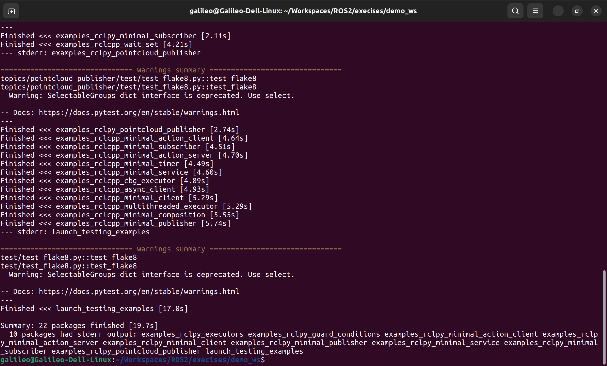
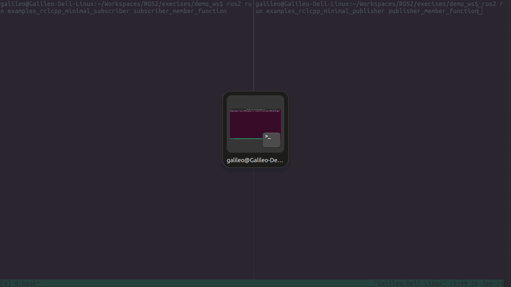

# ROS2 Humble学习笔记 (2)

## 一、前言
在[上一篇学习笔记](https://watershade.github.io/ROS2/ROS2_Humble_Learning_Note_1/)中，我们学习ROS2的一些基本概念，主要是官方入门教程中的[Beginner: CLI tools](https://docs.ros.org/en/humble/Tutorials/Beginner-CLI-Tools.html)部分。现在我们继续学习[Beginner: Client libraries](https://docs.ros.org/en/humble/Tutorials/Beginner-Client-Libraries.html).这部分将设计到ROS2的编程和代码等部分。通过这一部分学习，也能够对于ROS2的一些基本概念有更深入的理解。

## 二、ROS2编程基础
这篇笔记将记录在学习官方入门教程[Beginner: Client libraries](https://docs.ros.org/en/humble/Tutorials/Beginner-Client-Libraries.html)部分的具体内容和尝试遇到的问题，以及一些额外的思考。

### 2.1 Colcon入门
本小节内容主要参考[Colcon Tutorial](https://docs.ros.org/en/humble/Tutorials/Beginner-Client-Libraries/Colcon-Tutorial.html)和[A universal build tool](https://design.ros2.org/articles/build_tool.html)。


#### 2.1.1 Colcon的设计原则
在 ROS 生态系统中，软件被分成许多软件包。开发人员同时开发多个软件包的情况非常普遍。这与工作流程形成了鲜明对比，在工作流程中，开发人员一次只开发一个软件包，所有依赖关系都是一次性提供的，而不是不断迭代。

"手动"构建软件包的方法包括按照拓扑顺序逐个构建所有软件包。对于每个软件包，文档通常都会说明依赖关系是什么、如何设置环境来构建软件包，以及之后如何设置环境来使用软件包。如果没有一个能自动完成这一过程的工具，这样的工作流程在大规模的情况下是不可行的。

因此，ROS2的设计者就希望设计一个统一构建（build）工具，通过一次调用完成一组软件包的构建。它应当同时支持ROS1（向后兼容）和ROS2的软件包的构建。如果必要的元信息可以通过推断和/或外部提供的方式获得，那么它还能与那些本身不提供清单文件的软件包协同工作。这样，构建工具就能用于非 ROS 软件包（如 Gazebo，包括其点火依赖项、sdformat 等）。

尽管在ROS的生态系统中，有几种工具满足上述要求。大多都大同小异，因为是单独开发的，很多时候某些必要功能只存在与某个构建工具中。这就是为什么ROS2的设计者希望一个功能完善的统一构建工具的原因。想一想Python中数量繁多的包管理和依赖解决工具带来的后果。另外作者也提到了这样一个问题，这确实更能说明他们希望的构建工具到底是什么：
```txt
由于本文的重点是构建工具，因此需要澄清与构建系统的区别。

编译工具（Build Tool）对一组软件包进行操作。它确定依赖关系图，并按拓扑顺序为每个软件包调用特定的构建系统。构建工具本身应尽可能少地了解特定软件包所使用的构建系统。只需知道如何为其设置环境、调用构建和设置环境以使用构建的软件包即可。现有的 ROS 构建工具包括：catkin_make、catkin_make_isolated、catkin_tools 和 ament_tools。

另一方面，编译系统（Build System）是在单个软件包上运行的。例如 Make、CMake、Python setuptools 或 Autotools（ROS 目前没有使用）。例如，CMake 软件包可以通过调用以下步骤来构建：cmake、make、make install。
```

另外作者强调了Colcon应当功能单一，总之尽可能符合软件开发原则：
* 关注点分离
* 单一职责原则
* 最少知识原则
* 不要重复自己
* 保持愚蠢简单
* “不为不使用的东西付费”

作者提到了ROS2上已经有专门的获取构建工具所需源码的工具（例如rosinstall 或 wstool（对于 .rosinstall 文件）或 vcstool（对于 .repos 文件）），也有专门的依赖项安装工具（rosdep），二进制包生成工具（如bloom等）。


### 2.1.2 Colcon介绍
Colcon是一个构建工具，可以用来构建ROS2项目。它可以帮助我们更加方便地管理ROS2项目，包括编译、测试、安装等

### 2.1.3 安装Colcon
通常ros2-desktop中已经安装好了colcon.但是如果你要单独安装（这里只关注我目前使用的Ubuntu22.04），则可以使用apt安装：
```bash
sudo apt install python3-colcon-common-extensions
```

另外，我也看到有些包，比如`MoveIt 2`使用了colcon的mixin扩展。（colcon-mixin是colcon-core 的扩展，用于从存储库获取和管理 CLI mixins。）
```bash
$ sudo apt install python3-colcon-mixin
$ colcon mixin add default https://raw.githubusercontent.com/colcon/colcon-mixin-repository/master/index.yaml
$ colcon mixin update default
```
<font color=orange>（注：请注意当需要显示终端回应的内容时，我会在用户输入的命令前添加`$`符号，以表示命令提示符。以下不再赘述。）</font>


### 2.1.4 Colcon的目录结构
当新创建一个colcon软件包时，先要在其内部创建一个名为src的子文件夹用以存放代码。
这里假定我们创建一个软件包的工作空间叫做demo_ws.我们可以这样做：
```bash
mkdir -p demo_ws/src
cd demo_ws
```
这样我们就创建一个名字叫demo_ws的工作空间，并在其内部创建一个名为src的子文件夹。
因为本节的目的是学习colcon的使用，所以我们可以先从官方提供的[examples](https://github.com/ros2/examples)中clone代码。这个仓库里面有针对不同ROS2版本的example,
所以用户可以选择针对自己的ROS2版本进行clone。当然记得将clone的代码放在src文件夹中。

```bash
git clone https://github.com/ros2/examples src/examples -b humble
```
然后我们不妨熟悉一下examples的目录结构：
```bash
$ ls src/examples/
CONTRIBUTING.md  launch_testing  LICENSE  rclcpp  rclpy  README.md

## 当然也可以用目录树的结构展示
$ tree . -L 3
.
└── src
    └── examples
        ├── CONTRIBUTING.md
        ├── launch_testing
        ├── LICENSE
        ├── rclcpp
        ├── rclpy
        └── README.md

5 directories, 3 files
```
相比于入门教程多了一个文件夹：launch_testing。这个文件夹包含launch和launch_testing 包的简单用例。这些旨在帮助初学者开始使用这些软件包并帮助他们理解这些概念。
而rclcpp和rclpy分别是C++和python相关的示例代码。

当colcon完全编译之后，它内部的文件夹结构如下：
```txt
.
├── build
├── install
├── log
└── src
```
src就是我们刚才将源码放入的目录;build是编译空间;install是安装空间;log是调试或者编译的记录。

### 2.1.5 underlay和overlay
还记得在Beginner:CLI中，每次启动turtlesim的时候都要source一下`/opt/ros/humble/setup.bash`了吗？那里会配置我们启动turtlesim所需的各种依赖和环境变量。

在使用colcon编译的时候同样需要我们借助setup script（设置脚本）来创建一个包含示例软件包所需的构建依赖项的工作区。我们称这种环境为 `underlay`（底层环境）。因为`underlay`似乎没有好的翻译，但大概可以翻译叫做基础环境或者底层环境。表示上层或中层的代码编译、执行、测试都有需要依赖于它。后面的描述中我们就直接叫做`underlay`.

现在我们的工作区demo_ws将是现有ROS2安装的`overlay`（覆盖层）。`overlay`这个概念如果生硬的翻译就是“覆盖环境”。这是相对于`underlay`这个概念而言的。通常来说，当你迭代少量的packages时，建议使用一个独立的`overlay`，而不是将所有的packages放在同一个工作区中。

### 2.1.6 Build the Worksapce/工作区编译
catkin中除了代码空间/src（source space）、编译空间/build（build space）、安装空间/install（install space）。还有专门的devel（development space）用来存放编译生成的可执行文件等。但是新的ament_cmake不支持devel,需要安装包。这时候可以在build的时候`--symlink-install`选项，这样可以要求编译器尽可能使用符号链接而不是复制文件。这样就可以更改源代码中的配置文件来更改已安装的文件，从而加速项目的迭代。<font color=red>（这一部分解释还不是很理解）</font>

终于来到激动人心的编译环节了：
```bash
## 请确保当前正位于demo_ws目录下
colcon build --symlink-install
```
编译完成会有形如“Summary: {x} packages finished [{n}s]”这样的字样。信息比较直观，不再赘述。我们可以查看现在的文件目录：
```bash
$ tree -L 1
.
├── build
├── install
├── log
└── src

4 directories, 0 files
```
这个目录结构在前面已经简单介绍过了。我们可以深入的浏览一下每个目录的文件，以加深印象。

### 2.1.7 test/测试
colcon的功能十分强大，因此命令也就异常复杂。慢慢了解吧。我们先来看看如果使用colcon来测试。
```bash
colcon test
```
测试完成之后也会有类似的提示：“Summary: {x} packages finished [{n}s]”。
中间还可能有一些警告，比如下图：

<p style="text-align:center; color:orange">图1：colcon test结果示例图</p>

### 2.1.8 setup/设置
在进一步测试之前，需要source一下生成的setup脚本，才能为新生成的package执行包创建包含必须依赖的工作空间。做法和之前创建underlay的工作空间一样。因为ubuntu的terminal是bash,以后就不强调这一点。如果你的是其它的terminal,你还可以选择使用ps1,sh,zsh等。

```bash
source install/setup.bash
```

### 2.1.9 try/尝试
现在我们来尝试一下example里面的demo.入门教程里面演示的是examples_rclcpp_minimal_subscriber和examples_rclcpp_minimal_publisher这一组examples.打开两个终端窗口，一个担任subscriber一个担任publisher.

<p style="text-align:center; color:orange">图2：rclcpp minimal demo</p>


## 2.2 


## 三、项目开发
## 四、项目开发
## 五、项目开发

## 六、Artemis机器人构想


https://docs.ros.org/en/humble/Tutorials/Beginner-Client-Libraries/Colcon-Tutorial.html

## 附录
ROS相关：
* [Colcon Tutorial](https://docs.ros.org/en/humble/Tutorials/Beginner-Client-Libraries/Colcon-Tutorial.html)
* [A universal build tool](https://design.ros2.org/articles/build_tool.html)
* [古月居机器人教程](https://book.guyuehome.com/)
* [古月机器人入门21讲](https://class.guyuehome.com/p/t_pc/course_pc_detail/column/p_628f4288e4b01c509ab5bc7a)


Jetson相关：


Linux相关：
* [Tmux使用教程](https://www.ruanyifeng.com/blog/2019/10/tmux.html)

