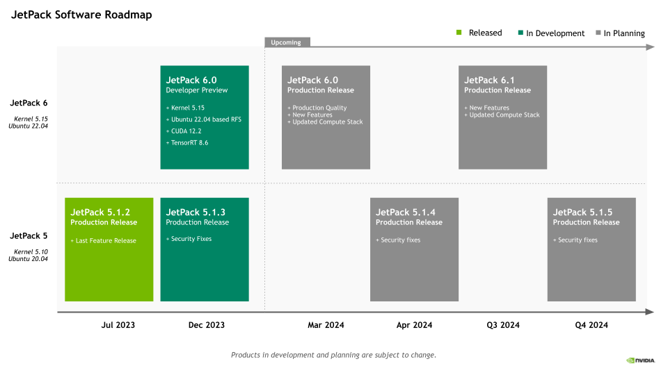
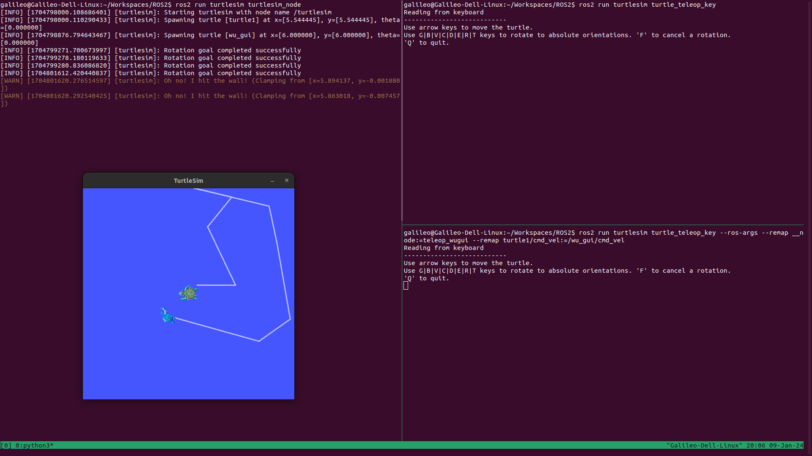

# ROS2 Humble学习笔记 (1)

[2024.01.05 正在编辑中，更新至3.2小节]

## 一、前言
2013年的时候已经接触ROS了，当时断断续续学习了一些ROS的基础知识。16年搬到深圳之后，也有幸参加过星火的一次关于ROS的一些活动。当时活动的主讲之一是CSDN上ROS知识传播界的大牛的古月和港中文的林天麟先生。然而，因为自己一直涉猎的是嵌入式领域，一直没有在ROS上有所深耕。十年过去了，我相信我的知识已经足够从头到尾做一台机器人小车（无论是嵌入式软硬件合适结构）。所以我决定开始重新学习ROS。当年ROS2还没有完成，现在ROS2的LTS版本已经是humble了（ROS的版本大体是按照字母顺序起名的，所以你可以看到进展）。

这次学习，我的目标是达到中级水平，能够按照自己的需求开发机器人系统所需要的功能包。另一方面，在工程上我希望基于手边的Jetson Nano自己制作一台机器人。在这些够完成之后，开始个人的机器人项目：Artemis。

除了ROS2的学习，我还希望同时了解和学习Nvidia的ISAAC ROS开发方法。好在我的笔记本基本满足ISAAC的最低要求。知识内存需要从16G升级到32G。目前暂且使用笔记本来开发ISAAC，后续如果实在需要服务器或者PC机，可能这将是一笔较大的投入。不过暂时先将此时放在一边。
好了，现在开始学习吧。愿计划可以达成。

## 二、安装
为了安装humble，我的计算机目前安装的Ubuntu22.04，这也是一个LTS版本。安装过程并不复杂，我按照官方的教程在笔记本（AMD64）和Raspberry Pi 4（ARM64）。

但是在我的Jetson Nano上遇到了问题。这是因为Nvidia对于Jetson Nano的支持并不积极，目前Nvidia的JetPack5（基于ubuntu20.04）支持的是orin系列和AVG系列。似乎JetPack 6(基于ubuntu22.04)也已经预发布了。似乎还继续支持orin和AVG系列。但按照我们对于Nvidia的了解，对于orin的支持也仅到JetPack6. Ubuntu 24.04将会是2024年另一个LTS版本，厂家的程序可能会延后半年到一年。所以nvidia未来的JetPack7可能会在2024年底或者2025年发布。相应的新Jetson硬件也应该会在2024年发布。所以如果需要购买Jetson，我们可以再等一等。暂时还是设法让Jetson Nano对humble进行支持。下面这几张图是Nvidia的产品和软件Roadmap，我觉得很讽刺的是支持的最后年限并不意味着软件和系统也跟着做相应的支持。

<p style="text-align:center; color:orange">图1：Jetson模块消费版路线图 </p>


<p style="text-align:center; color:orange">图2：Jetson模块工业版路线图 </p>


<p style="text-align:center; color:orange">图3：JetPack软件路线图 </p>


在搜索了一通之后，发现目前的道路有三条。一条是容易的道路，使用别人已经编译好的容器。另一条更难的道路是自行编译ROS2使其支持ubuntu18.04.第三条是让Jetson Nano支持ubuntu22.04.因为现在属于初期阶段，不想在起步阶段就卡住。所以我暂时使用容器的方法。当然这条道路坑也很多。

### 2.1 Jetson Nano容器方法运行ROS2 Humble
在开始正文之前，我简单说一下为什么会选择Humble，因为这是目前的最新的LTS版本，支持时间也相对比较长。感兴趣的朋友可以去ROS网站查看一下每个版本的支持时间。

#### 2.1.1 基础安装和尝试
Jetson Nano容器安装也是Nvidia官方支持的一部分。我们可以在他们的[链接](Jetson Containers)找到相应的说明。这个链接中包含多个ROS版本的Base、Core、Desktop镜像。
具体的安装方法可以看上面的链接中的说明。这里简单枚举一下命令：
```bash
#下载镜像到本地
sudo docker pull dustynv/ros:humble-ros-base-l4t-r32.7.1

# 通过镜像方式运行，这是一种比较节省空间的方式
sudo docker run --runtime nvidia -it --rm --network=host dustynv/ros:humble-ros-base-l4t-r36.2.0

#另一种更powerful的方式是直接clone整个仓库，然后在本都build和运行
#但是这种方式应该会占用更多空间，上手会有一定的难度。
#可以在稍微熟悉之后再尝试
```

#### 2.1.2 docker运行界面程序遇到的问题和解决办法
在docker界面运行ros2后如果要运行turtlesim_node,rqt等依赖gui的程序时要怎么解决问题。


#### 2.1.3 docker运行界面程序的IP问题

#### 2.1.X 更多问题

### 2.2 与ROS相关的vscode的插件
古月的ROS2入门21讲里面里面很好的总结了ROS2开发相干的插件，这里转述如下：
* ROS开发语言相关的python和C/C++插件。还有智能提示插件IntelliCode。这三个都是microsoft出的。还有CMAKE插件，古月推荐的是twxs提供的CMake插件，而不是由微软提供的CMake Tools。
* 美化相关的除了各种主题之外还有语言插件和叫做vscode-icons的插件。（也是microsoft出品）
* 与ROS直接相关的插件有：microsoft出的ROS(对ROS1和ROS2提供开发支持)；msg格式支持的Msg Language Support（作者是ajshort）；由smilerobotics制作的URDF插件对URDF文件提供支持；

## 三、ROS2基础学习

### 3.1 怎么查看turtlesim某个包的可执行文件
在官方的示例中，我们看到ros2 run的基本格式如下：`ros2 run <package_name> <executable_name>`,但是当我们拿到一个package的时候怎么它的executable对象呐。其实和我们查看我们的环境中的的packages是类似的。
```bash
# 查看pack命令
ros2 pkg list

# 查看是否包含某个名称的pack，例如寻找和urdf相关的包
ros2 pkg list | grep urdf

# 查看某个包的可执行程序，比如我们查看turtlesim包含的可执行程序
ros2 pkg executables turtlesim
#你将会收到如下response
# turtlesim draw_square
# turtlesim mimic
# turtlesim turtle_teleop_key
# turtlesim turtlesim_node
```
### 3.2 深刻理解spawn操作
在官方入门教程[Using turtlesim, ros2, and rqt](https://docs.ros.org/en/humble/Tutorials/Beginner-CLI-Tools/Introducing-Turtlesim/Introducing-Turtlesim.html#)那一章中指导我们利用rqt产生一个turtle，但是在看ros2入门21讲的时候我注意到它是利用命令行产生的另一个turtle。命令如下：
```bash
ros2 service call /spawn turtlesim/srv/Spawn "{x: 2, y: 2, theta: 0.2, name: ''}"
```
#### 3.2.1 追根溯源，弄懂怎么控制小乌龟
但是这条命令的格式为什么是这样，如果我要自己编辑一个命令靠死记硬背肯定不行呀。其实这也不是很复杂，我跟着ros2的命令提示操作起来。
```bash
# 1. 我们先看一下ros2都支持啥命令. 
# 为了便于描述，我在自己输入的命令前加上了‘$ ’
$ ros2 -h
  action     Various action related sub-commands
  bag        Various rosbag related sub-commands
  component  Various component related sub-commands
  daemon     Various daemon related sub-commands
  doctor     Check ROS setup and other potential issues
  interface  Show information about ROS interfaces
  launch     Run a launch file
  lifecycle  Various lifecycle related sub-commands
  multicast  Various multicast related sub-commands
  node       Various node related sub-commands
  param      Various param related sub-commands
  pkg        Various package related sub-commands
  run        Run a package specific executable
  security   Various security related sub-commands
  service    Various service related sub-commands
  topic      Various topic related sub-commands
  wtf        Use `wtf` as alias to `doctor`
# 共有17个参数，缩写和单词都是单数。不要误写成复数形式。
# 我们可以看到doctor和daemon分别是负责issue检查和守护程序的相关功能, wtf和docter一样
# lifecycle用来运行和生命周期相关的功能；multicast和组播相关；security应该是和加密相关的功能
# run用来运行包的可执行程序文件；launch运行启动文件；bag是用来记录、播放、查询rosbag的功能集
# pkg是ros功能包相关的功能集；interface和pkg的接口相关的功能集，下面会重点用到它
# components看提示适合container(容器)以及component(组件/元件)相关的。但目前还不知道用法
# param和node(节点)相关的参数操作相关的功能集
# node/service/action/topic是ROS2中一些基础概念，后面会提到

# 2. 起初我并不知道spawn到底是属于service，topic，action或是param
#    但是没关系，我们用list分别看看各自包含什么
$ ros2 node list
/turtlesim
$ ros2 action list
/turtle1/rotate_absolute
$ ros2 param list
/turtlesim:
  background_b
  background_g
  background_r
  qos_overrides./parameter_events.publisher.depth
  qos_overrides./parameter_events.publisher.durability
  qos_overrides./parameter_events.publisher.history
  qos_overrides./parameter_events.publisher.reliability
  use_sim_time
$ ros2 topic list
/parameter_events
/rosout
/turtle1/cmd_vel
/turtle1/color_sensor
/turtle1/pose
$ ros2 service list
/clear
/kill
/reset
/spawn
/turtle1/set_pen
/turtle1/teleport_absolute
/turtle1/teleport_relative
/turtlesim/describe_parameters
/turtlesim/get_parameter_types
/turtlesim/get_parameters
/turtlesim/list_parameters
/turtlesim/set_parameters
/turtlesim/set_parameters_atomically
# 上面是当我之前只开启了一个turtlesim_node之后的情况
# 可以看到spwan属于服务，当随着之后的学习我相信应该可以更准确的预测某个功能是service还是topic
# 好了我们现在锁定了我们想要的spwan功能属于一个service，具体是’/spawn‘

# 3.那么我们不妨先看一下service到底有啥操作
$ ros2 service -h
usage: ros2 service [-h] [--include-hidden-services] Call `ros2 service <command> -h` for more detailed usage. ...

Various service related sub-commands

options:
  -h, --help            show this help message and exit
  --include-hidden-services
                        Consider hidden services as well

Commands:
  call  Call a service
  find  Output a list of available services of a given type
  list  Output a list of available services
  type  Output a service's type             '
  Call `ros2 service <command> -h` for more detailed usage.

$ ros2 service call -h
ros2 service call -h
usage: ros2 service call [-h] [-r N] service_name service_type [values]

Call a service

positional arguments:
  service_name    Name of the ROS service to call to (e.g. '/add_two_ints')
  service_type    Type of the ROS service (e.g. 'std_srvs/srv/Empty')
  values          Values to fill the service request with in YAML format (e.g. '{a: 1, b: 2}'), otherwise the service request will be published with default values

options:
  -h, --help      show this help message and exit
  -r N, --rate N  Repeat the call at a specific rate in Hz

# 很显然ros2 service call是我们最终要使用的可执行程序它需要三个参数
# 第一个参数是service_name，这里是我们用`ros2 service list`的时候查询到的`/spwan`
# 第二个参数是service_type,按照上面的输出我们应该可以通过调用type查询到
# 第三个参数是values，需要参数是YAML形式的。这个是问题的核心。这个参数可选，忽略后用默认值。

# 4. 我们先来找到第二个参数
$ ros2 service type /spawn
turtlesim/srv/Spawn
# 在反复品味这个指令之后，我的理解是type是这个service需要的数据结构/数据类型
# 在尝试了param之后想到interface应该包含这个数据结构的信息，一测试还真可以

# 5. 我们用interface查看一下第三个参数有什么
$ ros2 interface -h
usage: ros2 interface [-h] Call `ros2 interface <command> -h` for more detailed usage. ...

Show information about ROS interfaces

options:
  -h, --help            show this help message and exit

Commands:
  list      List all interface types available
  package   Output a list of available interface types within one package
  packages  Output a list of packages that provide interfaces
  proto     Output an interface prototype
  show      Output the interface definition

  Call `ros2 interface <command> -h` for more detailed usage.
$ ros2 interface package turtlesim
turtlesim/srv/Spawn
turtlesim/srv/SetPen
turtlesim/srv/TeleportRelative
turtlesim/msg/Pose
turtlesim/msg/Color
turtlesim/action/RotateAbsolute
turtlesim/srv/Kill
turtlesim/srv/TeleportAbsolute
# 我们可以看到'turtlesim/srv/Spawn'正是turtlesim包的可用接口类型
# service type也是一种interface type。可以看到有srv,msg和action三种接口
# msg应该是topic用的，srv就是我们这里的service用的，action就是action用的
$ ros2 interface proto turtlesim/srv/Spawn
"x: 0.0
y: 0.0
theta: 0.0
name: ''
"
# 查看了类型的原型（prototype）
$ ros2 interface show turtlesim/srv/Spawn
float32 x
float32 y
float32 theta
string name # Optional.  A unique name will be created and returned if this is empty
---
string name
# 显示更详细的信息
```
到这里我们就基本了解了怎么使用spawn去产生另一个乌龟。这里还有一个问题是YAML是什么数据格式。我这里提供一个[菜鸟教程的链接](https://www.runoob.com/w3cnote/yaml-intro.html).YAML的语法还是有一些比较严格的规格的，可以使用vscode中的redhat的YAML插件来检查数据内容是否符合规格。一般在shell中使用YAML的flow style形式。和json类似，但key不使用引号包裹。
根据上面的提示物品们就可以自己制作一个的命令,注意YAML语句需要用单引号或者双引号包裹：
```bash
ros2 service call /spawn turtlesim/srv/Spawn "{ x: 6, y: 6, theta: 0.0, name: 'wu_gui' }"
```
#### 3.2.2 举一反三，我们试着使用“/reset”服务
按照上面类似的方法我们可以看一下/reset的用法：
```bash
# 查询第二个参数
$ ros2 service type /reset
std_srvs/srv/Empty

# 使用interface的show或者proto功能去查看这个类型的信息
$ ros2 interface proto std_srvs/srv/Empty
"{}
"

# 至此我们基本确定了value是空，这个参数可以省略
# 现在开始尝试一下
$ ros2 service call /reset std_srvs/srv/Empty

# 这时候你会发现之前界面上的两只乌龟都消失了，出来了另一只不同颜色的乌龟
```
#### 3.2.3 扩展技能，使用action操作乌龟
在3.2.1的最后我们使用service创造了另一只乌龟，不过在3.2.2中我们又将它清除了。现在我们再次重复3.2.1的操作创建另一只名字叫"wu_gui"的turtle。

```bash
## 1. 查询目前支持的action
$ ros2 action -h
usage: ros2 action [-h] Call `ros2 action <command> -h` for more detailed usage. ...

Various action related sub-commands

options:
  -h, --help            show this help message and exit

Commands:
  info       Print information about an action
  list       Output a list of action names
  send_goal  Send an action goal

  Call `ros2 action <command> -h` for more detailed usage.

## 2.查询一下send_goal需要什么参数 
$ ros2 action send_goal -h
usage: ros2 action send_goal [-h] [-f] action_name action_type goal

Send an action goal

positional arguments:
  action_name     Name of the ROS action (e.g. '/fibonacci')
  action_type     Type of the ROS action (e.g. 'example_interfaces/action/Fibonacci')
  goal            Goal request values in YAML format (e.g. '{order: 10}')

options:
  -h, --help      show this help message and exit
  -f, --feedback  Echo feedback messages for the goal

## 3. 现在看一下都有那些action，可以看到我们的wu_gui节点有一个action
$ ros2 action list
/turtle1/rotate_absolute
/wu_gui/rotate_absolute

## 4. 查询/wu_gui/rotate_absolute这个action的信息
$ ros2 action info -h
usage: ros2 action info [-h] [-t] [-c] action_name

Print information about an action

positional arguments:
  action_name       Name of the ROS action to get info (e.g. '/fibonacci')

options:
  -h, --help        show this help message and exit
  -t, --show-types  Additionally show the action type
  -c, --count       Only display the number of action clients and action servers
$ ros2 action info -t /wu_gui/rotate_absolute
Action: /wu_gui/rotate_absolute
Action clients: 0
Action servers: 1
    /turtlesim [turtlesim/action/RotateAbsolute]

## 此时我们得到send_goal的action_name和action_type，还需要一个goal
## 5. 类似与之前的方法我们用interface指令去查询turtlesim/action/RotateAbsolute
$ ros2 interface proto turtlesim/action/RotateAbsolute
"theta: 0.0
"

# 至此我们基本确定了所有的参数
# 6. 现在开始尝试发送指令
ros2 action send_goal /wu_gui/rotate_absolute  turtlesim/action/RotateAbsolute "{ theta: 1.732}"
Waiting for an action server to become available...
Sending goal:
     theta: 1.732

Goal accepted with ID: 8733fdd9a69a4bfebda19fae76b0912d

Result:
    delta: -0.9440000057220459

Goal finished with status: SUCCEEDED

```
现在你会发现乌龟已经朝向了顶部。

#### 3.2.4 继续折腾，使用topic和乌龟对话
topic是ros2很重要的概念，turtlesim下面有很多topic。稍后我会展示cmd_vel这个Topic。
```bash
# 1. 我们先看一下topic的功能
$ ros2 topic -h
usage: ros2 topic [-h] [--include-hidden-topics] Call `ros2 topic <command> -h` for more detailed usage. ...

Various topic related sub-commands

options:
  -h, --help            show this help message and exit
  --include-hidden-topics
                        Consider hidden topics as well

Commands:
  bw     Display bandwidth used by topic
  delay  Display delay of topic from timestamp in header
  echo   Output messages from a topic
  find   Output a list of available topics of a given type
  hz     Print the average publishing rate to screen
  info   Print information about a topic
  list   Output a list of available topics
  pub    Publish a message to a topic
  type   Print a topic's type                          '   

# 可以看到topic的功能还是很复杂的,后面我只展示几个主要步骤
# 2. 我们看一下当前有什么topic
$ ros2 topic list
/parameter_events
/rosout
/turtle1/cmd_vel
/turtle1/color_sensor
/turtle1/pose
/wu_gui/cmd_vel
/wu_gui/color_sensor
/wu_gui/pose
# 3. pub按照解释应该是发布（publish）主题的我们简单看一下它的用法 
ros2 topic pub -h
usage: ros2 topic pub [-h] [-r N] [-p N] [-1 | -t TIMES] [-w WAIT_MATCHING_SUBSCRIPTIONS] [--keep-alive N] [-n NODE_NAME]
                      [--qos-profile {unknown,system_default,sensor_data,services_default,parameters,parameter_events,action_status_default}] [--qos-depth N]
                      [--qos-history {system_default,keep_last,keep_all,unknown}] [--qos-reliability {system_default,reliable,best_effort,unknown}]
                      [--qos-durability {system_default,transient_local,volatile,unknown}] [--spin-time SPIN_TIME] [-s]
                      topic_name message_type [values]

Publish a message to a topic

positional arguments:
  topic_name            Name of the ROS topic to publish to (e.g. '/chatter')
  message_type          Type of the ROS message (e.g. 'std_msgs/String')
  values                Values to fill the message with in YAML format (e.g. 'data: Hello World'), otherwise the message will be published with default values

options:
  -h, --help            show this help message and exit
  -r N, --rate N        Publishing rate in Hz (default: 1)
  -p N, --print N       Only print every N-th published message (default: 1)
  -1, --once            Publish one message and exit
  -t TIMES, --times TIMES
                        Publish this number of times and then exit
  -w WAIT_MATCHING_SUBSCRIPTIONS, --wait-matching-subscriptions WAIT_MATCHING_SUBSCRIPTIONS
                        Wait until finding the specified number of matching subscriptions. Defaults to 1 when using "-1"/"--once"/"--times", otherwise defaults to 0.
  --keep-alive N        Keep publishing node alive for N seconds after the last msg (default: 0.1)
  -n NODE_NAME, --node-name NODE_NAME
                        Name of the created publishing node
  --qos-profile {unknown,system_default,sensor_data,services_default,parameters,parameter_events,action_status_default}
                        Quality of service preset profile to publish)
  --qos-depth N         Queue size setting to publish with (overrides depth value of --qos-profile option)
  --qos-history {system_default,keep_last,keep_all,unknown}
                        History of samples setting to publish with (overrides history value of --qos-profile option, default: keep_last)
  --qos-reliability {system_default,reliable,best_effort,unknown}
                        Quality of service reliability setting to publish with (overrides reliability value of --qos-profile option, default: reliable)
  --qos-durability {system_default,transient_local,volatile,unknown}
                        Quality of service durability setting to publish with (overrides durability value of --qos-profile option, default: transient_local)
  --spin-time SPIN_TIME
                        Spin time in seconds to wait for discovery (only applies when not using an already running daemon)
  -s, --use-sim-time    Enable ROS simulation time
# 尽管pub的命令很复杂，但是主要的参数还是3个：name,type,value
# 这和action，service并不区别。其中value有时是可选的
# 只是topic多了很多更多样的options，这些options后面慢慢研究

# 4. info和type都可以看到某个topic的类型，这里我们使用type看一下/wu_gui/cmd_vel的类型
$ ros2 topic type /wu_gui/cmd_vel
geometry_msgs/msg/Twist

# 这样我们就获得了第二个参数
# 现在根据第二个参数来了解第三个参数要怎么输入
$ ros2 interface show geometry_msgs/msg/Twist
# This expresses velocity in free space broken into its linear and angular parts.

Vector3  linear
	float64 x
	float64 y
	float64 z
Vector3  angular
	float64 x
	float64 y
	float64 z
$ ros2 interface proto geometry_msgs/msg/Twist
"linear:
  x: 0.0
  y: 0.0
  z: 0.0
angular:
  x: 0.0
  y: 0.0
  z: 0.0
"
# 上面的信息显示了线速度和角速度，每个都是三个参数组成的矢量，每个参数都是float64类型的。
# float64暂时不知道是不是double还是一种特殊定义的float类型。

# 5. 按照上面的信息我们来组合一个pub命令
$ ros2 topic pub /wu_gui/cmd_vel  geometry_msgs/msg/Twist  "{ linear: { x: 5.0, y: 0.0, z: 0.0 }, angular: { x: 0.0, y: 0.0, z: 1.732 }}"
```
现在你可以看到一个旋转的乌龟：


<p style="text-align:center; color:orange">图4：旋转乌龟</p>

### 3.3 turtlesim remap的理解

教程中举例的两个remap指令如下：

```bash
## 重定向node的名称
ros2 run turtlesim turtlesim_node --ros-args --remap __node:=my_turtle

## 重定向teleop_key的操作对象
ros2 run turtlesim turtle_teleop_key --ros-args --remap turtle1/cmd_vel:=turtle2/cmd_vel

```
官方对于remap其实有[说明](https://design.ros2.org/articles/ros_command_line_arguments.html#name-remapping-rules)。remap的原型是`ros2 run some_package some_ros_executable --ros-args --remap from:=to`或者简写做`ros2 run some_package some_ros_executable --ros-args -r from:=to`.

这个语句本身没有问题，只是from应该怎么填写是我的问题。比如第一条指令中的“__node”来自哪里？按照官方的说法这属于node的properities。携带有“__”标记应该是所有节点的通用参数。关于这些通用参数，我查询到[ROS2的一篇文章](https://design.ros2.org/articles/static_remapping.html)介绍了"__ns","__name","__node"这三种参数，分别表示namespace，name和node等。具体可点击上面的链接查看。我稍后可能会开一篇新的帖子介绍一下remap的详细参数。因为remap的机制似乎非常重要。


第二条指令中的“turtle1/cmd_vel”是这个节点的publisher的一条。我们可以按照如下方法查看：
```bash
$ ros2 node list
/teleop_turtle
/turtlesim
$ ros2 node info /teleop_turtle
/teleop_turtle
  Subscribers:
    /parameter_events: rcl_interfaces/msg/ParameterEvent
  Publishers:
    /parameter_events: rcl_interfaces/msg/ParameterEvent
    /rosout: rcl_interfaces/msg/Log
    /turtle1/cmd_vel: geometry_msgs/msg/Twist
  Service Servers:
    /teleop_turtle/describe_parameters: rcl_interfaces/srv/DescribeParameters
    /teleop_turtle/get_parameter_types: rcl_interfaces/srv/GetParameterTypes
    /teleop_turtle/get_parameters: rcl_interfaces/srv/GetParameters
    /teleop_turtle/list_parameters: rcl_interfaces/srv/ListParameters
    /teleop_turtle/set_parameters: rcl_interfaces/srv/SetParameters
    /teleop_turtle/set_parameters_atomically: rcl_interfaces/srv/SetParametersAtomically
  Service Clients:

  Action Servers:

  Action Clients:
    /turtle1/rotate_absolute: turtlesim/action/RotateAbsolute

```
上图的Publishers中的一个标签就是“/turtle1/cmd_vel”。而这个标签正好指向它控制的那个乌龟。现在我们不妨先spawn一个名字叫wugui的turtle，我在3.2.1小节有介绍方法。然后我们新创建一个teleop_key指向这个乌龟。接着在另一个终端里查看一下新创建的teleop_key的节点信息。

为了便于描述我在自己输入的指令前面添加了"$ ",如果你要复制指令需要去掉这个标志。输出的信息前面不添加任何内容。另外我目前已经打开了三个终端窗口，大家可以查看图5（Remap示例图）。我们将左侧窗口编号叫做#0，右侧上方叫做#1，右侧下方叫做#2.另外新打开一个终端叫做#3。

现在在#2终端操作如下：
```bash
$ ros2 service call /spawn turtlesim/srv/Spawn "{ x: 6, y: 6, theta: 0.0, name: 'wu_gui' }"
## 然后list一下topic，确保里面包含了你需要remap的目标
$ ros2 topic list
/parameter_events
/rosout
/turtle1/cmd_vel
/turtle1/color_sensor
/turtle1/pose
/wu_gui/cmd_vel
/wu_gui/color_sensor
/wu_gui/pose

## 接着将turtle_teleop_key的发布对象指向/wu_gui/cmd_vel
$ ros2 run turtlesim turtle_teleop_key --ros-args --remap /turtle1/cmd_vel:=/wu_gui/cmd_vel
```
这条指令并不完美，因为如果你list一下node会发现重名问题。
下面的在#3终端操作如下：
```bash
$ ros2 node list
WARNING: Be aware that are nodes in the graph that share an exact name, this can have unintended side effects.
/teleop_turtle
/teleop_turtle
/turtlesim
```
上面是我的显示，你看以看到重名问题提示。

现在我们回到#2终端,让我们停止这个重命名的节点.可以键入ctrl+c或者q停止刚才的节点。然后我们在#2终端重新remap。
```bash
## 重新输入
$ ros2 run turtlesim turtle_teleop_key --ros-args --remap __node:=teleop_wugui --remap /turtle1/cmd_vel:=/wu_gui/cmd_vel 

## 你如果使用方向键，它确实可以控制乌龟的旋转
```
现在我们在#3终端操作如下：
```bash
## 我们回到刚才list node的节点再次执行
$ ros2 node list
/teleop_turtle
/teleop_wugui
/turtlesim
## 现在再来看一下节点信息
$ ros2 node info /teleop_wugui
/teleop_wugui
  Subscribers:
    /parameter_events: rcl_interfaces/msg/ParameterEvent
  Publishers:
    /parameter_events: rcl_interfaces/msg/ParameterEvent
    /rosout: rcl_interfaces/msg/Log
    /wu_gui/cmd_vel: geometry_msgs/msg/Twist
  Service Servers:
    /teleop_wugui/describe_parameters: rcl_interfaces/srv/DescribeParameters
    /teleop_wugui/get_parameter_types: rcl_interfaces/srv/GetParameterTypes
    /teleop_wugui/get_parameters: rcl_interfaces/srv/GetParameters
    /teleop_wugui/list_parameters: rcl_interfaces/srv/ListParameters
    /teleop_wugui/set_parameters: rcl_interfaces/srv/SetParameters
    /teleop_wugui/set_parameters_atomically: rcl_interfaces/srv/SetParametersAtomically
  Service Clients:

  Action Servers:

  Action Clients:
    /turtle1/rotate_absolute: turtlesim/action/RotateAbsolute
```


这里展示一下我的测试图：

<p style="text-align:center; color:orange">图5：Remap示例</p>

然而，上述操作其实还是有一些副作用。尽管你可以通过方向键控制wugui，但是如果按G|B|V|C|D|E|R|T这些按键，控制的却是turtle1。我们需要继续优化这条指令。幸运的是我们在查看节点信息的时候已经发现了原因：action clients的标签还是/turtle1/rotate_absolute。我们通过名称也大概可以知道这个是关于控制旋转的动作。所以我们也remap一下它吧。这一次我们用间断的“-r”提到“--remap”当然还需要你使用Q或者Ctrl+C停止#2终端的执行。然后在#2终端执行如下操作：
```shell
$ ros2 run turtlesim turtle_teleop_key --ros-args \
-r __node:=teleop_wugui \
-r /turtle1/cmd_vel:=/wu_gui/cmd_vel \
-r /turtle1/rotate_absolute:=/wu_gui/rotate_absolute
```
现在我们在#3终端操作如下：
```shell
## 我们再查看一下节点信息
$ ros2 node info /teleop_wugui
/teleop_wugui
  Subscribers:
    /parameter_events: rcl_interfaces/msg/ParameterEvent
  Publishers:
    /parameter_events: rcl_interfaces/msg/ParameterEvent
    /rosout: rcl_interfaces/msg/Log
    /wu_gui/cmd_vel: geometry_msgs/msg/Twist
  Service Servers:
    /teleop_wugui/describe_parameters: rcl_interfaces/srv/DescribeParameters
    /teleop_wugui/get_parameter_types: rcl_interfaces/srv/GetParameterTypes
    /teleop_wugui/get_parameters: rcl_interfaces/srv/GetParameters
    /teleop_wugui/list_parameters: rcl_interfaces/srv/ListParameters
    /teleop_wugui/set_parameters: rcl_interfaces/srv/SetParameters
    /teleop_wugui/set_parameters_atomically: rcl_interfaces/srv/SetParametersAtomically
  Service Clients:

  Action Servers:

  Action Clients:
    /turtle1/rotate_absolute: turtlesim/action/RotateAbsolute

```
可以发现G|B|V|C|D|E|R|T这些按键控制的还是turtle1而不是wu_gui。我们看节点信息也可以看到Action Clients还是没有改变。
我在一个issue里面提到了这个问题：[issue 1312](https://github.com/ros2/ros2/issues/1312)。你可以查看[那篇帖子的回答](https://github.com/ros2/ros2/issues/1312#issuecomment-1234710681).大概意思就是当时这个feature还没有实现，但是目前有一些解决方法。不过确实非常繁琐。你需要将action的feedback，status，cancel_goal，get_result，send_goal等信息都重新remap一下。因为这涉及到action，后面学到了再深入了解吧。

### 3.4 node
我们再来回到一个基础问题：node是什么？

### 3.5 daemon的作用
我对daemon的作用不太了解，最后在查看 https://www.ncnynl.com/archives/202210/5572.html 和 https://answers.ros.org/question/327348/what-is-ros2-daemon/ 这两个网址后基本解决了这个问题。为了防止网址失效，将内容粘贴如下（内容稍有修改）：
```txt
ROS2入门教程-daemon简介
说明:
    ROS2 daemon是一个守护进程作用与master在 ROS1 中的作用相同。但是，与ROS1不同，它不是必需的，而是一种优化。
    ROS2 节点可以在没有它的情况下运行，这与ROS1节点在没有主节点（ROS Master）的情况下无法运行不同。
原理:

    DDS（ROS2 在其默认配置中使用的底层通信中间件）有一个发现协议。这用于为节点提供一种分散的方式来找到彼此，而不是像ROS1那样使用主节点。它工作得很好，但它也比使用主节点的方法花费更长的时间，因为每个启动的新节点都必须发送广播寻找其他节点并等待响应进来，以及从其他节点收集hello可能随时间到达的节点。结果是知道其他节点在网络上的存在和位置不再是单一请求的事情，建立知识需要时间。如果您涉及更复杂的网络，则该时间会更长。也很难知道您何时找到了当前存在的所有节点。（注：实时性就得不到保障，尽管ROS2不是一个实时系统。）

    对于想要启动、快速执行某些任务然后关闭的节点来说，这是一个重大缺陷。这类节点的一个很好的例子是 ros2 topic pub 创建的短期节点，用于在您运行该命令时发送一些数据。您不希望它在执行您要求的操作之前等待 30 秒收集节点问候广播。你可以减少它等待的时间，但是你等待的时间越短，它找到的现有节点图就越少，这意味着你的 ros2 主题发布数据可能不会到达实际监听该主题的每个节点。

    解决方案是 ROS2 daemon(守护进程)。这是一个全天候待命的节点，只是监听发现协议流量并记录哪些节点是活动的以及它们在哪里。然后，当一个新节点想知道其他节点在哪里时，它可以绕过自己的 DDS 发现过程，并联系已知端口上的 ROS2 daemon并询问它的graph information（可理解为网络拓扑）。

    这个方案的好处是新节点仍然执行其标准的 DDS 发现过程，所以如果ROS2 daemon不存在，那么它仍然能够找到其他新节点并正常运行。这与ROS 1有很大不同，如果主节点不存在，您的节点将无法运行。类似地，如果新节点在ROS2守护进程之后不久启动，那么守护进程将不会缓存太多关于现有节点的信息。然而，在这种情况下，新节点仍然可以从其DDS发现过程中找到丢失的信息，因此它对于该潜在问题也是稳健的。这与ROS1不同，在ROS1中，如果您在master死后重新启动它，任何新节点都会运行，但它们无法找到在 master 重新启动之前存在的节点。
```
归纳起来就是多了一个独立节点作为DDS graph information信息的收集者，可以减少发现目标节点的时长，但不会降低发现目标节点的机会（机率）。


## 四、深入学习


## 五、项目开发

## 六、Artemis机器人构想


## 附录
ROS相关：
* [humble Install](https://docs.ros.org/en/humble/Installation.html)
* [humble Beginning](https://docs.ros.org/en/humble/Tutorials.html)
* [古月居机器人教程](https://book.guyuehome.com/)
* [古月机器人入门21讲](https://class.guyuehome.com/p/t_pc/course_pc_detail/column/p_628f4288e4b01c509ab5bc7a)

Jetson相关：
* [Jetson Containers](https://github.com/dusty-nv/jetson-containers)
* [Jetson Containers/ROS](https://github.com/dusty-nv/jetson-containers/tree/master/packages/ros)


Linux相关：
* [Tmux使用指南](https://cgking.gitbook.io/linux/linux/tmux-shi-yong-shou-ce)

其它：
* [yaml菜鸟教程的链接](https://www.runoob.com/w3cnote/yaml-intro.html)
* [tmux使用指南](https://www.ruanyifeng.com/blog/2019/10/tmux.html)


<初稿写与2024.01 未完待续>
