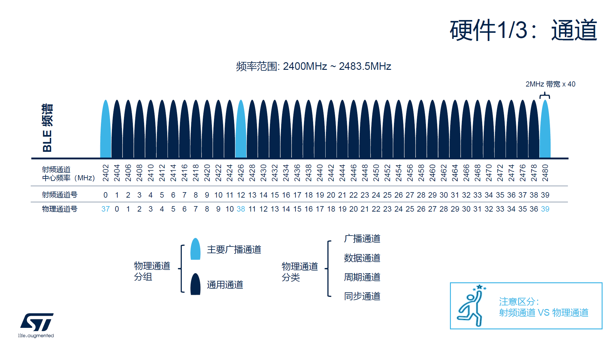
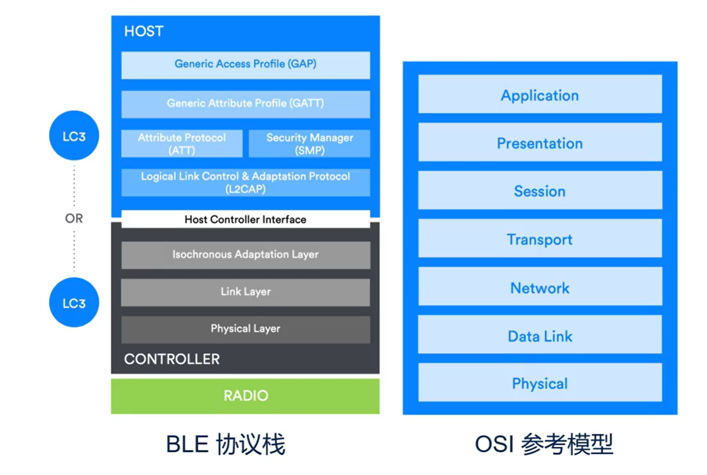

# BLE知识梳理
本文章记录对BLE相关知识的梳理。包含一些基础信息。

!!!本文章暂时没有组织结构，后续会根据需要进行调整。

## BLE基础
1. PHY层： 2.4G， 2400~2480MHz，每2M平均切块，共40个通道。其中0~36为数据通道，37~39为广播通道。可在0~36这三个数据通道跳频。
2. 广播和扫描：广播者：发出广播，扫描者：进行扫描的叫扫描者。扫描者发起通讯请求。
3. 连接：连接建立之后根据协议的定义之前的广播者变成了外设（从机），之前发起请求的扫描者变成了中心（主机）。连接建立后一般外设就停止广播了。外设和中心为建立一对一的关系，它们会按照某个连接间隔进行会面。这种会面持续几次之后就结束本次的“连接事件”，等到下一个时间间隔之后再进行碰面。每个“连接事件”内两者都会约定下次碰面的地点（那个数据通道）。每一次连接事件的发起都是由中心发起。
4. SMP：加密通讯。连接建立之后，用户可以选择是否启用加密通讯。此时双方就可以再BLE链路上进行对话了。
5. GATT：通用属性表。BLE设备之间通过GATT协议进行通讯。GATT定义了设备的服务和特征。服务是一组相关的特征，特征是设备提供的能力。蓝牙标准组织指定GATT这个应用层的目的就是为了BLE设备之间的互联互通。GATT是一个服务器/客户端架构。
6. Profiles：基于GATT，蓝牙标准组织制定了各种各样的profiles。

再BLE通讯中要注意区分射频通道和物理通道。具体如下图所示：

在BLE5.0之后在广播通道和数据通道的基础上又引入了周期通道和同步通道的概念。

跳频通道只能在0~36这37个通道上跳频。可通过设置Channel Map来选择在跳频时避开那些通道。请注意蓝牙会在每个连接间隔之后都会跳频。通道选择时根据CAS#2（通道选择算法）计算的结果。

Symbol Rate：符号速率，即数据传输速率。单位是Mbps。BLE的符号速率有两种，一种是1Ms/s，一种是2Ms/s。`LE 1M`的通讯速率为1Mbps;`LE 2M`的通讯速率为2Mbps;`LE Coded S=2`的通讯速率是500Kbps;`LE Coded S=8`的通讯速率是125Kbps。但是实际应用的通讯速率大概是实际数据通讯速率的80%左右，分别是800kbps，1400kbps，400kbps和100kbps。错误检测使用CRC检测。

蓝牙出厂时一般要进行频率校准。

蓝牙5.0之后引入了扩展广播。之前的成为传统广播。传统广播中每个广播包最大只能携带31个字节的用户数据（实际39字节数据长度）。有四种传统广播：ADV_IND(advertisement indication)、ADV_DIRECT_IND(advertisement direct indication)、ADV_SCAN_IND(advertisement scan indication)、ADV_NONCONN_IND(advertisement non-connectable indication)。ADV_DIRECT_IND（直连广播）只能携带对端设备6字节的地址。可扫描连接流程只能被扫描，不能被连接。

扩展广播中每个广播包最大可以携带251个字节的数据。有两种扩展广播：ADV_EXT_IND、ADV_SCAN_RSP。

ADV_IND PDU:广播包协议数据单元(Advertisement Indication Protocol Data Unit)。 它包含了两个部分：头部和载荷。头部两个字节，分别表示了PDU Type（4bits）, RFU(1bit), ChSel(1bit), TxAdd(1bit), RxAdd(1bit), Length(8bits)。载荷部分可以携带0~31个字节的数据。载荷长度是0~37个字节。其中包含6字节的地址和31字节的用户数据。用户数据按照LTV(Length-Type-Value)格式组织数据。请注意同一个广播数据包会在37/38/39这三个通道连续随机顺序发出。

要理解一点，为什么广播通道设定在高中低频三个分离的通道。因为这几个通道避开了wifi的干扰，可以有效提高蓝牙的信号强度。

扩展广播由两点大的改进：提高了可传送的用户数据长度（达到了1650字节）；扩展了传送距离（传统广播只能通过1M PHY进行传播，扩展广播支持了CODED PHY，可以传播更远距离）。

相应的扫描设备会在3个广播通道上进行扫描。设置不同的扫描间隔会影响扫描的命中率。因此需要根据应用场景选择合适的扫描间隔。比如IOS设备会有它建议的扫描间隔。

扫描又分为了两种类型：主动扫描机制和被动扫描机制。被动扫描建立连接的速度比较快，但是主动扫描可以获取更过的信息。

每个连接间隔内。可发送多个数据包，每个数据包的最多可承载244字节的ATT数据。

* ATT：Attribute Protocol，属性协议。ATT是BLE协议栈中的一个协议，用于BLE设备之间管理和交换属性数据。它定义了客户端和服务器之间的基本通信模式，允许客户端读取、写入和请求通知属性值。

* GATT：Generic Attribute Profile，通用属性表。Generic Attribute Profile（GATT）建立在ATT之上，是用于在BLE设备之间定义数据交换的框架。它规定了数据的组织方式，包括服务、特征和描述符的层次结构，为BLE应用程序提供了一种标准方法来组织数据。

连接参数：连接周期（connection interval）、连接超时（connection timeout）、
潜伏周期（slave latency）。潜伏周期表示外设可以忽略的连接周期个数。当潜伏周期为0时，外设必须在每个连接周期苏醒过来。当潜伏周期为N时，表示外设可以忽略N个连接周期。但是请注意连接周期和潜伏周期都受制于连接超时时间。连接超时一定要大于连接周期，否则有可能中断连接。而（潜伏周期N + 1）* 连接周期一定要小于连接超时时间。若已经创建（created）连接，但是未能建立（established）连接，则会超时。超时时间为连接间隔x6.

SMP的内容包含了四个维度：真实性（authenticity）、完整性（integrity）、机密性（confidentiality）、隐私性（privacy）。SMP的过程是建立连接的前提。真实性表示通讯的对象是一个真实的设备，而不是一个冒充的设备。完整性表示数据在传输过程中没有被篡改。机密性表示数据在传输过程是加密的，即使数据包被截取也不能被破译。隐私性表示设备无法被追踪。数据加密可保证数据的机密性。配对、绑定、认证和数字签名（MIC：Message Integrity Code）可以放置中间人攻击，从而保证数据的完整性和真实性。可通过私有可解析地址来保证设备的隐私性。

配对方法：BLE设备有多种配对方法：Just Works、Passkey Entry、Numeric Comparison、OOB（Out-of-Band）。在BLE（蓝牙低功耗）配对中，MITM（Man-in-the-Middle）是指中间人攻击。这种攻击方式中，恶意第三方插入到两个通信设备之间，窃取或篡改它们之间的通信信息，而通信双方并不知情。MITM攻击可能会导致通信数据的泄露、篡改或劫持，从而损害通信的保密性和完整性。因此，BLE配对中要防范MITM攻击至关重要。为了防范MITM攻击，BLE提供了多种配对方法，包括以下几种：

* Just Works：这是最简单的配对方法，不需要PIN码或数字证书。但由于缺乏安全性保障，可被MITM攻击。

* Passkey Entry：在此方法中，设备将显示一个由数字组成的6位数，用户需要将此数字输入另一设备来完成验证。这种方法可防范MITM攻击。这种方式需要外设有键盘（或触摸屏等等价输入设备），当然中心需要有数字显示媒介。

* Out of Band (OOB)：利用其他的安全通道，比如NFC或者蓝牙外部传输交换密钥信息。这种方法也可防范MITM攻击。OOB需要有额外的介质来交换密钥，这种方法常被用于蓝牙的无感连接。

* Numeric Comparison：设备显示一个数字，用户需要确认另一设备上显示的数字是否一致。这种方法同样能够有效地抵御MITM攻击。Numeric Comparison需要外设有显示设备，当然中心需要有数字显示媒介。

私有可解析地址(Resolvable Private Address)可保证隐私性，此时一个BLE外设有两个地址。一个是公开的广播地址(PRA: public random address),它是随机可变的;另一个是双方建立连接后使用的静态地址。

ATT属性表包含了三方面的内容：属性（Attribute）、角色（Role）、通讯方法（Communicate Method）。属性是BLE设备之间交换数据的基本单元，包括服务、特征和描述符。每条属性都是一个描述语句，用来描述设备的能力、状态或配置等。多条属性可以组成属性表。ATT定义了服务器和客户端两个角色，请注意它们的角色和中心、外设没有必然的对应关系。角色是指设备的角色，包括客户端、服务器和通知。通讯方法是指设备之间交换数据的协议，包括写、通知等。写是指客户端往服务器发送的数据，服务器向客户端发送数据的方式叫做通知。

使用ATT描述的属性组合之后可以表示GATT的配置文件。可以表示GATT的服务，服务的特征，特征的属性、值、描述符等。

GAP： Generic Access Profile，通用访问协议。GAP定义了设备在蓝牙网络中进行通信时的基本行为和流程，包括设备的连接、广播、发现和安全管理等。GAP规定了蓝牙设备的角色（例如广播器、观察者、中央设备、外围设备），并定义了设备之间的连接建立和维护机制。GAP主要涉及设备之间的连接和通信的基本过程，而GATT则涉及在连接建立后，如何组织和交换数据。

服务定义，服务功能，客户端对服务的访问方法、控制方法等等这些内容组成了一个Profile。一个Profile就是一个应用场景，一个应用场景里包含了服务的部分和客户端的部分。一个BLE外设里可以包含多个Profile。

## BLE 各版本更新笔记
[课程视频地址](https://www.bilibili.com/video/BV1Bg4y1U7DA/?spm_id_from=333.999.0.0&vd_source=500f29e5eee36acc5697873326bbceca)

BLE体系架构：

整体分了三层：应用层，Host/主机层， Controller/控制器层。在控制器层和主机层之间有一个HCI（Host Controller Interface）接口层。控制器（Controller）层用来操作射频信号，它里面包含了Radio Physical Layer, Link Layer和isochronous adapter layer(等时适配层).

Host层最底下是L2CAP（Logical Link Control and Adaptation Protocol）层，它负责建立连接、数据传输、安全认证等。在L2CAP层之上是ATT（Attribute Protocol）层和SMP层。ATT层负责定义设备的属性，包括服务、特征、描述符等。SMP层负责加密通讯。在ATT和SMP之上时广为熟知的GATT层。GATT层定义了设备的服务、特征、描述符的层次结构，为BLE应用程序提供了一种标准方法来组织数据。在GATT层之上时GAP层。GAP层定义了设备在无连接状态下可以使用的操作模式和过程（比如如何广播和发现）；定义了安全级别和模式；同时定义了一些用户接口标准。

请注意Host可以运行在单独的芯片上当然也可以和Controller运行在同一芯片上，取决于选择的具体硬件。

### 2.1 版本
目前最新的BLE版本是5.4， Bluetooth Mesh 的最新版本是1.1。

802.15.4

| 特性 | 802.15.4 | BLE |
|-------------|------------|-------------| 
| 标准 | IEEE标准 | Bluetooth SIG标准 |
| 用途 | 个人局域网（PAN） | 低功耗设备通信 | 
| 数据速率 | 250 kbps | 1 Mbps | 
| 频率 | 2.4 GHz | 2.4 GHz | 
| 覆盖范围 | 个人局域网范围 | 较短距离内的设备通信 | 
| 应用层协议 | Zigbee、Thread等 | 自定义应用层协议 |

蓝牙设备类型：经典蓝牙（BR/EDR），低功耗蓝牙（BLE）和双模蓝牙（Dual-mode Bluetooth）。经典蓝牙现在多用于Audio场合，BLE多用于电池供电的设备（手环，智能手表等）。双模蓝牙是指同时支持BR/EDR和BLE两种协议的蓝牙设备，一般用于笔记本、手机等。

经典蓝牙最快3Mbps，低功耗蓝牙最快2Mbps。运行在79个RF通道上。可以在32个通道上被发现（广播）。

PDU分成为了广播物理通道PDU，数据物理通道PDU，等时物理通道PDU。其中数据物理信道PDU有两种：LL Data PDU和LL Control PDU。LL Data PDU用于传输数据，LL Control PDU用于控制连接。

GFSK

### 2.2 GAP
Generic Access Profile（GAP）定义了设备在蓝牙网络中进行通信时的基本行为和流程，包括设备的连接、广播、发现和安全管理等。GAP规定了蓝牙设备的角色（例如广播器、观察者、中央设备、外围设备），并定义了设备之间的连接建立和维护机制。GAP主要涉及设备之间的连接和通信的基本过程，而GATT则涉及在连接建立后，如何组织和交换数据。

### 2.3 ATT

### 2.4 GATT

### 2.5 Profile

### 2.6 BLE Mesh

### 2.7 配对

### 2.8 私有2.4G

BLE设备有两类地址：一类是Public Address，长度为6字节（24bits company id + 24 bits company assigned id），需要向蓝牙组织购买；另一类是Random Address，长度为6字节，但是地址不固定。random address又有两种。一种是static address，上电后就固定下来的地址；另一种是private address这种地址定时更新的。private可分为可解析（resolvable）和不可解析（non-resolvable）两种。

## 附录

以太网基础1：https://www.stmcu.com.cn/video/1063
以太网基础2：https://www.stmcu.com.cn/video/1064
BLE系列课：https://www.stmcu.com.cn/Meeting/Details/2023BLEOnlineCourse
          https://space.bilibili.com/2100019006/channel/collectiondetail?sid=1382593
Wireless_2.4Ghz产品线上课程： https://space.bilibili.com/2100019006/channel/collectiondetail?sid=1507565

