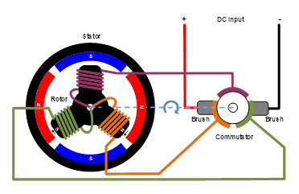

# 2024年FOC相关书籍阅读笔记
之前关于FOC的学习过于碎片化，关于FOC讲解的很多概念都没有系统性的梳理，因此，我打算系统性的整理一下相关的书籍，并记录一下自己的理解。

## 一. 《无感FOC入门指南》，阳波，ISBN 978-7-03-075176-8
本书借阅于深圳科技图书馆，作者阳波，网名海绵宝宝。本书不连后记总共137页，分成5个章节。本书印刷质量较好，全书配彩图。本书作者示例使用的是英飞凌的XMC4100单片机，目前比较昂贵。预计不会使用此硬件制作电路板，但是仍然会理解此芯片配置以方便后续硬件设计。本书理论核心是第4章，大概35页内容。本书编程实践是第5章，大概25页。前三章讲学习路径和软硬件准备。本书重点在于讲解无感FOC.

### 1.1 第一章/概述
文中重点提到了AN1078这份FOC领域广为人知的应用笔记。还提到了BLHeli这款开源飞控算法以及VESC项目。

文中探讨了无感方波控制算法中换相问题。重点提到多数使用的是反电动势过零点的换相方式在低速时因为信噪比而失效，因此多数低速启动使用的是开环强托（盲启）方式。文中还提到一种通过磁链信号的换相方式。

文中简单交待了无感FOC算法基本包含三部分：坐标系转换，电流调节和位置估计。FOC控制不想方波控制那样有浮空相，因此不能直接检测反电动势过零点。因此产生了两类位置估算算法。
* 第一类算法是由反电动势或磁链信号得到位置信息，此方法性能良好但在极低速或静止很难持续跟踪信号。常用的策略有三种：
    1. 间接得到反电动势信号。通过建立电机数学模型，通过补偿算法去贴近真实的电机运动。通过对两相正交坐标系中两个反电动势信号做反正切运算结算出连续位置信号。（参见AN1078）
    2. 第二种方法也是使用反电动势信号。但是这种方法是采用电机稳态运行是，d轴（仅限于永磁电机，感应电机不可用）的反电动势始终为0这个事实，通过锁相环控制其始终为0.这样就可以通过检测d轴反电动势是否为0来调节给定速度，进而对速度积分来获取位置信息。（本书使用这种办法）
    3. 第三种不使用反电动势信号，而是使用磁链信号。对于磁链信号有3种结算方法：对正交磁链信号求反正切，获取位置；利用外插法通过锁相环获取位置（适合低速，不适合高动态响应场合）;直接估算三项静止坐标系中的转子磁链（但用的不多）。
* 第二类算法其实就是高频注入算法。它利用dq轴电感差异来做检测。但是如果dq轴的电感差异不大（比如电动自行车、滑板车的轮毂电机它的dq轴电感差异不大）时，这种方法就无能为力。

### 1.2 第二章/硬件准备
这一篇中列举了做电机控制器开发常用的硬件仪器：稳压电源，示波器，万用表，LCR电桥，转速计，电流钳表。另外还列举了焊接需要的仪器和用品，比如电烙铁，热风枪，低温锡膏，吸锡带，洗板水等。调试使用的J-Link和USB隔离器。当然还有无刷电机以及控制板。

本章还对硬件原理图有比较详细的介绍。本电路板使用三个半桥驱动芯片（NCP5160B）配合六个MOSFET（IRFR3709Z）来驱动无刷电机。为了配合NCP5160B工作，还使用了一个电荷泵芯片LM2665来提升电压到10V.电路搭配4个采样电阻和运放TSV914（运放采用开尔文接法）实现对三个下桥臂采样和母线采样。（为什么要采用母线采样，而不是通过计算的方式？我的理解是它在后面使用了电压比较器直接控制TRAP,这样比软件安全。）此外还有其它各种辅助电路，这里就不一一列举。

### 1.3 第三章/软件准备
这一章分成了三个部分。第一部分讲了keil的配置，并制作了一个示例程序演示了怎么编译和烧写。第二部分讲了[J-Scope](https://www.segger.com/products/debug-probes/j-link/tools/j-scope/)的使用。因为本教程使用的是JLINK,所以可以使用这种办法。Segger官方有更全面的介绍，可以参考[这里](https://wiki.segger.com/UM08028_J-Scope)。文中没有介绍[RTT](https://www.segger.com/products/debug-probes/j-link/technology/about-real-time-transfer/),如果你想知道怎么使用RTT，也可以查看相关链接。第三部分各个功能模块的编程和测试。

* 关于ADC采样： 对于只有一个ADC模块的单片机，只能一次转换各个通道;对于有2个或者更多ADC模块的单片机，可以同时触发几个ADC模块同步进行采样。当然，有的单片机具有2个甚至4个采样保持电路，可以同时触发几个采样保持电路同时采集多个通道的电压。然后由一个ADC模块逐一转换。同步触发采样的信号是最好的。

个人感觉配图4.5有点问题，这个位置转子磁极和定子磁场已经处于锁定状态。如果将转子位置摆到图4.9的M位置可能会更好说明。正常驱动是转子磁极和定子磁场的角度始终在120度到60度之间变化。ZCP（zero crocessing point）出现在相差90度的地方，此时力矩也是最大的。

### 1.4  第四章/无感FOC的基本原理
这部分最开始描述了怎么让电机转动起来。其实就是转矩的最基本原理：转矩等于力（矢量）乘以距离。因此力的作用可以分成两个量：垂直与磁体方向的力（q轴方向）起到改变（方向和大小）转速的作用，而水平方向（d轴）的力在永磁电机中不对转速产生有效的作用。

## 二. 《深入理解无刷直流电机矢量控制技术》，上官致远/张健， ISBN 978-7-03-065510-3
本书借阅于深圳科技图书馆，作者上官致远和张健。本书正文总共118页。分为10个章节。本书印刷质量较好，全书配彩图。本书示例用到的是STM32F40X系列单片机。目前此单片机价格适中。考虑到对ST单片机相对更加熟练，可能会在后期使用STM32单片机制作自己的开发板。本书从电机原理、方波控制原理、矢量控制原理、SVPWM原理和测速原理、电机参数测量等多方面讲解了无刷电机的控制。相比于《无感FOC入门指南》本书的理论讲解更加细致，有助于理解矢量控制的原理。编程实践部分较少，但也有一些示例代码。本书对无感FOC稍有讲解，但是重点在于传统的FOC技术。

### 2.1 第一章/电机原理概要
左手原则：英国电机工程师弗莱明指出可以用左手的食指、中指和拇指分别指向磁场、电流和力的方向。导体受力F(N)= B x I x L。其中B为磁通密度（Wb/m^2），I为电流（A），L为处于磁场中导体的长度（m）。因此从磁场，电流和处于磁场的导体长度等方面改变磁力的大小。（左手法则用来判断磁生电的过程。）

右手螺旋定则：也称安倍定则，主要用于判断电流所产生的磁场的方向。在螺旋状导体中通入电流，右手握住螺旋转导线，如果四指指向电流环绕的方向，那么拇指就指向磁场的N极。或者换一种说法四指指示电流环绕的方向，拇指指示磁力线的方向。磁力线在磁体外部是从N极环绕到S极，在磁体内部是从S极指向N极。

电机正是基于通电的线圈在磁场中会产生磁力的作用来工作的。直流有刷电机主要由定子、换向器、电刷以及转子组成。线圈固定在定子上，在特定的位置换向器将改变电流的方向，从而持续电机旋转。有刷电机结构简单，控制方便，只是电刷容易出现磨损，寿命有限。

图1：直流电机换相原理

无刷直流电机控制技术用电力电子代替电刷，用霍尔传感器或其它技术检测转子位置，然后根据转子的位置实现换相。本书对无刷电机的结构等没有详细的介绍，有兴趣的可以看附录中“无刷直流电机、有刷直流电机：该如何选择？”这篇文章。它详细介绍了无刷电机的结构。

### 2.2 第二章/方波控制基础

本书开头讲了霍尔传感器而电机换相原理。其实有一些部分讲的不清楚。开关型霍尔传感器有单极性和双极性和全极性之分：单极性霍尔传感器只有当S极或者N极中靠经时才会产生激活信号，另一极性对霍尔传感器无任何效果；双极性霍尔开关在S极或N极靠近时激活，在另一极性靠近是关闭激活信号。全极性霍尔开关无论在N极或者S极靠近时激活，离开时关闭激活。通常无刷电机使用的是双极性的即在一个极性下是激活的，另一个极性下是关闭的。霍尔传感器通常有两种排放方法：间隔120度摆放和间隔60度摆放。两者在电机旋转是相位关系不同。

另一点需要明确的是电机的极对数（比如常说的4poles是两对极）和电气角度的关系：

电气角度 = 机械角度 x 极对数

因此一对极的无刷电机的电气角度和机械角度一致，旋转一圈的电气角度是360度；而两对极的无刷电机旋转一圈电气角度是720度，相当于旋转了两圈。

采用方波控制是任何时候只给三相电机中的两相同短，一相浮空。一个电周期需要6次换相，这就是我们通常所说的6步换相法。

常见的PWM调节方式有以下三种：
1. H:PWM/L:ON 即其中一相下桥臂一直开通，只用PWM调节另一相的上桥臂。
2. H:ON/PWM:L 即其中一相上桥臂一直开通，只用PWM调节另一相的下桥臂。
3. H:PWM/L:PWM 即两相桥臂对应的功率管互补调节。互补的好处是，上管关断的瞬间，可以由下官续流，而不经过续流二极管，可以避免大电流损害功率管。

AB

## 附录
* [无刷直流电机、有刷直流电机：该如何选择？](https://www.monolithicpower.cn/cn/brushless-vs-brushed-dc-motors)
