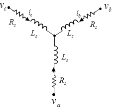

# 2024年FOC相关书籍阅读笔记
之前关于FOC的学习过于碎片化，关于FOC讲解的很多概念都没有系统性的梳理，因此，我打算系统性的整理一下相关的书籍，并记录一下自己的理解。

## 一. 《无感FOC入门指南》，阳波，ISBN 978-7-03-075176-8
本书借阅于深圳科技图书馆，作者阳波，网名海绵宝宝。本书不连后记总共137页，分成5个章节。本书印刷质量较好，全书配彩图。本书作者示例使用的是英飞凌的XMC4100单片机，目前比较昂贵。预计不会使用此硬件制作电路板，但是仍然会理解此芯片配置以方便后续硬件设计。本书理论核心是第4章，大概35页内容。本书编程实践是第5章，大概25页。前三章讲学习路径和软硬件准备。本书重点在于讲解无感FOC.

### 1.1 第一章/概述
文中重点提到了AN1078这份FOC领域广为人知的应用笔记。还提到了BLHeli这款开源飞控算法以及VESC项目。

文中探讨了无感方波控制算法中换相问题。重点提到多数使用的是反电动势过零点的换相方式在低速时因为信噪比而失效，因此多数低速启动使用的是开环强托（盲启）方式。文中还提到一种通过磁链信号的换相方式。

文中简单交待了无感FOC算法基本包含三部分：坐标系转换，电流调节和位置估计。FOC控制不想方波控制那样有浮空相，因此不能直接检测反电动势过零点。因此产生了两类位置估算算法。
* 第一类算法是由反电动势或磁链信号得到位置信息，此方法性能良好但在极低速或静止很难持续跟踪信号。常用的策略有三种：
    1. 间接得到反电动势信号。通过建立电机数学模型，通过补偿算法去贴近真实的电机运动。通过对两相正交坐标系中两个反电动势信号做反正切运算结算出连续位置信号。（参见AN1078）
    2. 第二种方法也是使用反电动势信号。但是这种方法是采用电机稳态运行是，d轴（仅限于永磁电机，感应电机不可用）的反电动势始终为0这个事实，通过锁相环控制其始终为0.这样就可以通过检测d轴反电动势是否为0来调节给定速度，进而对速度积分来获取位置信息。（本书使用这种办法）
    3. 第三种不使用反电动势信号，而是使用磁链信号。对于磁链信号有3种结算方法：对正交磁链信号求反正切，获取位置；利用外插法通过锁相环获取位置（适合低速，不适合高动态响应场合）;直接估算三项静止坐标系中的转子磁链（但用的不多）。
* 第二类算法其实就是高频注入算法。它利用dq轴电感差异来做检测。但是如果dq轴的电感差异不大（比如电动自行车、滑板车的轮毂电机它的dq轴电感差异不大）时，这种方法就无能为力。

### 1.2 第二章/硬件准备
这一篇中列举了做电机控制器开发常用的硬件仪器：稳压电源，示波器，万用表，LCR电桥，转速计，电流钳表。另外还列举了焊接需要的仪器和用品，比如电烙铁，热风枪，低温锡膏，吸锡带，洗板水等。调试使用的J-Link和USB隔离器。当然还有无刷电机以及控制板。

本章还对硬件原理图有比较详细的介绍。本电路板使用三个半桥驱动芯片（NCP5160B）配合六个MOSFET（IRFR3709Z）来驱动无刷电机。为了配合NCP5160B工作，还使用了一个电荷泵芯片LM2665来提升电压到10V.电路搭配4个采样电阻和运放TSV914（运放采用开尔文接法）实现对三个下桥臂采样和母线采样。（为什么要采用母线采样，而不是通过计算的方式？我的理解是它在后面使用了电压比较器直接控制TRAP,这样比软件安全。）此外还有其它各种辅助电路，这里就不一一列举。

### 1.3 第三章/软件准备
这一章分成了三个部分。第一部分讲了keil的配置，并制作了一个示例程序演示了怎么编译和烧写。第二部分讲了[J-Scope](https://www.segger.com/products/debug-probes/j-link/tools/j-scope/)的使用。因为本教程使用的是JLINK,所以可以使用这种办法。Segger官方有更全面的介绍，可以参考[这里](https://wiki.segger.com/UM08028_J-Scope)。文中没有介绍[RTT](https://www.segger.com/products/debug-probes/j-link/technology/about-real-time-transfer/),如果你想知道怎么使用RTT，也可以查看相关链接。第三部分各个功能模块的编程和测试。

* 关于ADC采样： 对于只有一个ADC模块的单片机，只能一次转换各个通道;对于有2个或者更多ADC模块的单片机，可以同时触发几个ADC模块同步进行采样。当然，有的单片机具有2个甚至4个采样保持电路，可以同时触发几个采样保持电路同时采集多个通道的电压。然后由一个ADC模块逐一转换。同步触发采样的信号是最好的。

个人感觉配图4.5有点问题，这个位置转子磁极和定子磁场已经处于锁定状态。如果将转子位置摆到图4.9的M位置可能会更好说明。正常驱动是转子磁极和定子磁场的角度始终在120度到60度之间变化。ZCP（zero crocessing point）出现在相差90度的地方，此时力矩也是最大的。

### 1.4  第四章/无感FOC的基本原理
#### 1.4.1 让电机转起来
这部分最开始描述了怎么让电机转动起来。其实就是转矩的最基本原理：转矩等于力（矢量）乘以距离。因此力的作用可以分成两个量：垂直与磁体方向的力（q轴方向）起到改变（方向和大小）转速的作用，而水平方向（d轴）的力在永磁电机中不对转速产生有效的作用。

然后描述了方波驱动，也就是我们常说的六步驱动法。在方波驱动法里面，总有一相连电源正极（上桥臂导通），另一相连电源负极（下桥臂导通），第三相浮空。方波控制可以用数字_电源正极相连的相_电源负极相连的相，比如1_A_B表示，A相上桥臂导通B相下桥臂导通C相浮空。六步法的基本导通顺序是1_A_B, 2_A_C, 3_B_C. 4_B_A, 5_C_A, 6_C_B. 按照这种顺序周而复始电机可以按照逆时针旋转。

方波控制的缺点是转矩有波动（转矩脉动），但是它支持极高转速，特别适合航模应用。

为了让转矩平滑过渡，就要构建角度无跳跃的连续旋转磁场，使其始终与转子磁场正交（保证转矩充分利用）。矢量控制的基础是PWM控制。最简单产生正旋波的PWM调整方式是SPWM.基于面积等效原理，按照正旋波信号对PWM波进行调制。但是这种方法对直流母线电压利用率较低。于是就出现了广泛使用的SVPWM技术。通过在相电压调制波中加入三次谐波以形成马鞍状波形。加入的三次谐波通常有两种，一种是正旋波，另一种是等腰形三角波。

#### 1.4.2 无感FOC算法
这部分描述了Clarke变换，Park变换。本质是坐标变化，使用投影的方法可计算矩阵具体数值。

Clarke等幅变换公式：
$ \begin{bmatrix} I_{\alpha} \\ I_{\beta} \ \end{bmatrix}  = \frac{2}{3}\begin{bmatrix} 1 & -\frac{1}{2} & -\frac{1}{2} \\ 0 & \frac{\sqrt{3}}{2} & -\frac{\sqrt{3}}{2} \ \end{bmatrix} \begin{bmatrix} I_a \\ I_b \\ I_c \\ \end{bmatrix}$

Clarke等功率变换公式：
$ \begin{bmatrix} I_{\alpha} \\ I_{\beta} \ \end{bmatrix}  = \sqrt{\frac{2}{3}}\begin{bmatrix} 1 & -\frac{1}{2} & -\frac{1}{2} \\ 0 & \frac{\sqrt{3}}{2} & -\frac{\sqrt{3}}{2} \ \end{bmatrix} \begin{bmatrix} I_a \\ I_b \\ I_c \\ \end{bmatrix}$

Park变换公式：
$\begin{bmatrix} I_d \\ I_q \end{bmatrix} = \begin{bmatrix} \cos(\theta) & \sin(\theta) \\ -\sin(\theta) & \cos(\theta) \end{bmatrix} \begin{bmatrix} I_\alpha \\ I_\beta \end{bmatrix}$

#### 1.4.3 PI调节
PID控制是控制学的基础。这部分不再完全转述，只说明一些注意事项。

因为积分环节可能会出现调节缓慢的问题，因此要对积分的最大值进行限幅，防止出现“顶死”现象。

PI环节的输出是电流$i_d$和$i_q$

#### 1.4.4 Park反变换

#### 1.4.5 Clarke反变换

#### 1.4.6 SVPWM

配图4.26有错误，本来应该是五段式，但是配图是七段式。七段式有$V_0$和$V_7$两个零向量成分，但是五段式只有$V_0$。此时在一个周期内总有一相是始终关断的（占空比为零）。

102页的公式也出现很多错误。稍后一齐更正到下面。

## 二. 《深入理解无刷直流电机矢量控制技术》，上官致远/张健， ISBN 978-7-03-065510-3
本书借阅于深圳科技图书馆，作者上官致远和张健。本书正文总共118页。分为10个章节。本书印刷质量较好，全书配彩图。本书示例用到的是STM32F40X系列单片机。目前此单片机价格适中。考虑到对ST单片机相对更加熟练，可能会在后期使用STM32单片机制作自己的开发板。本书从电机原理、方波控制原理、矢量控制原理、SVPWM原理和测速原理、电机参数测量等多方面讲解了无刷电机的控制。相比于《无感FOC入门指南》本书的理论讲解更加细致，有助于理解矢量控制的原理。编程实践部分较少，但也有一些示例代码。本书对无感FOC稍有讲解，但是重点在于传统的FOC技术。

### 2.1 第一章/电机原理概要
左手原则：英国电机工程师弗莱明指出可以用左手的食指、中指和拇指分别指向磁场、电流和力的方向。导体受力F(N)= B x I x L。其中B为磁通密度（Wb/m^2），I为电流（A），L为处于磁场中导体的长度（m）。因此从磁场，电流和处于磁场的导体长度等方面改变磁力的大小。（左手法则用来判断磁生电的过程。）

右手螺旋定则：也称安倍定则，主要用于判断电流所产生的磁场的方向。在螺旋状导体中通入电流，右手握住螺旋转导线，如果四指指向电流环绕的方向，那么拇指就指向磁场的N极。或者换一种说法四指指示电流环绕的方向，拇指指示磁力线的方向。磁力线在磁体外部是从N极环绕到S极，在磁体内部是从S极指向N极。

电机正是基于通电的线圈在磁场中会产生磁力的作用来工作的。直流有刷电机主要由定子、换向器、电刷以及转子组成。线圈固定在定子上，在特定的位置换向器将改变电流的方向，从而持续电机旋转。有刷电机结构简单，控制方便，只是电刷容易出现磨损，寿命有限。

图1：直流电机换相原理

无刷直流电机控制技术用电力电子代替电刷，用霍尔传感器或其它技术检测转子位置，然后根据转子的位置实现换相。本书对无刷电机的结构等没有详细的介绍，有兴趣的可以看附录中“无刷直流电机、有刷直流电机：该如何选择？”这篇文章。它详细介绍了无刷电机的结构。

### 2.2 第二章/方波控制基础

本书开头讲了霍尔传感器而电机换相原理。其实有一些部分讲的不清楚。开关型霍尔传感器有单极性和双极性和全极性之分：单极性霍尔传感器只有当S极或者N极中靠经时才会产生激活信号，另一极性对霍尔传感器无任何效果；双极性霍尔开关在S极或N极靠近时激活，在另一极性靠近是关闭激活信号。全极性霍尔开关无论在N极或者S极靠近时激活，离开时关闭激活。通常无刷电机使用的是双极性的即在一个极性下是激活的，另一个极性下是关闭的。霍尔传感器通常有两种排放方法：间隔120度摆放和间隔60度摆放。两者在电机旋转是相位关系不同。

另一点需要明确的是电机的极对数（比如常说的4poles是两对极）和电气角度的关系：

电气角度 = 机械角度 x 极对数

因此一对极的无刷电机的电气角度和机械角度一致，旋转一圈的电气角度是360度；而两对极的无刷电机旋转一圈电气角度是720度，相当于旋转了两圈。

采用方波控制是任何时候只给三相电机中的两相同短，一相浮空。一个电周期需要6次换相，这就是我们通常所说的6步换相法。

常见的PWM调节方式有以下三种：
1. H:PWM/L:ON 即其中一相下桥臂一直开通，只用PWM调节另一相的上桥臂。
2. H:ON/PWM:L 即其中一相上桥臂一直开通，只用PWM调节另一相的下桥臂。
3. H:PWM/L:PWM 即两相桥臂对应的功率管互补调节。互补的好处是，上管关断的瞬间，可以由下官续流，而不经过续流二极管，可以避免大电流损害功率管。

### 2.3 第三章/矢量控制基础
这一章介绍对矢量控制原理介绍的比较清晰一点。公式推导也很细致，很多其它的书籍避开了公式的推导，反而让人有很多疑问。

开头讲了FOC诞生与一个期望高效稳定的控制三相交流感应电机的需求，由K.Hasse和F.Blaschke在70年代提出的。这种方法通过一系列坐标变换接耦复杂的电流关系，使得交流电机变得简单可控。

本书也交代了一个简单的事实：无论哪种电机，它的转矩都正比于定子磁场和转子磁场的叉乘，即它们所围城的平行四边形的面积。因此当定子磁场和转子磁场（在两者幅值不变时）夹角90度时，电机产生的力矩最大。

#### 2.3.1 坐标系转换

矢量控制的核心思想是将三相电流形成的旋转磁场从3s坐标系转换到2S正交坐标系，然后再从2s座标系转换到2r坐标系中。旋转的过程中，形成的旋转矢量始终等效。

三相对称正弦电流可以这样表示：

$I_A(t) = I_{m} \sin(\omega t)$

$I_B(t) = I_{m} \sin(\omega t - \frac{2\pi}{3})$

$I_C(t) = I_{m} \sin(\omega t - \frac{4\pi}{3})$

其中$I$是电流，$\omega$是电机转速，$t$是时间。

根据欧拉公式$e^{j\theta} = \cos(\theta) + j\sin(\theta)$，经过一步一步推导可以得到：

$\vec{I_s} = \frac{3}{2}I_{m} \cos(\omega t) + j\frac{3}{2}\sin(\omega t)$

也可表示成：
$\vec{I_s} = \frac{3}{2}I_{m} e^{j\theta} $

然后讲了Clarke变换。其实Clarke变换本质是矩阵的运算。它比较容易理解,就是常规的坐标系转换。比如等幅值变换公式如下：

$ \begin{bmatrix} I_{\alpha} \\ I_{\beta} \ \end{bmatrix}  = \frac{2}{3}\begin{bmatrix} 1 & -\frac{1}{2} & -\frac{1}{2} \\ 0 & \frac{\sqrt{3}}{2} & -\frac{\sqrt{3}}{2} \ \end{bmatrix} \begin{bmatrix} I_a \\ I_b \\ I_c \\ \end{bmatrix}$

或

$ \begin{bmatrix} U_{\alpha} \\ U_{\beta} \ \end{bmatrix}  = \frac{2}{3}\begin{bmatrix} 1 & -\frac{1}{2} & -\frac{1}{2} \\ 0 & \frac{\sqrt{3}}{2} & -\frac{\sqrt{3}}{2} \ \end{bmatrix} \begin{bmatrix} U_a \\ U_b \\ U_c \\ \end{bmatrix}$

为什么前面的系数是2/3?你可以理解到在s2坐标系$I_{\alpha}$和$I_{\beta}$构成的旋转矩阵的幅度要达到$I_m$时，需要将$I_m$的$\frac{3}{2}$倍乘到$I_{\alpha}$和$I_{\beta}$上。因此在等幅值变换中，很多要乘以$\frac{2}{3}$以消除幅度的差异。

前面的Clarke变换不仅对电流如此（对于电压也同样如此），三相对称电压的幅度Um转换之后的幅度也是$\frac{3}{2}U_m$.不带系数直接转换后到s2的P的$\alpha$和$\beta$的幅度就是$\frac{9}{4}U_m*I_m$.总功率是$\alpha$和$\beta$之和$\frac{9}{2}U_m*I_m$。原先三相对称电压的每一相的幅度$U_m*I_m$，三相总和是$3U_m*I_m$.因此转换后的幅度是原来幅度的$\frac{3}{2}$倍。因此功率的修正参数$\frac{2}{3}$，具体到无论电流或者电压关系中就需要求根号即电流或者电压的转换矩阵的系数是$\sqrt{\frac{2}{3}}$:

$ \begin{bmatrix} I_{\alpha} \\ I_{\beta} \ \end{bmatrix}  = \sqrt{\frac{2}{3}}\begin{bmatrix} 1 & -\frac{1}{2} & -\frac{1}{2} \\ 0 & \frac{\sqrt{3}}{2} & -\frac{\sqrt{3}}{2} \ \end{bmatrix} \begin{bmatrix} I_a \\ I_b \\ I_c \\ \end{bmatrix}$

或

$ \begin{bmatrix} U_{\alpha} \\ U_{\beta} \ \end{bmatrix}  = \sqrt{\frac{2}{3}}\begin{bmatrix} 1 & -\frac{1}{2} & -\frac{1}{2} \\ 0 & \frac{\sqrt{3}}{2} & -\frac{\sqrt{3}}{2} \ \end{bmatrix} \begin{bmatrix} U_a \\ U_b \\ U_c \\ \end{bmatrix}$

从S3转换到S2之后，电流关系还是没有解耦。还需要Park变换将其从S2转换到R2。即从$\alpha-\beta$坐标系转换到$d-q$坐标系。其中$d-q$坐标系是一个和$\omega$同步旋转的坐标系，无论电流还是电压在d-q坐标系中都是常数，两者完全解耦。

park变换的公式比较简单，我们直接列举如下：

$\begin{bmatrix} i_d \\ i_q \end{bmatrix} = \begin{bmatrix} \cos(\theta) & \sin(\theta) \\ -\sin(\theta) & \cos(\theta) \end{bmatrix} \begin{bmatrix} i_\alpha \\ i_\beta \end{bmatrix}$

或

$\begin{bmatrix} u_d \\ u_q \end{bmatrix} = \begin{bmatrix} \cos(\theta) & \sin(\theta) \\ -\sin(\theta) & \cos(\theta) \end{bmatrix} \begin{bmatrix} u_\alpha \\ u_\beta \end{bmatrix}$

其中：
* $i_d$, $i_q$是电流在d-q坐标系中的分量；$i_\alpha$, $i_\beta$是电流在$\alpha-\beta$坐标系中的分量；
* $u_d$, $u_q$是电压在d-q坐标系中的分量；$u_\alpha$, $u_\beta$是电压在$\alpha-\beta$坐标系中的分量；
* $\theta$是$\alpha-\beta$坐标系和$d-q$坐标系的相位差,即当前的电气角度。

#### 2.3.3 PMSM电机的几个坐标方程

图2：Y形接法三相绕组示意图

后面又讲了永磁同步电机的几个重要的数学方程.

先将电压方程：
$\begin{equation}  V_d = R_s i_d + L_d \frac{di_d}{dt} - \omega_e \psi_q \end{equation}$

$\begin{equation}  V_q = R_s i_q + L_q \frac{di_q}{dt} + \omega_e \psi_d   \end{equation}$
在上面的方程中，
* $V_d$ 和 $V_q$ 分别表示d轴和q轴的电压
* $R_s$ 表示定子电阻
* $i_d$ 和 $i_q$ 分别表示d轴和q轴的电流分量
* $L_d$ 和 $L_q$ 分别表示d轴和q轴的电感
* $\frac{di_d}{dt}$ 和 $\frac{di_q}{dt}$ 表示电流的变化率
* $\omega_e$ 表示电气角速度（等于转子角速度乘以极对数）
* $\psi_d$ 和 $\psi_q$ 分别表示d轴和q轴的磁链.

上面的两个公式都有三部分组成：第一项表示电阻造成的压降；第二项表示电感造成的压降；第三项表示磁链变化造成的电压变化。前两相比较好理解，这里主要解释一下第三项。可参见图2以理解电压方程。

法拉第电磁感应定律的公式如下：

$E = -\frac{d\phi}{dt}$

在这个公式中，$E$ 表示感应电动势，$\frac{d\phi}{dt}$表示磁通量的变化率。负号表示了感应电动势的方向与磁通量变化的方向相反，这符合了能量守恒的原则。根据法拉第电磁感应定律，当磁通量在一个导体中产生变化时，会在导体中产生感应电动势，进而产生感应电压。

在电气机械系统中，电动机的磁场与电流、转子位置等之间存在耦合关系。当永磁同步电机的转子运动导致磁链的变化时，根据法拉第电磁感应定律，这将导致在电机绕组中产生电动势，从而产生感应电压。这就是磁链变化引起的电压变化。

磁链（magnetic flux linkage）是磁通量概念的推广，它是对穿过线圈或元件的磁通量（magnetic flux）进行积分得到的量。磁链是磁通量与线圈的绕组数的乘积，表示通过线圈的总磁通量。数学上，磁链（Ψ）可以表示为：

 $\Psi = N \cdot \Phi$

其中，Ψ是磁链，N是线圈的匝数，Φ是磁通量。

磁通（magnetic flux）是磁感应强度在某个给定的面积或导体横截面上的总和，通常用Φ表示。它是磁感应线的数量。磁通量的单位是韦伯（Weber），表示单位时间内通过一个给定面积的磁通量。磁链通常用于描述电磁装置中电流和磁场之间的关系，而磁通则用于描述在给定的横截面上穿过的总磁感应线的数量。

然后是磁链方程（文中先交代磁链方程）：

$\begin{equation}   \psi_d = L_d i_d + \psi_m  \end{equation}$

$\begin{equation}  \psi_q = L_q i_q \end{equation}$

在这些方程中，$\psi_d$ 和 $\psi_q$ 分别表示d轴和q轴的磁链，$L_d$ 和 $L_q$ 是对应的电感，$i_d$ 和 $i_q$ 分别表示d轴和q轴的电流分量，而 $\psi_m$ 是永磁体产生的磁链。

在永磁同步电机中，d轴和q轴所表示的是电机的两个正交轴。因为永磁体产生的磁场是固定的，与电流无关，所以永磁体产生的磁链$\psi_m$只会影响与永磁体磁场方向一致的轴，即d轴。对于d轴，永磁体的磁链会与电流产生的磁链相叠加，所以d轴的磁链方程中会有一项永磁体的磁链$\psi_m$。而对于q轴来说，永磁体的磁链与电流产生的磁链方向是正交的，所以永磁体的磁链不会影响q轴的磁链方程。

当磁通量穿过线圈发生变化时，根据法拉第电磁感应定律，线圈中就会产生感应电流。这些感应电流产生的磁场又会产生一个反向的磁通量，从而抵消外部磁场的影响，这就是所谓的反电动势。这种现象可以解释为磁感线的“想要”穿过线圈，然而线圈中感应电流产生的磁场则产生了一个相反的磁力，试图阻止外部磁感线的穿透。这一理论既有助于我们理解电磁感应现象，也是许多电磁设备工作原理的基础。

第三个是转矩方程：

$ T_e = \frac{P}{\omega_e} = \frac{\frac{3}{2} p_n (V_d I_d + V_q I_q)}{\omega_e} $

上面的方程中$p_n$表示极对数，$V_d$和$V_q$表示d轴和q轴的电压分量，$I_d$和$I_q$表示d轴和q轴的电流分量，$\omega_e$表示电气角速度（等于转子角速度乘以极对数），$T_e$表示电机的转矩。

如果将磁链方程代入上面的公式：

$\begin{equation}  T_e = \frac{3}{2} p_n ( (L_d - L_q) i_d i_q  + \psi_m i_q  ) \end{equation}$

在这个公式中，$ T_e $ 代表电磁转矩， $ p_n $ 代表电机的极对数， $ \psi_m $ 代表磁链， $ L_d $ 和 $ L_q $ 分别代表 d 轴和 q 轴的电感， $ i_d $ 和 $ i_q $ 分别代表 d 轴和 q 轴的电流。

最后是运动方程：

$ J\frac{d\omega_{\text{mech}}}{dt} = T_e - T_l -  B\cdot\omega_{\text{mech}} $
在这个方程中，
* $J$ 代表转动惯量
* $\omega_{\text{mech}}$ 代表机械角速度
* $T_e$ 代表电磁转矩
* $T_l$ 代表负载转矩
* $B$ 代表系统的黏滞摩擦阻尼

此外还需要注意到这里的$\omega_{\text{mech}}$和前面提到的$\omega_e$是不同的。前面提到的$\omega_e$是转子电气角速度，而这里的$\omega_{\text{mech}}$是机械角速度。两者的关系是：

$\omega_{\text{mech}} = p_n \omega_e$

上面的公式可以这样理解电磁转矩产生了三个效果：一个是提供了负载转矩（带动负载转动）; 另一个是克服了摩擦阻尼（减少了转子的转动速度）; 第三个是产生了机械角速度（使得电机转动起来）。

我们将上面的公式变形一下：
$\begin{equation}  T_e = T_l + B\cdot\omega + J\frac{d\omega}{dt} \end{equation}$

上面的公式和原书并不一样。我认为原书中公式有一定的问题。比如转矩方程中$V_d i_d - $V_q i_q$本来应当是$V_d i_d + $V_q i_q$。本文对这几个公式的使用也没有说明。相当于直接把公式列出来，没有说明要怎么用。

另外，关于PMSM的数学公式，可以查看MathWorks的PMSM文档。我在附录中给出了相关链接。
这里将mathworks的pmsm电机数学模型转载如下。
* 电压方程：

    $V_d = i_d R_s  + \frac{d\lambda_d}{dt} - \omega_e L_q i_q $

    $ V_q = i_q R_s  + \frac{d\lambda_q}{dt} + \omega_e L_d i_d + \omega_e \lambda_{pm} $

* 磁链方程：

    $\lambda_d = L_d i_d + \lambda_{pm} $
    
    $\lambda_q = L_q i_q $

* 转矩方程：

    $T_e = \frac{3}{2} p (\lambda_{pm} i_q +  (L_d - L_q) i_d i_q ) $

* 运动方程：

    $ T_e - T_l = J\frac{d\omega_m}{dt}  +  B\cdot\omega_m $

其中：

* $V_d$ 是 d 轴电压（伏特）
* $V_q$ 是 q 轴电压（伏特）
* $i_d$ 是 d 轴电流（安培）
* $i_q$ 是 q 轴电流（安培）
* $R_s$ 是定子相绕组电阻（欧姆）
* $\lambda_{pm}$ 是永磁磁链（韦伯）
* $\lambda_d$ 是 d 轴磁链（韦伯）
* $\lambda_q$ 是 q 轴磁链（韦伯）
* $\omega_e$ 是对应于定子电压频率的电角速度（弧度/秒）
* $\omega_m$ 转子机械转速（弧度/秒）
* $L_d$ 是 d 轴绕组电感（亨）
* $L_q$ 是 q 轴绕组电感（亨）
* $T_e$ 是 PMSM 产生的机电转矩 (Nm)
* $T_l$ 是负载转矩 (Nm)
* $p$ 是电机极对数
* $J$ 是惯量系数 (kg-$m^2$)
* $B$ 是摩擦系数 (kg-$m^2$/秒)

这里的公式和书中的公式稍微不同，但基本上是相同的含义。比如电压方程直接引入了磁链方程。感觉没有本书中原来的公式简洁。

另一点需要说明的是$R_s$是以Y形导体为例的定子电阻。如果是以$\Delta$形导体为例，则$R_s$应当是等效变换之后的电阻。

**负载转矩**：
关于负载转矩这个量我纠结了很久。按照公式，这个量应该是一个和转动惯量没有关系的量。也就是它的存在不改变固有的转动惯量。其实我在最初的理解中有意无意的将它和转动行为分开，后来忽然想清楚了，原来自己钻了牛角尖。负载转矩当然就是负载产生的转矩，没有什么大惊小怪的。它的存在当然没有改变转动惯量，除非你刚好将负载直接固定在轴上转动。那么问题来了，皮带、链条在世纪工作中有没有改变转动惯量。当然有。但是皮带上的负载却没有。比如传送带上面的箱子。
感兴趣的可以看东方电机对于负载转矩的解释，我将其放在附录中。

**关于$L_q$和$L_d$的理解**
在转矩方程中，$L_q$和$L_d$分别是交轴和直轴的电感。转矩整体可以看作由两部分组成：第一部分是$\lambda_{pm} i_q$ （或者叫$\psi_m i_q$）;第二部分是$(L_d - L_q) i_d i_q$. 第一部分的永磁磁链在一个确定的电机中可以认为是恒定的，因此它的大小之和q轴电流分量相关。第二部分在某些类型的电机中L_d和L_q可能相等，这部分就可以忽略。这样转矩就和直轴电流i_d没有关系了。在设法让$i_d=0$的控制中，即便$L_d$和$L_q$不同，理想情况下转矩受$i_d$的影响也不大。有的电机中（比如永磁体内嵌式结构的PMSM中）$i_d$和$i_q$不同，i_d也不为零。这时候这一部分就需要考虑进来。因为我对电机模型的理解还没有完全理解透彻，所以这部分先不展开。

#### 2.3.3 矢量控制架构

本书在随后的3.6小节里面开始讲了矢量控制架构。书中采用最常用的$i_d = 0$控制。为了方便后面的描述，我将原书中图3.10拍下来放在这里。

我们在前面讲过坐标系转换的目的将d轴的励磁电流和q轴的转矩电流分开，达到接耦目的。因此最内环的控制就是对解耦之后的$i_d$和$i_q$分别进行控制，这一环叫做转矩控制或者叫做电流环控制。

在这一环中采集三相电流（根据基尔霍夫定律也可以根据其中的两相电流可重构出三相电流）和机械角度$\theta_m$（可根据机械角度获取电气角度$\theta_e$），经过Clarke变换和park变换之后，求解出此时的$i_d$和$i_q$。在将获取的$i_d$和$i_q$与期望的$i_d$和$i_q$比较之后，通过控制环节（简单的是PID控制，还可以是复杂的MPC或者ADRV等控制）求解出下一次的$V_d$和$V_q$，然后根据上一次获得的电角度$\theta_e$通过Park反变换求解出$V_\alpha$和$V_\beta$. $V_\alpha$和$V_\beta还需要变换成三相电压。这一步就需要用到Clarke反变换和FOC的另一个难点SVPWM.

下载再回到电流换的外环，电流换外通常还有速度环用来给出转速的变化量。具体做法是通过电机位置和时间间隔或者其它方法求解出当前的转速，然后将转速与目标转速比较求解出速度变化量。速度环只控制$i_q$.而在PMSM中我们通常期望$i_d$的取值为0. 但是在其它控制策略，比如弱磁控制或者MTPA控制中，$i_d$也有其它期望值。

实际上在很多控制中还要在最外层添加位置环，以实现对位置的精确控制。

#### 2.3.4 坐标反转换
因为park变换的矩阵是正交矩阵，所以park变换的矩阵就是求倒置矩阵（也是求逆矩阵），因此反park变换就可以由park变换求得：

$\begin{bmatrix} i_\alpha \\ i_\beta \end{bmatrix} = \begin{bmatrix} \cos(\theta) & -\sin(\theta) \\ \sin(\theta) & \cos(\theta) \end{bmatrix} \begin{bmatrix} i_d \\ i_q \end{bmatrix} $

或

$\begin{bmatrix} u_\alpha \\ u_\beta \end{bmatrix} = \begin{bmatrix} \cos(\theta) & -\sin(\theta) \\ \sin(\theta) & \cos(\theta) \end{bmatrix} \begin{bmatrix} u_d \\ u_q \end{bmatrix} $

其中：
* $i_d$, $i_q$是电流在d-q坐标系中的分量；$i_\alpha$, $i_\beta$是电流在$\alpha-\beta$坐标系中的分量；
* $u_d$, $u_q$是电压在d-q坐标系中的分量；$u_\alpha$, $u_\beta$是电压在$\alpha-\beta$坐标系中的分量；
* $\theta$是$\alpha-\beta$坐标系和$d-q$坐标系的相位差,即当前的电气角度。

书中像推导park变换一样采用投影法来结算反park变化。也没有问题。

而反clarke也可以采用逆矩阵计算。但是要知道实际的控制中，我们是通过PWM和等面积法来控制三相电压的，因此实际上我们最终是使用SVPWM来实现最终的2s到3s变换的。关于SVPWM比较复杂，我们在下一章后有讲述。

#### 2.3.5 电流换和速度环
电流环的响应最快，频率一般在20KHz左右.（不同的书籍中对这个数值的描述不同）电路u环的PI控制参数可以通过下面公式预先估算。（但公式没有详细解释说明，这里简单将照片黏贴如下图。）

速度环作为电流环的输入，通过与检测或估算的速度比较之后将结果送到PI控制器中。速度环的调整频率一般低于电流环，常见的速度环调整频率为2～10KHz。但是要注意：速度的检测频率一定要大于速度环的执行频率，否则速度环的调整会无效，造成系统震荡。（这一句话其实没太明白。不知道意思是不是要对求解的速度进行某种形式的滤波以防止检测异常导致震荡。）

### 2.4 SVPWM基础
#### 2.4.1 基础矢量和矢量圆
SVPWM的全称是Space Vector Pulse Width Modulation，即空间矢量脉冲宽度调制。它通过三项逆变器的6个功率管输出随时间变化的PWM波，模拟三相对称正弦电流形成的电压矢量圆，产生接近圆形的磁链轨迹。

SVPWM控制中，除了防止上下桥臂同时导通而引入的死区时间外的任意时刻，每一相的上下桥臂总有一个桥臂是导通的。（不像方波那样总有一向是浮空的。）所以三相总共就存在$2^3 = 8$种状态。其中两种状态是所有上桥臂导通或者所有下桥臂导通，此时三相中没有电流通过。其余6种状态，经过计算可知，三相电压合成的电压矢量的长度和电源电压的比值是固定的。类似三相电流合成之后的幅值会编程相电流的3/2倍一样，合成电压的幅值也会是相电压的3/2倍。在等幅度变换中需要在结果中引入一个2/3的乘数因子以修正幅值。总之，合成电压和电源电压的关系如下方程所示：

$  U_{out}= \frac{2}{3} U_{dc} e^{j\theta} $ 

如果$\theta$用电角转速$\omega_e$表示，则：

$  U_{out}= \frac{2}{3} U_{dc} e^{j\omega_e t} $ 

其中$U_{out}$表示合成电压，$U_{dc}$表示电源电压，$t$表示时间。

上面的公式刚好可以表示一个矢量圆。位于矢量圆中间的向量。都可以由它两边的向量表示。我们假定周期为T,则$T U_ref = t_1 U_x + t_2 U_{x+1} + t_3 U_z$ 且 $T = t_1 + t_2 + t_3$。

#### 2.4.2 矢量所处扇区的判断
本书的4.2推理过程非常费解，推导之间几乎没有关联。如果将U1，U2和U3形象的指向$\beta$轴，另外两相指向与之呈现120度夹角的另外两个方向的向量，可能更容易理解一点。即便是这样对于N值也没有很好的说明。没有说明A，B，C，N的具体含义。

为了么要引入要引入A,B,C和N.真的莫名其妙。而且在扇区I描述里面有等号，到了表格中就没有等号了。也没有明确说明为什么不能有等号。表格中对于$U_\alpha$没有限制的部分也没有明确要求$U_\alpha \neq 0$。

建议这部分参考第一本书相关内容。

## 概念说明
* 弱磁控制： 当您使用 FOC 算法让电机以额定磁通运行时，最大转速受定子电压、额定电流和反电动势的限制。此转速称为基转速。若超出此转速，机器的运行就会变得复杂，因为反电动势大于供电电压。但是，如果您将 d 轴定子电流 (Id) 设置为负值，则转子磁链会减小，从而使电机以高于基转速的转速运行。这种操作称为电机的弱磁控制。见下图：

图x：弱磁控制运作示意图

* 直接转矩控制:  直接转矩控制(DTC) 是一种矢量电机控制方法，它通过直接控制电机的磁通和转矩来实现电机转速控制。与控制 d 和 q 轴电机电流的磁场定向控制 (FOC) 不同，DTC 算法根据电机位置和电流估计转矩和磁通值。然后，它使用 PI 控制器来控制电机转矩和磁通，最终生成运行电机的最佳电压。见下图：

图x：DTC控制示意图

## 附录
* [无刷直流电机、有刷直流电机：该如何选择？](https://www.monolithicpower.cn/cn/brushless-vs-brushed-dc-motors)
* [Mathworks PMSM](https://www.mathworks.com/help/sps/ref/pmsm.html)
* [Mathworks PMSM Overview](https://ww2.mathworks.cn/help/mcb/pmsm.html?searchHighlight=PMSM&s_tid=srchtitle_support_results_4_PMSM)
* [Mathworks FOC](https://ww2.mathworks.cn/help/mcb/gs/implement-motor-speed-control-by-using-field-oriented-control-foc.html)
* [Mathworks Field weakening control](https://ww2.mathworks.cn/help/mcb/gs/field-weakening-control-mtpa-pmsm.html)
* [Mathworks Field weakening control 2](https://ww2.mathworks.cn/discovery/field-weakening-control.html?s_tid=srchtitle_support_results_10_MTPA)
* [Mathworks MTPA control](https://ww2.mathworks.cn/help/mcb/ref/mtpacontrolreference.html)
* [直接转矩控制 (DTC)](https://ww2.mathworks.cn/help/mcb/gs/direct-torque-control-dtc.html)
* [自抗扰控制](https://ww2.mathworks.cn/help/slcontrol/ug/active-disturbance-rejection-control.html)
* [Surface Mount PMSM](https://ww2.mathworks.cn/help/mcb/ref/surfacemountpmsm.html)
* [超越 PID：探索磁场定向控制器的替代控制策略](https://ww2.mathworks.cn/campaigns/offers/field-oriented-control-techniques-white-paper.html)
* [PMSM Constraint Curves and Their Application](https://ww2.mathworks.cn/help/mcb/gs/pmsm-constraint-curves-and-their-application.html)
* [东方电机关于负载转矩的解释](https://www.orientalmotor.com.cn/qa_det/qa_application/qa_41bl/)
