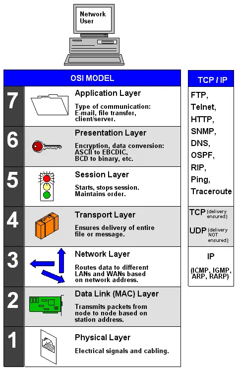

# MQTT 笔记/Note About MQTT

## 一、 概述
MQTT（Message Queuing Telemetry Transport）, 中文名叫消息队列遥测传输协议. MQTT是一个基于发布/订阅（publish/subscribe）模式的“轻量级”消息传输协议。它是一种基于发布/订阅的消息协议，它是为低带宽和低功耗设备设计的。它旨在为物联网（IoT）设备提供可靠的消息传输，并支持多平台、多协议。

MQTT协议由客户端和服务器组成，客户端可以订阅主题（topic）并接收发布到这些主题的消息。服务器可以向客户端发送消息，并将消息发布到主题。

MQTT协议支持三种消息质量（QoS）：

- 至多一次（QoS 0）：消息可能会丢失，但不会重复。
- 至少一次（QoS 1）：消息不会丢失，但可能会重复。
- 只有一次（QoS 2）：消息不会丢失也不会重复。

## 二、 MQTT讲解
### 2.1 ISO NetWork Model

图1：ISO七层网络模型

在讲解MQTT之前，先来看一下ISO七层网络模型。ISO七层网络模型是一种网络模型，它将网络分为七层，分别为物理层（Physical Layer）、数据链路层（Data Link Layer）、网络层（Network Layer）、传输层（Transport Layer）、会话层（Session Layer）、表示层（Presentation Layer）、应用层（Application Layer）。

* 物理层：物理层主要负责物理连接、信号传输、物理寻址等功能。
* 数据链路层：数据链路层主要负责将数据包从一台计算机传输到另一台计算机。
* 网络层：网络层主要负责将数据包从一台计算机传输到另一台计算机，并保证数据包的可靠传输。IP协议属于这一层。
* 传输层：传输层主要负责建立、维护、终止连接，并提供可靠的报文传输。常说的TCP和UDP协议位于这一层。
* 会话层：会话层主要负责建立、维护、终止会话。RPC,SQL属于这一层。
* 表示层：表示层主要负责对数据进行编码、加密、解密、压缩等功能。TLS/SSL协议属于这一层。
* 应用层：应用层主要负责应用进程之间的通信。常说的HTTP,FTP,TELNET等都是属于应用层协议。

其中物理层、数据链路层和网络层一般统称为媒体层（Media Layer）。MQTT和http协议一样位于应用层之上，依赖于TCP/UDP协议，很多时候还需要TLS/SSL协议。

### 2.2 MQTT概述
MQTT是一种发布/订阅协议，旨在连接物联网设备。与HTTP的请求/响应范例不同，MQTT以事件驱动的方式运行，允许将消息推送到客户端。这种架构方法通过解耦数据生产者和数据消费者并消除它们之间的依赖关系来实现高度可扩展的解决方案。建立MQTT连接以发布和订阅消息的两个关键组件是 MQTT客户端和MQTT代理，如下图所示。
！[mqtt-publish-subscribe](img//mqtt-publish-subscribe.svg)

图2：MQTT发布/订阅架构

### 2.3 MQTT的几个概念
在进行正文介绍之前，需要先了解MQTT的几个概念：
1. Topic：主题，是消息的分类标签。
2. Message：消息，是发布到主题的载体。
3. QoS：服务质量，是指消息的可靠性。
4. ClientID：客户端ID，是客户端的唯一标识符。

还需要了解对于一个Topic来说MQTT设备担任的几个角色：
1. Publisher：发布者，是向服务器发布消息的客户端。
2. Subscriber：订阅者，是从服务器订阅消息的客户端。
3. Broker: 中间人，是服务器，负责消息的发布和订阅。

但是真实的MQTT应用中一个设备可能同时担任发布者和订阅者的角色，所以还可以认为MQTT具有以下两个角色：
1. Client：客户端，使用MQTT的程序或设备。客户端总是通过网络连接到服务端。它可以发布应用消息给其它相关的客户端;订阅以请求接受相关的应用消息；取消订阅以移除接受应用消息的请求；从服务端断开连接等。
2. Server：服务器，作为发送消息的客户端和请求订阅的客户端之间的中介。服务器可以接受来自客户端的网络连接；接受客户端发布的应用消息;处理客户端的订阅和取消订阅请求;转发应用消息给符合条件的已订阅客户端.

当然下面的几个基本概念也需要明确一下：
* Network Connection：网络连接，MQTT使用的底层传输协议基础设施。客户端使用它连接服务器。它可以提供提供有序的、可靠的、双向字节流传输。
* Application Message：应用消息，它是MQTT协议通过网络传输的应用数据。应用消息通过MQTT传输时，它们有关联的服务质量（QoS）和主题（Topic）。
* Session：会话，是指客户端和服务器之间的一次通信。会话可以是持久的，也可以是临时的。持久会话可以跨越越多次网络连接，临时会话则在客户端断开连接后就结束。
* MQTT Control Packet：MQTT控制报文，通过网络连接发送的信息数据包。它是MQTT协议的核心数据单元。MQTT规范定义了十四种不同类型的控制报文，其中一个（PUBLISH报文）用于传输应用消息。
* Topic Name：主题名，是MQTT协议中消息的分类标签。它由一系列的主题层级组成，用斜杠（/）分隔。
* Topic Filter：主题过滤器，是订阅者用来订阅主题的条件。它可以是一个完整的主题名，也可以是一个通配符。

### 2.3 MQTT报文格式（MQTT V3.1.1）
MQTT控制报文由三部分组成：固定报头（Fixed Header）、可变报头（Variable Header）、有效载荷（Payload）。

#### 2.3.1 固定报头
固定报头：固定报头由控制报文类型（MQTT Control Packet type）、报文标志（Flags specific to each MQTT Control Packet type）、剩余长度（Remaining Length）三个字段组成。如下表：
<table>
    <tr>
        <td>Bit</td>
        <td>7</td>
        <td>6</td>
        <td>5</td>
        <td>4</td>
        <td>3</td>
        <td>2</td>
        <td>1</td>
        <td>0</td>
    </tr>
    <tr>
        <td>Byte 1</td>
        <td colspan="4">MQTT Control Packet type</td>
        <td colspan="4">Flags specific to each MQTT Control Packet type</td>
    </tr>
    <tr>
    <td>Byte 2</td>
    <td colspan="8" align="center">Remaining Length</td>
    </tr>
</table>

控制报文类型（MQTT Control Packet type）：第一个字节的高半字节，表示控制报文的类型。控制报文的具体含义如下：

 名字          | 值  | 报文流动方向  | 描述                   
-------------|----|---------|----------------------
 Reserved    | 0  | 禁止      | 保留                   
 CONNECT     | 1  | 客户端到服务端 | 客户端请求连接服务端           
 CONNACK     | 2  | 服务端到客户端 | 连接报文确认               
 PUBLISH     | 3  | 两个方向都允许 | 发布消息                 
 PUBACK      | 4  | 两个方向都允许 | QoS 1消息发布收到确认        
 PUBREC      | 5  | 两个方向都允许 | 发布收到（保证交付第一步）        
 PUBREL      | 6  | 两个方向都允许 | 发布释放（保证交付第二步）        
 PUBCOMP     | 7  | 两个方向都允许 | QoS 2消息发布完成（保证交互第三步） 
 SUBSCRIBE   | 8  | 客户端到服务端 | 客户端订阅请求              
 SUBACK      | 9  | 服务端到客户端 | 订阅请求报文确认             
 UNSUBSCRIBE | 10 | 客户端到服务端 | 客户端取消订阅请求            
 UNSUBACK    | 11 | 服务端到客户端 | 取消订阅报文确认             
 PINGREQ     | 12 | 客户端到服务端 | 心跳请求                 
 PINGRESP    | 13 | 服务端到客户端 | 心跳响应                 
 DISCONNECT  | 14 | 客户端到服务端 | 客户端断开连接              
 Reserved    | 15 | 禁止      | 保留                   

为了便于记忆，可以将上面14个有效标签（不含Reserved）分成三种功能：连接相关的包含CONNECT，CONNACK和DISCONNECT；发布相关的包含PUBLISH，PUBACK，PUBREC，PUBREL，PUBCOMP；订阅相关的包含SUBSCRIBE，SUBACK，UNSUBSCRIBE，UNSUBACK。
* 标志位（Flags specific to each MQTT Control Packet type）：第一个字节的低半字节，表示控制报文的具体含义。多数标志位都是Reserved,只有PUBLISH可以设置：

 控制报文        | 固定报头标志             | Bit 3 | Bit 2 | Bit 1 | Bit 0   
-------------|--------------------|-------|-------|-------|---------
 CONNECT     | Reserved           | 0     | 0     | 0     | 0       
 CONNACK     | Reserved           | 0     | 0     | 0     | 0       
 PUBLISH     | Used in MQTT 3.1.1 | DUP1  | QoS2  | QoS2  | RETAIN3 
 PUBACK      | Reserved           | 0     | 0     | 0     | 0       
 PUBREC      | Reserved           | 0     | 0     | 0     | 0       
 PUBREL      | Reserved           | 0     | 0     | 1     | 0       
 PUBCOMP     | Reserved           | 0     | 0     | 0     | 0       
 SUBSCRIBE   | Reserved           | 0     | 0     | 1     | 0       
 SUBACK      | Reserved           | 0     | 0     | 0     | 0       
 UNSUBSCRIBE | Reserved           | 0     | 0     | 1     | 0       
 UNSUBACK    | Reserved           | 0     | 0     | 0     | 0       
 PINGREQ     | Reserved           | 0     | 0     | 0     | 0       
 PINGRESP    | Reserved           | 0     | 0     | 0     | 0       
 DISCONNECT  | Reserved           | 0     | 0     | 0     | 0       

DUP1 =控制报文的重复分发标志；
QoS2 = PUBLISH报文的服务质量等级；
RETAIN3 = PUBLISH报文的保留标志.

* 剩余长度（Remaining Length）：第二个字节开始，表示表示当前报文剩余部分的字节数，包括可变报头和负载的数据。剩余长度不包括用于编码剩余长度字段本身的字节数。剩余长度字段使用一个变长度编码方案，对小于128的值它使用单字节编码。更大的值按下面的方式处理。低7位有效位用于编码数据，最高有效位用于指示是否有更多的字节。因此每个字节可以编码128个数值和一个延续位（continuation bit）。最高为为1表示下一字节还是剩余长度字节。注意低字节在前.剩余长度字段最大4个字节,因此最大数字是2^(4*7) = 2^28 = 256MB。比如假设剩余字节长度是321字节，那么第二个字节是0xC1,第二个字节是0x02.

#### 2.3.2 可变报头
某些MQTT控制报文包含可变报头。可变报头的内容根据报文类型而有所不同。报文
可变头部：可变头部根据报文类型不同而不同。可变报头的报文标识符（Packet Identifier）字段存在于在多个类型的报文里。

* Packet Identifier： 报文标识符。很多控制报文的可变报头部分包含一个两字节的报文标识符字段。这些报文是PUBLISH（QoS > 0时）， PUBACK，PUBREC，PUBREL，PUBCOMP，SUBSCRIBE, SUBACK，UNSUBSCRIBE，UNSUBACK。

Bit | 7～0
|:-:|:-----:|
Byte1|报文标识符 MSB
Byte2|报文标识符 LSB

SUBSCRIBE，UNSUBSCRIBE和PUBLISH（QoS大于0）控制报文必须包含一个非零的16位报文标识符（Packet Identifier）。客户端每次发送一个新的这些类型的报文时都必须分配一个当前未使用的报文标识符。如果一个客户端要重发这个特殊的控制报文，在随后重发那个报文时，它必须使用相同的标识符。当客户端处理完这个报文对应的确认后，这个报文标识符就释放可重用。QoS1的PUBLISH对应的是PUBACK，QoS2的PUBLISH对应的是PUBCOMP，与SUBSCRIBE对应的是SUBACK，与UNSUBSCRIBE对应的是UNSUBACK。PUBACK, PUBREC, PUBREL报文必须包含与最初发送的PUBLISH报文相同的报文标识符。类似地，SUBACK和UNSUBACK必须包含在对应的SUBSCRIBE和UNSUBSCRIBE报文中使用的报文标识符。

CONNECT,CONNACK,DISCONNECT,PINGREQ,PINGRESP控制报文不包含报文标识符。QoS等于0的PUBLISH报文不能包含报文标识符。

客户端和服务器彼此独立的分配报文标识符。所以当客户端和服务器组合使用相同的报文标识符可以实现并发的消息交换。

#### 2.3.3 有效载荷
某些MQTT控制报文在报文的最后部分包含一个有效载荷。对于PUBLISH来说有效载荷就是应用消息。下表列出了需要有效载荷的控制报文：

 控制报文        | 有效载荷 
-------------|------
 CONNECT     | 需要   
 CONNACK     | 不需要  
 PUBLISH     | 可选   
 PUBACK      | 不需要  
 PUBREC      | 不需要  
 PUBREL      | 不需要  
 PUBCOMP     | 不需要  
 SUBSCRIBE   | 需要   
 SUBACK      | 需要   
 UNSUBSCRIBE | 需要   
 UNSUBACK    | 不需要  
 PINGREQ     | 不需要  
 PINGRESP    | 不需要  
 DISCONNECT  | 不需要  

## 2.4 MQTT控制报文
#### 2.4.1 CONNECT报文
客户端到服务端的网络连接建立后，客户端发送给服务端的第一个报文必须是CONNECT报文。在一个网络连接上，客户端只能发送一次CONNECT报文。服务端必须将客户端发送的第二个CONNECT报文当作协议违规处理并断开客户端的连接。有效载荷包含一个或多个编码的字段。包括客户端的唯一标识符，Will主题，Will消息，用户名和密码。除了客户端标识之外，其它的字段都是可选的，基于标志位来决定可变报头中是否需要包含这些字段。

CONNECT的报文类型是1,固定报头的其余部分已经在前面详细介绍了。

CONNECT的可变报头比较复杂.它按照下列次序包含四个字段：协议名（Protocol Name），协议级别（Protocol Level），连接标志（Connect Flags）和保持连接（Keep Alive）。

协议名（Protocol Name）由构成如下表：

Byte​| 说明 | （H）7 ～ 0（L） 
:---:|:---:|:---------:
 byte 1 | 长度 MSB (0) | 0x00 
 byte 2 | 长度 LSB (4) | 0x04
 byte 3 | ‘M’        | 0x4D
 byte 4 | ‘Q’        | 0x51
 byte 5 | ‘T’        | 0x54
 byte 6 | ‘T’        | 0x54 

协议名是表示协议名 MQTT 的UTF-8编码的字符串。MQTT规范的后续版本不会改变这个字符串的偏移和长度。如果协议名不正确服务端可以断开客户端的连接，也可以按照某些其它规范继续处理CONNECT报文。对于后一种情况，按照本规范，服务端不能继续处理CONNECT报文。

协议级别（Protocol Level）表示支持的MQTT协议版本标识。
Byte​| 说明 | （H）7 ～ 0（L） 
:---:|:---:|:---------:
 byte 7 | Level（4） | 0x04

客户端用8位的无符号值表示协议的修订版本。对于3.1.1版协议，协议级别字段的值是4(0x04)。如果发现不支持的协议级别，服务端必须给发送一个返回码为0x01（不支持的协议级别）的CONNACK报文响应CONNECT报文，然后断开客户端的连接。

正是因为这个原因，才没有MQTT4直接有MQTT v3.1.1跳到MQTT v5.

连接标志（Connect Flags）字段包含一些用于指定MQTT连接行为的参数。它还指出有效载荷中的字段是否存在。
 Byte | 7 | 6 | 5 | 4～3 | 2 | 1 | 0 
:------:|:---:|:---:|:---:|:---:|:---:|:---:|:---:
 含意 | User Name | Password ​| Will Retain | Will QoS | Will Flag |Clean Session | Reserved |
 byte 8 | X | X | X | X | X | X  | 0 

服务端必须验证CONNECT控制报文的保留标志位（第0位）是否为0，如果不为0必须断开客户端连接。这部分的内容比较复杂，可以结合MQTT的通讯过程掌握。

保持连接（Keep Alive）字段是一个以秒为单位的时间间隔，表示为一个16位的字，它是指在客户端传输完成一个控制报文的时刻到发送下一个报文的时刻，两者之间允许空闲的最大时间间隔。客户端负责保证控制报文发送的时间间隔不超过保持连接的值。如果没有任何其它的控制报文可以发送，客户端必须发送一个PINGREQ报文 。

## MQTT 客户端
mqtt.fx

mqttx

MQTT Explorer

## 附录
MQTT Intro:
* [MQTT官网](https://mqtt.org/)
* [MQTT3.1.1 协议中文版](https://mcxiaoke.gitbook.io/mqtt/)
* [MQTT 5.0协议中文版](https://mqtt.p2hp.com/mqtt-5-0)
* [oasis mqtt 5.0](https://docs.oasis-open.org/mqtt/mqtt/v5.0/mqtt-v5.0.pdf)
* [oasis mqtt 3.1.1](https://docs.oasis-open.org/mqtt/mqtt/v3.1.1/mqtt-v3.1.1.pdf)
* [Intro MQTT 3.1.1](http://www.taichi-maker.com/homepage/esp8266-nodemcu-iot/iot-tuttorial/mqtt-tutorial/)

MQTT Library:
* [Paho mqtt](https://eclipse.dev/paho/)
* [wolfMQTT](https://www.wolfssl.com/products/wolfmqtt/)
* [FreeRTOS coreMQTT](https://aws.github.io/aws-iot-device-sdk-embedded-C/202011.00/libraries/standard/coreMQTT/docs/doxygen/output/html/index.html)
* [NetX Duo MQTT](https://learn.microsoft.com/en-us/azure/rtos/netx-duo/netx-duo-mqtt/chapter1)

MQTT Client:
* [MQTTX](https://mqttx.app/zh)
* [MQTTX web](http://www.emqx.io/online-mqtt-client)
* [MQTT Explorer](https://github.com/thomasnordquist/MQTT-Explorer)
* [MQTT.fx](https://github.com/emqx/MQTTX)
* [paho mqtt-spy](https://github.com/eclipse/paho.mqtt-spy)
* [Mosquitto](https://github.com/eclipse/mosquitto)

