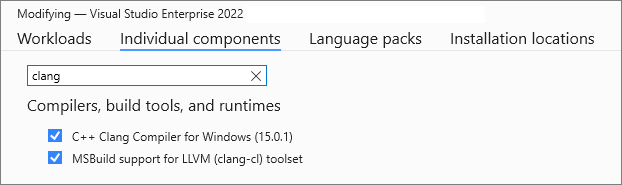

# ChangKun的Modern C++学习教程笔记
____________________________________________________

## 一、概述
本教程来源于欧长坤的Modern C++教程页面。教程中作者是使用make来进行编译的。我这里采用了一种更复杂的方法：利用windows系统的WSL2作为运行环境，使用Visual Studio作为IDE，使用cmake来进行编译。当然其实也可以使用VS Code可能更加灵活通用。但是想增强对VS的了解。另一方面我使用了Codeium作为代码编写助手，因此禁用了自带的IntelliSense功能。具体可以看1.1节的环境配置部分。

## 1.1、环境配置
我假定你使用的是windows 11（理论上Windows 10也可以，但我没有测试过）。我假定你也安装了Visual Studio 2022。如果你没有安装，可以到微软官网下载安装。除了常规的Visual Studio安装，你还需要安装WSL2。我安装的是debian 12。当然其它版本也是可以的，只是后面的过程你可能需要根据自己的发行版本进行相应调整。

### 1.1.1 在Visual Studio中启用clang
具体过程可参考[微软官方文档](https://learn.microsoft.com/zh-cn/cpp/build/clang-support-msbuild?view=msvc-170). 
基本步骤就是在individual component中安装Clang Compiler for Windows和clang-cl。


### 1.1.2 在wsl2中安装llvm
这一部分可以参照我的一篇博客。

TODO: 稍后给出链接。

### 1.1.3 安装Codeium并关闭IntelliSense
打开扩展>管理扩展，搜索codeium并安装。codeium需要注册，具体过程请自行搜索。

### 1.1.4 在wsl2中安装ssh和其它必须的软件
TODO: 稍后提供方法

### 1.1.5 开启ssh服务并尝试从vs中连接wsl2
TODO: 稍后提供方法

### 1.1.6 制作一个hello world项目并测试
TODO: 稍后提供方法

## 二、教程第二章笔记：语言可用性的强化
第二章的标题是“语言可用性的强化”。这里的“语言可用性”是指发生在运行时之前的语言特性。

### 2.1 常量

#### 2.1.1 空指针

空指针：nullptr。在空指针这一部分程序提供了一段测试代码，其中用到了[type_traits](https://en.cppreference.com/w/cpp/types/type_traits)。这个库定义了一系列与类型（Type）相关的模板和函数。本次使用的is_same模板类正是这个头文件中的函数，可以用来判断两个类型是否相同。另外需要说明的是nullptr的类型是std::nullptr_t。Modern C++建议使用std::is_same来比较两个类型是否相同。

#### 2.1.2 常量表达式标签
常量表达式标签：constexpr。尽管之前的c++已经有常量表达式，但是Modern C++提供了更强大的constexpr用来在编译时优化这些常量表达式。关键字constexpr是在C++11中引入的，并在 C++14中进行了改进。它表示constant（常数）表达式。与const一样，它可以应用于变量：如果任何代码试图modify（修改）该值，将引发编译器错误。与const不同，constexpr也可以应用于函数和类constructor（构造函数）。constexpr指示值或返回值是constant（常数），如果可能，将在编译时进行计算。本教程对于constexpr的描述不太清晰，建议看[微软关于constexpr的描述](https://learn.microsoft.com/zh-cn/cpp/cpp/constexpr-cpp?view=msvc-170).

### 2.2 变量及其初始化

#### 2.2.1 if/switch变量声明强化 
if/switch变量声明强化：在if和switch语句中可以声明一个临时变量。这方便迭代器等算法的实现。这以增强功能在C++17才引进。在示例程序中用到了std::find定义在algorithm头文件中。用来在某个范围内搜寻目标变量的第一次出现的位置。函数原型可参考[这里](https://cplusplus.com/reference/algorithm/find/).

#### 2.2.2 初始化列表
初始化列表：用在对象初始化时使用。在传统C++中，不同对象有不同的初始化方法。比如普通数组，POD（Plain Old Data）类型可以使用{}初始化，而类对象则需要使用构造函数（拷贝构造或（）运算符）。不同的类型初始化方法不同。而Modern C++中引入了初始化列表，可以统一初始化语法。在c++11中首选引入了std::initializer_list，它是一个模板类，用来将类初始化。此外C++11还提供了统一的语法来初始化任意对象。

#### 2.2.2 结构化绑定
结构化绑定：结构化绑定提供了类似其他语言中提供的多返回值功能。在C++11/14中只能通过std::tuple和std::tie来变相实现多返回值功能。但是我们依然需要非常清楚元组包含了多少个对象以及各自的类型。C++17引入了结构化绑定功能，大大提升了多返回值编写的体验。

### 2.3 类型推导
文章认为在传统C和C++中，参数的类型必须明确定义，这其实对于快速编码没有帮助。尤其面对一大堆复杂的模板类型时，必须明确指出变量类型才能进行后续的编码，这不仅拖慢开发效率。代码还变得又臭又长。（也增加了错误的发生概率。尽管如此我自己认为数据类型还是很重要的。尤其对于底层的编程，数据的类型和数据的存储和处理都非常重要。）

C++引入了auto和decltype关键字来解决这个问题。

#### 2.3.1 auto关键字
auto：auto关键字很早就进入了C++，但时钟作为一个存储类型的指示符存在，与register并存。（另外传统C++使用关键字register指示将变量存储在register中。但是现在的编译器可以比人工提供更优的存储方式，因此在Modern C++中register关键字也被弃用。）在传统C++中如果一个变量不是register，就自动视作auto变量。在C++17中将register的功能弃用，只作为一个保留关键字。auto的语义也随之而来做出变更。在前面的迭代器示例中，就用到了auto。另外复杂的模板类型推导也可以用到auto。从C++20其auto甚至能用于函数传参。（也就是C++11/14/17不能这样做。很多程序目前还在使用C++17及其以前的版本。）但是auto目前还不能推导数组元素类型。实际测试发现参数的返回类型也可以是auto的。比如：
```cpp
auto sub(auto x, auto y) {
    return x - y;
}
```

auto只能对变量进行类型推导。

#### 2.3.2 decltype关键字
decltype: decltype关键字可以认为是declare type的缩写。这个关键字是为了解决auto关键字只能对变量进行类型推导的缺陷二出现的。它的用法和`typeof`类似。用法是：`decltype(expression)`。decltype的作用是返回expression的类型。decltype的表达式一般是变量、函数调用、成员访问、运算符表达式等。decltype的返回值是一个类型，而不是表达式的值。

* 关于`typedef`: 早期的C++标准中并没有提供名为typeof的关键字，而是在某些编译器或语言中支持的扩展。在标准C++中，类型推导是通过decltype来实现的，因此可以将typeof视为一种扩展，而不是正式的C++标准关键字。

* 关于`typeid`: typeid关键字是用来获取表达式的类型信息的。但是在C++11中，typeid只能用于指针、引用、成员指针、成员函数指针等。在C++17中，typeid可以用于任意表达式。typeid是一个运算符不是函数。typeid 的结果是 const type_info&。 该值是对表示 type-id 或 expression 的类型的 type_info 对象的引用，具体取决于所使用的 typeid 的形式。关于typeid的更多信息，可以参考[微软关于typeid的介绍](https://learn.microsoft.com/zh-cn/cpp/cpp/typeid-operator?view=msvc-170)。

#### 2.3.3 尾返回类型
尾返回类型： trailing return type（尾返回类型）是C++11引入的新特性。它允许函数的返回类型在函数声明和定义中分离。在函数声明中，可以指定返回类型，而在函数定义中，可以省略返回类型。这样可以提高代码的可读性。在C++17中，尾返回类型可以用于函数模板。形如`decltype(x+y) add(T x, U y)`的语句不能通过编译。这是因为编译器读到decltype(x+y)时，并不知道x和y的类型。但是在尾返回类型中，可以将decltype(x+y)作为函数的返回类型。做法如下：
```cpp  
template<typename T, typename U>
auto add(T x, U y) -> decltype(x+y) {
    return x + y;
}
```
从C++14开始可以让普通函数也就被返回值推导，因此下面的写法变得合理：
```cpp
template<typename T, typename U>
auto add(T x, U y) {
    return x + y;
}
```
 
 #### 2.3.4 decltype(auto)
decltype(auto) : 是c++14引入的一个略微复杂的用法。主要用来对转发函数或者封装的返回类型进行推导。它使得我们无需显示的指定decltype的参数表达式。

### 2.4 控制流

#### 2.4.1 if constexpr
if constexpr: C++17引入了if constexpr来支持在编译时进行条件判断。（原文介绍说是从C++11引入，但是搜索之后发现是C++17引入的。）if constexpr的语法和if语句类似，但是在判断条件前面加上constexpr关键字。这样可以避免运行时判断，提高效率。[微软关于if constexpr的介绍](https://learn.microsoft.com/zh-cn/cpp/cpp/if-else-statement-cpp?view=msvc-170#-if-constexpr-statements)也非常有用。关于这条语句可能存在误解，认为是不是用if指示效率低而已？微软教程中举得示例带代码：
```cpp
// Compile with /std:c++17
#include <iostream>

template<typename T>
auto Show(T t)
{
    if (std::is_pointer_v<T>) // Show(a) results in compiler error for return *t. Show(b) results in compiler error for return t.
    //if constexpr (std::is_pointer_v<T>) // This statement goes away for Show(a)
    {
        return *t;
    }
    else
    {
        return t;
    }
}

int main()
{
    int a = 42;
    int* pB = &a;

    std::cout << Show(a) << "\n"; // prints "42"
    std::cout << Show(pB) << "\n"; // prints "42"
}
```
如果如图使用`if`而不是`if constexpr`, 会出现编译错误。原因是当参数类型是int等类型，编译器照例会编译所有的代码语句。

#### 2.4.2 基于范围的for循环
区间for迭代：C++11引入了range-based for循环，终于实现了类似与python那样简洁的代码。关于基于范围的for迭代可参见[微软关于range-based for的介绍](https://learn.microsoft.com/zh-cn/cpp/cpp/range-based-for-statement-cpp?view=msvc-170).基本语法是`for (for-range-declaration:expression)`. 请注意，在语句的 for-range-declaration 部分中，auto 关键字是首选的。如果你看微软的相关章节会发现`const auto&`这样的写法，这是因为在C++17中，`const auto&`可以用来声明一个常量引用。也需要明确一点形如`for(auto y: x)`的写法并不会修改x的值。如果需要修改x的值应该使用形如`for(auto& y: x)`使用引用的写法。

### 2.5 模板
C++ 的模板是这门语言的一种特殊的艺术。模板的哲学在于将一切能够在编译期处理的问题丢到编译期进行处理，仅在运行时处理那些最核心的动态服务，进而大幅优化运行期的性能。

#### 2.5.1 外部模板
传统C++中，模板只有在使用时才会被编译器实例化。但是主要每个编译单元（文件）中编译的代码遇到了完整定义的模板，都会被实例化。这就产生了重复实例化的问题。这个问题导致了编译时间的增加。为此Modern C++引入了外部模板，扩充了原来的强制编译器实例化模板的语法，使得我们能够显式的通知编译器何时进行模板的实例化。（其实就是添加extern关键字。）示例如下：
```cpp
template class std::vector<bool>; // 显式（强制）实例化
extern template class std::vector<double>; // 不再改当前编辑文件中实例化模板 
```

关于模板的详细指示可以查看[微软关于模板的介绍](https://learn.microsoft.com/zh-cn/cpp/cpp/templates-cpp?view=msvc-170).

模板类中的尖括号">"要特别注意。在传统C++中，可以强制在嵌套模板的两个`>`之间添加空格，否则会出错。但是从C++11开始，连续的右尖括号`>`将是被允许的。

#### 2.5.2 类型别名模板
C++中`类型（Type）`和`模板（Template）`是两个完全不同单容易混淆的东西。"模板"是一种代码的组织工具，用于生成特定类型或值的代码实例，而"类型"是数据的抽象分类，用于指定数据的内部表示和操作方式。"模板"指的是一种通用的代码框架，它可以用一个或多个类型或值作为参数，在编译时被实例化为特定的类、函数或其他代码实体。在传统C++中,可以使用`typedef`来定义一个类型，但是去不能用它来定义一个模板。

#### 2.5.3 变长参数模板
在传统C++中，无论是类模板还是函数模板都只能接收股东数量的模板参数；但在C++11中加入了新的表示方法： 允许任意个数、任意类别的模板参数，同事也不需要在定时将参数个数固定。这就是变长参数模板。形式大体如下：

```cpp
// 变长函数模板
template<typename... Args>
void foo(Args... args) {
    // do something with args
}

foo(1, 2.0, "hello"); // 调用foo函数，传入三个参数

// 变长类模板
template<typename... Args>
class Magic <>{
    // do something with args
};

class Magic<int, double, std::string> m; // 实例化Magic类模板，传入三个参数

// 甚至可以是0个模板参数
class Magic<> m2; // 实例化Magic类模板，没有参数

// 若要避免0个模板参数的歧义，可以先定义一个模板参数：
template<typename T, typename... Args> 
class Magic_2 {
    // do something with args
};

class Magic_2<int> m3; // 这样就限制了模板至少有一个参数

函数也可以类似定义

template<typename... Args>
void print(const std::string& s, Args... args);

print("hello", 1, 2.0); // 调用print函数，传入两个参数

template<typename... Args>
auto func_args_num(Args... args) {
    auto n = sizeof...(args); // 计算参数个数
    return n;
}

``` 
但是对于变长参数模板的展开到目前为止仍然没有一种简单的方法。目前有两种方式：
1. 递归模板函数法：通过递归调用模板函数，将参数分解为多个参数，直到终止递归的函数。在C++17之前，递归模板方式一般要定义两个函数，其中一个负责展开终止递归函数，另一个负责展开剩余参数。非常繁琐。自C++17以后，可通过利用`if constexpr`和`sizeof...`来实现对终止递归函数的条件编译。这样就只需要定义一个函数。事实上我们尽管使用了变参模板，却不一定需要对参数做逐个遍历，可以利用std::bind及完美转发等特性实现对函数和参数的兵丁，从而达到成功调用的目的。

2. 初始化列表展开法：这种方法利用了初始化列表(std::initializer_list)和lambda表达式。语法比较费解，如下：

```cpp
template<typename T, typename... Args>
void my_printf(T value, Args... args) {
    std::cout << value << std::endl;
    (void) std::initializer_list<T> {
        ([&args]{std::cout << args << std::endl;}(),value)...
    };
}
``` 

<font color=red>上面的代码我暂时还不能理解。</font>

除此之外，C++17中还将变长参数的特性带给了表达式：
```cpp
template<typename... Args>
auto sum(Args... args) {
    return (args +...); // 表达式模板
}

int main() {
    std::cout << sum(1, 2, 3, 4, 5) << std::endl; // 输出15
    return 0;
}
``` 
可以看到通过这种方式让迭代操作变得非常简单。


#### 2.5.4 非类型模板参数
类型模板传入的是具体类型，例如：
```cpp
template<typename T, typename U>
auto add(T a, U b) {
    return a + b;
}
``` 

而非类型模板参数传入的是可以是变量、表达式、函数调用等，例如：
```cpp
template<typename T, int N>
void print_array(T (&arr)[N]) {
    for (int i = 0; i < N; ++i) {
        std::cout << arr[i] << " ";
    }
    std::cout << std::endl;
}
```

### 2.6 面向对象

#### 2.6.1 委托构造
C++11引入了委托构造，可以将构造函数委托给另一个构造函数，从而简化构造函数的编写。

#### 2.6.2 继承构造
C++11引入了继承构造，可以继承父类的构造函数，从而简化子类的构造函数编写。

#### 2.6.3 显式虚函数重载
在传统C++中经常容易发生意外重载虚函数的事情。或者当虚函数在基类中删除之后，子类拥有的旧的函数就不再重载此虚函数，而变成了一个普通类方法。这可能造成灾难性的后果。

C++11引入了`override`和final关键字，可以显式的指示编译器对虚函数进行重载。`override`关键字用于指示编译器检查函数签名是否正确，`final`关键字用于指示编译器不再对此函数进行重载。

* `override`: 重载虚函数时，使用`override`显式的告知编译器进行重载。编译器将检查基函数是否存在与要重载的目标函数一致的虚函数。如果不存在将无法编译。示例如下：
```cpp
struct Base {
    virtual void foo(int);
};

struct SubClass : Base {
    virtual void foo(int) override {/*do something*/}; // 合法
    virtual void foo(float) override {/*do something*/}; // 非法，签名不匹配
};
```

* `final`: `final`则是为了防止类被继续继承以及终止虚函数继续重载引入的。声明函数为`final`时，编译器将不再对此函数进行重载。示例如下：
```cpp
struct Base {
    virtual void foo() final;
};

struct SubClass1 final : Base {}; // 合法，子类声明为final

struct subClass2 : subClass1 {}; // 非法，子类声明为final

struct SubClass3 : Base {
    virtual void foo() override {/*do something*/}; // 非法，父类中声明为final
};
```

#### 2.6.4 显式禁用默认函数
在传统C++中，如果程序员没有提供，编译器会默认为对象生成默认构造函数、析构函数、复制构造和赋值运算符。另外C++也定义了诸如new delete这样的运算符。当程序员有需要时，可以重载这部分函数。用户想要精确控制默认函数行为一般需要将不需要的函数声明为private。而且用户默认的构造函数和用户定义的构造函数不可以共存。C++11引入了更强大的功能，允许显式的声明采用或者拒绝构造函数。例如：
```cpp
class MyClass {
public:
    MyClass() = default; // 采用默认构造函数    
    MyClass& operator=(const MyClass&) = delete; // 拒绝复制构造函数
    MyClass(int x) : data(x) {} // 定义构造函数
};
```

#### 2.6.5 强类型枚举
C++11引入了枚举类(enumeration class),并使用`enum class`语法进行声明。文中提到传统的C++中枚举类型不是类型安全的。两个不同的枚举类型可直接进行比较。同一个命名空间内两个不同模具类型的枚举值不能重名。C++11中使用`enum class`可以解决这些问题。枚举类用法示例：
```cpp
enum class Color : unsigned char{ RED, GREEN, BLUE };
```
文中给出了一段很费解的代码：
```cpp
#include <iostream>
template<typename T>
std::ostream& operator<<(
    typename std::enable_if<std::is_enum<T>::value,
        std::ostream>::type& stream, const T& e)
{
    return stream << static_cast<typename std::underlying_type<T>::type>(e);
}
```

### 2.7 习题解答

#### 2.7.1 第一题

* 问题： 使用结构化绑定，仅用一行函数内代码实现如下函数：

template <typename Key, typename Value, typename F>
void update(std::map<Key, Value>& m, F foo) {
    // TODO:
}
int main() {
    std::map<std::string, long long int> m {
        {"a", 1},
        {"b", 2},
        {"c", 3}
    };
    update(m, [](std::string key) {
        return std::hash<std::string>{}(key);
    });
    for (auto&& [key, value] : m)
        std::cout << key << ":" << value << std::endl;
}

* 解答：
本题的难点即使不是答案，而是问题本身。问题本身的语法有很多关键点。`std::map<Key, Value>`,`std::hash`和lambda表达式这三个语法点还是要理解一下的。问题的简单描述其实应该是如何在update函数中添加一行代码，实现用hash值取代每个key原有的value。
```cpp
for (auto&& [key, value] : m) value = foo(key);
```
答案也很简单，就是将value用foo函数的计算结果代替。foo函数在main函数中传入，用来返回一个hack code。答案的另一个重点是`auto&& [key, value] : m`，这里用了两个`&`,而不是一个。这是因为不但需要对键值对解引用，还需要能够修改值。

#### 2.7.2 第二题
* 问题： 尝试用折叠表达式实现用于计算均值的函数，传入允许任意参数。
* 答案：这个问题和示例中的求sum类似。指示需要使用`sizeof...`，我尝试将`sizeof...`赋值给一个变量，然后使用`if constexpr`去判断是否为0。结果发现不能通过编译。正确答案如下（和原来的答案稍有出入）：
```cpp
#include <iostream>
#include <type_traits>

template<typename ... Ts>
auto average(Ts ... args) {
	if constexpr (sizeof...(args) > 0) {
		return ((args + ...) / sizeof...(args));
	}
	else {
		return 0;
	}
}

int main() {
		std::cout << average(1, 2, 3, 4, 5, 7, 8) << std::endl; // 3
		return 0;
}
```

## 三、教程第三章笔记：语言运行期的强化
教程第三章的标题是《语言运行期的强化》。它主要讲解了modern C++在运行期的一些优化。


### 3.1 Lambda表达式
现代语言比如python，rust之类都有lambda表达式。C++11引入了lambda表达式，可以用来创建匿名函数。lambda表达式可以捕获外部变量，也可以作为函数参数。lambda表达式的语法如下：
```cpp
[capture](parameters) mutable(optional)  -> return-type { function-body }
```
其中，capture可以捕获列表；parameters表示函数的参数；mutable表示函数是否可以修改捕获的变量，可选；return-type表示函数的返回类型，使用的是我们之前描述的尾返回类型。这里重点讲一下捕获列表`[capture]`。捕获列表可以理解未parameter的一种类型。Lambda表达式内部函数体默认情况下式不能够使用函数体外部的变量的，这时候捕获列表就可以起到传递外部数据的作用。捕获列表有四种形式：值（value）捕获、引用（reference）捕获、隐式捕获、表达式捕获。

* 值捕获：与参数传值类似（值捕获的前提式变量可以拷贝）。<font color=red>被捕获的变量在Lambda表达式被创建时拷贝，而非调用时才拷贝。</font>示例如下：
```cpp
void lambda_value_capture() {
    int value = 1;
    auto copy_value = [value] {
        return value;
    };
    value = 100;
    auto stored_value = copy_value();
    std::cout << "stored_value = " << stored_value << std::endl;
    // 这时, stored_value == 1, 而 value == 100.
    // 因为 copy_value 在创建时就保存了一份 value 的拷贝
}
```
上面的代码示例中请注意没有用std::cout直接输出copy_value的值。这是因为copy_value实际是一个函数对象，调用它不会执行函数体，而是返回一个类似函数指针一样的东西。后面的文章这样描述："Lambda 表达式的本质是一个和函数对象类型相似的类类型（称为闭包类型）的对象（称为闭包对象）， 当 Lambda 表达式的捕获列表为空时，闭包对象还能够转换为函数指针值进行传递".

* 引用捕获：与引用传参类似，引用捕获保存的时引用，值会发生变化。可以和值捕获做个比较。示例如下：
```cpp
void lambda_reference_capture() {
    int value = 1;
    auto copy_value = [&value] {
        return value;
    };
    value = 100;
    auto stored_value = copy_value();
    std::cout << "stored_value = " << stored_value << std::endl;
    // 这时, stored_value == 100, value == 100.
    // 因为 copy_value 保存的是引用
}
```
请注意这里引用捕获使用的符号`&`，和普通的参数引用类似。

* 隐式捕获：编译器使用隐式捕获可以自动捕获外部变量。隐式捕获常见有五种形式：
    * [] 空捕获列表
    * [name1, name2, ...] 捕获一系列变量
    * [&name1, &name2, ...] 捕获一系列变量的引用
    * [=] 值捕获列表，让编译器自动推导值捕获列表
    * [&] 引用捕获，让编译器自行推导引用列表

但编译器根据什么样的规则自行推导。文章没有讲解。

* 表达式捕获：前面三种形式捕获的均是左值，而不能捕获右值。C++14中引入了表达式捕获功能，使其可以捕获右值。示例如下：
```cpp
#include <iostream>
#include <memory>  // std::make_unique
#include <utility> // std::move

void lambda_expression_capture() {
    auto important = std::make_unique<int>(1);
    auto add = [v1 = 1, v2 = std::move(important)](int x, int y) -> int {
        return x+y+v1+(*v2);
    };
    std::cout << add(3,4) << std::endl;
}
```
在上面的important式一个独占指针，是不能被`=`运算符捕获的。这时候我们需要使用`std::move`将其转移成右值，在表达式中初始化。

```txt
右值引用是 C++11 引入的新概念，用于表示对临时对象或将要销毁的对象的引用。它在语义上区别于左值引用，可以用于启用移动语义、完美转发以及构造临时对象等操作。右值引用的语法是在类型名称后添加两个连续的 & 符号（&&）。通过声明一个右值引用，可以将其绑定到临时对象或将要销毁的对象，从而在这些对象上执行移动操作，以提高性能并避免不必要的复制。
```

在C++14之后，lambda表达式也支持`auto`关键字从而具备了泛型的功能。（Lambda表达式不能能被模板化）示例如下：
```cpp
auto add = [](auto x, auto y) {
    return x+y;
};  

add(1, 2); // 3
add(1.0, 2.0); // 3.0
add("hello", "world"); // helloworld
```

```txt
在C++中，“闭包类型”通常指的是lambda表达式（lambda expressions）的类型，而“闭包对象”是指lambda表达式创建的可调用对象（callable object）。Lambda表达式是C++11引入的功能，用于创建匿名函数对象。闭包类型指的是lambda表达式的类型，而闭包对象是指lambda表达式创建的函数对象，可以像函数一样被调用。
```

### 3.2 函数对象包装器
文中专门提到这一点“这部分内容虽然属于标准库的一部分，但是从本质上来看，它却增强了 C++ 语言运行时的能力， 这部分内容也相当重要，所以放到这里来进行介绍。”
实际上这部分讲解的内容，是许多初学C++的人所不知道的。

#### 3.2.1 std::function
在文中作者先使用一个example描述了lambda表达式表示的匿名函数分别被作为函数类型和函数被使用。在C++11中，统一了两者的改变：将能够被调用的对象的类型通常为可调用类型。而这种类型可以通过`std::function` 来表示。文中有这样一段总结：
```txt
C++11 std::function 是一种通用、多态的函数封装， 它的实例可以对任何可以调用的目标实体进行存储、复制和调用操作， 它也是对 C++ 中现有的可调用实体的一种类型安全的包裹（相对来说，函数指针的调用不是类型安全的）， 换句话说，就是函数的容器。当我们有了函数的容器之后便能够更加方便的将函数、函数指针作为对象进行处理。
```
或者有稍微清晰一点的描述：
```txt
std::function是C++标准库中的一个模板类，用于封装可调用对象，例如函数、函数指针、成员函数指针或者lambda表达式。它提供了一种通用的方式来存储、传递和调用任意可调用对象，从而使得代码更加灵活、可复用和可扩展。
```
听着像是互联网黑话。基本上可以归纳为“通用”，“安全”和“灵活”。其实最好的理解方式还是看代码。请注意`std::function`的头文件是`<functional>`。

#### 3.2.2 std::bind和std::placeholders
std::bind 是 C++ 标准库中的一个函数，它用于创建一个函数对象，这个函数对象可以将原始函数的参数绑定到特定的数值上。std::placeholders 是 C++ 标准库中用于占位符的命名空间，它提供了一系列预定义的占位符，用于在使用函数对象时指定需要绑定的参数位置。我们可以使用 std::placeholders::_1, std::placeholders::_2, std::placeholders::_3, ... 以此类推，来指定绑定参数列表中对应的位置。

#### 3.2.3 右值引用
在前面讲解lambda表达式的时候，我已经替代过右值引用。但是通过那段描述。还是挺晕的。这一段作者对右值引用做了详细说明：
```txt
右值引用是 C++11 引入的与 Lambda 表达式齐名的重要特性之一。它的引入解决了 C++ 中大量的历史遗留问题， 消除了诸如 std::vector、std::string 之类的额外开销， 也才使得函数对象容器 std::function 成为了可能。
```
文中对涉及的几个名词做了专门的解释，确实让人有所领悟：
* 左值 (lvalue, left value)： 顾名思义就是赋值符号左边的值。准确来说， 左值是表达式（不一定是赋值表达式）后依然存在的持久对象。
* 右值 (rvalue, right value)： 右边的值，是指表达式结束后就不再存在的临时对象。请注意右值要么是一个纯右值，要么是一个将亡值。
* 字面量 (literal)： 字面量就是直接写在代码中的值，例如 10, "hello", 3.14, true 等。
* 纯右值 (prvalue, pure rvalue)： 纯粹的右值，要么是纯粹的字面量，例如 10, true； 要么是求值结果相当于字面量或匿名临时对象，例如 1+2。非引用返回的临时变量、运算表达式产生的临时变量、原始字面量、 Lambda 表达式都属于纯右值。需要注意的是，字面量除了字符串字面量以外，均为纯右值。而字符串字面量是一个左值，类型为 const char 数组。<font color=red>但是注意，数组可以被隐式转换成相对应的指针类型，而转换表达式的结果（如果不是左值引用）则一定是个右值（右值引用为将亡值，否则为纯右值）。</font>这一部分的描述是否费解。在我测试`decltype(101)`之类的表达式时，发现也是能编译的。也就是说此时的字面值其实被当作了表达式，从而被转换成了左值？
* 将亡值 (xvalue, expiring value)： 也是 C++11 为了引入右值引用而提出的概念（因此在传统 C++ 中， 纯右值和右值是同一个概念），也就是即将被销毁、却能够被移动的值。（<font color=red>就是说如果这个值没有被移动就会被销毁？</font>）

在作者进行讲解时，用到了`static_cast`.这里简单对它进行一些说明。static_cast 是 C++ 中用于执行显式类型转换的操作符。它可以将一个表达式转换为指定的类型，包括用户定义的类型、内置类型和其他类型。static_cast 在编译时执行类型检查，并且通常用于较为安全的类型转换操作。static_cast 是在编译时执行类型转换，不进行运行时检查。它主要用于执行较为安全的类型转换，例如基本类型之间的转换、向上转型或者非多态类的类型转换。static_cast 在执行类型转换时不进行运行时类型检查，因此转换的安全性需要程序员自行确保。而 dynamic_cast 则是在运行时执行类型转换，它可以用于执行安全的向下转型（将指向基类对象的指针或引用转换为指向派生类对象的指针或引用），并进行运行时类型检查，以确保类型转换的安全性。dynamic_cast 只能在存在虚函数的类层次结构中进行类型转换，用来处理多态类型的转换。

在作者进行讲解时，还用到了`static_assert`. static_assert 是 C++11 引入的关键字，用于在编译时进行静态断言（Static Assertion）。它允许在编译时对某些条件进行检查，如果条件为假，则导致编译失败并显示错误消息。static_assert 的语法形式如下：
```cpp
static_assert (constant_expression, "error message");
```
static_assert 只能用于在编译时进行常量表达式的验证，不能用于运行时条件的检查。因此，它适用于那些只需在编译期就能确定的条件检查，例如类型大小的验证、常量的合法性检查等。

要拿到一个将亡值，就需要用到右值引用：`T &&`，其中 T 是类型。 右值引用的声明让这个临时值的生命周期得以延长、只要变量还活着，那么将亡值将继续存活。C++11 提供了 std::move 这个方法将左值参数无条件的转换为右值， 有了它我们就能够方便的获得一个右值临时对象.

作者举了一段代码：
```cpp
#include <iostream>
#include <string>

void reference(std::string& str) {
    std::cout << "lvalue" << std::endl;
}
void reference(std::string&& str) {
    std::cout << "rvalue" << std::endl;
}

int main()
{
    std::string  lv1 = "string,";       // lv1 is a lvalue
    // std::string&& r1 = lv1;           // illegal, rvalue can't ref to lvalue
    std::string&& rv1 = std::move(lv1); // legal, std::move can convert lvalue to rvalue
    std::cout << rv1 << std::endl;      // string,
    
    const std::string& lv2 = lv1 + lv1; // legal, const lvalue reference can extend temp variable's lifecycle
    // lv2 += "Test";                   // illegal, const ref can't be modified
    std::cout << lv2 << std::endl;      // string,string
    
    std::string&& rv2 = lv1 + lv2;      // legal, rvalue ref extend lifecycle
    rv2 += "string";                    // legal, non-const reference can be modified
    std::cout << rv2 << std::endl;      // string,string,string,
    
    reference(rv2);                     // output: lvalue
    
    return 0;
}
```

这段代码似乎十分简单。但是结果让人很费解。第一'reference(rv2)'为什么使出的是`lvalue`。其次使用`std::move(lv1)`将lv1的所有权转移给了`rv1`.如果再对`lv1`操作，似乎是对`rv1`操作了。比如如果我在`std::string&& rv1 = std::move(lv1);`之后，尝试`lv1.assign("newstr1")`。这时候rv1的信息也相应的变化了。第三，如果像程序一样使用`const std::string& lv2 = lv1 + lv1;`是能够编译的。但是如果改成"std::string& lv2 = lv1 + lv1;"就会报错。

请注意上面的代码中`lv1`和`lv1 + lv1`的语义有很大的区别。前者是一个现存的变量，后者会生成一个临时变量。临时变量的生命周期很短，而右值引用延长了它的声明周期。

#### 3.2.4 移动语义

作者在“移动语义”这一段编写了一段很有意思的代码，很好的展示了构造、移动、析构和拷贝操作。我的代码的调试输出如下（指针输出一般不同，但流程类似）：
```txt
construct: @0x55555556aeb0
construct: @0x55555556b2e0
move: @0x55555556b2e0
destruct: @0
destruct: @0x55555556aeb0
obj:
 @0x55555556b2e0
Value1
destruct: @0x55555556b2e0
```
可以看到程序开始在调用`return_rvalue`函数的时候，先构建了两个临时对象a和b，然后b被move给了obj对象，然后这段程序结束之后程序析构了a和b。但是b因为被move了，此时的地址变成了nullptr。所以析构的时候其实并没有析构b。接着程序按照代码要求输出了obj的地址和值。可以看到，这两个信息和b的信息一致。最后在main函数结束之后。obj的生命周期结束，所以析构了b之前创建的对象。

作者举了第二个关于move的例子。这里将`std::string`对象的值move给了vector对象的一个元素中。结果之前那个`std::string`对的内容为空。但是在前面的代码中将`lv1`move给`rv1`之后反而里面有内容。<font color=red>规则还是挺奇怪的。</font>

为了便于演示这段奇怪的行为，我们可以编写类似的代码：
```cpp
#include <iostream>
#include <string>
#include <utility>
#include <vector>

int main(){
    std::string str = "str to move";
    std::string&& rstr = std::move(str);

    std::cout << "str: {" << str ;
    std::cout << "} and rstr: {" << rstr << "}"<< std::endl;
    std::vector<std::string> v;
    v.push_back(std::move(str));
    std::cout << "str: {" << str ;
    std::cout << "} and rstr: {" << rstr << "}"<< std::endl;

    return 0;
}
```
这段代码的输出如下：
```txt
str: {str to move} and rstr: {str to move}
str: {} and rstr: {}
```

可以看出第一次move之后str和rstr变成了同一个对象。操作str就是操作rstr。但是在push_back之后第二次打印输出的时候，str的内容变成了空，这时候rstr的内容也变成了空。这两次move的奇怪行为还是值得关注的。

为了追查原因，我仿照作者之前的代码做一个自己的类去继承std::string:
```cpp
#include <iostream>
#include <string>
#include <utility>
#include <vector>

class MyStr : public std::string {
public:
    int* ptr;
    using std::string::string;
    using std::string::operator=;

    MyStr() :ptr(new int(1)) {
        std::cout << "construct: @" << ptr << std::endl;
    }

    MyStr(MyStr& s) :ptr(new int(*s.ptr)) {
        std::cout << "copy: @" << ptr << std::endl;
    }

	MyStr(MyStr&& s) :ptr(s.ptr) {
        std::cout << "move: @" << ptr << std::endl;
        s.ptr = nullptr;
    }

    ~MyStr() {
        std::cout << "destruct: @" << ptr << std::endl;
    } 

};

int main() {
    //MyStr str = "str to move";
    MyStr str;
    str.assign("str to move");
    MyStr&& rstr = std::move(str);

    std::cout << "str: {" << str;
    std::cout << "} and rstr: {" << rstr << "}" << std::endl;
    std::vector<MyStr> v;
    v.push_back(std::move(str));
    std::cout << "str: {" << str;
    std::cout << "} and rstr: {" << rstr << "}" << std::endl;

    return 0;
}
```

输出如下：
```txt
construct: @0x55555556beb0
str: {str to move} and rstr: {str to move}
move: @0x55555556beb0
str: {str to move} and rstr: {str to move}
destruct: @0x55555556beb0
destruct: @0
```
可以发现，第一次move并没有真正的被move（第一次打印之前没看到move的输出）。第二次move才真正的move成功。

#### 3.2.5 完美转发
因为在C++11中引入了右值，导致了引用塌陷问题。所以C++11放宽了规则，允许我们在使用引用时既能支持左值引用又能支持右值引用。但需要遵守下表的规则：

| 函数形参类型 | 实参参数类型 | 推导后函数形参类型 |
|--------|--------|-----------|
| T&     | 左引用    | T&        |
| T&     | 右引用    | T&        |
| T&&    | 左引用    | T&        |
| T&&    | 右引用    | T&&       |

<font color=red>因此，模板函数中使用 T&& 不一定能进行右值引用，当传入左值时，此函数的引用将被推导为左值。 更准确的讲，无论模板参数是什么类型的引用，当且仅当实参类型为右引用时，模板参数才能被推导为右引用类型。</font>

完美转发就是基于上述规律产生的。所谓完美转发，就是为了让我们在传递参数的时候， 保持原来的参数类型（左引用保持左引用，右引用保持右引用）。完美转发使用的语法是`std::forward<T>(t)`。除了`std::forward`之外，还要注意要使用`auto`来对接完美转发实现正确的类型推导。

### 3.3 总结
本章作者没有提供测试题。

本章重点介绍了右值的引入带来一些需要注意的问题。此外还介绍了lambda表达式，以及使用std::function实现对函数的包装，使用std::bind实现函数和参数的绑定等。

## 4 教程第四章笔记：容器


## 附录
* [欧长坤的Modern C++教程页面](https://changkun.de/modern-cpp/)
* [欧长坤的Modern C++教程仓库](https://github.com/changkun/modern-cpp-tutorial/)