# ROS2 Humble学习笔记 (2)

## 一、前言
在[上一篇学习笔记](https://watershade.github.io/ROS2/ROS2_Humble_Learning_Note_1/)中，我们学习ROS2的一些基本概念，主要是官方入门教程中的[Beginner: CLI tools](https://docs.ros.org/en/humble/Tutorials/Beginner-CLI-Tools.html)部分。现在我们继续学习[Beginner: Client libraries](https://docs.ros.org/en/humble/Tutorials/Beginner-Client-Libraries.html).这部分将设计到ROS2的编程和代码等部分。通过这一部分学习，也能够对于ROS2的一些基本概念有更深入的理解。

## 二、ROS2编程基础
这篇笔记将记录在学习官方入门教程[Beginner: Client libraries](https://docs.ros.org/en/humble/Tutorials/Beginner-Client-Libraries.html)部分的具体内容和尝试遇到的问题，以及一些额外的思考。

### 2.1 Colcon入门
本小节内容主要参考[Colcon Tutorial](https://docs.ros.org/en/humble/Tutorials/Beginner-Client-Libraries/Colcon-Tutorial.html)和[A universal build tool](https://design.ros2.org/articles/build_tool.html)。


#### 2.1.1 Colcon的设计原则
在 ROS 生态系统中，软件被分成许多软件包。开发人员同时开发多个软件包的情况非常普遍。这与工作流程形成了鲜明对比，在工作流程中，开发人员一次只开发一个软件包，所有依赖关系都是一次性提供的，而不是不断迭代。

"手动"构建软件包的方法包括按照拓扑顺序逐个构建所有软件包。对于每个软件包，文档通常都会说明依赖关系是什么、如何设置环境来构建软件包，以及之后如何设置环境来使用软件包。如果没有一个能自动完成这一过程的工具，这样的工作流程在大规模的情况下是不可行的。

因此，ROS2的设计者就希望设计一个统一构建（build）工具，通过一次调用完成一组软件包的构建。它应当同时支持ROS1（向后兼容）和ROS2的软件包的构建。如果必要的元信息可以通过推断和/或外部提供的方式获得，那么它还能与那些本身不提供清单文件的软件包协同工作。这样，构建工具就能用于非 ROS 软件包（如 Gazebo，包括其点火依赖项、sdformat 等）。

尽管在ROS的生态系统中，有几种工具满足上述要求。大多都大同小异，因为是单独开发的，很多时候某些必要功能只存在与某个构建工具中。这就是为什么ROS2的设计者希望一个功能完善的统一构建工具的原因。想一想Python中数量繁多的包管理和依赖解决工具带来的后果。另外作者也提到了这样一个问题，这确实更能说明他们希望的构建工具到底是什么：
```txt
由于本文的重点是构建工具，因此需要澄清与构建系统的区别。

编译工具（Build Tool）对一组软件包进行操作。它确定依赖关系图，并按拓扑顺序为每个软件包调用特定的构建系统。构建工具本身应尽可能少地了解特定软件包所使用的构建系统。只需知道如何为其设置环境、调用构建和设置环境以使用构建的软件包即可。现有的 ROS 构建工具包括：catkin_make、catkin_make_isolated、catkin_tools 和 ament_tools。

另一方面，编译系统（Build System）是在单个软件包上运行的。例如 Make、CMake、Python setuptools 或 Autotools（ROS 目前没有使用）。例如，CMake 软件包可以通过调用以下步骤来构建：cmake、make、make install。
```

另外作者强调了Colcon应当功能单一，总之尽可能符合软件开发原则：
* 关注点分离
* 单一职责原则
* 最少知识原则
* 不要重复自己
* 保持愚蠢简单
* “不为不使用的东西付费”

作者提到了ROS2上已经有专门的获取构建工具所需源码的工具（例如rosinstall 或 wstool（对于 .rosinstall 文件）或 vcstool（对于 .repos 文件）），也有专门的依赖项安装工具（rosdep），二进制包生成工具（如bloom等）。


#### 2.1.2 Colcon介绍
Colcon是一个构建工具，可以用来构建ROS2项目。它可以帮助我们更加方便地管理ROS2项目，包括编译、测试、安装等

#### 2.1.3 安装Colcon
通常ros2-desktop中已经安装好了colcon.但是如果你要单独安装（这里只关注我目前使用的Ubuntu22.04），则可以使用apt安装：
```bash
sudo apt install python3-colcon-common-extensions
```

另外，我也看到有些包，比如`MoveIt 2`使用了colcon的mixin扩展。（colcon-mixin是colcon-core 的扩展，用于从存储库获取和管理 CLI mixins。）
```bash
$ sudo apt install python3-colcon-mixin
$ colcon mixin add default https://raw.githubusercontent.com/colcon/colcon-mixin-repository/master/index.yaml
$ colcon mixin update default
```
<font color=orange>（注：请注意当需要显示终端回应的内容时，我会在用户输入的命令前添加`$`符号，以表示命令提示符。以下不再赘述。）</font>


#### 2.1.4 Colcon的目录结构
当新创建一个colcon软件包时，先要在其内部创建一个名为src的子文件夹用以存放代码。
这里假定我们创建一个软件包的工作空间叫做demo_ws.我们可以这样做：
```bash
mkdir -p demo_ws/src
cd demo_ws
```
这样我们就创建一个名字叫demo_ws的工作空间，并在其内部创建一个名为src的子文件夹。
因为本节的目的是学习colcon的使用，所以我们可以先从官方提供的[examples](https://github.com/ros2/examples)中clone代码。这个仓库里面有针对不同ROS2版本的example,
所以用户可以选择针对自己的ROS2版本进行clone。当然记得将clone的代码放在src文件夹中。

```bash
git clone https://github.com/ros2/examples src/examples -b humble
```
然后我们不妨熟悉一下examples的目录结构：
```bash
$ ls src/examples/
CONTRIBUTING.md  launch_testing  LICENSE  rclcpp  rclpy  README.md

## 当然也可以用目录树的结构展示
$ tree . -L 3
.
└── src
    └── examples
        ├── CONTRIBUTING.md
        ├── launch_testing
        ├── LICENSE
        ├── rclcpp
        ├── rclpy
        └── README.md

5 directories, 3 files
```
相比于入门教程多了一个文件夹：launch_testing。这个文件夹包含launch和launch_testing 包的简单用例。这些旨在帮助初学者开始使用这些软件包并帮助他们理解这些概念。
而rclcpp和rclpy分别是C++和python相关的示例代码。

当colcon完全编译之后，它内部的文件夹结构如下：
```txt
.
├── build
├── install
├── log
└── src
```
src就是我们刚才将源码放入的目录;build是编译空间;install是安装空间;log是调试或者编译的记录。

#### 2.1.5 underlay和overlay
还记得在Beginner:CLI中，每次启动turtlesim的时候都要source一下`/opt/ros/humble/setup.bash`了吗？那里会配置我们启动turtlesim所需的各种依赖和环境变量。

在使用colcon编译的时候同样需要我们借助setup script（设置脚本）来创建一个包含示例软件包所需的构建依赖项的工作区。我们称这种环境为 `underlay`（底层环境）。因为`underlay`似乎没有好的翻译，但大概可以翻译叫做基础环境或者底层环境。表示上层或中层的代码编译、执行、测试都有需要依赖于它。后面的描述中我们就直接叫做`underlay`.

现在我们的工作区demo_ws将是现有ROS2安装的`overlay`（覆盖层）。`overlay`这个概念如果生硬的翻译就是“覆盖环境”。这是相对于`underlay`这个概念而言的。通常来说，当你迭代少量的packages时，建议使用一个独立的`overlay`，而不是将所有的packages放在同一个工作区中。

#### 2.1.6 Build the Worksapce/工作区编译
catkin中除了代码空间/src（source space）、编译空间/build（build space）、安装空间/install（install space）。还有专门的devel（development space）用来存放编译生成的可执行文件等。但是新的ament_cmake不支持devel,需要安装包。这时候可以在build的时候`--symlink-install`选项，这样可以要求编译器尽可能使用符号链接而不是复制文件。这样就可以更改源代码中的配置文件来更改已安装的文件，从而加速项目的迭代。<font color=red>（这一部分解释还不是很理解）</font>

终于来到激动人心的编译环节了：
```bash
## 请确保当前正位于demo_ws目录下
colcon build --symlink-install
```
编译完成会有形如“Summary: {x} packages finished [{n}s]”这样的字样。信息比较直观，不再赘述。我们可以查看现在的文件目录：
```bash
$ tree -L 1
.
├── build
├── install
├── log
└── src

4 directories, 0 files
```
这个目录结构在前面已经简单介绍过了。我们可以深入的浏览一下每个目录的文件，以加深印象。

另外，如果您不想构建特定的软件包，将一个名为`COLCON_IGNORE`的空文件放在目录中，则不会索引。你还可以在build,install,log的目录中发现这个文件。我推测这个文件相当于一个标签，编译器会忽略索引这个文件所在的目录。

#### 2.1.7 test/测试
colcon的功能十分强大，因此命令也就异常复杂。慢慢了解吧。我们先来看看如果使用colcon来测试。
```bash
colcon test
```
测试完成之后也会有类似的提示：“Summary: {x} packages finished [{n}s]”。
中间还可能有一些警告，比如下图：
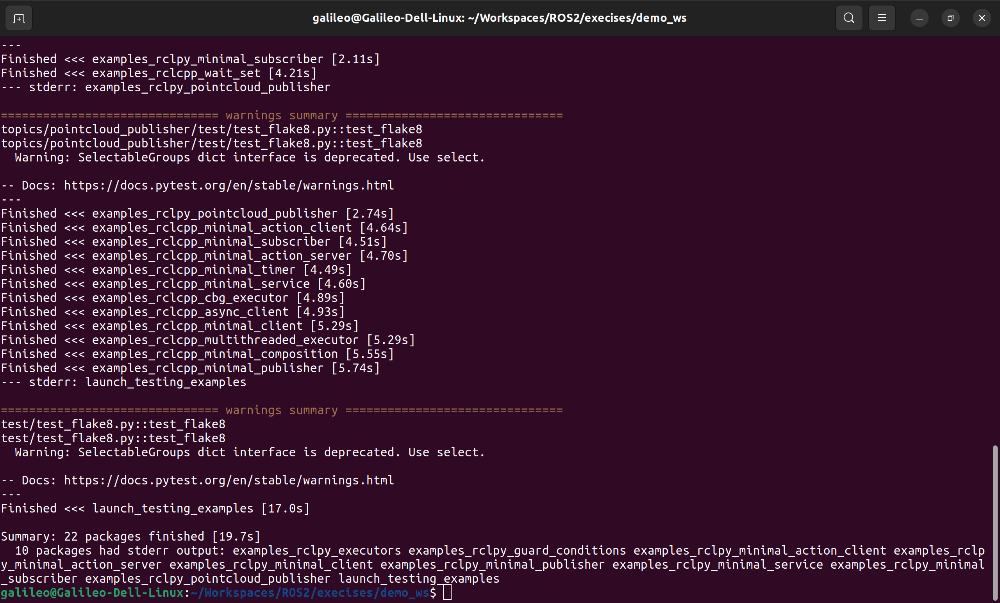
<p style="text-align:center; color:orange">图1：colcon test结果示例图</p>

如果要避免在CMAKE软件包中配置和建造测试，则可以通过：-CMAKE -ARGS -DBUILD_TESTING = 0。

如果你想运行特定的测试，可以使用如下命令：
```bash
colcon test --packages-select <package_name> --ctest-args -R <YOUR_TEST_IN_PKG>
```

#### 2.1.8 setup/设置
在进一步测试之前，需要source一下生成的setup脚本，才能为新生成的package执行包创建包含必须依赖的工作空间。做法和之前创建underlay的工作空间一样。因为ubuntu的terminal是bash,以后就不强调这一点。如果你的是其它的terminal,你还可以选择使用ps1,sh,zsh等。

```bash
source install/setup.bash
```

#### 2.1.9 try/尝试
现在我们来尝试一下example里面的demo.入门教程里面演示的是examples_rclcpp_minimal_subscriber和examples_rclcpp_minimal_publisher这一组examples.打开两个终端窗口，一个担任subscriber一个担任publisher.
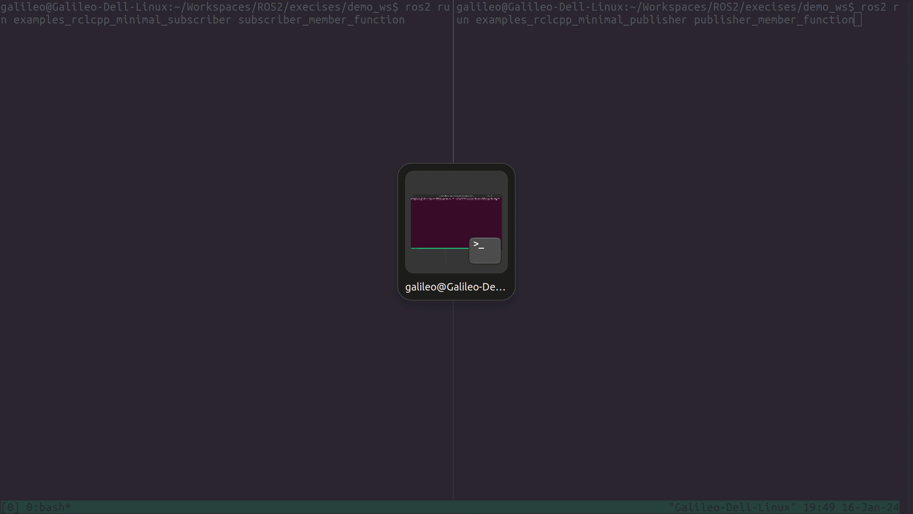
<p style="text-align:center; color:orange">图2：rclcpp minimal demo</p>

#### 2.1.10 create an package/新包
colcon每个包都有一个`package.xml`文件，此文件定义了作者、版本、依赖等信息。我们不妨打开一个examples_rclcpp_minimal_publisher的package.xml文件，并使用[xmltool](https://github.com/cmiles74/xmltool/)工具解析一下它的构成。
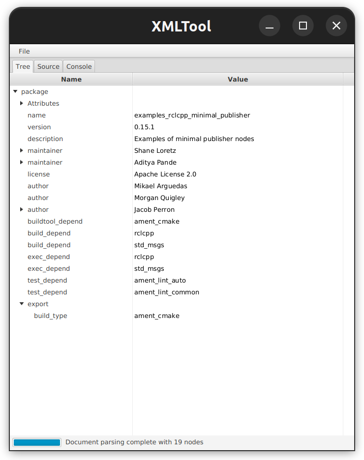
<p style="text-align:center; color:orange">图3：package.xml解析结果</p>

上图很清晰的展示了xml的主要节点。我们可以看到此包的build、execute和test都依赖rclcpp和std_msgs。也可以看到编译类型是`ament_cmake`。

colcon支持多种构建类型。推荐的类型是ament_cmake和ament_python。也支持纯cmake包。
ament_cmake是C/c++的构建类型。ament_python则是python的构建类型。

我们可以使用`ros2 pkg create`去创建基于模板的新包。现在来尝试一下：
```bash
$ cd src/examples/rclcpp

$ ros2 pkg create --build-type ament_cmake --dependencies rclcpp std_msgs --description "It is an demo package"  --license MIT  demo_pkg
going to create a new package
package name: demo_pkg
destination directory: /home/galileo/Workspaces/ROS2/execises/demo_ws/src/examples/rclcpp
package format: 3
version: 0.0.0
description: It is an demo package
maintainer: ['galileo <zjh.2008.09@gmail.com>']
licenses: ['MIT']
build type: ament_cmake
dependencies: ['rclcpp', 'std_msgs']
creating folder ./demo_pkg
creating ./demo_pkg/package.xml
creating source and include folder
creating folder ./demo_pkg/src
creating folder ./demo_pkg/include/demo_pkg
creating ./demo_pkg/CMakeLists.txt

$ tree demo_pkg/
demo_pkg/
├── CMakeLists.txt
├── include
│   └── demo_pkg
├── LICENSE
├── package.xml
└── src

3 directories, 3 files

```
这样我们就新建了一个包，只是里面暂时没有代码。关于`ros2 pkg create`的详细用法，你可以使用`ros2 pkg create -h`去仔细查看。请尽量选择设置一个license,否则里面可能会产生警告提示。

#### 2.1.11 colcon_cd
ROS2还提供一个快速跳转的工具，但是默认是没有生效的。所以需要提前设置一下：
```bash
echo "source /usr/share/colcon_cd/function/colcon_cd.sh" >> ~/.bashrc
echo "export _colcon_cd_root=/opt/ros/humble/" >> ~/.bashrc

## 如果有必要可以查看一下添加是否成功
cat ~/.bashrc | grep colcon_cd

```
为了让新添加的生效，我们可以重新打开一下shell.我们可以检验一下是否成功。
```bash
$ colcon_cd rclcpp
$ pwd
/opt/ros/humble/share/rclcpp
$ colcon_cd std_msgs
$ pwd
/opt/ros/humble/share/std_msgs
$ colcon_cd examples_rclcpp_minimal_publisher
$ pwd
/opt/ros/humble/share/examples_rclcpp_minimal_publisher
```
可以看出这个工具确实挺方便的，但是前提是你需要知道包的正确名称。另外如果没有source过的包，这个工具也无法跳转。比如，我们尝试寻找刚才的`demo_pkg`：
```bash
$ colcon_cd demo_pkg
Could neither find package 'demo_pkg' from '/opt/ros/humble/' nor from the current working directory
```
#### 2.1.12 colcon命令自动补全
colcon支持命令自动补全，但是默认是没有开启的。如果需要开启，需要在bashrc中添加一行：
```bash
echo "source /usr/share/colcon_argcomplete/hook/colcon-argcomplete.bash" >> ~/.bashrc
## 如果有必要可以查看一下添加是否成功
cat ~/.bashrc | grep argcomplete
```
然后重新打开shell，就可以使用命令自动补全了。


### 2.2 Workspace/工作区
本小节内容主要参考[creating a workspace tutorial](https://docs.ros.org/en/humble/Tutorials/Beginner-Client-Libraries/Creating-A-Workspace/Creating-A-Workspace.html)和[A universal build tool](https://design.ros2.org/articles/build_tool.html)。

我们在上一小节介绍了underlay和overlay的概念。工作区（Workspace）就是一个包含ROS包的目录。我们每次在启动ROS2的时候都要Source一下(如果你将source的代码放在.bashrc中，则不需要每次都手动source)，这个过程实际就是在配置必要软件包的工作区。

#### 2.2.1 Creating a workspace/创建工作区
按照官方教程创建名字工作区。这部分的概念和步骤和上一小节一致。不再赘述。这一节的不同点在于我们创建的工作区名称叫做demo2_ws.(原文叫做ros2_ws,我这里改为demo2_ws是为了和上一小节做区分。)
另外这一节的样例代码变成了[ros tutories](https://github.com/ros2/ros2_tutorials)。首先用cd指令跳转到你的目标目录。然后执行以下命令：

```bash
mkdir -p demo2_ws/src
cd demo2_ws/src
git clone https://github.com/ros/ros_tutorials.git -b humble
```
如果成功clone,我们照例使用tree命令查看一下：
```bash
$ tree -L 2
.
└── ros_tutorials
    ├── roscpp_tutorials
    ├── rospy_tutorials
    ├── ros_tutorials
    └── turtlesim
```
#### 2.2.2 Resolve dependencies/依赖关系
这一节主要关注ROS2包的依赖关系。在我们编写好代码或者copy示例程序之后，在编译之前，我们最好先解决依赖关系。不然当你花费和很久时间才发现缺少必要的依赖项，这将非常的不划算。

我们可以用rosdep命令来解决依赖关系。当然我们首先要回到我们的工作区目录，然后使用rosdep来执行依赖检查。如下：
```bash
## 因为我们刚才在src目录，现在需要回到工作区根目录
$ cd ../
$ rosdep install -i --from-path src --rosdistro humble -y
#All required rosdeps installed successfully
```
上面的命令稍微有些复杂，我们可以先学习一下`rosdep`命令和`rosdep install`。如下：
```bash
$ rosdep 
Usage: rosdep [options] <command> <args>

Commands:

rosdep check <stacks-and-packages>...
  check if the dependencies of package(s) have been met.
## rosdep check检查依赖项是否都满足，我的理解是应该使用这个命令检查依赖关系。

rosdep install <stacks-and-packages>...
  download and install the dependencies of a given package or packages.
## rosdep install应该是用来下载依赖项。但是入门教程使用这个去检查并自动下载依赖。

rosdep db
  generate the dependency database and print it to the console.
## rosdep db命令生成依赖数据库，并打印到控制台。

rosdep init
  initialize rosdep sources in /etc/ros/rosdep.  May require sudo.
## rosdep init命令初始化rosdep源。可能需要以root权限运行。

rosdep keys <stacks-and-packages>...
  list the rosdep keys that the packages depend on.

rosdep resolve <rosdeps>
  resolve <rosdeps> to system dependencies

rosdep update
  update the local rosdep database based on the rosdep sources.

rosdep what-needs <rosdeps>...
  print a list of packages that declare a rosdep on (at least
  one of) <rosdeps>

rosdep where-defined <rosdeps>...
  print a list of yaml files that declare a rosdep on (at least
  one of) <rosdeps>

rosdep fix-permissions
  Recursively change the permissions of the user's ros home directory.
  May require sudo.  Can be useful to fix permissions after calling
  "rosdep update" with sudo accidentally.


rosdep: error: Please enter a command
```

我按照自己的理解尝试使用`rosdep check`来检查，也成功了：
```bash
$ rosdep check --from-paths src --rosdistro humble
All system dependencies have been satisfied
```

要想查看`rosdep check`和`rosdep install`的详细信息，可以使用`-h`选项。因为命令较多，就不一一解释。这里只关注这次使用的这几个选项的含义：
```bash
$ rosdep install -h
## 只摘录部分内容
--os=OS_NAME:OS_VERSION
                        Override OS name and version (colon-separated), e.g.
                        ubuntu:lucid
-c SOURCES_CACHE_DIR, --sources-cache-dir=SOURCES_CACHE_DIR
                    Override /home/galileo/.ros/rosdep/sources.cache
-y, --default-yes     Tell the package manager to default to y or fail when
-i, --ignore-packages-from-source, --ignore-src
                        Affects the 'check', 'install', and 'keys' verbs. If
                        specified then rosdep will ignore keys that are found
                        to be catkin or ament packages anywhere in the
                        ROS_PACKAGE_PATH, AMENT_PREFIX_PATH or in any of the
                        directories given by the --from-paths option.

--from-paths          Affects the 'check', 'keys', and 'install' verbs. If
                    specified the arguments to those verbs will be
                    considered paths to be searched, acting on all catkin
                    packages found there in.
--rosdistro=ROS_DISTRO
                        Explicitly sets the ROS distro to use, overriding the
                        normal method of detecting the ROS distro using the
                        ROS_DISTRO environment variable. When used with the
                        'update' verb, only the specified distro will be
                        updated.
```
`-i`选项将会忽略在 ROS_PACKAGE_PATH、AMENT_PREFIX_PATH 或 --from-paths 选项指定的任何目录中的任意位置发现的 catkin 或 ament 包的键。

`--from-paths`用来搜索这个路径下所有的catkin软件包。

`--rosdistro`用来制定ROS的版本，比如我们用的humble.

`-y`告诉软件管理器默认为yes.

入门教程和介绍了从source或者fat archive的安装。参数更加复杂。这里不再赘述。（因为我也没有尝试）

总之如果依赖全部already,会提示`#All required rosdeps installed successfully`。

包是通过`package.xml`文件来声明依赖项的。后面会详细介绍。在2.1.10其实也简单提到过。所以清晰的文档结构也帮助rosdep来快速的检查依赖关系。

#### 2.2.3 编译
这一章和2.1中的步骤没有什么特殊。不再赘述：
```bash
$ colcon build
## 省略输出内容
Summary: 1 package finished [14.8s]

$ tree -L 2
.
├── build
│   ├── COLCON_IGNORE
│   └── turtlesim
├── install
│   ├── COLCON_IGNORE
│   ├── local_setup.bash
│   ├── local_setup.ps1
│   ├── local_setup.sh
│   ├── _local_setup_util_ps1.py
│   ├── _local_setup_util_sh.py
│   ├── local_setup.zsh
│   ├── setup.bash
│   ├── setup.ps1
│   ├── setup.sh
│   ├── setup.zsh
│   └── turtlesim
├── log
│   ├── build_2024-01-19_20-14-45
│   ├── COLCON_IGNORE
│   ├── latest -> latest_build
│   └── latest_build -> build_2024-01-19_20-14-45
└── src
    └── ros_tutorials

10 directories, 13 files
```
有意思的是如果你观察src/ros_tutorials目录，里面有好几个文件夹。但是最终生成的只有一个package.而上一章其实生成了好几个packages.这一点可以留个疑问。

入门教程还对几个参数做了解释：
* --packages-up-to（构建你想要的软件包及其所有依赖包），但不构建整个工作区（节省时间
* --symlink-install让你在每次修改 python 脚本时都不必重新构建。
* --event-handlers console_direct+ 在构建时显示控制台输出（也可以在日志目录中找到）。

#### 2.2.4 运行测试
要运行测试，老样子还是要source一下underlay和新建的包（overlay）。如下：
```bash
## 教程又提了一遍，但是如果你已经将这个命令写入到.bashrc就没必要重复
source /opt/ros/humble/setup.bash

## 进入demo2_ws工作区，否则不能完成。我这里已经ready.就不再执行。
## 这里使用的是local_setup，为什么没用setup。下文有介绍
source install/local_setup.bash
```
这里需要说明一下`local_setup`和`setup`的区别：
* `local_setup`是ROS2的本地设置，即只设置`overlay`的工作环境。因为我们之前source了`/opt/ros/humble/setup.bash`相当于手动source了`underlay`
* `setup`不仅会设置`overlay`的工作环境还会设置`underlay`的工作环境。所以也可以只用一步`setup`让两个工作区都ready.
测试命令之前也用过：
```bash
ros2 run turtlesim turtlesim_node
```
但是我们怎么知道这个是overlay的，而不是underlay的呢？因为即便我们没有使用`local_setup`也可以运行.

#### 2.2.5 修改测试
为了验证确实是我们的overlay运行了，最简单的办法是修改一下窗口的标题或者窗口的大小等信息。
我这里使用vscode去打开整个工作区。src/ros_tutorials下面有4个目录。经过分析之后感觉目标目录应该就是“turtlesim/src”下面的文件。
入门教程里面提到要修改ros_tutorials/turtlesim/src/turtle_frame.cpp和我的查找是一致的。我们就开始修改吧：
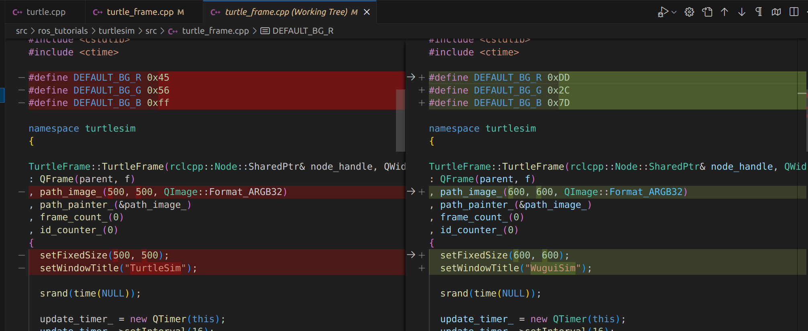
<p style="text-align:center; color:orange">图4：代码修改</p>

可以看到代码只要做了三个大的修改：
1. 修改了背景颜色（DEFAULT_BG_R,DEFAULT_BG_G,DEFAULT_BG_B三个地方）
2. 窗口尺寸由(500, 500)改为了(600, 600)
3. 标题由"TurtleSim"改为了"WuguiSim"

修改完成之后：根据步骤前面已经介绍的方法，完成编译。然后我们来设法做一个对比。一个启用了overlay(即使用`source install/local_setup.bash`),另一个不用。效果演示如下：
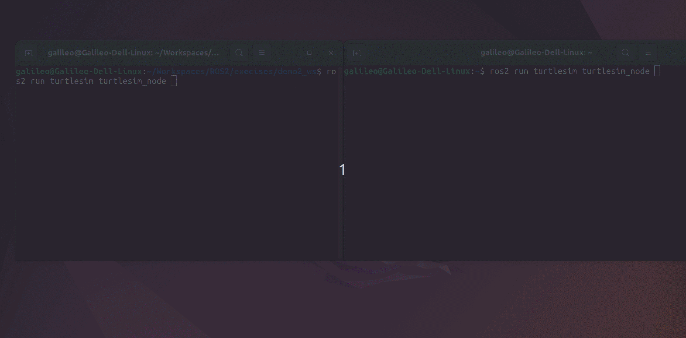
<p style="text-align:center; color:orange">图5：两个不同的turtlesim界面</p>

* 第一个窗口背景为艳粉色的是Overlay,可以看到窗口的title也更改为了"WuguiSim"，窗口也比第二个大了很多。（我屏幕分辨率比较高，所以窗口显示的可能比你电脑上的小一些。）
* 第二个窗口和我们之前测试的一样。窗口明显比第一个小了一圈。标题还是TurtleSim。

所以我们可以认为Overlay层是先被寻找的。类似与C语言的局部变量。当在Overlay里面找不到我们需要的package的时候才会去修找underlay层的包。如果启用了我们修改过的Overlay,因为turtlesim已经在这里寻找到了。所以就会出现我们做出修改的窗口。

### 2.3 ROS2 Package和它的创建
奇怪的是，我其实在笔记1中也没有自己提过Package是什么。官方其实也没有将。我们其实之前用`ROS2 pack`这个命令对包进行过一番操作。因为software package默认是一个大家都熟知的概念。但是其实我自己并不能给它一个很好的解释。我们不妨来看看官方怎么解释的吧：
```txt
A package is an organizational unit for your ROS 2 code. If you want to be able to install your code or share it with others, then you’ll need it organized in a package. With packages, you can release your ROS 2 work and allow others to build and use it easily.

（对于ROS2来说）一个软件包（Package，简称软件包）是ROS2的代码管理单元。如果你想要安装你的的代码，或者将它们分享给其他人，你需要将它们组织成一个包的形式。通过包，您可以发布您的ROS2作品并允许其他人轻松构建和使用它。
```
这个概念其实很清晰。首先它是软件代码的组织形式，通过软件包这种形式会将代码中的所有文件见按照某种形式组织/捆绑在一起。第二，你发布给别人的时候，也是将你的代码当作一个整体（package）发布出去。别人获取时也是b把这个包的整体获取过来。否则软件将事实不完整的。

ROS2中的包创建使用ament作为其构建系统，并使用colcon作为其构建工具。您可以使用官方支持的CMake或Python创建包，但也存在其他构建类型。

#### 2.3.1 ament
(注：这部分主要参考[about build system](https://docs.ros.org/en/foxy/Concepts/About-Build-System.html)这一篇的内容。)

ament是ROS2的构建系统。它是ROS2的核心组件之一。ament的主要目的是帮助ROS2项目开发者快速、可靠的构建ROS2软件。我们不妨看一下[官方是如何解释ament]()的:
```txt
Under everything is the build system. Iterating on catkin from ROS 1, we have created a set of packages under the moniker ament. Some of the reasons for changing the name to ament are that we wanted it to not collide with catkin (in case we want to mix them at some point) and to prevent confusion with existing catkin documentation. ament’s primary responsibility is to make it easier to develop and maintain ROS 2 core packages. However, this responsibility extends to any user who is willing to make use of our build system conventions and tools. Additionally it should make packages conventional, such that developers should be able to pick up any ament based package and make some assumptions about how it works, how to introspect it, and how to build or use it.

一切之下都是构建系统。 在 ROS 1 的 catkin 上进行迭代，我们创建了一组名为 ament 的包。 将名称更改为 ament 的一些原因是我们希望它不与 catkin 冲突（以防我们想在某个时候将它们混合）并防止与现有的 catkin 文档混淆。 ament 的主要职责是让 ROS 2 核心包的开发和维护变得更加容易。 然而，这一责任延伸到任何愿意使用我们的构建系统约定和工具的用户。 此外，它应该使包变得常规，这样开发人员应该能够选择任何基于 ament 的包，并对其如何工作、如何内省以及如何构建或使用它做出一些假设。

```

ament是一个不断发展的构建系统，目前主要由ament_package，ament_cmake, ament_lint和build tools组成。它们被托管在[ament的github仓库](https://github.com/ament)中。关于这几个仓库具体包含什么内容这里就不再赘述。下面只描述与之相关的一些概念。

* ament packages :任何包含package.xml并遵循ament打包准则的包，无论底层构建系统如何。package.xml“清单”文件包含处理和操作包所需的信息。此包信息包括全局唯一的包名称以及包的依赖项等内容。package.xml文件还充当标记文件，指示包在文件系统上的位置。package.xml文件的解析由`catkin_pkg`提供（如 ROS 1 中所示），而通过在文件系统中搜索这些package.xml文件来定位包的功能由构建工具（例如 colcon）提供。

* ament cmake pacakge :使用CMake构建的ament包,它遵循ament的打包准则。这种类型的包由 package.xml 文件的`<export>`标记中的 `<build_type>ament_cmake</build_type>` 标记标识。

* ament Python package :遵循ament打包指南的Python包。

* setuptools : 它是python常用的一个打包和分发工具。它也是ament中python package的打包工具。

* package.xml :包的清单文件（manifest file）。标记包的根并包含有关包的元信息，包括其名称、版本、描述、维护者、许可证、依赖项等。 清单的内容采用机器可读的XML格式，并且内容在REP 127和140中描述，并且有可能在未来的REP中进一步修改。

#### 2.3.2 Package的结构
我们首先来了解一下ament包的组成。对于cmake的包它包含这样几个关键文件/文件夹：
* __CMakeLists.txt__ 描述如何在包中构建代码
* __include/<package_name>__ 包含包的公共标头的目录
* __package.xml__ 文件包含了包的元信息
* __src__ 目录包含包的源代码

其实最简单的是我们去查看一下我们之前2.1中的包的结构：
```bash
$ tree -L 3 wait_set/
wait_set/
├── CHANGELOG.rst
├── CMakeLists.txt
├── include
│   └── wait_set
│       ├── listener.hpp
│       ├── random_listener.hpp
│       ├── random_talker.hpp
│       ├── talker.hpp
│       └── visibility.h
├── package.xml
├── README.md
└── src
    ├── executor_random_order.cpp
    ├── listener.cpp
    ├── static_wait_set.cpp
    ├── talker.cpp
    ├── thread_safe_wait_set.cpp
    ├── wait_set_composed.cpp
    ├── wait_set.cpp
    ├── wait_set_random_order.cpp
    ├── wait_set_topics_and_timer.cpp
    └── wait_set_topics_with_different_rates.cpp

3 directories, 19 files
```
可以看出这个package包含了上面提到的四个部分。当然还有一些其它几个ament包不需要的文件：`CHANGELOG.rst`和`README.md`等。


我们再来看看python的包组成：
* __package.xml__ 文件包含有关包的元信息
* __resource/<package_name>__ 是包的标记文件
* __setup.cfg__ 当包有可执行文件时需要setup.cfg，因此ros2 run可以找到它们
* __setup.py__ 包含如何安装包的说明
* __<package_name>__ 与您的包同名的目录，ROS2工具使用它来查找您的包，包含`__init__.py`

其实最简单的是我们去查看一下我们之前2.1中的包的结构：
```bash
$ tree -L 3 minimal_publisher/
minimal_publisher/
├── CHANGELOG.rst
├── examples_rclpy_minimal_publisher
│   ├── __init__.py
│   ├── publisher_local_function.py
│   ├── publisher_member_function.py
│   ├── publisher_old_school.py
│   └── __pycache__
│       └── __init__.cpython-310.pyc
├── package.xml
├── README.md
├── resource
│   └── examples_rclpy_minimal_publisher
├── setup.cfg
├── setup.py
└── test
    ├── __pycache__
    │   ├── test_copyright.cpython-310-pytest-6.2.5.pyc
    │   ├── test_flake8.cpython-310-pytest-6.2.5.pyc
    │   └── test_pep257.cpython-310-pytest-6.2.5.pyc
    ├── test_copyright.py
    ├── test_flake8.py
    └── test_pep257.py

5 directories, 17 files
```
可以看出这个package包含了上面提到的五个部分。当然还有一些其它几个ament包不需要的文件：`CHANGELOG.rst`和`README.md`等。

比较Cmake和Python的ament包相似之处是都包含了package.xml文件。在Cmake中的include文件夹了里面包含了一个和包名相同的子文件，而Python的resource中也有一个和包名相同的标记文件。两个package.xml文件的build_type标签也不相同。分标包含了`ament_cmake`标签和`ament_python`标签。

然而比较让我觉得不理解的是下面这种结构。一个是rclcpp/topics/minimal_publisher/,它的结构如下：
```
$ tree minimal_publisher/
minimal_publisher/
├── CHANGELOG.rst
├── CMakeLists.txt
├── lambda.cpp
├── member_function.cpp
├── member_function_with_type_adapter.cpp
├── member_function_with_unique_network_flow_endpoints.cpp
├── member_function_with_wait_for_all_acked.cpp
├── not_composable.cpp
├── package.xml
└── README.md

0 directories, 10 files
```
可以看到这个包根本没有include文件夹。和cmake ament的要求的包结构不一样。但应该也是合理的。后面再继续关注这个情况。

另外需要注意的是一个workspace可以包含一个或者多个package,这些package可以是python package或者cmake package.甚至其它受支持的构建系统。比如cargo ament（编译rust包）。但是需要注意它们不能相互嵌套。（一个包里面包含另一个包的情况是不允许的。它们应该都有独立的包结构。）下面是入门教程示例的一个简单的文件结构：
```txt
workspace_folder/
    src/
      cpp_package_1/
          CMakeLists.txt
          include/cpp_package_1/
          package.xml
          src/

      py_package_1/
          package.xml
          resource/py_package_1
          setup.cfg
          setup.py
          py_package_1/
      ...
      cpp_package_n/
          CMakeLists.txt
          include/cpp_package_n/
          package.xml
          src/
```
我们在2.1和2.2小节使用的目录结构都符合这种推荐的方式。

#### 2.3.3 尝试自己创建一个Package
（这一部分的操作我们在2.1.10中其实已经简单尝试过。这里再操作一次是为了更加熟练和深入。）
我们现在先回到我们在2.2小节使用的那个工作区。（就是运行turtlesim的那个工作区）
这一小节，将使用`ros2 pack create`来创建package.以下的操作假定你已经跳转到了demo2_ws工作区。现在让我们开始吧：
```bash
$ ros2 pkg create -h
usage: ros2 pkg create [-h] [--package-format {2,3}] [--description DESCRIPTION] [--license LICENSE]
                       [--destination-directory DESTINATION_DIRECTORY] [--build-type {cmake,ament_cmake,ament_python}]
                       [--dependencies DEPENDENCIES [DEPENDENCIES ...]] [--maintainer-email MAINTAINER_EMAIL]
                       [--maintainer-name MAINTAINER_NAME] [--node-name NODE_NAME] [--library-name LIBRARY_NAME]
                       package_name

Create a new ROS 2 package

positional arguments:
  package_name          The package name

options:
  -h, --help            show this help message and exit
  --package-format {2,3}, --package_format {2,3}
                        The package.xml format.
  --description DESCRIPTION
                        The description given in the package.xml
  --license LICENSE     The license attached to this package; this can be an arbitrary string, but a LICENSE file will only be generated
                        if it is one of the supported licenses (pass '?' to get a list)
  --destination-directory DESTINATION_DIRECTORY
                        Directory where to create the package directory
  --build-type {cmake,ament_cmake,ament_python}
                        The build type to process the package with
  --dependencies DEPENDENCIES [DEPENDENCIES ...]
                        list of dependencies
  --maintainer-email MAINTAINER_EMAIL
                        email address of the maintainer of this package
  --maintainer-name MAINTAINER_NAME
                        name of the maintainer of this package
  --node-name NODE_NAME
                        name of the empty executable
  --library-name LIBRARY_NAME
                        name of the empty library

```
我们先来看一下创建一个包需要的几个主要参数。
* `package_name`是必须参数。想必大家都能理解。
* `--license`是这个包支持的LICENSE，我们来查看一下：
  ```bash
  $ ros2 pkg create --license ? my_test
  Supported licenses:
  Apache-2.0
  BSL-1.0
  BSD-2.0
  BSD-2-Clause
  BSD-3-Clause
  GPL-3.0-only
  LGPL-3.0-only
  MIT
  MIT-0
  ```
  可以看出来它支持`Apache-2.0`, `BSL-1.0`, `BSD-2.0`, `BSD-2-Clause`, `BSD-3-Clause`, `GPL-3.0-only`, `LGPL-3.0-only`, `MIT`, `MIT-0`这几种LICENSE。看一查看[这里](https://opensource.org/licenses/)了解更多license.
* `--package-format {2,3}`是这个包的package.xml格式，我们可以选择`2`或`3`。具体可以查看[REP-0149](https://ros.org/reps/rep-0149.html).
* `--build-type`是这个包的构建类型，我们可以选择`cmake`,`ament_cmake`或`ament_python`来构建。
* `--dependencies`是这个包的依赖关系，可以指定多个依赖。如果是多个依赖项，依次写在后面就行。后面也可以手动修改。
* `--maintainer-email`和`--maintainer-name`是这个包的维护者信息。
* `--node-name`和`--library-name`是这个包的可执行节点和库名称。
* `--destination-directory`是这个包的生成目录，默认是当前目录。
* `--description`是这个包的描述信息。

通过上面对于它的介绍，我们应该可以创建出一个新的包。我们来试试吧：
```bash
## 入门教程提供的脚本，用来创建一个名字叫做my_package，节点名字叫做my_node的包。
$ ros2 pkg create --build-type ament_cmake --license Apache-2.0 --node-name my_node my_package
$ tree my_package/
my_package/
├── CMakeLists.txt
├── include
│   └── my_package
├── LICENSE
├── package.xml
└── src
    └── my_node.cpp

3 directories, 4 files
```
上面的文件结构和我们在上一小节的描述一致。我们现在再打开package.xml看一下：
```xml
<?xml version="1.0"?>
<?xml-model href="http://download.ros.org/schema/package_format3.xsd" schematypens="http://www.w3.org/2001/XMLSchema"?>
<package format="3">
  <name>my_package</name>
  <version>0.0.0</version>
  <description>TODO: Package description</description>
  <maintainer email="zjh.2008.09@gmail.com">galileo</maintainer>
  <license>Apache-2.0</license>

  <buildtool_depend>ament_cmake</buildtool_depend>

  <test_depend>ament_lint_auto</test_depend>
  <test_depend>ament_lint_common</test_depend>

  <export>
    <build_type>ament_cmake</build_type>
  </export>
</package>
```
可以看到默认的package-format是3.0； 版本号默认是0.0.0； 因为我们没有制定依赖项所以也看不到相关信息（只有测试依赖项）；默认的描述信息现实的是`TODO: Package description`。maintainer信息尽管我没有专门制定，但是也会默认使用我自己的名字。license是我们指定的Apache-2.0。`build_type`是ament_cmake。

现在我们依照上面的办法办法来创建一个支持ament python的package.
```bash
$ ros2 pkg create --build-type ament_python --license Apache-2.0 --node-name my_2nd_node my_2nd_package
$ tree my_2nd_package/
my_2nd_package/
├── LICENSE
├── my_2nd_package
│   ├── __init__.py
│   └── my_2nd_node.py
├── package.xml
├── resource
│   └── my_2nd_package
├── setup.cfg
├── setup.py
└── test
    ├── test_copyright.py
    ├── test_flake8.py
    └── test_pep257.py

3 directories, 10 files
```
这样我就创建了一个支持名称叫做my_2nd_package的ament python的包。目录结构和之前提到的一致。我们打开package.xml看一下：
```xml
<?xml version="1.0"?>
<?xml-model href="http://download.ros.org/schema/package_format3.xsd" schematypens="http://www.w3.org/2001/XMLSchema"?>
<package format="3">
  <name>my_2nd_package</name>
  <version>0.0.0</version>
  <description>TODO: Package description</description>
  <maintainer email="zjh.2008.09@gmail.com">galileo</maintainer>
  <license>Apache-2.0</license>

  <test_depend>ament_copyright</test_depend>
  <test_depend>ament_flake8</test_depend>
  <test_depend>ament_pep257</test_depend>
  <test_depend>python3-pytest</test_depend>

  <export>
    <build_type>ament_python</build_type>
  </export>
</package>
```
可以看到默认的package-format是3.0； 版本号默认是0.0.0； 因为我们没有指定依赖项所以也看不到相关信息（只有测试依赖项）；默认的描述信息现实的是`TODO: Package description`。maintainer信息尽管我没有专门制定，但是也会默认使用我自己的名字。license是我们指定的Apache-2.0。`build_type`是ament_python。

python包中还专门提到了__init__.py这个文件，我们不妨也看一下它的内容。结果一查看，里面默认的内容为空。

现在我们来构建刚才创建的两个包。这一次我们根据入门教程的建议，先使用build直接构建。然后修改一部分内容，单独构建某一个包。
```bash
## 构建整个工作区
$ cd ../
$ colcon build
[0.792s] WARNING:colcon.colcon_core.package_selection:Some selected packages are already built in one or more underlay workspaces:
	'turtlesim' is in: /home/galileo/Workspaces/ROS2/execises/demo2_ws/install/turtlesim, /opt/ros/humble
If a package in a merged underlay workspace is overridden and it installs headers, then all packages in the overlay must sort their include directories by workspace order. Failure to do so may result in build failures or undefined behavior at run time.
If the overridden package is used by another package in any underlay, then the overriding package in the overlay must be API and ABI compatible or undefined behavior at run time may occur.

If you understand the risks and want to override a package anyways, add the following to the command line:
	--allow-overriding turtlesim

This may be promoted to an error in a future release of colcon-override-check.
Starting >>> my_2nd_package
Starting >>> my_package
Starting >>> turtlesim
--- stderr: my_2nd_package                                                                                      
/home/galileo/.local/lib/python3.10/site-packages/setuptools/_distutils/cmd.py:66: SetuptoolsDeprecationWarning: setup.py install is deprecated.
!!

        ********************************************************************************
        Please avoid running ``setup.py`` directly.
        Instead, use pypa/build, pypa/installer or other
        standards-based tools.

        See https://blog.ganssle.io/articles/2021/10/setup-py-deprecated.html for details.
        ********************************************************************************

!!
  self.initialize_options()
---
Finished <<< my_2nd_package [0.94s]
Finished <<< my_package [1.15s]                                                           
Finished <<< turtlesim [8.34s]                     

Summary: 3 packages finished [9.05s]
  1 package had stderr output: my_2nd_package
```
我们不妨来分别运行两个包，看一下结果。
```bash
$ source install/local_setup.bash
$ ros2 pkg list| grep my
dummy_map_server
dummy_robot_bringup
dummy_sensors
my_2nd_package
my_package
## 运行my_package
$ ros2 run my_package my_node
hello world my_package package
## 运行my_2nd_package
$ ros2 run my_2nd_package my_2nd_node
Hi from my_2nd_package.
```
现在我们修改一下的my_package输出内容。我们在my_node.cpp原来printf函数下面添加一行`printf("Hallo! Wie geht's?\n");`。然后重新编译：
```bash
## 构建单个包
$ colcon build --packages-select my_package
Starting >>> my_package
Finished <<< my_package [0.49s]                     

Summary: 1 package finished [1.11s]
$ ros2 run my_package my_node
hello world my_package package
Hallo! Wie geht's?
```
这样我们就完成了编译。（因为我们已经source过一次overlay,这一次其实修改没有涉及到依赖项的添加，所以没有再重新source.）

现在我们再修改一下my_2nd_package的输出内容。我们在my_2nd_node.py原来print函数下面添加一行`print(‘Wie ist das wetter?’)`。因为是python,请注意换行的格式。然后重新编译和测试：
```bash
## 构建单个包
$ colcon build --packages-select my_2nd_package 
Starting >>> my_2nd_package
--- stderr: my_2nd_package                   
/home/galileo/.local/lib/python3.10/site-packages/setuptools/_distutils/cmd.py:66: SetuptoolsDeprecationWarning: setup.py install is deprecated.
!!

        ********************************************************************************
        Please avoid running ``setup.py`` directly.
        Instead, use pypa/build, pypa/installer or other
        standards-based tools.

        See https://blog.ganssle.io/articles/2021/10/setup-py-deprecated.html for details.
        ********************************************************************************

!!
  self.initialize_options()
---
Finished <<< my_2nd_package [0.80s]

Summary: 1 package finished [1.43s]
  1 package had stderr output: my_2nd_package

$ ros2 run my_2nd_package my_2nd_node
Hi from my_2nd_package.
Wie ist das wetter?
```

#### 2.3.4 修改package.xml
刚才提到过package.xml文件可以被修改，我们现在讲描述信息修改掉吧。

唯一需要说明的是，ament_python的setup.py中也包含package.xml文件的信息，所以我们需要两处同步修改。

现在你可以使用`$ ros2 pkg xml {package_name}`去查看这个包的package.xml内容了。

### 2.4 尝试编写ament_cmake包
本小节参照入门教程[Writing a simple publisher and subscriber (C++)](https://docs.ros.org/en/humble/Tutorials/Beginner-Client-Libraries/Writing-A-Simple-Cpp-Publisher-And-Subscriber.html)的内容。

这一小节，包的创建和编译还是参照2.2和2.3小节的内容进行。主要是通过编程来深化node（节点）和topic（话题）的概念。其实程序功能比较简单，一个节点发布内容到一个Topic上，另一个订阅内容这个Topic。

这一次我们新建一个工作区，名字叫做demo3_ws. 然后创建一个名字叫做cpp_pubsub的package。
```bash
$ mkdir -p demo3_ws/src
$ cd demo3_ws/src
$ ros2 pkg create --build-type ament_cmake --license Apache-2.0 --destination-directory ./src --description "A simple publisher and subscriber node in C++" cpp_pubsub
$ ls src/cpp_pubsub/
CMakeLists.txt  include  LICENSE  package.xml  src
```
至此，我们已经创建了一个名字叫做cpp_pubsub的包。我们这次将从[这里](https://raw.githubusercontent.com/ros2/examples/humble/rclcpp/topics/minimal_publisher/member_function.cpp)下载一个源文件放到src目录下。可以使用wget或者直接从浏览器现在，然后手动放入也可以。我选择前者：
```bash
$ wget -O src/cpp_pubsub/src/publisher_member_function.cpp https://raw.githubusercontent.com/ros2/examples/humble/rclcpp/topics/minimal_publisher/member_function.cpp
## 省略回应内容 ...
## 下载完成之后，检查一下
$ ls src/cpp_pubsub/src/
publisher_member_function.cpp
## 然后使用你最喜欢的工具查看和修改文档，我使用vscode
$ code src/cpp_pubsub/
```
#### 2.4.1 学习这段示例代码
开头有几个c++11引入的头文件：
```c++
/*This header is part of the date and time library.*/
#include <chrono>
/*This header is part of the function objects library and provides the standard hash function.*/
#include <functional>
/*This header is part of the dynamic memory management library.*/
#include <memory>
#include <string>
```
关于chrono的描述可以看这里[chrono](https://en.cppreference.com/w/cpp/header/chrono);关于functional的描述可以看这里[functional](https://en.cppreference.com/w/cpp/header/functional);关于memory的描述可以看这里[memory](https://en.cppreference.com/w/cpp/header/memory)。


接下来有几个与ros相关的library中的头文件：
```c++
/*`rclcpp` provides the canonical C++ API for interacting with ROS.*/
/*It consists of these main components：Node，Publisher，Subscriber，Servic Client，Servic Server，Timer，Parameter，Rate， Executors， CallbackGroups ... and many more*/
#include "rclcpp/rclcpp.hpp"

#include "std_msgs/msg/string.hpp"
```
如果有必要，可以手动打开查看。请记住这一步我们使用了rclcpp和std_msgs这两个ROS的包。所以后面需要在依赖项中有所体现。

再来看一下主函数：
```c++
int main(int argc, char * argv[])
{
  rclcpp::init(argc, argv);
  rclcpp::spin(std::make_shared<MinimalPublisher>());
  rclcpp::shutdown();
  return 0;
}
```
可以大体理解先初始化，然后循环执行MinimalPublisher这个类的构造函数，最后关闭。所以再来看一下MinimalPublisher这个类。

```c++
class MinimalPublisher : public rclcpp::Node
{
public:
  MinimalPublisher()
  : Node("minimal_publisher"), count_(0)
  {
    publisher_ = this->create_publisher<std_msgs::msg::String>("topic", 10);
    timer_ = this->create_wall_timer(
      500ms, std::bind(&MinimalPublisher::timer_callback, this));
  }

private:
  void timer_callback()
  {
    auto message = std_msgs::msg::String();
    message.data = "Hello, world! " + std::to_string(count_++);
    RCLCPP_INFO(this->get_logger(), "Publishing: '%s'", message.data.c_str());
    publisher_->publish(message);
  }
  rclcpp::TimerBase::SharedPtr timer_;
  rclcpp::Publisher<std_msgs::msg::String>::SharedPtr publisher_;
  size_t count_;
};
```
这个函数就比较复杂了。看起来我们还是需要先来理解一些基本知识。

#### 2.4.2 rclcpp和std_msgs学习

* static_assert: 
* std::bind:
* RCLCPP_INFO: 
* rclcpp::init:
* rclcpp::spin
* rclcpp::shutdown
* rclcpp::Node
* rclcpp::create_publisher
* rclcpp::create_wall_timer

这部分函数的功能比较简单，但是用到的函数还是比较复杂的。

#### 2.4.3 配置依赖项
前面提到了我们用到了rclcpp和std_msgs这两个包，所以我们需要在package.xml中添加依赖项。添加内容：
```txt
<depend>rclcpp</depend>
<depend>std_msgs</depend>
```
CMakelists.txt文件内容也要修改，在适当位置添加：
```txt
find_package(rclcpp REQUIRED)
find_package(std_msgs REQUIRED)
```
此外还需要添加一个默认的C++版本：
```bash
# Default to C++14
if(NOT CMAKE_CXX_STANDARD)
  set(CMAKE_CXX_STANDARD 14)
endif()
```
做完这些内容，我们构建一下：
```bash
## 检查一下依赖
$ rosdep check --from-paths src --ignore-src --rosdistro humble -y
All system dependencies have been satisfied

## 我们也可以用另一条指令
$ rosdep install -i --from-paths src --ignore-src --rosdistro humble -y
#All required rosdeps installed successfully
$ colcon build
Starting >>> cpp_pubsub
Finished <<< cpp_pubsub [3.95s]                     

Summary: 1 package finished [4.55s]
```
#### 2.4.3 在这个package中间添加一个subscriber节点
照例从[这里](https://raw.githubusercontent.com/ros2/examples/humble/rclcpp/topics/minimal_subscriber/member_function.cpp)下载文件。
```bash
$ wget -O src/cpp_pubsub/src/subscriber_member_function.cpp https://raw.githubusercontent.com/ros2/examples/humble/rclcpp/topics/minimal_subscriber/member_function.cpp
$ ls src/cpp_pubsub/src/
publisher_member_function.cpp  subscriber_member_function.cpp
```
同样的办法我们查看一下代码。具体这里就不再描述。因为这个源文件同样使用rclcpp和std_msgs这两个包。所以不必要再修改package.xml。但是需要向CMakeLists.txt中添加一个新的target。
新增：
```txt
add_executable(listener src/subscriber_member_function.cpp)
ament_target_dependencies(listener rclcpp std_msgs)
```
修改：
```txt
install(TARGETS
  talker 
  listener
  DESTINATION lib/${PROJECT_NAME})
```
OK,现在我们再来构建一次：
```bash
做完这些内容，我们构建一下：
```bash
## 检查一下依赖
$ rosdep check --from-paths src --ignore-src --rosdistro humble -y
All system dependencies have been satisfied

## 我们也可以用另一条指令
$ rosdep install -i --from-paths src --ignore-src --rosdistro humble -y
#All required rosdeps installed successfully
$ colcon build
Starting >>> cpp_pubsub
Finished <<< cpp_pubsub [4.87s]                     

Summary: 1 package finished [5.53s]
```
这一次可以不用检查依赖项。不过多做一步问题不大。

现在再来source一下overlay,然后测试：
```bash
$ source install/setup.bash
$ ros2 pkg list | grep cpp_pubsub
cpp_pubsub
## 检查一下可执行程序
$ ros2 pkg executables cpp_pubsub
cpp_pubsub listener
cpp_pubsub talker
## 运行listener
$ ros2 run cpp_pubsub listener
``````
同样的方法在另一个终端运行talker：
```bash
$ source install/setup.bash
$ ros2 run cpp_pubsub talker
```
可以看到listener订阅到了talker发布的消息。

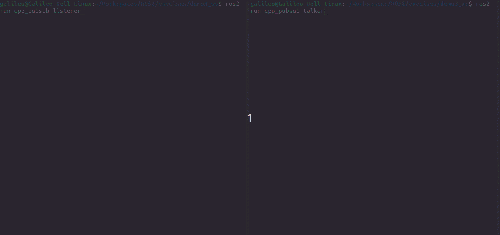
<p style="text-align:center; color:orange">图6：cpp_pubsub的测试图</p>

需要说明的使用`ros2 pkg executables cpp_pubsub`检查到的`listener`和`talker`其实是在CMakelists.txt文件中定义的。

#### 2.4.4 总结
这一章节使用了入门教程提供的示例代码来测试两个node之间通过topic进行通讯。代码尽管不复杂，但是有很多地方需要详细了解才行。另外代码使用了modern c++。看起来后面还要更新自己的modern c++知识。

在这一节我们了解到了rclcpp中的Node::create_publisher和Node::create_subscription这两个函数。这两个函数可以用来创建发布者和订阅者。此外我们还学会使用rclcpp中的Node::create_wall_timer函数来创建定时器。


### 2.5 尝试编写ament_python包
本小节参照入门教程[Writing a simple publisher and subscriber (Python)](https://docs.ros.org/en/humble/Tutorials/Beginner-Client-Libraries/Writing-A-Simple-Py-Publisher-And-Subscriber.html)的内容。这一部分的功能和2.4节的基本一致，只是代码是用python编写的。

这一节我们新建一个工作区名称叫做demo4_ws，然后在里面创建一个名称是py_pubsub类型是ament_python的package。如下：
```
$ mkdir -p demo4_ws/src
$ cd demo4_ws
$ ros2 pkg create py_pubsub --build-type ament_python --license "Apache-2.0" --destination-directory src --description "A simple publisher and subscriber example in Python" 
$ tree src/py_pubsub/
src/py_pubsub/
├── LICENSE
├── package.xml
├── py_pubsub
│   └── __init__.py
├── resource
│   └── py_pubsub
├── setup.cfg
├── setup.py
└── test
    ├── test_copyright.py
    ├── test_flake8.py
    └── test_pep257.py

3 directories, 9 files
```
照例我们需要从示例库分别下载两份文件，一份是[publisher_member_function.py](https://raw.githubusercontent.com/ros2/examples/humble/rclpy/topics/minimal_publisher/examples_rclpy_minimal_publisher/publisher_member_function.py);另一份是[subscriber_member_function.py](https://raw.githubusercontent.com/ros2/examples/humble/rclpy/topics/minimal_subscriber/examples_rclpy_minimal_subscriber/subscriber_member_function.py)。这两个文件正如名称所表示的那样一个是publisher的代码一个是subscriber的代码。下载完成之后，我们可以使用vscode打开工程检视代码。
如下：
```bash
$ wget -O src/py_pubsub/py_pubsub/publisher_member_function.py https://raw.githubusercontent.com/ros2/examples/humble/rclpy/topics/minimal_publisher/examples_rclpy_minimal_publisher/publisher_member_function.py
$ wget -O src/py_pubsub/py_pubsub/subscriber_member_function.py https://raw.githubusercontent.com/ros2/examples/humble/rclpy/topics/minimal_subscriber/examples_rclpy_minimal_subscriber/subscriber_member_function.py
$ ls src/py_pubsub/py_pubsub/
__init__.py  publisher_member_function.py  subscriber_member_function.py
$ code src/py_pubsub/
```
我们先从publisher_member_function.py这个文件开始
开头三行
```python
import rclpy
from rclpy.node import Node

from std_msgs.msg import String
```
这两行导入了ROS2的一些基础包，其中rclpy是ROS2的python接口，Node是ROS2的节点基类。std_msgs是ROS2的标准消息类型。整个程序从main开始：
```python
def main(args=None):
    rclpy.init(args=args)

    minimal_publisher = MinimalPublisher()

    rclpy.spin(minimal_publisher)

    # Destroy the node explicitly
    # (optional - otherwise it will be done automatically
    # when the garbage collector destroys the node object)
    minimal_publisher.destroy_node()
    rclpy.shutdown()


if __name__ == '__main__':
    main()
```
main函数的逻辑基本和ament_cmake的一致。先调用rclpy.init初始化ROS2环境，然后创建了一个MinimalPublisher的实例，最后调用rclpy.spin让节点持续运行，直到节点被销毁(rclpy.shutdown)。在shutdown之前，这个函数还调用了 minimal_publisher.destroy_node()去销毁节点。这一点在前面的程序中没有看到。

MinimalPublisher类如下：
```python
class MinimalPublisher(Node):

    def __init__(self):
        super().__init__('minimal_publisher')
        self.publisher_ = self.create_publisher(String, 'topic', 10)
        timer_period = 0.5  # seconds
        self.timer = self.create_timer(timer_period, self.timer_callback)
        self.i = 0

    def timer_callback(self):
        msg = String()
        msg.data = 'Hello World: %d' % self.i
        self.publisher_.publish(msg)
        self.get_logger().info('Publishing: "%s"' % msg.data)
        self.i += 1
```
这一部分逻辑也比较简单使用。整体创建了MinimalPublisher的类，继承自rclpy.node。然后使用rclpy.node.create_timer创建一个500ms调用一次的定时器。在timer_callback函数中，创建了一个std_msgs.msg.String类型的消息，设置了要发布的信息，发布并打印日志。
这中间引用了很多rclpy和std_msgs的API。后面慢慢学习吧，不可能一蹴而就。

然后我们再来看看subscriber_member_function.py的代码。开头也是引用了rclpy和std_msgs的包。main函数的流程也一致，只是这次创建了一个名称叫做MinimalSubscriber的类，继承自rclpy.node。然后使用rclpy.node.create_subscription订阅了topic。订阅的回调函数是listener_callback。在这个函数里面使用rclpy.node.get_logger打印日志。

现在再来修改一下package.xml文件，添加依赖项。
```xml
<exec_depend>rclpy</exec_depend>
<exec_depend>std_msgs</exec_depend>
```
注意这个和ament_cmake的标签不一样。后者之前使用的是一个`depend`标签。
还记得setup.cfg和setup.py这两个文件的区别吗：
* __setup.cfg__ 当包有可执行文件时需要setup.cfg，因此ros2 run可以找到它们
* __setup.py__ 包含如何安装包的说明

现在需要修改setup.py，来添加执行点(entry point):
```python
entry_points={
        'console_scripts': [
                'talker = py_pubsub.publisher_member_function:main',
        ],
},
```
现在再来检查一下setup.cfg文件。内容应当是：
```txt
[develop]
script_dir=$base/lib/py_pubsub
[install]
install_scripts=$base/lib/py_pubsub
```

现在开始检查依赖，然后build整个package.
```bash
$ rosdep install -i --from-path src --rosdistro humble -y
#All required rosdeps installed successfully
$ colcon build
## 如果你里面有多个package,也可以
$ colcon build --packages-select py_pubsub
Starting >>> py_pubsub
--- stderr: py_pubsub                   
/home/galileo/.local/lib/python3.10/site-packages/setuptools/_distutils/cmd.py:66: SetuptoolsDeprecationWarning: setup.py install is deprecated.
!!

        ********************************************************************************
        Please avoid running ``setup.py`` directly.
        Instead, use pypa/build, pypa/installer or other
        standards-based tools.

        See https://blog.ganssle.io/articles/2021/10/setup-py-deprecated.html for details.
        ********************************************************************************

!!
  self.initialize_options()
---
Finished <<< py_pubsub [0.89s]

Summary: 1 package finished [1.51s]
  1 package had stderr output: py_pubsub
```
接着source一下overlay.并在两个终端分别运行talker和listener。
在一个终端执行：
```bash
$ source install/setup.bash
$ ros2 pkg list | grep py_pubsub
py_pubsub
$ ros2 pkg executables py_pubsub
py_pubsub listener
py_pubsub talker
$ ros2 run py_pubsub listener
```
在另一个终端执行：
在一个终端
```bash
$ source install/setup.bash
$ ros2 pkg list | grep py_pubsub
py_pubsub
$ ros2 run py_pubsub talker
```
测试效果如下：
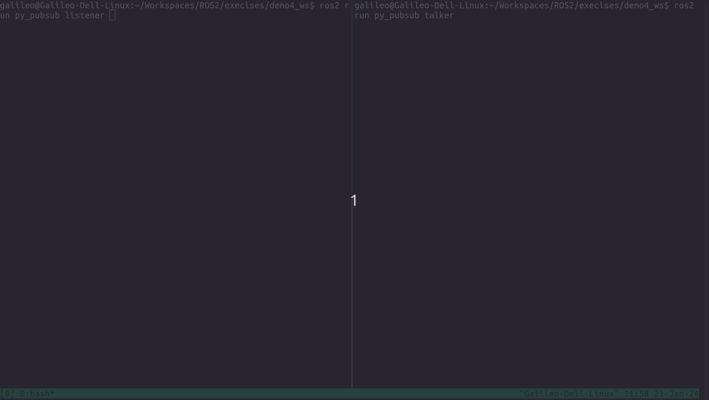
<p style="text-align:center; color:orange">图7：py_pubsub的测试图</p>

请注意这里的`talker`和`listener`的名称其实是在前面setup.py文件中定义的。

#### 2.5.2 总结
这一章节使用了入门教程提供的示例代码来测试两个node之间通过topic进行通讯。代码尽管不复杂，但是有很多地方需要详细了解才行。

在这一节我们了解到了rclpy中的Node::create_publisher和Node::create_subscription这两个函数。这两个函数可以用来创建发布者和订阅者。此外我们还学会使用rclpy中的Node::create_timer函数来创建定时器。


### 2.6 使用c++编写ROS2的server和client
本小节参照入门教程[Writing a simple service and client (C++)](https://docs.ros.org/en/humble/Tutorials/Beginner-Client-Libraries/Writing-A-Simple-Cpp-Service-And-Client.html)的内容。这一部分主要演示了ROS2的service怎么使用。在这一章你会发现请求和响应的结构由`.srv`文件决定。

这一次我们建立一个新的工作空间叫做demo5_ws：。
```bash
## 你需要先导航到你放置练习工程的目录中
$ mkdir -p demo5_ws/src
## 和前面一样我在操作时始终位于工作区根目录，这一点和官方热门不同，因此命令有一些区别
$ cd cmke_ws
$ 
```
然后我们来创建一个package，名字叫做cpp_srvcli，依赖于rclcpp和example_interfaces，构建类型还是ament_cmake,license还是“Apache-2.0”.请注意命令中名称的位置，要防止写在`--dependencies`后面。另外请注意[example_interfaces](https://github.com/ros2/example_interfaces)也是一个package,它包含构建请求和响应所需的`.srv`文件的包。你可以通过'ros2 pkg list'看到它。至于`.srv`的格式后面在专门做出说明。

如下：
```bash
$ ros2 pkg list | grep example_
example_interfaces
$ ros2 pkg create cpp_srvcli  --destination-directory src  --build-type ament_cmake --license Apache-2.0 --dependencies rc
```
#### 2.6.1 创建server程序
本次将创建一个求和(sum)服务。我们照例打开vscode编辑代码。这次我们将代码写在一个名称叫做`add_two_ints_server.cpp`的文件中。文件中代码如下：
```c++
#include "rclcpp/rclcpp.hpp"
#include "example_interfaces/srv/add_two_ints.hpp"

#include <memory>

void add(const std::shared_ptr<example_interfaces::srv::AddTwoInts::Request> request,
          std::shared_ptr<example_interfaces::srv::AddTwoInts::Response>      response)
{
  response->sum = request->a + request->b;
  RCLCPP_INFO(rclcpp::get_logger("rclcpp"), "Incoming request\na: %ld" " b: %ld",
                request->a, request->b);
  RCLCPP_INFO(rclcpp::get_logger("rclcpp"), "sending back response: [%ld]", (long int)response->sum);
}

int main(int argc, char **argv)
{
  rclcpp::init(argc, argv);

  std::shared_ptr<rclcpp::Node> node = rclcpp::Node::make_shared("add_two_ints_server");

  rclcpp::Service<example_interfaces::srv::AddTwoInts>::SharedPtr service =
    node->create_service<example_interfaces::srv::AddTwoInts>("add_two_ints", &add);

  RCLCPP_INFO(rclcpp::get_logger("rclcpp"), "Ready to add two ints.");

  rclcpp::spin(node);
  rclcpp::shutdown();
}
```
这段代码看似简单，但是本质还是挺复杂的。如果你深入example_interfaces::srv::AddTwoInts::Request和example_interfaces::srv::AddTwoInts::Response去查看，会发现AddTwoInts是一个很复杂的类型。里面用到了很多modern c的新特性。

这段代码的功能其实就是从request里面获取a和b两个变量的值然后相加，再将结果返回给response，同时在服务器这一侧使用`rclcpp::get_logger`打印必要的logger.

程序创建节点使用了`rclcpp::Node::make_shared`函数实现的：
```c++
std::shared_ptr<rclcpp::Node> node = rclcpp::Node::make_shared("add_two_ints_server");
```
为该节点创建一个名为 add_two_ints 的服务，并使用 &add 方法自动在网络上通告它:
```c++
rclcpp::Service<example_interfaces::srv::AddTwoInts>::SharedPtr service =
node->create_service<example_interfaces::srv::AddTwoInts>("add_two_ints", &add);
```
#### 2.6.2 创建client程序
这部分我们将代码写在一个名称叫做`add_two_ints_client.cpp`的文件中。文件中代码如下：
```c++
#include "rclcpp/rclcpp.hpp"
#include "example_interfaces/srv/add_two_ints.hpp"

#include <chrono>
#include <cstdlib>
#include <memory>

using namespace std::chrono_literals;

int main(int argc, char **argv)
{
  rclcpp::init(argc, argv);

  if (argc != 3) {
      RCLCPP_INFO(rclcpp::get_logger("rclcpp"), "usage: add_two_ints_client X Y");
      return 1;
  }

  std::shared_ptr<rclcpp::Node> node = rclcpp::Node::make_shared("add_two_ints_client");
  rclcpp::Client<example_interfaces::srv::AddTwoInts>::SharedPtr client =
    node->create_client<example_interfaces::srv::AddTwoInts>("add_two_ints");

  auto request = std::make_shared<example_interfaces::srv::AddTwoInts::Request>();
  request->a = atoll(argv[1]);
  request->b = atoll(argv[2]);

  while (!client->wait_for_service(1s)) {
    if (!rclcpp::ok()) {
      RCLCPP_ERROR(rclcpp::get_logger("rclcpp"), "Interrupted while waiting for the service. Exiting.");
      return 0;
    }
    RCLCPP_INFO(rclcpp::get_logger("rclcpp"), "service not available, waiting again...");
  }

  auto result = client->async_send_request(request);
  // Wait for the result.
  if (rclcpp::spin_until_future_complete(node, result) ==
    rclcpp::FutureReturnCode::SUCCESS)
  {
    RCLCPP_INFO(rclcpp::get_logger("rclcpp"), "Sum: %ld", result.get()->sum);
  } else {
    RCLCPP_ERROR(rclcpp::get_logger("rclcpp"), "Failed to call service add_two_ints");
  }

  rclcpp::shutdown();
  return 0;
}
```
这段代码也使用了智能指针，我会转么写一篇文章将智能指针。

这段代码先使用rclcpp.init初始化.然后创建node,使用rclcpp::Node::create_client创建client。接着创建request,并设置a和b的值。然后以1s的周期去检查服务器状态，如果服务器不可用就继续等待。rclcpp出错则会报错并退出。如果服务器可用就发送request并用异步方式等待回应，这段代码使用的是`async_send_request`来实现的.使用spin_until_future_complete去等待服务器的响应。如果完成就使用`rclcpp::get_logger`打印结果。最后关闭并推出。

这段程序中还是用到了`atoll`，它的作用和`atol`类似。`atol`是把字符串转成长整形(long int),`atoll`是把字符串转成长长整形(long long int)。主要原因是我们的srv文件中定义的服务输入是int64的：
```txt
int64 a
int64 b
---
int64 sum
```

#### 2.6.3 元文件和编译规则设置
我们需要的两个依赖项是rclcpp和example_interfaces。我们需要在`package.xml`中添加它们.好在我们在创建的时候已经添加。现在只需要检查一下。现在向CMakeLists.txt文件添加依赖项：
```txt
add_executable(server src/add_two_ints_server.cpp)
ament_target_dependencies(server rclcpp example_interfaces)

add_executable(client src/add_two_ints_client.cpp)
ament_target_dependencies(client rclcpp example_interfaces)

install(TARGETS 
        server 
        client 
        DESTINATION lib/${PROJECT_NAME})
```
编辑好之后，我们检查依赖项并编译。
```bash
$ rosdep install -i --from-path src --rosdistro humble -y
#All required rosdeps installed successfully
$ colcon build --packages-select cpp_srvcli
Starting >>> cpp_srvcli
Finished <<< cpp_srvcli [4.09s]                     

Summary: 1 package finished [4.70s]
```

#### 2.6.4 运行程序
在一个终端运行client：
```bash
$ source install/setup.bash
## 确保package可见
$ ros2 pkg list | grep cpp_srvcli
cpp_srvcli
## 查询可执行程序
$ ros2 pkg executables cpp_srvcli
cpp_srvcli client
cpp_srvcli service
## 运行client
$ ros2 run cpp_srvcli client 12 56
```
请注意，理论上服务器要先运行。这里让client运行是为了验证client程序的等待过程是否会报错。我们可以故意等几秒钟再启动server：
```bash
$ source install/setup.bash
## 运行service
$ ros2 run cpp_srvcli service
```
结果如下图8所示。
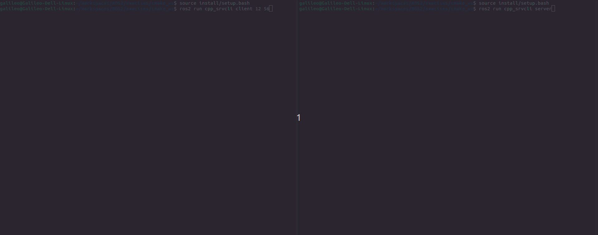
<p style="text-align:center; color:orange">图8：cpp_srvcli测试图</p>

#### 2.6.5 总结
本章我们学习了ROS2的service的使用，并编写了server和client程序。可以看出这部分的程序还是非常复杂的。至于srv我们本次使用了外部的srv,后面我们还需要学习自己编写srv文件和服务器和客户端的类的编写。

在这一节我们了解到了rclcpp中的Node::create_service创建服务器和使用Node::create_client创建客户端;也学会使用wait_for_service去等待服务器的可用性；也学会使用async_send_request函数去异步发送请求。

### 2.7 使用python编写ROS2的server和client
本小节参照入门教程[Writing a simple service and client (Python)](https://docs.ros.org/en/humble/Tutorials/Beginner-Client-Libraries/Writing-A-Simple-Py-Service-And-Client.htm)的内容。这一部分功能和上一小节基本一致，只是语言变成了python.

这一次我们建立一个新的工作空间叫做demo6_ws,之后接下来几篇涉及ament_python的工程都放在这个目录中。
```bash
## 你需要先导航到你放置练工程的目录中
$ mkdir -p demo6_ws/src
## 和前面一样我在操作时始终位于工作区根目录，因此命令有一些区别
$ cd demo6_ws
```
然后我们来创建一个package，名字叫做py_srvcli，依赖于rclpy和example_interfaces，构建类型还是ament_python,license还是“Apache-2.0”.请注意命令中名称的位置，要防止写在`--dependencies`后面。另外请注意[example_interfaces](https://github.com/ros2/example_interfaces)也是一个package,它包含构建请求和响应所需的`.srv`文件的包。你可以通过'ros2 pkg list'看到它。至于`.srv`的格式后面在专门做出说明。
如下：
```bash
$ ros2 pkg list | grep example_
example_interfaces
$ ros2 pkg create py_srvcli  --destination-directory src  --build-type ament_python --license Apache-2.0 --dependencies rclpy example_interfaces --description "Python client server tutorial"
$ tree src/py_srvcli/
src/py_srvcli/
├── LICENSE
├── package.xml
├── py_srvcli
│   └── __init__.py
├── resource
│   └── py_srvcli
├── setup.cfg
├── setup.py
└── test
    ├── test_copyright.py
    ├── test_flake8.py
    └── test_pep257.py

3 directories, 9 files
```

#### 2.7.1 创建server程序
本次将创建一个求和(sum)服务。我们照例打开vscode编辑代码。这次我们将代码写在一个名称叫做`service_member_function.py`的文件中（目录是`src/py_srvcli/py_srvcli`）。文件中代码如下：
```python
from example_interfaces.srv import AddTwoInts

import rclpy
from rclpy.node import Node


class MinimalService(Node):

    def __init__(self):
        super().__init__('minimal_service')
        self.srv = self.create_service(AddTwoInts, 'add_two_ints', self.add_two_ints_callback)

    def add_two_ints_callback(self, request, response):
        response.sum = request.a + request.b
        self.get_logger().info('Incoming request\na: %d b: %d' % (request.a, request.b))

        return response


def main():
    rclpy.init()

    minimal_service = MinimalService()

    rclpy.spin(minimal_service)

    rclpy.shutdown()


if __name__ == '__main__':
    main()
```
这段代码的开头三行引入了rclcpp和example_interfaces的依赖，然后定义了一个类MinimalService，继承自Node。MinimalService的构造函数中创建了一个服务，服务的类型是AddTwoInts，服务的名称是add_two_ints，回调函数是add_two_ints_callback。 add_two_ints_callback函数的功能是接收请求，计算结果，并返回响应。

MinimalService的main函数中创建了一个MinimalService的实例，并启动spin。spin的功能是不断地检查是否有可用的服务请求，如果有就调用回调函数。

#### 2.7.2 创建client程序
这部分我们将代码写在一个名称叫做`client_member_function.py`的文件中。文件中代码如下：
```python
import sys

from example_interfaces.srv import AddTwoInts
import rclpy
from rclpy.node import Node


class MinimalClientAsync(Node):

    def __init__(self):
        super().__init__('minimal_client_async')
        self.cli = self.create_client(AddTwoInts, 'add_two_ints')
        while not self.cli.wait_for_service(timeout_sec=1.0):
            self.get_logger().info('service not available, waiting again...')
        self.req = AddTwoInts.Request()

    def send_request(self, a, b):
        self.req.a = a
        self.req.b = b
        self.future = self.cli.call_async(self.req)
        rclpy.spin_until_future_complete(self, self.future)
        return self.future.result()


def main():
    rclpy.init()

    minimal_client = MinimalClientAsync()
    response = minimal_client.send_request(int(sys.argv[1]), int(sys.argv[2]))
    minimal_client.get_logger().info(
        'Result of add_two_ints: for %d + %d = %d' %
        (int(sys.argv[1]), int(sys.argv[2]), response.sum))

    minimal_client.destroy_node()
    rclpy.shutdown()


if __name__ == '__main__':
    main()
```
这段代码比较简洁。照例是使用example_interfaces和rclpy的api.初始化，接着启用客户端发送请求，最后打印结果，最后销毁节点并关闭rclpy。具体代码不再一一分析。请查看入门教程介绍。

#### 2.7.3 修改entry point，并编译
现在我们来修改setup.py并添加`entry point`，新增内容：
```python
entry_points={
    'console_scripts': [
        'service = py_srvcli.service_member_function:main',
        'client = py_srvcli.client_member_function:main',
    ],
},
```

然后检查依赖项并编译：
```bash
$ rosdep install -i --from-path src --rosdistro humble -y
#All required rosdeps installed successfully
$ colcon build --packages-select py_srvcli
Starting >>> py_srvcli
--- stderr: py_srvcli                   
/home/galileo/.local/lib/python3.10/site-packages/setuptools/_distutils/cmd.py:66: SetuptoolsDeprecationWarning: setup.py install is deprecated.
!!

        ********************************************************************************
        Please avoid running ``setup.py`` directly.
        Instead, use pypa/build, pypa/installer or other
        standards-based tools.

        See https://blog.ganssle.io/articles/2021/10/setup-py-deprecated.html for details.
        ********************************************************************************

!!
  self.initialize_options()
---
Finished <<< py_srvcli [0.78s]

Summary: 1 package finished [1.39s]
  1 package had stderr output: py_srvcli
```

#### 2.7.4 运行测试

在一个终端运行client：
```bash
$ source install/setup.bash
## 确保package可见
$ ros2 pkg list | grep py_srvcli
py_srvcli
## 查询可执行程序
$ ros2 pkg executables py_srvcli
py_srvcli client
py_srvcli service
## 运行client
$ ros2 run py_srvcli client 78 10
```
请注意，理论上服务器要先运行。这里让client运行是为了验证client程序的等待过程是否会报错。我们可以故意等几秒钟再启动server：
```bash
$ source install/setup.bash
## 运行service
$ ros2 run py_srvcli service
```
#### 2.7.5 意外

在上面测试的过程中我不小心将`service = py_srvcli.service_member_function:main`写成了`servive = py_srvcli.service_member_fuction:main`，导致程序无法运行。后来我修正之后，尝试重新编译之后程序出现了三个可执行程序：`client`，`servive`和`service`。我甚至使用了`colcon build --cmake-clean-first`也没有效果。最后我索性删除build,install和log目录。然后重新编译。最后就可以了。（变成了只有两个可执行程序。）

#### 2.7.6 总结
相比于2.6,可以发现2.7中的python程序本身更加简洁。流程大同小异。setup.py和CMakeLists.txt文件在配置execute point上有相同的作用。

在这一节我们了解到了rclpy中的Node::create_service创建服务器和使用Node::create_client创建客户端;也学会使用wait_for_service去等待服务器的可用性；也学会使用spin_until_future_complete函数去等待任务完成。

### 2.8 编写定制化的msg和srv文件
本小节参照入门教程[Creating custom msg and srv files](https://docs.ros.org/en/humble/Tutorials/Beginner-Client-Libraries/Custom-ROS2-Interfaces.html)的内容。

在2.6和2.7中我们使用了examples_interfaces中的srv文件。但是我们也可以自己编写srv文件。（如果不能支持也太奇怪了。）所以本章将编写service(服务)需要的srv文件。我们在2.4和2.5中实现topic程序的时候使用的std_msgs库中的标准string格式的消息。其实还可一通过msg文件定制自己需要的消息。我们也在这一小节介绍。

本小节内容分为创建自定义接口和接口测试部分。篇幅较大，所以中间个别之前讲过的部分就会省略掉。因为本小节内容涉及接口部分，是一个比较综合的测试。所以本小节的文件夹明明就不以demo+数字命名。而是直接叫做`custom_if_ws`.
我们首先建立这个目录：
```bash
## 首先导航到你放置练习工程的目录
$ mkdir -p custom_if_ws/src
## 然后进入目录
$ cd custom_if_ws
```
#### 2.8.1 IDL(https://www.omg.org/spec/IDL/)
在开始正文之前，我们先来点理论的。本部分内容参考了[IDL](https://www.omg.org/spec/IDL/)、[IDL Mapping](https://design.ros2.org/articles/idl_interface_definition.html)和[About-Internal-Interfaces](https://docs.ros.org/en/rolling/Concepts/Advanced/About-Internal-Interfaces.html)的部分内容。

IDL是OMG组织定义的一门描述性语言。我们来看一下OMG组织是如何定义IDL语言的：
```txt
IDL is a descriptive language used to define data types and interfaces in a way that is independent of the programming language or operating system/processor platform. The IDL specifies only the syntax used to define the data types and interfaces. It is normally used in connection with other specifications that further define how these types/interfaces are utilized in specific contexts and platforms.

IDL 是一种描述性语言，用于以独立于编程语言或操作系统/处理器平台的方式定义数据类型和接口。 IDL 仅指定用于定义数据类型和接口的语法。 它通常与其他规范结合使用，进一步定义如何在特定上下文和平台中使用这些类型/接口。
```

你可能会问了，我们现在正在讲srv和msg,这和IDL有什么关系呐？那是因为DDS使用IDL定义的数据格式。而DDS正是ROS2的核心通信组件。因此ROS2当然和IDL有关，而且IDL对于ROS2很重要。目前IDL语言最新的标准是2018年定义的4.2版本。ROS2支持了IDL 4.2版本的子集。如果你有打开idl文件的必要，有很多支持vscode的IDL解析插件，比如RTL开发的“OMG IDL”，当然还有更多。用户定义自己的msg和srv接口之后（表达了用户的意图），需要通过某种方式让ros2能够按照这个接口去通讯（ROS2底层需要理解用户的意图），这时候就出现了一套rosidl的工具来帮助翻译msg,srv（还有后面的action）文件成idl格式的数据接口。(实际上，整个过程可能更复杂。我会在第三节中再仔细将这部分的内容。)我们在这一节（即2.8节）中的主要工作就是掌握这些方法。

ROS2支持的IDL的子集，大家可以查看[这个链接IDL MApping](https://design.ros2.org/articles/idl_interface_definition.html).这里简单罗列如下：
* 注释（Comments）： 行注释 (//) 和块注释(/* ... */)都支持。
* 标识符（Identifiers）：标识符必须以 ASCII 字母字符开头，后跟任意数量的 ASCII 字母、数字和下划线(_)字符。
* 字面值（Literals）：整形（Integer），字符（Character），字符串（String），浮点数（Floating-point）和定点数（Fixed-point）。
* 预处理（Preprocessing）：目前，读取“.idl”文件时不会进行任何预处理。
* 基本数据类型(Basic Types)：整形(short,long,long long,unsigned short,unsigned long,unsigned long long, int8, uint8, int16, uint16, int32, uint32, int64, uint64), 浮点数(float, double, long double), 字符(char， wchar), 布尔数(boolean), 8进制数(octet).
* 模板类型（Template Types）：Sequences（sequence<type_spec>， sequence<type_spec, N>）， string，wstring
* 结构化类型：结构体（Structures）， 枚举（Enumerations）和数组（Arrays）

下面描述一下IDL和其他语言的基础类型的映射关系：
 IDL type | C type | C++ type | Python type 
---|---|---|---
 float | float | float | float 
 double | double | double | float 
 long double | long double | long double2 | float 
 char | unsigned char | unsigned char | str with length 1 
 wchar | char16_t | char16_t | str with length 1 
 boolean | _Bool | bool | bool 
 octet | unsigned char | std::byte1 | bytes with length 1 
 int8 | int8_t | int8_t | int 
 uint8 | uint8_t | uint8_t | int 
 int16 | int16_t | int16_t | int 
 uint16 | uint16_t | uint16_t | int 
 int32 | int32_t | int32_t | int 
 uint32 | uint32_t | uint32_t | int 
 int64 | int64_t | int64_t | int 
 uint64 | uint64_t | uint64_t | int 

下面描述一下IDL和其他语言的复杂类型的映射关系：
 IDL type | C type | C++ type | Python type 
---|---|---|---
 T[N] | T[N] | std::array&lt;T, N&gt; | list 
 sequence&lt;T&gt; | struct {size_t, T * } | std::vector&lt;T&gt; | list 
 sequence&lt;T, N&gt; | struct {size_t, T * }, size_t N | std::vector&lt;T&gt; | list 
 string | char * | std::string | str 
 string&lt;N&gt; | char * | std::string | str 
 wstring | char16_t * | std::u16string | str 
 wstring&lt;N&gt; | char16_t * | std::u16string | str 

 <font color=red>以上仅仅是部分摘录，而且不一定准确。建议阅读原文。</font>

为了便于理解整个过程，我将这个过程的示意图转载如下：

<p style="text-align:center; color:orange">图9：rrosidl动态消息类型</p>

这里需要将一个概念：metadata,元数据。元数据（Metadata），又称中介数据、中继数据，为描述数据的数据（data about data），主要是描述数据属性（property）的信息，用来支持如指示存储位置、历史数据、资源查找、文件记录等功能。（引用自百度百科，我觉得这种说法还是有道理的。）我们在下文编写的src,msg文件本质是一个元数据文件。


#### 2.8.2 创建自定义msg和srv接口
按照入门教程的描述，自己制作的msg和srv文件是需要放在一个单独的ament_cmake工程中，借助rosidl的一些工具来生成代码。因此我们要创建一个ament_cmake类型的package，包的名称叫做tutorial_interfaces：
```bash
$ ros2 pkg create tutorial_interfaces --build-type ament_cmake --destination-dir src/ --license Apache-2.0 --description "A tutorial package with custom msg and srv interfaces"
## 然后创建两个文件夹
$ mkdir src/tutorial_interfaces/msg  src/tutorial_interfaces/srv
$ tree src/tutorial_interfaces/
src/tutorial_interfaces/
├── CMakeLists.txt
├── include
│   └── tutorial_interfaces
├── LICENSE
├── msg
├── package.xml
├── src
└── srv

5 directories, 3 files
## 使用vscode去编辑代码
$ code src/tutorial_interfaces/
```
按照教程在msg中创建名为Num.msg的文件，内容填写为：
```txt
int64 num
```
请注意文件命名的时候单词首字母大写，这应该是一种规范。（具体原因暂时不知道，不大写应该也没有问题。只是如果你使用`ros2 interface list`去查看所有的接口的时候，你会发现接口的BaseName的命名都是字母首字母大写，比如`geometry_msgs/msg/PoseArray`。）这个文件应该也可以理解用来发布订阅的消息中包含一个名字叫num的int64类型的变量。

接着继续创建另一个名为Sphere.msg的msg文件，内容填写为：
```txt
geometry_msgs/Point center
float64 radius
```
通过`ros2 interface list`确实能够查看到这个类型（名称是geometry_msgs/msg/Pose）：
```base
$ ros2 interface show geometry_msgs/msg/Pose
# A representation of pose in free space, composed of position and orientation.

Point position
	float64 x
	float64 y
	float64 z
Quaternion orientation
	float64 x 0
	float64 y 0
	float64 z 0
	float64 w 1
$ ros2 interface show geometry_msgs/msg/Point
# This contains the position of a point in free space
float64 x
float64 y
float64 z
```
可以看出geometry_msgs/Point其实就是一个三个float64组成的矢量。
而要定义的Sphere除了这个点之外还定义了半径radius，半径也是float64的。

我们接着在定义一个名字叫AddThreeInts.srv的srv文件，既然是srv就需要两组数据，一组是请求的(request)另一组是响应的(response).srv的表示也非常简洁，用一行`---`隔开了上边的rquest和下边的response。如下：
```txt
int64 a
int64 b
int64 c
---
int64 sum
```
这个文件和example_interfaces的AddTwoInts.srv类似。只是2个请求参数变成了这里的3个。

编辑好这3个文件之后，我们就需要来编辑依赖项和CMake配置等信息。
这一节需要用到geometry_msgs和rosidl_default_generators这两个依赖项。前者在Sphere.msg中用到了，后者是rosidl转换需要的依赖项。要添加内容如下：
```txt
find_package(geometry_msgs REQUIRED)
find_package(rosidl_default_generators REQUIRED)

rosidl_generate_interfaces(${PROJECT_NAME}
  "msg/Num.msg"
  "msg/Sphere.msg"
  "srv/AddThreeInts.srv"
  DEPENDENCIES geometry_msgs # Add packages that above messages depend on, in this case geometry_msgs for Sphere.msg
)
```
注意真个文件没有必要添加`add_executable`标签。`rosidl_generate_interfaces`的标签的格式请注意。

接着修改`package.xml`文件。它的编写比我们之前在格式都复杂一些：
```txt
<depend>geometry_msgs</depend>
<buildtool_depend>rosidl_default_generators</buildtool_depend>
<exec_depend>rosidl_default_runtime</exec_depend>
<member_of_group>rosidl_interface_packages</member_of_group>
```
通用依赖项(即在build,execute,test阶段都用到的依赖项)是geometry_msgs。rosidl_default_generators只能在build的时候用到，而rosidl_default_runtime只能在execute的时候用到。member_of_group教程说的是依赖组的名称。这一点我也没怎么理解。但whatever,就这么着吧。后面看看能不能理解。

好了，现在我们准备编译吧：
```bash
$ rosdep install -i --from-path src --rosdistro humble -y
#All required rosdeps installed successfully
$ colcon build  --packages-select tutorial_interfaces
[0.757s] WARNING:colcon.colcon_core.prefix_path.colcon:The path '/home/galileo/Workspaces/ROS2/execises/python_ws/install' in the environment variable COLCON_PREFIX_PATH doesn't exist
[0.757s] WARNING:colcon.colcon_ros.prefix_path.ament:The path '/home/galileo/Workspaces/ROS2/execises/python_ws/install/py_srvcli' in the environment variable AMENT_PREFIX_PATH doesn't exist
Starting >>> tutorial_interfaces
Finished <<< tutorial_interfaces [3.04s]                     

Summary: 1 package finished [3.65s]
```
简单测试一下吧：
```bash
$ source install/setup.bash
$ ros2 interface list | grep -E 'Num|Sphere|AddThreeInts'
    tutorial_interfaces/msg/Num
    tutorial_interfaces/msg/Sphere
    tutorial_interfaces/srv/AddThreeInts
$ ros2 interface show tutorial_interfaces/msg/Num
int64 num
$ ros2 interface show geometry_msgs/msg/Point
# This contains the position of a point in free space
float64 x
float64 y
float64 z
$ ros2 interface show tutorial_interfaces/srv/AddThreeInts
int64 a
int64 b
int64 c
---
int64 sum
```
这和我们的设置一致。说明我们的接口设置完成。但是这些接口到底好不好用呐？我们在下文再做测试。

#### 2.8.3 测试前准备
入门教程里面是将前几课的教程放在一个叫做ros_ws的文件夹。所以它们可以直接就在原来的工作空间操作。但是我们每一刻都是一个独立的工作空间。你可能就要说：你是不是傻眼了？那倒不至于。其实我当时将教程分开是考虑到后面的教程会修改前面的代码。这样独立开来会有很多好处。现在的解决方案也异常简单：直接拷贝一份过来修改成我们需要的代码就可以。（请注意我的demo3_ws、demo4_ws和本节的custom_if_ws都在同一个目录下。）我们可以这样将需要的工程拷贝过来就成，我们以2.4节的cpp_pubsub为例：
```bash
$ cp -r ../demo3_ws/src/cpp_pubsub/ src/
```
接着我们索性将2.5,2.6和2.7节的package全部拷贝过来（不是剪切）：
```bash
$ cp -r ../demo4_ws/src/py_pubsub/ src/
$ cp -r ../demo5_ws/src/cpp_srvcli/ src/
$ cp -r ../demo6_ws/src/py_srvcli/ src/
$ ls src/
cpp_pubsub  cpp_srvcli  py_pubsub  py_srvcli  tutorial_interfaces
```

这样我们就将原来的package源代码都拷贝过来了。接下来几个小节我们分别修改topic和service的示例工程，然后编译运行测试。

#### 2.8.3 cpp_pubsub使用tutorial_interfaces/msg/Num消息接口
这一节我们下来使用cpp_pubsub来测试Num.msg接口。

先来看publisher_member_function.cpp这个文件的修改。这个文件的功能是发布消息。原来的教程使用的是`std_msgs::msg::String`这种类型来传递数据，这一次我们将使用2.8.1节中创建的`tutorial_interfaces::msg::Num`接口来传递数据。具体修改见下图：
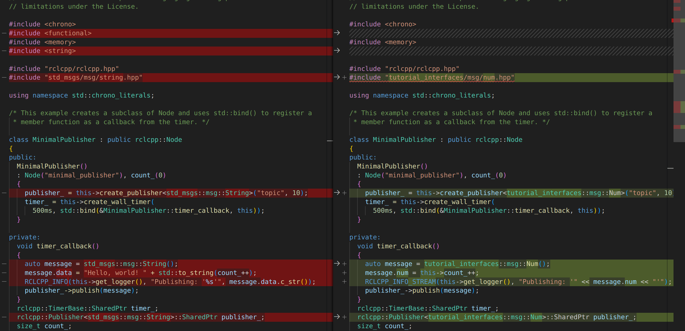
<p style="text-align:center; color:orange">图10：publisher_member_function代码差异</p>
下面是修改总结：

1. std_msgs/msg/string.hpp 替换为 tutorial_interfaces/msg/num.hpp
2. create_publisher的模板由<std_msgs::msg::String>改为<tutorial_interfaces::msg::Num>。
3. 回调的消息有String变成了Num。RCLCPP_INFO函数被更改为了RCLCPP_INFO_STREAM。

现在我们再来看subscriber_member_function.cpp这个文件的修改。这个文件的功能是订阅消息。原来的教程使用的是`std_msgs::msg::String`这种类型来接收数据，这一次我们将使用2.8.1节中创建的`tutorial_interfaces::msg::Num`接口来接收数据。具体修改见下图：
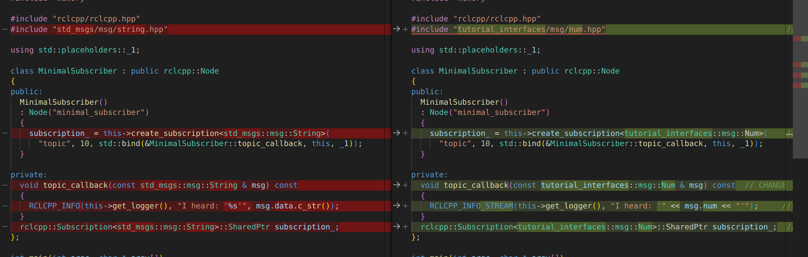
<p style="text-align:center; color:orange">图11：subscriber_member_function代码差异</p>
下面是修改总结：
1. std_msgs/msg/string.hpp 替换为 tutorial_interfaces/msg/num.hpp
2. create_subscription的模板由<std_msgs::msg::String>改为<tutorial_interfaces::msg::Num>。
3. 回调的消息有String变成了Num。RCLCPP_INFO函数被更改为了RCLCPP_INFO_STREAM。

因为依赖项由之前的std_msgs变成了tutorial_interfaces。所以CMakeLists.txt和package.xml也需要修改。请按照入门教程修改，这里不再赘述。基本上是将std_msgs替换为tutorial_interfaces。或者添加tutorial_interfaces依赖。因为tutorial_interfaces本质是依赖于std_msgs的。
```bash
$ rosdep install -i --from-paths src/cpp_pubsub  --rosdistro humble -y
ERROR: the following packages/stacks could not have their rosdep keys resolved
to system dependencies:
cpp_pubsub: Cannot locate rosdep definition for [tutorial_interfaces]
```
<font color='red'>怎么报错了呐？</font>

原来我还没有source当前的overlay。（因为别的原因我关闭了之前的终端。）而我们当前需要编译的源码依赖于tutorial_interfaces，所以我们必须先将tutorial_interfaces配置到当前的环境中才可以。所以我们重来一次：
```bash
$ source install/setup.sh
$ rosdep install -i --from-paths src/cpp_pubsub  --rosdistro humble -y
#All required rosdeps installed successfully
$ colcon build --packages-select cpp_pubsub
Starting >>> cpp_pubsub
Finished <<< cpp_pubsub [5.84s]                     

Summary: 1 package finished [6.46s]
## 我们新增加了包到环境中，所以现在需要重新source一次overlay
$ source install/setup.sh
## 检查一下cpp_pubsub是否加载成功
$ ros2 pkg executables cpp_pubsub
cpp_pubsub listener
cpp_pubsub talker
$ ros2 run cpp_pubsub listener
```
现在我们打开第二个终端（如果你也像我一样使用tmux,那这时候你可以将现在的终端分成两个窗口来避免在新打开的终端里面重新切换到目标目录并source）：
```bash
## 先cd到本节课程的工作空间
## 然后source
$ source install/setup.sh
$ ros2 run cpp_pubsub talker
```
结果如下：
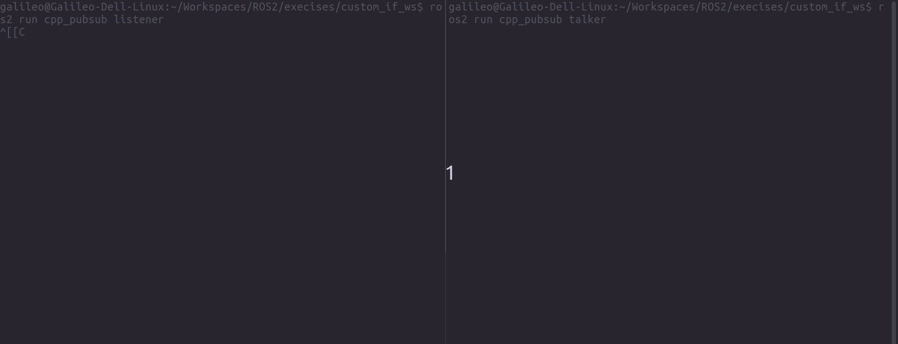
<p style="text-align:center; color:orange">图12：cpp_pubsub使用Num传递消息测试</p>

#### 2.8.4 py_pubsub使用tutorial_interfaces/msg/Num消息接口
这一节我们下来使用py_pubsub来测试Num.msg接口。

按照入门教程改动即可，还是修改头文件并将std_msgs/msg/String更改为tutorial_interfaces/msg/Num。这里就不再赘述。

ament_python的修改比较简单，仅修改package.xml文件即可。只需要中的`exec_depend`标签内的`std_msgs`更改为`tutorial_interfaces`即可。

然后按照之前的流程编译即可：
```bash
$ source install/setup.sh
$ rosdep install -i --from-paths src/py_pubsub  --rosdistro humble -y
#All required rosdeps installed successfully
$ colcon build --packages-select  py_pubsub
```
然后在这个窗口运行lisenter：
```bash
$ source install/setup.sh
## 检查一下py_pubsub是否加载成功
$ ros2 pkg executables py_pubsub
py_pubsub listener
py_pubsub talker
$ ros2 run py_pubsub listener
```
在另一个终端运行talker：
```bash
$ source install/setup.sh
$ ros2 run py_pubsub talker
```
运行结果和2.8.3节一样。不再赘述。

#### 2.8.5 cpp_srvcli使用tutorial_interfaces/srv/AddThreeInts服务接口
cpp_srvcli之前的两个源文件是`add_two_ints_server.cpp`和`add_two_ints_client.cpp`。为了名副其实我们将它们分别更名为`add_three_ints_server.cpp`和`add_three_ints_client.cpp`。

在add_two_ints_server.cpp中使用的是`example_interfaces::srv::AddTwoInts`，而我们这次使用的是`tutorial_interfaces/srv/AddThreeInts`服务接口。所以要做相应的替换，而之前request的数据也在a和b之外添加了c.<font color=yellow>当然头文件也要相应修改，但是请注意头文件的basename变成了全小写。</font>我们就按照这个原则修改add_three_ints_server.cpp文件。同样的方法用到add_three_ints_client.cpp的修改中。只是请注意这次argc变成了4.

CMakeLists.txt文件除了依赖项要从`example_interfaces`改为`tutorial_interfaces`之外，还要更改目标文件的名字。（入门教程没有更改文件名称）

package.xml只需要将依赖项从`example_interfaces`改为`tutorial_interfaces`即可。

然后编译：
```bash
$ source install/setup.sh
$ rosdep install -i --from-paths src/cpp_srvcli  --rosdistro humble -y
#All required rosdeps installed successfully
$ colcon build --packages-select cpp_srvcli
Starting >>> cpp_srvcli
Finished <<< cpp_srvcli [2.12s]                     

Summary: 1 package finished [2.75s]
## 我们新增加了包到环境中，所以现在需要重新source一次overlay
$ source install/setup.sh
## 检查一下cpp_srvcli是否加载成功
$ ros2 pkg executables cpp_srvcli
cpp_srvcli client
cpp_srvcli server
$ ros2 run cpp_srvcli client 11 22 33
```
在另一个终端延迟打开server：
```bash
$ source install/setup.sh
$ ros2 run cpp_srvcli server
```

测试结果如下：
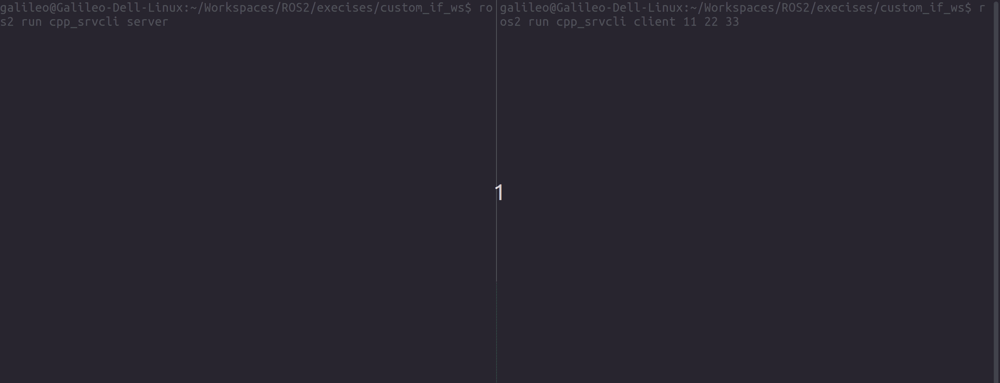
<p style="text-align:center; color:orange">图13：AddThreeInts传递服务消息测试</p>

#### 2.8.6 py_srvcli使用tutorial_interfaces/srv/AddThreeInts服务接口
py_srvcli的测试和cpp_srvcli大同小异（程序更简单）。细节不再赘述。参见入门教程即可。

然后编译：
```bash
$ source install/setup.sh
$ rosdep install -i --from-paths src/py_srvcli  --rosdistro humble -y
#All required rosdeps installed successfully
$ colcon build --packages-select py_srvcli
Starting >>> py_srvcli
--- stderr: py_srvcli                   
/home/galileo/.local/lib/python3.10/site-packages/setuptools/_distutils/cmd.py:66: SetuptoolsDeprecationWarning: setup.py install is deprecated.
!!

        ********************************************************************************
        Please avoid running ``setup.py`` directly.
        Instead, use pypa/build, pypa/installer or other
        standards-based tools.

        See https://blog.ganssle.io/articles/2021/10/setup-py-deprecated.html for details.
        ********************************************************************************

!!
  self.initialize_options()
---
Finished <<< py_srvcli [0.84s]

Summary: 1 package finished [1.46s]
  1 package had stderr output: py_srvcli
## 我们新增加了包到环境中，所以现在需要重新source一次overlay
$ source install/setup.sh
## 检查一下py_srvcli是否加载成功
$ ros2 pkg executables py_srvcli
py_srvcli client
py_srvcli service
$ ros2 run py_srvcli client 11 22 33
```
在另一个终端延迟打开server：
```bash
$ source install/setup.sh
$ ros2 run py_srvcli service
```
测试完成。

#### 2.8.7 总结
2.8节学会了怎么使用自定义的srv,msg接口。我们也初步接触了rosidl.未来将继续研究ros2的API.

### 2.9 实现自定义接口
本小节参照入门教程[Implementing custom interfaces](https://docs.ros.org/en/humble/Tutorials/Beginner-Client-Libraries/Single-Package-Define-And-Use-Interface.html)的内容。

在上一节我们使用了专门的包来创建接口。这是ROS官方推荐的做法，但是你也看到整个过程比较繁琐。你需要先准备好接口并将其当作被使用接口的underlay才能够支持后者编译和运行。那有没有简单的做法。本章就描述了这种方法。

因为接口文件只能在ament_cmake中编译，所以如果你当你需要访问包内自定义接口的时候，你的工程必须是ament_cmake。如果你必须使用python,那有两种方法：一种是做成独立的包，另一种将python封装成可供cpp使用的库。为简单期间，入门教程介绍了在ament_cmake包内使用自定义接口的办法。

#### 2.9.1 实现基础接口

本节教程我们还在custom_if_ws工作区中操作。我们首先创建一个名称为more_interfaces，类型是ament_cmake的包：
```bash
## 确保已经cd到了custom_if_ws目录中
$ ros2 pkg create more_interfaces --build-type ament_cmake --license Apache-2.0 --destination-directory src/ --description "A package with custom interfaces"
$ ls src/
cpp_pubsub  cpp_srvcli  more_interfaces  py_pubsub  py_srvcli  tutorial_interfaces
## 照例创建一个msg文件夹用来存放消息接口描述文件
$ mkdir src/more_interfaces/msg
## 我们顺便打开vscode

```
现在我们将要创建一个名为AddressBook.msg的消息描述文件，内容如下：
```txt
uint8 PHONE_TYPE_HOME=0
uint8 PHONE_TYPE_WORK=1
uint8 PHONE_TYPE_MOBILE=2

string first_name
string last_name
string phone_number
uint8 phone_type
```
这个文件相比于2.8中的定义稍微复杂了一点。前三行定义了三个常量。后面定义了三个string类型的变量分别表示姓、名、手机号。然后定义了一个uint8_t类型的变量表示手机类型。只是三个常量看起来表示phone_type。但是具体将这几个常量制定给phone_type这个变量，我尚不清楚。在之前[Baisc/Interface](https://docs.ros.org/en/humble/Concepts/Basic/About-Interfaces.html)的篇幅讲了接口定义的内容。只是因为当时对接口还不太理解。还不知道原来接口的作用这么大。（之前不知道接口可以自定义。）

我们照例要修改依赖项，在2.8节已经描述过了（rosidl的编译、运行相关的依赖项）。在package.xml中添加：
```txt
<buildtool_depend>rosidl_default_generators</buildtool_depend>

<exec_depend>rosidl_default_runtime</exec_depend>

<member_of_group>rosidl_interface_packages</member_of_group>
```

在CMakeLists.txt中添加：
```txt
find_package(rosidl_default_generators REQUIRED)


rosidl_generate_interfaces(${PROJECT_NAME}
  "msg/AddressBook.msg"
)
```

此外还需要额外添加一条（相比于2.8节）：
```txt
$ rosdep install -i --from-paths src/more_interfaces/  --rosdistro humble -y
#All required rosdeps installed successfully
$ colcon build --packages-select more_interfaces
Starting >>> more_interfaces
Finished <<< more_interfaces [2.25s]                     

Summary: 1 package finished [2.86s]
```

有意思的是上文CMakeLists.txt其实可以这样编写：
```txt
find_package(rosidl_default_generators REQUIRED)

set(msg_files
  "msg/AddressBook.msg"
)

rosidl_generate_interfaces(${PROJECT_NAME}
  $(msg_files)
)
```
我们甚至可以将上面的文件扩展为一种常规结构：


```txt
find_package(rosidl_default_generators REQUIRED)

set(msg_files
  "msg/AddressBook.msg"
)

set(srv_files
  "srv/Service#.src"
)

set(action_files
  "action/Action#.src"
)

rosidl_generate_interfaces(${PROJECT_NAME}
  $(msg_files)
  $(srv_files)
  $(action_files)
)

```
[上文是举例，你需要根据你世纪的文件来扩展上述语法。]

然后执行依赖项检查和编译工作。最后我们开测试一下接口：
```bash
$ source install/setup.bash
$ ros2 interface list | grep more
    more_interfaces/msg/AddressBook
$ ros2 interface show more_interfaces/msg/AddressBook
uint8 PHONE_TYPE_HOME=0
uint8 PHONE_TYPE_WORK=1
uint8 PHONE_TYPE_MOBILE=2

string first_name
string last_name
string phone_number
uint8 phone_type
```

#### 2.9.2 创建使用接口的代码
现在我们来创建使用我们在2.9.1中创建的AddressBook消息接口。

我们先创建一个文件名字叫做publish_address_book.cpp，内容如下：
```cpp
#include <chrono>
#include <memory>

#include "rclcpp/rclcpp.hpp"
#include "more_interfaces/msg/address_book.hpp"

using namespace std::chrono_literals;

class AddressBookPublisher : public rclcpp::Node
{
public:
  AddressBookPublisher()
  : Node("address_book_publisher")
  {
    address_book_publisher_ =
      this->create_publisher<more_interfaces::msg::AddressBook>("address_book", 10);

    auto publish_msg = [this]() -> void {
        auto message = more_interfaces::msg::AddressBook();

        message.first_name = "John";
        message.last_name = "Doe";
        message.phone_number = "1234567890";
        message.phone_type = message.PHONE_TYPE_MOBILE;

        std::cout << "Publishing Contact\nFirst:" << message.first_name <<
          "  Last:" << message.last_name << std::endl;

        this->address_book_publisher_->publish(message);
      };
    timer_ = this->create_wall_timer(1s, publish_msg);
  }

private:
  rclcpp::Publisher<more_interfaces::msg::AddressBook>::SharedPtr address_book_publisher_;
  rclcpp::TimerBase::SharedPtr timer_;
};


int main(int argc, char * argv[])
{
  rclcpp::init(argc, argv);
  rclcpp::spin(std::make_shared<AddressBookPublisher>());
  rclcpp::shutdown();

  return 0;
}
```
我们再来分析一下上面的代码。头文件部分照例引用了`rclcpp`接口，然后使用我们方才自定义的`more_interfaces/msg/AddressBook`消息接口的头文件`more_interfaces/msg/address_book.hpp`。

整个程序的流程还是先初始化（init），然后循环调用（spin）自定义的类AddressBookPublisher的成员（使用std::make_shared创建类的实体），最后从循环中跳出后关闭（shutdown）程序。

AddressBookPublisher的构建程序中，先使用create_publisher创建一个名叫address_book_publisher_的发布者（重载类型为more_interfaces::msg::AddressBook）。然后使用Lambda表达式创建一个消息发布者publish_msg。publish_msg函数中，先创建一个AddressBook类型的消息，然后设置相关的字段，然后打印相关信息，最后使用address_book_publisher_的publish函数发布消息。最后使用create_wall_timer创建一个名为timer_的定时器按照1s的周期调用publish_msg函数发布消息。

我们不妨先编译一下publisher的代码。现在需要根据将新增的依赖项`rclcpp`添加到package.xml和CMakeLists.txt文件中。在package.xml中添加：
```txt
<depend>rclcpp</depend>
```
在CMakeLists.txt文件中添加：
```txt
find_package(rclcpp REQUIRED)

add_executable(publish_address_book src/publish_address_book.cpp)
ament_target_dependencies(publish_address_book rclcpp)

install(TARGETS
    publish_address_book
  DESTINATION lib/${PROJECT_NAME})
```
除了这些常规代码，还需要添加：
```txt
rosidl_get_typesupport_target(cpp_typesupport_target
  ${PROJECT_NAME} rosidl_typesupport_cpp)

target_link_libraries(publish_address_book "${cpp_typesupport_target}")
```
这些代码将告诉编译期要从相同的节点寻找自定义接口。<font color=red>这段代码也是区别与从其它package加载的最主要区别。请多加注意。</font>

我们现在再次检查依赖项并编译。
```bash
$ rosdep install -i --from-paths src/more_interfaces/ --rosdistro humble -y
#All required rosdeps installed successfully
$ colcon build --packages-select more_interfaces
Starting >>> more_interfaces
Finished <<< more_interfaces [3.69s]                     

Summary: 1 package finished [4.31s]
```
现在我们来测试它。我们将用`ros2 topic echo`来查看我们的发布的消息。之后真实代码的编写中也可以用这种方式调试Topic代码。
在一个终端调用publish_address_book去发布消息：
```bash
$ source install/setup.bash
$ ros2 run more_interfaces publish_address_book
```
在另一个终端调用`ros2 topic echo`来查看发布的消息：
```bash
$ source install/setup.bash
$ ros2 topic echo /address_book
```
需要注意如果我们在这个终端中不source的话，尽管我们可以通过`ros2 topic list`发现/address_book这个topic，但是我们无法查看发布的消息：
```bash
$ ros2 topic echo /address_book
The message type 'more_interfaces/msg/AddressBook' is invalid
```
所以必须事先source.

结果如下：
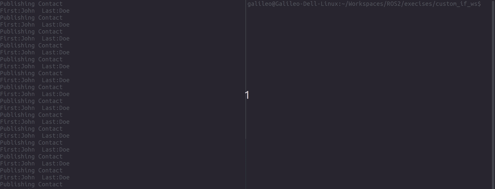
<p style="text-align:center; color:orange">图14：AddressBook消息接口测试</p>

#### 2.9.3 使用已存在的接口定义
入门教程的这一部分假定我们在自己的msg文件里面包含了其它包的相应文件。文中举的例子是名字叫做`rosidl_tutorials_msgs`的包。这个包实际上是不存在。它举出的例子我们在定义Sphere.msg的时候已经用过了。Sphere.msg的定义如下：
```txt
geometry_msgs/Point center
float64 radius
```
其中geometry_msgs/Point就是存在的另一个包。具体的流程可以参考这部分（2.8.2）即可。

我们在定义这个包的时候也在package.xml和CMakeLists.txt中添加了依赖项`geometry_msgs`。只是那个包中间没有引用`geometry_msgs/msg/point.hpp`文件.因为尽管这个Sphere这个消息体尽管被定义了。但是最终没有被使用。

#### 2.9.4 总结
这一节我们继续深入的了解了如何在同一个package使用自定义的interface.但是这并不是官方推荐的一种方式。尤其是如果在python包中使用则会非常繁琐。（与其这样不如为你的工程专门制作制作一个基础的接口package.将你会用到的特殊接口全部定义在其中。这样可以方便管理和使用。）

### 2.10 在C++类中使用参数(Parameters)
本小节参照入门教程[Using parameters in a class（C++）](https://docs.ros.org/en/humble/Tutorials/Beginner-Client-Libraries/Using-Parameters-In-A-Class-CPP.html)的内容。

我们在[笔记1](https://watershade.github.io/ROS2/ROS2_Humble_Learning_Note_1)中
本节将学习如何在C++类中使用parameters。在开始之前我们不妨先建立一个基本的工程，随后再一步一步了解怎么在被工程中引用parameters，最后学会在launch中设置参数。

#### 2.10.1 准备工作-创建基础工程
先创建一个`demo7_ws`工作区，然后创建一个`cpp_parameters`包。这个包的是ament_cmake类型;名字不妨叫做`cpp_parameters`；依赖项是`rclcpp`;license照例是Apache-2.0：
```bash
$ mkdir -p demo7_ws/src
$ cd demo7_ws
$ ros2 pkg create cpp_parameters --destination-directory src/ --build-type ament_cmake  --license Apache-2.0  --dependencies rclcpp  --description "C++ parameter tutorial"
$ tree  src/cpp_parameters/
src/cpp_parameters/
├── CMakeLists.txt
├── include
│   └── cpp_parameters
├── LICENSE
├── package.xml
└── src

3 directories, 3 files
$ code src/cpp_parameters
```
我了后面使用parameter,我们需要在即将编写的代码中包含一些pkg相关的参数。我们可以按照入门教程的代码，创建一个cpp_parameters_node.cpp文件，并填入代码：
```cpp
#include <chrono>
#include <functional>
#include <string>

#include <rclcpp/rclcpp.hpp>

using namespace std::chrono_literals;

class MinimalParam : public rclcpp::Node
{
public:
  MinimalParam()
  : Node("minimal_param_node")
  {
    this->declare_parameter("my_parameter", "world");

    timer_ = this->create_wall_timer(
      1000ms, std::bind(&MinimalParam::timer_callback, this));
  }

  void timer_callback()
  {
    std::string my_param = this->get_parameter("my_parameter").as_string();

    RCLCPP_INFO(this->get_logger(), "Hello %s!", my_param.c_str());

    std::vector<rclcpp::Parameter> all_new_parameters{rclcpp::Parameter("my_parameter", "world")};
    this->set_parameters(all_new_parameters);
  }

private:
  rclcpp::TimerBase::SharedPtr timer_;
};

int main(int argc, char ** argv)
{
  rclcpp::init(argc, argv);
  rclcpp::spin(std::make_shared<MinimalParam>());
  rclcpp::shutdown();
  return 0;
}
```
上面的程序还是rclcpp传统的流程不再赘述，我们主要分析MinimalParam这个继承自Node的Class. 在MinimalParam的构造函数中使用Node::declare_parameter茶u年构建了一个key是"my_parameter"的参数，并为这个参数赋初值为“world”。然后创建一个定时器，每隔1s调用timer_callback函数。在timer_callback函数中，我们使用Node::get_parameter函数获取参数值，并打印出来。然后我们使用Node::set_parameters函数修改参数值。

通过这操作可以将外部设置的参数显示出来，显示完之后有将参数值设为默认值。

我们也可以在构造函数中添加参数描述符（param description），这样在使用`ros2 param list`命令时可以看到参数的描述。参数描述符（param description）除了能简单描述参数之外还可以给它添加一些限制，比如是否只读，参数范围等。这样我们相关的程序就可以修改为：
```cpp
// ...
class MinimalParam : public rclcpp::Node
{
public:
  MinimalParam()
  : Node("minimal_param_node")
  {
    auto param_desc = rcl_interfaces::msg::ParameterDescriptor{};
    param_desc.description = "This parameter is mine!";

    this->declare_parameter("my_parameter", "world", param_desc);

    timer_ = this->create_wall_timer(
      1000ms, std::bind(&MinimalParam::timer_callback, this));
  }
 // ......
} 
```
现在我们需要修改CMakeLists.txt文件，添加我们的目标文件。如下：
```txt
add_executable(minimal_param_node src/cpp_parameters_node.cpp)
ament_target_dependencies(minimal_param_node rclcpp)

install(TARGETS
    minimal_param_node
  DESTINATION lib/${PROJECT_NAME}
)
```
然后我们检查依赖项并编译：
```bash
$ rosdep install -i --from-paths src/cpp_parameters/ --rosdistro humble -y
#All required rosdeps installed successfully
$ colcon build --packages-select cpp_parameters
Starting >>> cpp_parameters
Finished <<< cpp_parameters [3.63s]                     

Summary: 1 package finished [4.28s]
```
最后我们source一下环境变量，并运行程序：
```bash
$ source install/setup.bash
$ ros2 pkg list | grep cpp_parameters
cpp_parameters
$ ros2 run cpp_parameters minimal_param_node
[INFO] [1706097049.922609500] [minimal_param_node]: Hello world!
[INFO] [1706097050.922285795] [minimal_param_node]: Hello world!
# ...
```
我们可以看到程序打印出了参数值。

#### 2.10.2 从外部修改参数测试
不要关闭上一个终端，我们打开一个新的终端窗口：
```bash
# cd到你的demo7_ws工作区，然后source环境变量
$ source install/setup.bash 
## cpp_parameters运行后方可参看参数
$ ros2 param list
/minimal_param_node:
  my_parameter
  qos_overrides./parameter_events.publisher.depth
  qos_overrides./parameter_events.publisher.durability
  qos_overrides./parameter_events.publisher.history
  qos_overrides./parameter_events.publisher.reliability
  use_sim_time
## 获取节点名称，下一步需要  
$ ros2 node list
/minimal_param_node
## 获取参数
$ ros2 param get /minimal_param_node my_parameter
String value is: world
$ ros2 param set /minimal_param_node my_parameter earth/sky
```
测试如下：
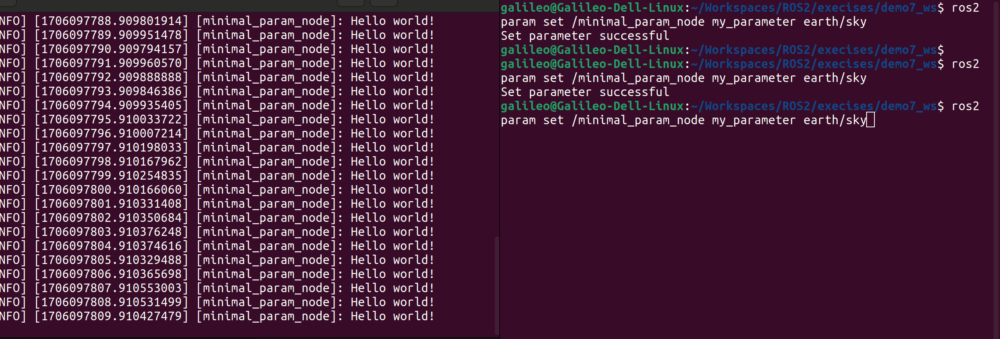
<p style="text-align:center; color:orange">图15：外部设置参数测试</p>

对了别忘了使用`ros2 param describe`命令来查看参数的描述：
```bash
$ ros2 param describe  minimal_param_node my_parameter
Parameter name: my_parameter
  Type: string
  Description: This parameter is mine!
  Constraints:
```
请注意要确保当节点运行后才能使用上面的命令查看参数。


#### 2.10.3 从launch修改参数
通过param修改参数是一种临时修改，如果需要长期修改，则需要修改launch文件。我们可以修改launch文件，使得参数可以在launch文件中设置。

但是launch方式修改的流程相对复杂一些。我们现在来学习怎么使用launch文件修改参数吧。首先我们先在package目录下创建一个名字叫做`launch`文件夹：
```bash
## 确保我们已经cd到了demo7_ws工作区;当然你也可以进入到cpp_parameters包目录下
## 我的操作都假定目前正位于demo7_ws工作区目录下
$ mkdir -p src/cpp_parameters/launch
## 我们照例在vscode里面打开cpp_parameters包目录
$ code src/cpp_parameters
```
然后我们在launch文件夹下创建一个名字叫做`cpp_parameters_launch.py`的文件，内容如下：
```python
from launch import LaunchDescription
from launch_ros.actions import Node

def generate_launch_description():
    return LaunchDescription([
        Node(
            package="cpp_parameters",
            executable="minimal_param_node",
            name="custom_minimal_param_node",
            output="screen",
            emulate_tty=True,
            parameters=[
                {"my_parameter": "earth"}
            ]
        )
    ])
```
这里需要说明一下，这里的package和executable名称均是我们在2.10.2中使用的名称。executable的获取我们可以使用`ros2 pkg executables cpp_parameters`来获取。我们设置的为name设置的`custom_minimal_param_node`,也会在后面launch测试的时候显示出来.你稍后可以留意。

我们接下来修改CMakeLists.txt文件，以确保setup脚本可以调用launch实现对参数的编辑.添加：
```txt
install(
  DIRECTORY launch
  DESTINATION share/${PROJECT_NAME}
)
```

然后我们编译一下：
```bash
$ colcon build --packages-select cpp_parameters
Starting >>> cpp_parameters
Finished <<< cpp_parameters [0.71s]                     

Summary: 1 package finished [1.31s]
```

好了现在我们开始测试吧。让我们先source一下环境变量：
```bash
source install/setup.bash
```

接着使用launch命令执行刚才的`cpp_parameters_launch.py`的文件：
```bash
ros2 launch cpp_parameters cpp_parameters_launch.py
```
测试结果如下：

<p style="text-align:center; color:orange">图16：通过launch设置参数实验</p>

扩展：
另外我发现，对于python文件编译的过程实际上是检查编译通过后之后将python文件copy到install/cpp_parameters/share/cpp_parameters/launch/的目录中。如果我们这时候修改一下这个python文件，比方我们将earth改成Mars，会发现：
```bash
$ ros2 launch cpp_parameters cpp_parameters_launch.py
[INFO] [launch]: All log files can be found below /home/galileo/.ros/log/2024-01-25-12-23-16-861542-Galileo-Dell-Linux-23086
[INFO] [launch]: Default logging verbosity is set to INFO
[INFO] [minimal_param_node-1]: process started with pid [23087]
[minimal_param_node-1] [INFO] [1706156597.930575708] [custom_minimal_param_node]: Hello Mars!!
[minimal_param_node-1] [INFO] [1706156598.930572550] [custom_minimal_param_node]: Hello world!
[minimal_param_node-1] [INFO] [1706156599.930544611] [custom_minimal_param_node]: Hello world!
```

### 2.11 在Python类中使用参数(Parameters)
本小节参照入门教程[Using parameters in a class (Python)](https://docs.ros.org/en/humble/Tutorials/Beginner-Client-Libraries/Using-Parameters-In-A-Class-Python.html#using-parameters-in-a-class-python)的内容。

#### 2.11.1 创建基础包

我们在2.10中介绍了在C++中使用参数，这一节我们介绍在python中怎么使用paramters.我们先来准备一个包含paramter的python package吧。本次我们将创建一个名字叫`demo8_ws`的新工作区，并创建一个叫做python_parameters的ament_python类型的package：
```bash
$ mkdir -p demo8_ws/src
$ cd demo8_ws
$ ros2 pkg create python_parameters --destination-directory src/ --build-type ament_python  --license Apache-2.0  --dependencies rclpy  --description "Python parameter tutorial"
$ tree pkg src/python_parameters/
pkg  [error opening dir]
src/python_parameters/
├── LICENSE
├── package.xml
├── python_parameters
│   └── __init__.py
├── resource
│   └── python_parameters
├── setup.cfg
├── setup.py
└── test
    ├── test_copyright.py
    ├── test_flake8.py
    └── test_pep257.py

3 directories, 9 files

## 接着我们照例打开vsode来编辑工程
$ code src/python_parameters
```

我们在`python_parameters`包中创建一个`python_parameters_node.py`源文件，内容如下：
```python
import rclpy
import rclpy.node
from rcl_interfaces.msg import ParameterDescriptor

class MinimalParam(rclpy.node.Node):
    def __init__(self):
        super().__init__('minimal_param_node')

        my_parameter_descriptor = ParameterDescriptor(description='This parameter is mine!')

        self.declare_parameter('my_parameter', 'world', my_parameter_descriptor)

        self.timer = self.create_timer(1, self.timer_callback)

    def timer_callback(self):
        my_param = self.get_parameter('my_parameter').get_parameter_value().string_value

        self.get_logger().info('Hello %s!' % my_param)

        my_new_param = rclpy.parameter.Parameter(
            'my_parameter',
            rclpy.Parameter.Type.STRING,
            'world'
        )
        all_new_parameters = [my_new_param]
        self.set_parameters(all_new_parameters)

def main():
    rclpy.init()
    node = MinimalParam()
    rclpy.spin(node)
    node.destroy_node()
    rclpy.shutdown()

if __name__ == '__main__':
    main()
```    
在代码main函数中照例初始化创建一个MinimalParam类型的节点，然后循环执行节点，当从spin退出之后销毁节点并关闭ROS2。我们主要将一下MinimalParam。

MinimalParam的初始化（类似构造函数）函数中创建了一个名为`minimal_param_node`的节点并创建了一个ParameterDescriptor，然后使用`declare_parameter`创建一个key是`my_parameter`的参数，并为这个参数赋初值为“world”。然后创建一个定时器，每隔1s调用timer_callback函数。

在timer_callback函数中，先使用`get_parameter`获取参数值，并打印出来。然后我们使用`set_parameters`函数将参数值复原为“world”。

现在我们需要将这个文件添加进编译目标，让我们修改setup.py文件，修改entry_points为：
```python
entry_points={
    'console_scripts': [
        'minimal_param_node = python_parameters.python_parameters_node:main',
    ],
},
```

接着检查并编译：
```bash
$ rosdep install -i --from-path src/python_parameters/ --rosdistro humble -y
All required rosdeps installed successfully
$ colcon build --packages-select python_parameters
Starting >>> python_parameters
--- stderr: python_parameters                   
/home/galileo/.local/lib/python3.10/site-packages/setuptools/_distutils/cmd.py:66: SetuptoolsDeprecationWarning: setup.py install is deprecated.
!!

        ********************************************************************************
        Please avoid running ``setup.py`` directly.
        Instead, use pypa/build, pypa/installer or other
        standards-based tools.

        See https://blog.ganssle.io/articles/2021/10/setup-py-deprecated.html for details.
        ********************************************************************************

!!
  self.initialize_options()
---
Finished <<< python_parameters [0.90s]

Summary: 1 package finished [1.50s]
  1 package had stderr output: python_parameters
```

编译成功后，我们可以运行这个节点：
```bash
$ source install/setup.bash
$ ros2 run python_parameters minimal_param_node
[INFO] [1706159642.638704504] [minimal_param_node]: Hello world!
[INFO] [1706159643.631924780] [minimal_param_node]: Hello world!
[INFO] [1706159644.631876017] [minimal_param_node]: Hello world!

# ...
```

#### 2.11.2 在终端中修改参数

不要关闭正在运行minimal_param_node的终端，我们新打开一个终端。在新的终端中可以枚举当前可用的param：
```bash
$ ros2 param list
/minimal_param_node:                                                  
  my_parameter                                                        
  use_sim_time    
```
也可以查看描述符：
```bash
## 不妨先查看一下节点
$ ros2 node list
/minimal_param_node
## 查看参数描述符
$ ros2 param describe /minimal_param_node my_parameter
Parameter name: my_parameter
  Type: string
  Description: This parameter is mine!
  Constraints:
## 查看当前的参数设置
$ ros2 param get /minimal_param_node my_parameter  
String value is: world
```
现在我们看一下当我们修改参数是，正在运行的节点输出信息有何变化
```bash
$ ros2 param set /minimal_param_node my_parameter moon
```
这时候我正在输出的信息由`Hello World！`变成了`Hello Moon！`：
```txt
[INFO] [1706161965.181400961] [minimal_param_node]: Hello world!
[INFO] [1706161966.180624814] [minimal_param_node]: Hello moon!
[INFO] [1706161967.180764113] [minimal_param_node]: Hello world!
```

#### 2.11.3 在launch file中修改参数
现在我们创建一个launch file文件放在package下的launch目录中，名称叫做`python_parameters_launch.py`，内容如下：
```python
from launch import LaunchDescription
from launch_ros.actions import Node

def generate_launch_description():
    return LaunchDescription([
        Node(
            package='python_parameters',
            executable='minimal_param_node',
            name='custom_minimal_param_node',
            output='screen',
            emulate_tty=True,
            parameters=[
                {'my_parameter': 'earth'}
            ]
        )
    ])
```
上面的代码和我们在2.10.3并无本质区别。

与2.10.3不同的是我们这次需要修改setup.py文件（而不是CMakeLists.txt），添加launch文件的路径：
```python
import os
from glob import glob
# ...

setup(
  # ...
  data_files=[
      # ...
      (os.path.join('share', package_name), glob('launch/*launch.[pxy][yma]*')),
    ]
  )
```
上文只要是在data_files中添加一个条目，用来添加launch文件的路径。

然后来是编译测试：
```bash
$ rosdep install -i --from-path src/python_parameters/ --rosdistro humble -y
#All required rosdeps installed successfully
$ colcon build  --packages-select python_parameters 
Starting >>> python_parameters
--- stderr: python_parameters                   
/home/galileo/.local/lib/python3.10/site-packages/setuptools/_distutils/cmd.py:66: SetuptoolsDeprecationWarning: setup.py install is deprecated.
!!

        ********************************************************************************
        Please avoid running ``setup.py`` directly.
        Instead, use pypa/build, pypa/installer or other
        standards-based tools.

        See https://blog.ganssle.io/articles/2021/10/setup-py-deprecated.html for details.
        ********************************************************************************

!!
  self.initialize_options()
---
Finished <<< python_parameters [0.82s]

Summary: 1 package finished [1.43s]
  1 package had stderr output: python_parameters
```

在这个终端中source环境，然后运行launch一下刚才`python_parameters_launch.py`：
```bash
$ source install/setup.bash
$ ros2 launch python_parameters python_parameters_launch.py
[INFO] [launch]: All log files can be found below /home/galileo/.ros/log/2024-01-25-14-35-21-049774-Galileo-Dell-Linux-28706
[INFO] [launch]: Default logging verbosity is set to INFO
[INFO] [minimal_param_node-1]: process started with pid [28707]
[minimal_param_node-1] [INFO] [1706164522.213285310] [custom_minimal_param_node]: Hello earth!
[minimal_param_node-1] [INFO] [1706164523.206513830] [custom_minimal_param_node]: Hello world!
[minimal_param_node-1] [INFO] [1706164524.206772311] [custom_minimal_param_node]: Hello world!
[minimal_param_node-1] [INFO] [1706164525.206759469] [custom_minimal_param_node]: Hello world!
```

#### 2.11.4 总结
这样我们就完成了在C++和Python中使用参数的教程。我们可以看到，在C++和Python中使用参数，我们需要在节点初始化的时候声明参数，并在回调函数中获取参数值。在launch文件中修改参数，我们需要在launch文件中声明参数，并在节点初始化的时候设置参数。

另外有一点注意事项，在编写launch file的时候要确保参数名称和类型匹配，节点和可执行程序的名称要正确。否则可能会出错。


### 2.12 使用`ros2doctor`识别错误
 本小节参照入门教程[Using ros2doctor to identify issues](https://docs.ros.org/en/humble/Tutorials/Beginner-Client-Libraries/Getting-Started-With-Ros2doctor.html)的内容。

我们在笔记1中简单描述过`ros2 doctor`可以排查故障。这个命令的底层使用的工具就是`ros2doctor`.它可以检查ROS2的各个方面，包括平台、版本、网络、环境、运行系统等，并警告您可能的错误和问题原因。`ros2doctor`是`ros2cli`包的一部分。只要`ros2cli`被正确安装，`ros2doctor`就可以正常运行。

我使用`ros2 doctor`检查我的ros2结果如下：
```bash
$ ros2 doctor
/opt/ros/humble/lib/python3.10/site-packages/ros2doctor/api/package.py: 112: UserWarning: joint_limits has been updated to a new version. local: 2.36.0 < latest: 2.37.0
/opt/ros/humble/lib/python3.10/site-packages/ros2doctor/api/package.py: 112: UserWarning: tricycle_steering_controller has been updated to a new version. local: 2.30.0 < latest: 2.32.0
## omit ...
/opt/ros/humble/lib/python3.10/site-packages/ros2doctor/api/package.py: 119: UserWarning: Cannot find the latest versions of packages: python_parameters robotiq_hardware_tests robotiq_driver serial moveit2_tutorials [...] Use `ros2 doctor --report` to see full list.

All 5 checks passed
```
显示的这些警告提示我有一些packages需要更新。但是最终还是提示了`All 5 checks passed`。
如果因为某种原因导致我的包出错应该会有大概类似下面的提示：
```
1/5 checks failed

Failed modules:  network
```

除了静态查找错误，ros2doctor还可以检查动态错误。比如按照入门教程的说法我先运行`ros2 run turtlesim turtlesim_node`然后运行`ros2 run turtlesim turtle_teleop_key`会显示额外的警告：
```txt
/opt/ros/humble/lib/python3.10/site-packages/ros2doctor/api/topic.py: 42: UserWarning: Publisher without subscriber detected on /turtle1/color_sensor.
/opt/ros/humble/lib/python3.10/site-packages/ros2doctor/api/topic.py: 42: UserWarning: Publisher without subscriber detected on /turtle1/pose.
```
这些警告提示/turtle1/color_sensor和/turtle1/pose没有订阅者。如果你设法订阅（可通过`ros2 topic echo`去订阅或者其它方法。），就会发现相应的警告消失了。

因为能够检测到动态（ROS2节点运行时）的错误，所以ros2doctor可以帮助我们更快的定位问题。

当需要更全面的排查警告或者错误的时候，一份完整的报告将是非常有用的。我们可以通过`ros2 doctor --report`命令生成报告。

```bash
$ ros2 doctor --report

   NETWORK CONFIGURATION
inet         : 127.0.0.1
# omit...
OADCAST,MULTICAST,UP>
mtu          : 1500

   PACKAGE VERSIONS
robotiq_hardware_tests                             : latest=, local=0.0.1
# omit ...
   PLATFORM INFORMATION
system           : Linux
# omit...

   QOS COMPATIBILITY LIST
compatibility status    : No publisher/subscriber pairs found

   RMW MIDDLEWARE
middleware name    : rmw_fastrtps_cpp

   ROS 2 INFORMATION
distribution name      : humble
# omit...

   TOPIC LIST
topic               : none
publisher count     : 0
subscriber count    : 0
```
生成的报告包含了NETWORK、PACKAGE VERSIONS、PLATFORM INFORMATION、QOS COMPATIBILITY LIST、RMW MIDDLEWARE、ROS 2 INFORMATION、TOPIC LIST等部分。

但是需要强调的是ros2doctor并不是一个调试工具，它不能帮助你排查你代码中的问题或者是系统部署情况的问题。

关于ros2doctor的更多信息，请参考[ros2doctor](https://github.com/ros2/ros2cli/tree/humble/ros2doctor)文档。


### 2.13 创建和使用插件（C++）
本小节参照入门教程[Creating and using plugins (C++)](https://docs.ros.org/en/humble/Tutorials/Beginner-Client-Libraries/Pluginlib.html)的内容。

#### 2.13.1 插件库（Pluginlib）
插件(Plugin)是在现有软件基础上扩展功能的一种组件。插件是从运行时库（runtime。即共享对象、动态链接库）加载的动态可加载类。ROS2使用插件来扩展软件包的现有功能。插件对于扩展/修改应用程序行为非常有用，而无需应用程序源代码。

插件库(Pluginlib)是ROS包用来加载和卸载插件的C++库。 使用pluginlib，您不必将应用程序显式链接到包含类的库；相反pluginlib可以在任何时候打开包含导出类的库，而应用程序无需事先了解该库或包含类定义的头文件。 

#### 2.13.2 创建基础包(base package)
本教程将创建两个packages。一个是基础包（base package），用来定义基类（Base Class）；另一个是插件包（plugin package），用来实现具体的插件（Plugin）。在基类中我们将创建一个通用的多边形类，并在插件包中实现具体的多边形类。我们不妨将两个包放在一个工作区中，命名为demo9_ws.

```bash
## 先确保已经cd到你准备存放工作区的目录
mkdir -p demo9_ws/src
cd demo9_ws
```

这一部分我们先来创建基础包。基础包的名字叫做polygon_base，依赖于pluginlib库,内部节点的名字我们显式命名为area_node。现在让我们创建这个ament_cmake包吧：
```base
$ ros2 pkg create polygon_base --destination-directory src --build-type ament_cmake --license Apache-2.0 --dependencies pluginlib --node-name area_node --description "A package for create regular polygons"
$ tree src/polygon_base/
src/polygon_base/
├── CMakeLists.txt
├── include
│   └── polygon_base
├── LICENSE
├── package.xml
└── src
    └── area_node.cpp

3 directories, 4 files

## 现在打开vscode
$ code src/polygon_base/
```
我们创建一个头文件（位于include/polygon_base/目录下）regular_polygon.hpp，内容如下：
```cpp
#ifndef POLYGON_BASE_REGULAR_POLYGON_HPP
#define POLYGON_BASE_REGULAR_POLYGON_HPP

namespace polygon_base
{
  class RegularPolygon
  {
    public:
      virtual void initialize(double side_length) = 0;
      virtual double area() = 0;
      virtual ~RegularPolygon(){}

    protected:
      RegularPolygon(){}
  };
}  // namespace polygon_base

#endif  // POLYGON_BASE_REGULAR_POLYGON_HPP
```
这个类定义了一个基类RegularPolygon，它有三个虚函数：initialize、area和析构函数。initialize函数用来设置多边形的边长，area函数用来计算多边形的面积。
需要注意的一件事是初始化方法的存在。 对于pluginlib，需要一个不带参数的构造函数，因此如果类需要任何参数，我们使用initialize方法将它们传递给对象。

尽管我们定义了类，但是我们稍后再来实现他。现在我们需要让编译器能够识别这个文件。先修改CMakelists.txt文件，添加如下内容：
```cmake
install(
  DIRECTORY include/
  DESTINATION include
)
```
请注意我们在创建包的时候指明了node name,所以工程src下还会自动生成一个area_node.cpp的文件。而且CMakefiles.txt文件也会自动包含了相关cpp文件。

#### 2.13.3 创建插件包(plugin package)
现在我们创建一个名字叫polygon_plugins的包，依赖于pluginlib和刚刚创建的package：polygon_base。此外我们还需要制定她的`--library-name`为`polygon_plugins`，`--plugin-name`为`polygon_plugin`，`--description`为"A package for create regular polygons"。现在我们来创建它吧：
```bash
$ ros2 pkg create polygon_plugins --destination-directory src --build-type ament_cmake --license Apache-2.0 --dependencies polygon_base --library-name polygon_plugins --dependencies polygon_base pluginlib  --description "A package for create regular polygons"
$ tree src/polygon_plugins/
src/polygon_plugins/
├── CMakeLists.txt
├── include
│   └── polygon_plugins
│       ├── polygon_plugins.hpp
│       └── visibility_control.h
├── LICENSE
├── package.xml
└── src
    └── polygon_plugins.cpp

3 directories, 6 files
## 现在打开vscode
$ code src/polygon_plugins/
```
然后我们添加在polygon_plugins.cpp文件添加如下代码：
```cpp
#include "polygon_plugins/polygon_plugins.hpp"
#include <polygon_base/regular_polygon.hpp>
#include <cmath>

namespace polygon_plugins
{
  class Square : public polygon_base::RegularPolygon
  {
    public:
      void initialize(double side_length) override
      {
        side_length_ = side_length;
      }

      double area() override
      {
        return side_length_ * side_length_;
      }

    protected:
      double side_length_;
  };

  class Triangle : public polygon_base::RegularPolygon
  {
    public:
      void initialize(double side_length) override
      {
        side_length_ = side_length;
      }

      double area() override
      {
        return 0.5 * side_length_ * getHeight();
      }

      double getHeight()
      {
        return sqrt((side_length_ * side_length_) - ((side_length_ / 2) * (side_length_ / 2)));
      }

    protected:
      double side_length_;
  };
}

#include <pluginlib/class_list_macros.hpp>

PLUGINLIB_EXPORT_CLASS(polygon_plugins::Square, polygon_base::RegularPolygon)
PLUGINLIB_EXPORT_CLASS(polygon_plugins::Triangle, polygon_base::RegularPolygon)
```
上面分别定义了两个类：一个创建正三角形，一个创建正方形。并在area区域求边长。代码的最后两行使用`PLUGINLIB_EXPORT_CLASS`宏来导出这两个类。

上述步骤允许在加载包含的库时创建插件实例，但插件加载器仍然需要一种方法来查找该库并知道在该库中引用什么。为此，我们还将创建一个XML文件，该文件以及包清单中的特殊导出行，使有关我们的插件的所有必要信息可供ROS工具链使用。我们需要在package根目录下创建一个叫做`plugins`的xml文件。并填充如下内容：
```
<library path="polygon_plugins">
  <class type="polygon_plugins::Square" base_class_type="polygon_base::RegularPolygon">
    <description>This is a square plugin.</description>
  </class>
  <class type="polygon_plugins::Triangle" base_class_type="polygon_base::RegularPolygon">
    <description>This is a triangle plugin.</description>
  </class>
</library>
```
在这个文件中描述了插件类和基类的名称，并添加了必要的描述。有几点需要注意：
* `library`标签提供了包含我们要导出的插件的库的相对路径。在 ROS2中，这只是库的名称。在ROS1中，它包含前缀lib或有时lib/lib（即lib/libpolygon_plugins），但这里更简单。
* `class`标签声明了我们要从库中导出的插件。 我们来看看它的参数：
  * `type`：插件的完全限定类型。 对于我们来说，这就是 Polygon_plugins::Square。
  * `base_class`：插件的完全限定基类类型。 对于我们来说，那就是Polygon_base::RegularPolygon。
  * `description`：插件及其用途的描述。

我们还需要让编译器输出插件，需要在CMakeLists.txt文件中添加：
```cmake
pluginlib_export_plugin_description_file(polygon_base plugins.xml)
```
需要注意的是这和在ROS1中的是有区别的。在ROS1中需要修改package.xml文件，添加：
```xml
<export>
  <plugin plugin="${prefix}/polygon_plugins">
    <class name="polygon_plugins::Square" />
    <class name="polygon_plugins::Triangle" />
  </plugin>
</export>
```
pluginlib_export_plugin_description_file 命令的参数是:
* 带有基类的包，即polygon_base。
* 插件声明xml的相对路径，即plugins.xml。

#### 2.13.4 修改基础包(base package)以使用插件
我们现在修改plugin_base包中的area_node.cpp文件，使其使用插件。首先，我们需要包含插件的头文件：
```cpp
#include <polygon_plugins/polygon_plugins.hpp>
```
然后，我们需要创建一个插件管理器：
```cpp
#include <pluginlib/class_loader.hpp>

int main(int argc, char** argv)
{
  // To avoid unused parameter warnings
  (void) argc;
  (void) argv;

  pluginlib::ClassLoader<polygon_base::RegularPolygon> poly_loader("polygon_base", "polygon_base::RegularPolygon");

  try
  {
    std::shared_ptr<polygon_base::RegularPolygon> triangle = poly_loader.createSharedInstance("polygon_plugins::Triangle");
    triangle->initialize(10.0);

    std::shared_ptr<polygon_base::RegularPolygon> square = poly_loader.createSharedInstance("polygon_plugins::Square");
    square->initialize(10.0);

    printf("Triangle area: %.2f\n", triangle->area());
    printf("Square area: %.2f\n", square->area());
  }
  catch(pluginlib::PluginlibException& ex)
  {
    printf("The plugin failed to load for some reason. Error: %s\n", ex.what());
  }

  return 0;
}
```
在程序开头先用`pluginlib::ClassLoader`类来加载插件。这个类需要两个必传参数和两个默认参数：
* 第一个参数`package`是插件所在的包的名称。
* 第二个参数`base_class`是插件的基类名称。
* 第三个参数`attrib_name`是要在 maniext.xml 文件中搜索的属性，默认为“plugin”。
* 第四个参数`plugin_xml_paths`是搜索plugin.xml文件的路径列表，默认通过ros::package::getPlugins()爬取。

前两个参数必须指明。在上面的代码中插件所在的包是我们创建的基包（Base Package）"polygon_base"；插件的基类是我们在基包中创建的基类(Base Class)"polygon_base::RegularPolygon"。

因为`createSharedInstance`方法的加载可能会有异常，所以我们用`try-catch`块来捕获异常。在try块中，我们使用`createSharedInstance`方法创建了两个插件实例，分别是正三角形和正方形。我们调用initialize方法来设置边长，并调用area方法来计算面积。

查看`createSharedInstance`的源码可以看到，它会调用`loadLibraryForClass`方法来加载库，然后调用`createUniqueInstance`方法来创建实例。

重要提示：定义此节点的`Polygon_base`包不依赖于`Polygon_plugins`类。插件将动态加载，无需声明任何依赖项。 此外，我们使用硬编码的插件名称实例化类，但您也可以使用参数等动态地执行此操作。

但是这个例子其实并没有很好的展示插件如何动态加载的。我们需要在运行时加载插件，而不仅仅是在编译时。好的软件应该提供一个机制来动态加载插件，而不仅仅是编译时。

#### 2.13.5 编译和运行
现在我们可以编译和运行程序了。首先，我们需要编译polygon_base包：
```bash
$ rosdep check --from-paths src --ignore-src --rosdistro humble -y
All system dependencies have been satisfied
$ colcon build --packages-select polygon_base
Starting >>> polygon_base
Finished <<< polygon_base [2.78s]                     

Summary: 1 package finished [3.41s]
```
可以看到在polygon_plugins尚未编译的时候，polygon_base已经成功编译。也说明了基包并不依赖于插件本身。然后，我们可以编译polygon_plugins包：
```bash
$ colcon build --packages-select polygon_plugins
```
现在我们可以验证一下包ready：
```bash
$ source install/setup.bash
$ ros2 pkg list | grep polygon
polygon_base                    
polygon_plugins                 
$ ros2 pkg executables polygon_base
polygon_base area_node
```
最后，我们可以运行area_node节点：
```bash
$ ros2 run polygon_base area_node
```
输出应该如下：
```
Triangle area: 43.30
Square area: 100.00
```
area_node节点成功运行，并自动完成插件的加载。

#### 2.13.6 总结
至此，我们完成了插件的创建和使用。插件的功能目前我还没有深刻体会，后面再继续了解吧。

## 三、ROS API
在上面的章节中无论是创建Topic,Service,Paramrter,我们都用到了rcl(rclcpp,rclpy)API，但是我们没有对其有一个深刻的印象。在本节中，我们将更全面的了解ROS2中的主要API，并深入了解一下它们。

这部分编写过程中参考了如下文档：
* [Internal ROS 2 interfaces](https://docs.ros.org/en/humble/Concepts/Advanced/About-Internal-Interfaces.html)
* [API Documentation](https://docs.ros.org/en/humble/API-Docs.html)
* [API Docs List](https://docs.ros2.org/latest/api/)
* [ROS 2 middleware implementations](https://docs.ros.org/en/humble/Concepts/Advanced/About-Middleware-Implementations.html)

### 3.1 客户端库(Client Libraries)
本小节主要参考了[Client libraries](https://docs.ros.org/en/humble/Concepts/Basic/About-Client-Libraries.html)的内容。

客户端库是允许用户实现其ROS2代码的应用程序接口。通过客户端库，用户可以访问节点(Node)、主题(Topic)、服务(Service)等ROS2概念。客户端库有多种编程语言，因此用户可以使用最适合其应用的语言编写ROS2代码。例如，你可能更喜欢用Python来编写可视化工具，因为它能让原型迭代更快，而对于系统中注重效率的部分，用C++来实现节点可能更好。

使用不同客户端库编写的节点能够相互共享信息，因为所有客户端库都实现了代码生成器，使用户能够以各自的语言与ROS2接口文件(Interface Fles)进行交互。

除了特定语言的通信工具外，客户端库还为用户提供了使ROS成为"ROS"的核心功能。例如，下面列出了通常可通过客户库访问的功能：
* 名称/Names和命名空间/Namespaces
* 时间/Time（真实/Real或模拟/simulated）
* 参数/Parameters
* 控制台日志/Console Logging
* 线程模型/Threading Model
* 进程内通信/Intra-process communication

'rcl': ROS Client Library, 是ROS客户端的缩写。我们在前面的工程中用到的rclcpp（C++客户端库）和rclpy（Python客户端库）就是ROS2中提供的两种客户端库。

* `rclcpp`: rclcpp是面向用户的C++惯用接口，可提供所有ROS客户端功能，如创建节点、发布者和订阅。rclcpp构建在rcl和rosidl API的基础之上，旨在与rosidl_generator_cpp生成的 C++ 消息配合使用。rclcpp利用C++和C++17的所有特性，使界面尽可能易于使用，但由于它重用了rcl中的实现，因此能够与使用 rcl API 的其他客户端库保持一致的行为。rcl的源码位于[ROS2/RCLCPP](https://github.com/ros2/rclcpp)下。自动生成关于rclcpp的文档位于[rclcpp api index](https://docs.ros.org/en/humble/p/rclcpp/)，用户可根据需要查看。

* `rclpy`: rclpy是客户端库的Python版本。与C++客户端库一样，rclpy 也是在 `rcl` C API的基础上实现的。该接口使用Native Python类型(Types)和模式（Patterns, 如列表和上下文对象），提供了一种习惯的Python体验。通过在实现中使用rcl API，它在功能和行为方面与其他客户端库保持一致。除了为rcl API和每个消息的Python类提供Python习惯绑定外，Python客户端库还负责执行模型，使用threading.Thread或类似的方法来运行rcl API中的函数。与C++一样，它为用户交互的每个ROS消息生成自定义Python代码，但与C++不同的是，它最终将本机Python消息对象转换为消息的C版本。所有操作都发生在消息的Python版本上，直到它们需要传递到`rcl`层，此时它们被转换为消息的纯C版本，以便它可以传递到`rcl` C API。 如果可能的话，在同一进程中的发布者和订阅者之间进行通信时可以避免这种情况，以减少与Python之间的转换。`rclpy`的源码位于·[ROS2/RCLPY](https://github.com/ros2/rclpy)下，自动生成关于rclpy的文档位于[rclpy api for foxy](http://docs.ros2.org/foxy/api/rclpy/index.html)或[rclpy api for iron](https://docs.ros.org/en/iron/p/rclpy/)，用户可根据需要查看。

除了上面的两个有ROS官方维护的库外，还有几个社区维护的库：比如之处RUST语言的[ros2-rust/ros2_rust](https://github.com/ros2-rust/ros2_rust), Node.js的[rclnodejs
](https://www.npmjs.com/package/rclnodejs)。还有一个对rcl库进行补充以构成完成客户端库的[rclc](https://github.com/ros2/rclc).

最后再终端说一下`rcl`库。客户机程序库中的大部分功能并不是客户机程序库的编程语言所特有的。例如，参数的行为和命名空间的逻辑最好在所有编程语言中都相同。正因为如此，客户机库不需要从头开始实现通用功能，而是使用一个通用的核心 ROS 客户机库（RCL）接口来实现 ROS 概念的逻辑和行为，而这些功能与语言无关。因此，客户端库只需用外来函数接口封装 RCL 中的通用功能即可。这样，客户端库就更精简，也更易于开发。由于 C 语言通常是客户端库最容易封装的语言，因此 RCL 的常用功能都使用 C 接口。除了使客户程序库轻量化外，使用通用核心的一个好处是不同语言之间的行为更加一致。如果对 RCL 核心功能的逻辑/行为（例如命名空间）做了任何更改，所有使用 RCL 的客户端库都将反映这些更改。此外，有了共同的核心，维护多个客户端库的错误修复工作也会变得更轻松。`rcl`库的源码位于[ros2/rcl](https://github.com/ros2/rcl).

需要特定于语言的功能/属性的客户端库概念不在 RCL 中实现，而是在每个客户端库中实现。 例如，“spin”函数使用的线程模型将具有特定于客户端库语言的实现。


### 3.1


* `rmw`: the ROS middleware interface. The rmw API is the interface between the ROS 2 software stack and the underlying middleware implementation. The underlying middleware used for ROS 2 is either a DDS or RTPS implementation, and is responsible for discovery, publish and subscribe mechanics, request-reply mechanics for services, and serialization of message types.
* `rcl`: the ROS client library interface. The rcl API is a slightly higher level API which is used to implement the client libraries and does not touch the middleware implementation directly, but rather does so through the ROS middleware interface (rmw API) abstraction.

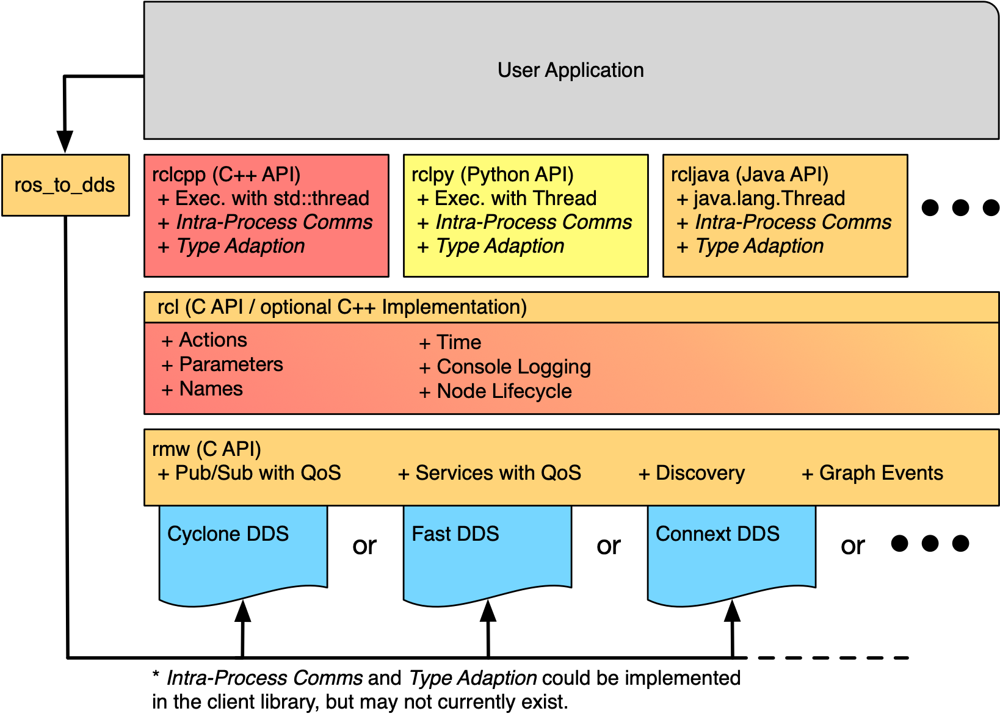
<p style="text-align:center; color:orange">图？：ros客户端库API分层</p>


## 四、Y
## 五、Z

## 六、Artemis机器人构想


https://docs.ros.org/en/humble/Tutorials/Beginner-Client-Libraries/Colcon-Tutorial.html

## 附录
ROS相关：
* [Colcon Tutorial](https://docs.ros.org/en/humble/Tutorials/Beginner-Client-Libraries/Colcon-Tutorial.html)
* [A universal build tool](https://design.ros2.org/articles/build_tool.html)
* [古月居机器人教程](https://book.guyuehome.com/)
* [古月机器人入门21讲](https://class.guyuehome.com/p/t_pc/course_pc_detail/column/p_628f4288e4b01c509ab5bc7a)
* [open-rmf](https://osrf.github.io/ros2multirobotbook/)
* [open-rmf docs](https://osrf.github.io/ros2multirobotbook/)
* [ROS2 for RUST](https://github.com/ros2-rust/ros2_rust)
* [REP 149](https://www.ros.org/reps/rep-0149.html)
* [ROS Tutorials](http://wiki.ros.org/ros_tutorials)
Jetson相关：
* [ament](https://docs.ros.org/en/foxy/Concepts/About-Build-System.html)
* [rosidl](https://github.com/ros2/rosidl/tree/humble)
* [About-Internal-Interfaces](https://docs.ros.org/en/rolling/Concepts/Advanced/About-Internal-Interfaces.html)
* [IDL](https://www.omg.org/spec/IDL/)
* [IDL Mapping](https://design.ros2.org/articles/idl_interface_definition.html)
* [Interface Design](https://design.ros2.org/articles/interface_definition.html)
* [Launch](https://docs.ros.org/en/humble/Tutorials/Intermediate/Launch/Launch-Main.html)
* [rcl library](https://docs.ros.org/en/humble/p/rcl/)
* [rclcpp](https://docs.ros2.org/latest/api/rclcpp/)
* [humble api list](https://docs.ros.org/en/humble/p/)
* [ROS Index](https://index.ros.org/)
* [ROS2 CANopen Stack](https://ros-industrial.github.io/ros2_canopen/manual/humble/)

Linux相关：
* [Tmux使用教程](https://www.ruanyifeng.com/blog/2019/10/tmux.html)

C++和ROS2语法相关：
* [ROS_PUBLIC](https://floodshao.github.io/2020/03/06/ros2-%E6%BA%90%E7%A0%81%E8%A7%A3%E6%9E%90%E4%B8%8E%E5%AE%9E%E8%B7%B5-Node/)
* [chrono](https://en.cppreference.com/w/cpp/header/chrono)
* [functional](https://en.cppreference.com/w/cpp/header/functional)
* [memory](https://en.cppreference.com/w/cpp/header/memory)
* [rclcpp](https://docs.ros2.org/latest/api/rclcpp/)
* [rclcpp Repository](https://github.com/ros2/rclcpp)
* [std_msgs Repository](https://github.com/ros2/common_interfaces/tree/humble/std_msgs)
* [c++ lambda表达式](https://learn.microsoft.com/zh-cn/cpp/cpp/lambda-expressions-in-cpp?view=msvc-170)
* [Modern C++](https://learn.microsoft.com/zh-cn/cpp/cpp/welcome-back-to-cpp-modern-cpp?view=msvc-170)